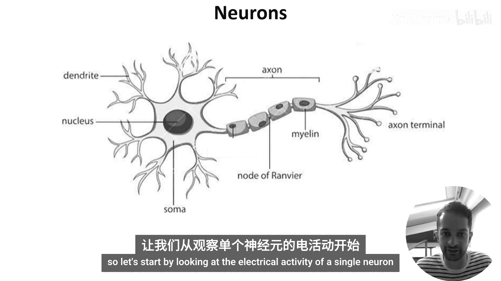
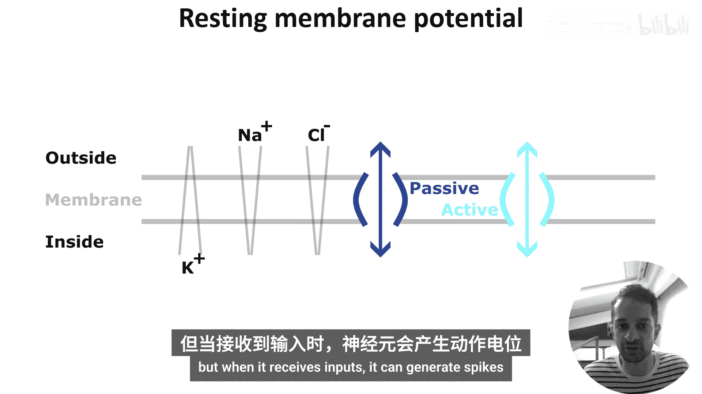
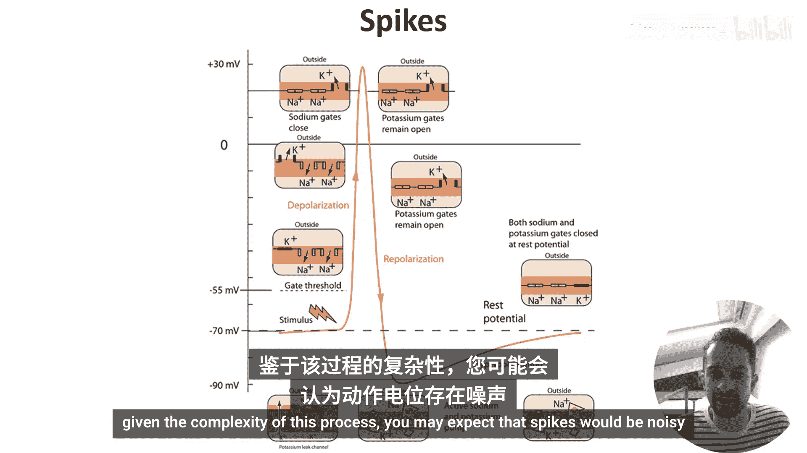
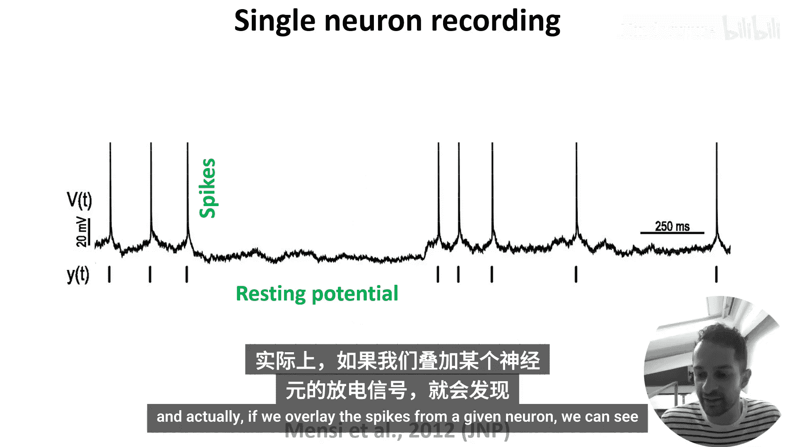
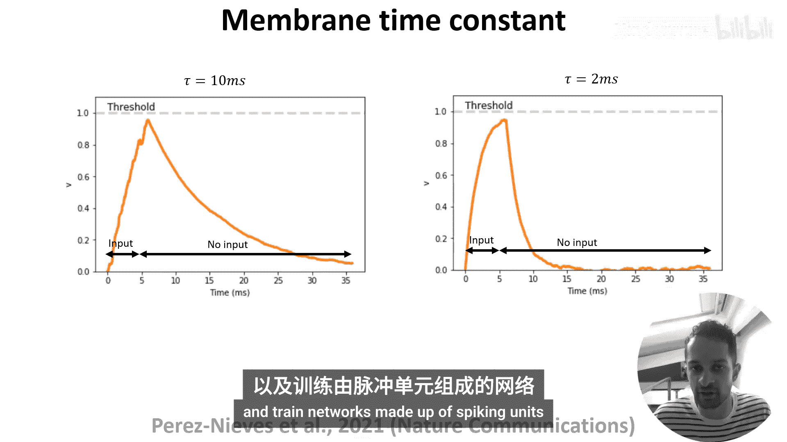

# 006：神经元功能 🧠

在本节课中，我们将学习神经元如何作为信息处理单元工作。我们将重点探讨神经元的电信号活动，包括静息电位和动作电位的产生机制，并了解这些生物特性如何与机器学习模型产生联系。

上一节我们介绍了神经元的结构。本节中，我们来看看神经元如何通过电信号来处理信息。

## 神经元的电活动记录

以下是研究人员如何记录和分析神经元的电活动。

上图展示了单个神经元的电活动。X轴是时间（毫秒），Y轴是电压（毫伏）。获取此类数据通常需要电极放大器和一个记录样本，例如培养皿中的分离神经元，甚至是手术中的人脑。

从这类图中，我们可以观察到两个主要特征：
1.  存在高振幅、持续1-2毫秒的事件，我们称之为**动作电位**或**峰电位**。
2.  在峰电位之间，神经元的电压在一个基线值附近波动，这个基线值称为**静息膜电位**。

## 静息电位的产生机制

那么，神经元如何产生静息电位和峰电位呢？细胞膜在其中扮演了关键角色。细胞膜将细胞内部与外部环境分隔开。

重要的是，带电粒子（离子，如钠离子和钾离子）在膜两侧的分布是不均匀的。例如，钾离子在细胞内的浓度较高，而钠离子和氯离子在细胞外的浓度较高。这意味着膜两侧同时存在化学梯度和电学梯度。

然而，这些带电离子不能直接穿过细胞膜，必须通过镶嵌在膜上的特殊蛋白质通道。有些通道是被动的，只允许离子顺浓度梯度扩散；另一些则是主动的，消耗能量以逆浓度梯度运输离子。

这些离子运动的总体结果是，每种离子都会在一个平衡点达到稳定，此时其化学浓度梯度与静电梯度相等，这被称为该离子的**平衡电位**。

膜的静息电位是所有离子平衡电位的总和，通常在**-70毫伏**左右。

## 动作电位的产生过程

静息电位是神经元在几乎没有输入时的状态。当它接收到输入时，就可能产生峰电位。

上图示意了动作电位产生的过程，时间尺度为几毫秒。

1.  **去极化**：输入信号导致膜上的钠通道打开，钠离子顺浓度梯度流入细胞。这使膜电位升高。如果升高到足够高，超过一个称为**阈值**的临界点，电压门控钠通道会大量打开。更多钠离子涌入，膜电位迅速上升至峰值。
2.  **复极化**：在高电压下，钠通道关闭，而钾通道打开。钾离子流出神经元，使膜电位下降。
3.  **超极化**：有趣的是，复极化通常会使膜电位下降到比静息电位更低的水平，最低可达**-90毫伏**。这被称为超极化。其效果是在一段时间内（称为**不应期**）有效地提高了触发新峰电位的刺激阈值。
4.  **恢复**：超极化之后，主动和被动的离子运动最终将膜电位带回**-70毫伏**的静息状态。

## 峰电位的特性与编码

鉴于这个过程的复杂性，你可能会认为峰电位是充满噪声的。但如果我们再看一下单个神经元的记录：

你会发现它们的形状看起来非常相似。实际上，如果我们叠加同一个神经元产生的所有峰电位，会发现它们确实看起来都一样。例如，左图显示了一个真实神经元对不同输入产生的超过100个峰电位。

你可以看到变异性非常低。这意味着每个神经元的峰电位本质上是**二元的“全或无”响应**。如果神经元需要编码更复杂的信息，它们必须通过改变峰电位的**数量**或**时间**来实现。我们将在课程后期回到神经元如何编码信息的问题。

由于每个神经元的峰电位如此相似，峰电位序列（或称峰电位序列）通常被绘制为二进制事件。例如，右图就是我们所说的**栅格图**，每一行显示了不同神经元随时间变化的放电活动。

## 神经元的动态差异

虽然每个神经元自身的峰电位形状相同，但并非所有神经元的动态特性都一样。

例如，考虑向神经元注入输入电流。注入足够的电流会使其膜电位超过阈值并引发峰电位。但如果我们只注入少量瞬时电流，其膜电位会升高，然后衰减回静息状态。

我们将这种衰减所需的时间称为**膜时间常数**。实验观察到，不同的神经元具有不同的膜时间常数值，因此以不同的速率衰减。上图绘制了两个具有不同膜时间常数的示例神经元（尽管是模拟的）的响应。

## 与机器学习的联系

虽然本视频中的这些细节似乎与机器学习相去甚远，但使用神经网络模型来探索这些特征在计算中的作用，或利用生物特征来提高性能，都是非常令人兴奋的前景。

仅举一个这方面的例子，在[引用的论文](此处应插入实际引用链接或标识)中，B及其同事构建了具有不同膜时间常数的人工神经网络，并表明这提高了任务性能。

那么，如何制造具有不同膜时间常数的人工单元呢？在下一个视频中，我们将展示如何对单个神经元进行数学建模，这将为我们后续课程中学习如何构建和训练由脉冲单元组成的网络奠定基础。

本节课中我们一起学习了神经元电活动的基础：静息电位的离子机制、动作电位“全或无”的产生过程及其阶段性变化（去极化、复极化、超极化），以及神经元通过峰电位的时间和数量进行信息编码的特性。我们还初步探讨了神经元动态特性（如膜时间常数）的差异及其在改进人工神经网络模型中的潜在价值。下一节，我们将开始学习如何用数学方程来描述这些过程。