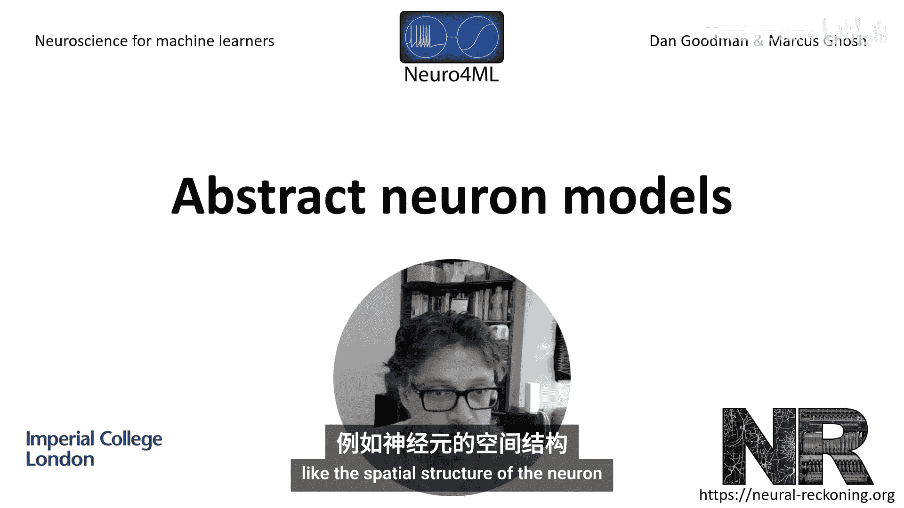
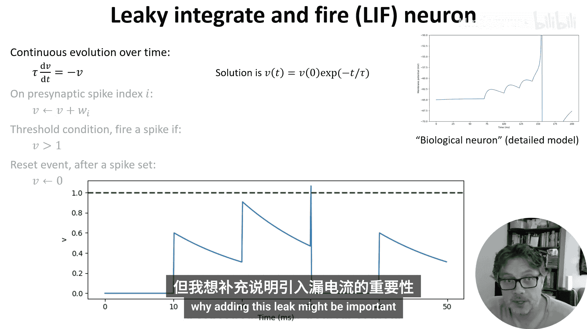
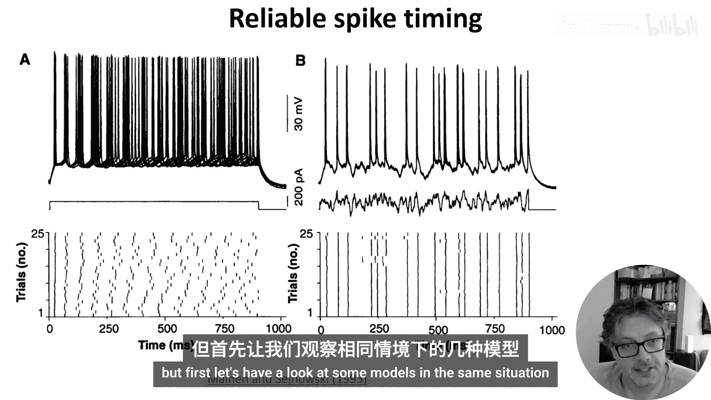
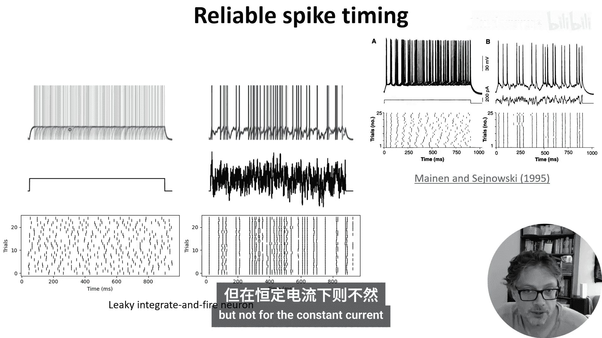
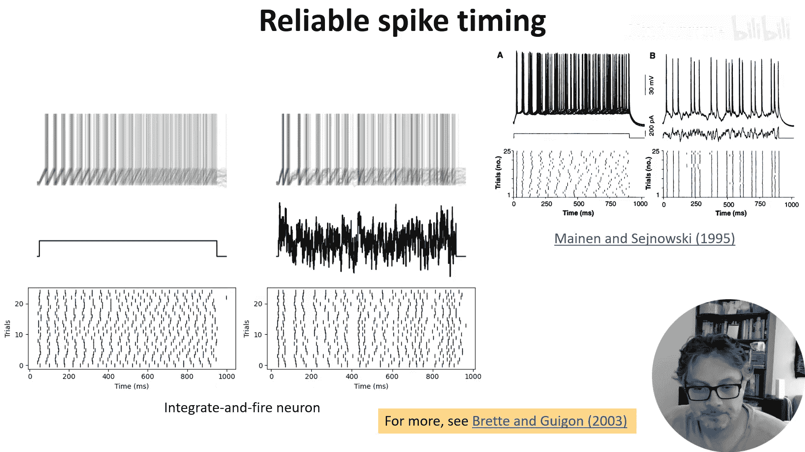
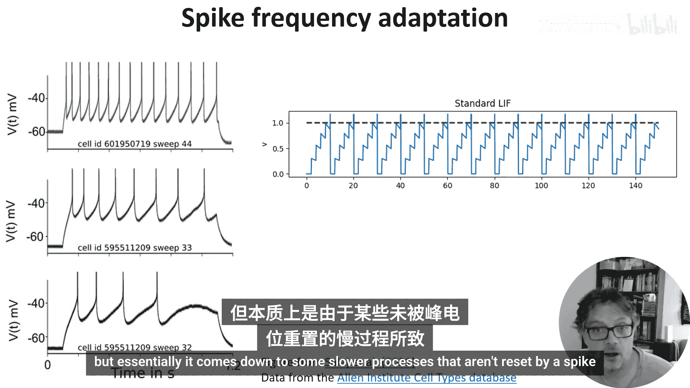
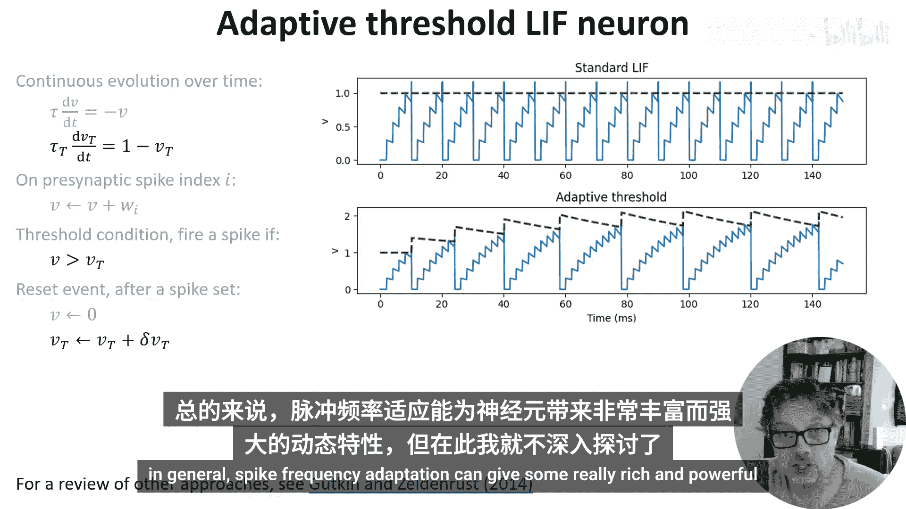
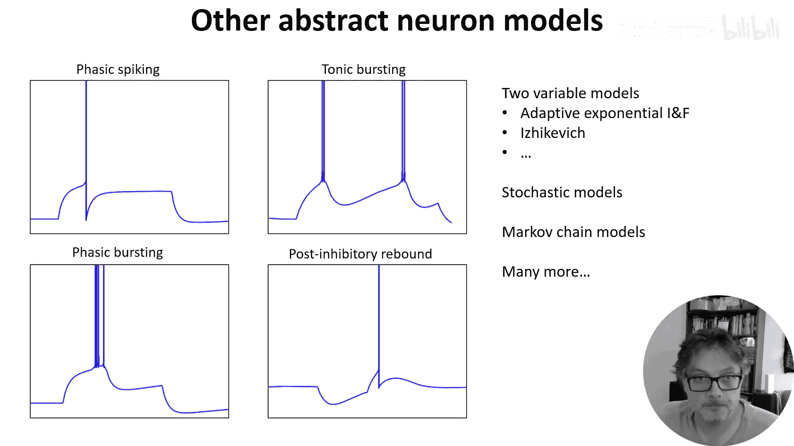

# 007：抽象神经元模型 🧠

在本节课中，我们将学习如何将复杂的生物神经元细节抽象和简化为简单的计算模型。我们将从机器学习中熟悉的人工神经元开始，逐步引入时间动态、泄漏、输入电流建模以及发放频率适应等概念，以构建更贴近生物神经元行为的模型。

---

## 从人工神经元到脉冲神经元

上一节我们介绍了生物神经元的许多细节，本节中我们来看看如何将其抽象为简单的模型。我们将聚焦于那些不包含大量生物细节（如神经元的空间结构）的模型。

我们首先从机器学习中你可能已经熟悉的人工神经元开始。这个神经元有 N 个输入，激活值为 `x1` 到 `xN`，以及权重 `W1` 到 `WN`。每个激活值和权重都是一个实数。

它对其输入进行加权求和，然后将结果通过某个非线性函数 `F` 传递。你可以在这里使用各种函数。在较早的研究中，你经常会看到 Sigmoid 函数，部分原因是它曾被认为是真实神经元的一个良好模型。如今，你更常看到的是整流线性单元（ReLU），事实证明它更容易处理，并且通常能给出更好的结果。

有趣的是，关于什么是真实神经元激活函数的最佳模型，至今仍有论文发表，例如 2023 年的这篇论文，它看起来有点像 Sigmoid 和 ReLU 之间的中间形态。

模型与生物数据之间的关系是通过计算输入输出函数来建立的。通常，通过计算在一段时间内、多次运行中，进入神经元的脉冲数量与输出脉冲数量的关系。

这个模型所缺失的是生物神经元的时间动态。

---

## 引入时间动态：整合发放模型

现在让我们来谈谈时间动态。我们在之前的视频中看到，当神经元接收到足够的输入电流时，会将其推高到一个阈值，从而引发动作电位，也称为脉冲。

输入电流的来源是来自其他神经元的传入脉冲，我们将在下周关于突触的视频中详细讨论。本周，这里有一个简单、理想化的示意图来说明这个过程（该图来自模型而非真实数据，以便更清晰地说明过程）。

曲线显示了神经元膜电位的变化，红色标记指示了输入脉冲到达的时间。每个传入的脉冲都会引起输入电流的瞬时激增。对于第一个脉冲，它不足以导致神经元发放脉冲。过一段时间后，膜电位开始衰减回其静息值。然后更多的脉冲到来，最终，累积效应足以将神经元推过阈值，它发放一个脉冲并重置。

你能想到的最简单的模型称为整合发放神经元。

以下是它的行为示意图。每当一个传入脉冲到达（这里每 10 毫秒一次），膜电位就会瞬时跳跃一个固定的权重值，直到达到阈值，此时发放脉冲并重置。

我们可以用一系列基于事件的方程将其写成标准形式：
1.  当接收到传入脉冲时，设置变量 `V = V + W_i`。
2.  如果阈值条件 `V > 1` 为真，则发放脉冲。
3.  发放脉冲后，将 `V` 设置为 0。

你可以看到，这已经捕捉到了真实神经元部分行为。但它忽略了在没有新输入的情况下，膜电位会衰减回静息值这一事实。所以让我们加上这一点。

---

## 添加泄漏：泄漏整合发放模型

我们可以通过将膜视为电路中的电容器来模拟这种衰减。将其转化为微分方程，`V` 随时间演化，遵循微分方程：`τ * dV/dt = -V`，其中 `τ` 是我们在上一个视频中讨论过的膜时间常数。

解这个微分方程可以看到，在没有任何输入的情况下，`V` 随时间以时间常数 `τ` 呈指数衰减。

以下是它的样子。你可以看到，在膜电位瞬时增加之后，它开始衰减回静息值。虽然这看起来不是一个很棒的模型，但事实证明，它通常足以捕捉真实神经元中发生的大部分情况。你将在本周的练习中看到这一点，但我想给出另一个为什么添加这种泄漏可能很重要的原因。

在实验中，如果你向神经元注入一个恒定的输入电流（如图中所示），并记录几次重复试验中发生的情况，你会发现膜电位和脉冲时间在试验之间有相当大的差异。这是因为大脑中存在大量噪声，这些噪声会随时间累积。

另一方面，如果你注入一个波动的输入电流，你会发现膜电位和脉冲都倾向于在相同的时间发生。这张图上的垂直线基本上向你展示了在每次重复中，脉冲都在大致相同的时间发生。

我稍后会回来解释为什么会发生这种情况，但首先让我们看看一些模型在相同情况下的表现。

使用泄漏整合发放神经元，你会看到同样的情况发生。在这里，我将膜电位绘制为半透明，以便你可以清楚地看到，对于波动电流，脉冲时间和膜电位都倾向于重叠，但对于恒定电流则不然。

但是，如果我们用一个没有泄漏的简单整合发放神经元重复这个实验，你可以看到，无论是恒定电流还是波动电流，你都会得到不可靠的脉冲时间。换句话说，添加泄漏使神经元对噪声更具鲁棒性，这是大脑以及我们将在课程后面谈到的低功耗神经形态硬件的一个重要特性。

那么，为什么泄漏能使其更具噪声鲁棒性呢？这个问题由 Romain Brette 和 Eric Shea-Brown 在 2003 年的一篇论文中解答。数学分析很复杂，但归结为这样一个事实：如果你在微分方程中要么有泄漏，要么有非线性，内部噪声引起的波动就不会随时间累积。而对于一个线性且无泄漏的神经元，噪声会累积。

---

## 改进输入建模：电流动力学

好的，提醒一下我们讲到哪里了，我们讲到了泄漏整合发放神经元，我们刚刚看到它具有一些你希望生物神经元模型具备的良好特性。但是，当你查看右上角的图片时，你仍然可以看到模型中的这些瞬时跳跃并不非常真实。那么我们如何改进呢？

一个简单的答案是改变模型，使得传入脉冲对膜电位的影响不是瞬时的，而是对输入电流产生瞬时影响，然后该电流作为输入提供给泄漏整合发放神经元。

所以你可以在下面的图中看到，输入电流现在的行为就像之前的膜电位一样，具有这种指数形状。你可以将其视为突触内部过程的模型，我们将在下周详细讨论。目前，我们将通过添加一个微分方程来模拟这一点：`τ_i * dI/dt = -I`。这与我们之前为膜电位设置的方程类似，但有自己的时间常数 `τ_i`。

我们还将这个电流 `I` 添加到 `V` 的微分方程中，乘以一个常数 `R`。模型的其余部分与之前相同。

你可以看到这更好地近似了形状。这里你可以看到，这看起来与那个非常相似。

如果你想，你还可以在这里做更多的事情，例如，你可以模拟电导的变化而不是电流，我们将在下周更多地讨论这一点。

---

## 模拟发放频率适应

现在，如果你将一系列规则的脉冲输入到一个没有任何噪声的泄漏整合发放神经元中，这就是正在发生的情况。你会看到脉冲之间的时间总是相同的。它必须如此，因为微分方程是无记忆的，并且在每次脉冲后重置。

然而，真实神经元对其最近的活动有记忆。这里有一些来自艾伦研究所细胞类型数据库的记录（我们将在课程后期再次提到）。在这些记录中，他们向这三个不同的神经元注入了恒定电流并记录了它们的活动。

你可以看到，神经元输出的不是规则间隔的脉冲序列，而是脉冲之间的间隔越来越大。你可以在这里特别清楚地看到，这里的间隔比这里的间隔长得多。

这背后有各种机制，但本质上归结为一些较慢的过程没有被脉冲重置。那么让我们看看如何模拟这一点。

实际上，有许多不同的模型用于模拟发放频率适应，我只向你展示一种非常简单的方法，但如果你想了解更多想法，可以看看这篇综述。

在这个简单模型中，我们只是引入了一个由变量 `V_T` 表示的动态阈值（图中绿线）。每次神经元发放脉冲时，阈值都会增加，使得发放下一个脉冲更加困难，然后阈值缓慢衰减回其起始值。

在方程中，我们通过为阈值设置一个新的指数衰减微分方程来表示这一点，通过修改阈值条件为 `V > V_T` 而不是大于 1，并指定在脉冲后，阈值增加一个小量。

现在你可以看到它完成了任务，早期脉冲之间的间隔比后期脉冲之间的间隔小。总的来说，发放频率适应可以给神经元带来一些非常丰富和强大的动态特性，但我现在不打算深入讨论更多细节。

---

## 总结与扩展

好了，这次对一些抽象神经元模型特性的快速浏览就到这里。如果你想深入了解，还有更多知识需要学习。

我们模型中尚未看到的一些真实神经元行为包括：相位性发放（仅在输入开始时发放脉冲）、簇状发放（多个脉冲，可以是相位性的，仅在输入开始时，也可以是紧张性的，持续进行），以及抑制后反弹，即神经元在抑制性或负向电流关闭后发放一个脉冲。

你可以用双变量模型捕捉许多这些效应，例如自适应指数整合发放模型或 Izhikevich 神经元模型。

还有基于高斯噪声电流或概率性发放过程的随机神经元模型，更进一步，还有神经元的马尔可夫链模型，你可以模拟神经元在离散状态之间切换的概率。

还有很多很多。如果你想进一步学习，我将在本周的阅读材料中提供一些链接。你还会找到一个 Jupyter Notebook，其中包含生成本视频中所有图形的所有代码。

本节课中，我们一起学习了如何将生物神经元抽象为计算模型，从简单的人工神经元出发，逐步引入了时间动态、泄漏整合、电流动力学以及发放频率适应等关键概念，构建了更贴近生物现实的泄漏整合发放模型及其变体。这些抽象模型是理解神经计算和构建脉冲神经网络的基础。

在下一个视频中，我们将讨论更具生物物理细节的神经元模型。😊