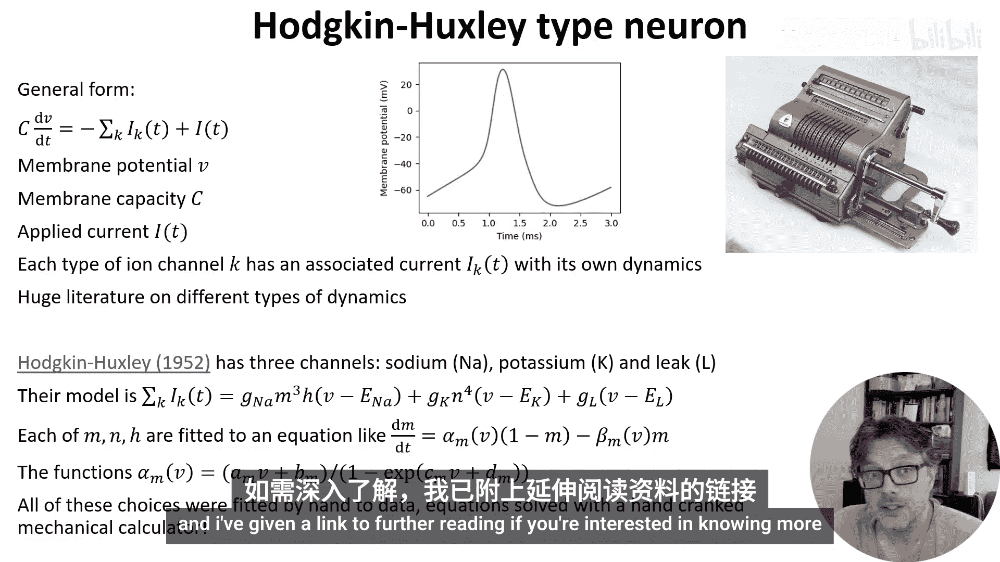
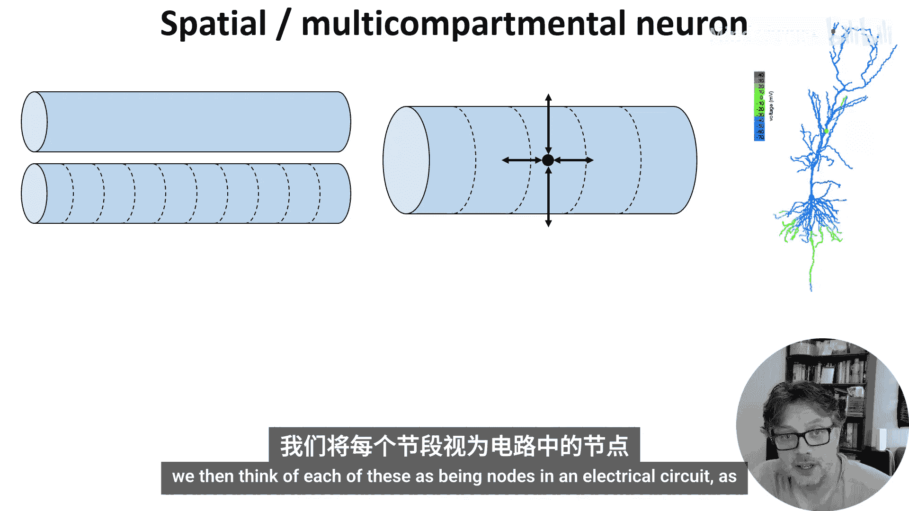
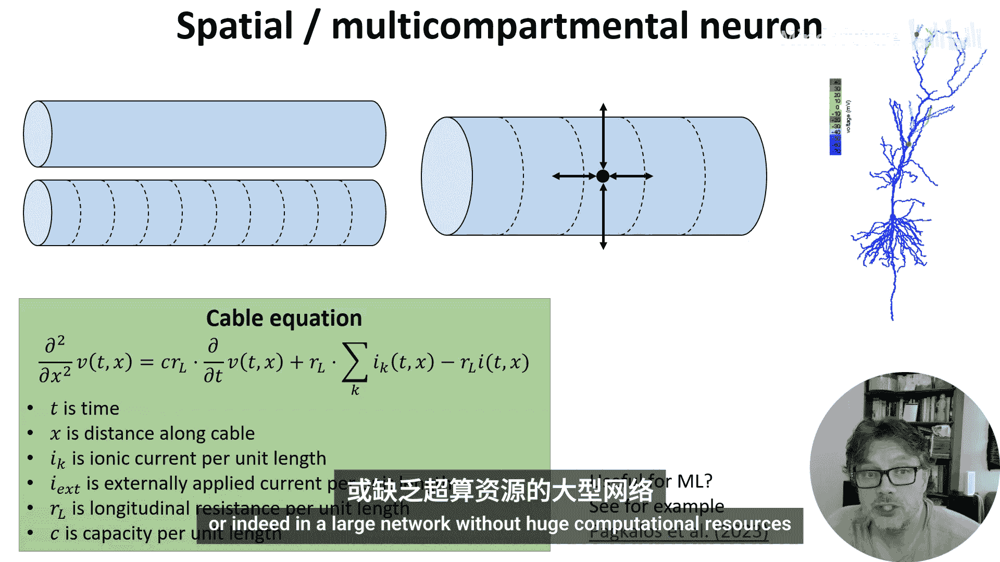
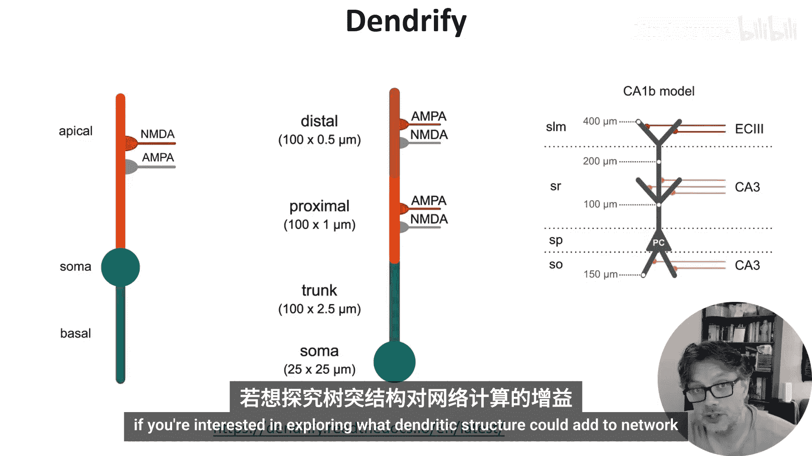
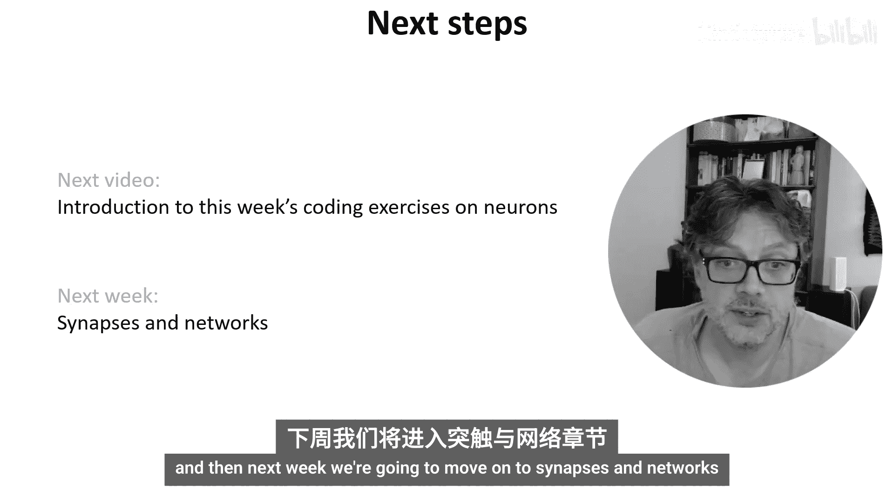

# 008：生物物理模型 🧠

在本节课中，我们将简要了解两类更贴近生物物理现实的神经元模型：霍奇金-赫胥黎模型和包含空间结构的电缆模型。我们不会深入细节，但会介绍其核心思想、数学形式以及它们在计算上的挑战。


## 霍奇金-赫胥黎模型 ⚡

上一节我们讨论了简化的积分发放模型，本节中我们来看看一个更复杂的经典模型。

霍奇金-赫胥黎模型是一个著名的生物物理模型，可以精确地模拟动作电位。下图展示了一个由该模型生成的动作电位波形。


这类模型的推导方式，是将细胞膜视为一个由电容和多个电压依赖性电阻（对应不同的离子通道）组成的电路。每个离子通道都有其自身的动力学特性，并且存在许多不同的类型。

在霍奇金和赫胥黎的原始论文中，他们只考虑了三种通道：钠通道、钾通道和漏通道。他们通过手工计算（使用手摇机械计算器，耗时数周求解方程），找到了一系列能很好近似这些动力学的函数。最终，这归结为一个包含四个动态变量的非线性微分方程，其中有许多函数形式和常数需要根据数据拟合。

该模型的模拟也颇具挑战，要么需要非常小的时间步长，要么需要特定的数值积分方法。

以下是一个模拟此类模型的代码示例（可在本视频附带的Notebook中找到）：

```python
# 霍奇金-赫胥黎模型模拟代码示例
# 此处为伪代码，展示模型的核心结构
def hodgkin_huxley(V, m, h, n, I_inj):
    # 定义各种离子电导、反转电位等参数
    # 计算膜电流
    # 更新状态变量 (V, m, h, n) 的微分方程
    return dVdt, dmdt, dhdt, dndt
```

以上只是对此类模型的快速一瞥。如果你有兴趣了解更多，视频中提供了进一步阅读的链接。



## 空间结构与电缆模型 🌳

到目前为止，我们讨论的所有模型都完全忽略了一个事实：神经元具有非常复杂的空间结构，包括树突和轴突。如下图所示，电活动会在细胞周围传播。


我们可以通过将树突和轴突想象成圆柱体来捕捉这种结构，然后将这些圆柱体分解成许多相对均匀的短圆柱段。接着，我们像处理霍奇金-赫胥黎神经元一样，将每一段视为电路中的一个节点。




如果采用这种方法并进行数学分析，我们会得到**电缆方程**，这是一个二阶偏微分方程：

```
∂V/∂t = (1/(r_m * c_m)) * ∂²V/∂x² - (V - V_rest)/τ_m
```

其中，`V`是膜电位，`x`是沿神经突的距离，`r_m`和`c_m`是膜的特性参数，`τ_m`是膜时间常数。

可以通过将电缆分割成如上所述的分隔间来模拟这个方程。但可以想象，计算量会迅速变得非常庞大，因为真实的神经元可能有成千上万个需要模拟的分隔间。

问题在于，这些空间细节对于网络整体的功能是否重要，还是仅仅是实现细节？目前尚无定论，但有观点认为它可能很重要，这是一个活跃的研究领域（例如，可以参考近期的一些论文）。核心挑战在于，其计算需求太大，难以在机器学习设置中或没有巨大计算资源的大型网络中使用。

## 模型简化工具 🛠️

这就引出了**Dendrified**这类工具。它是一个相对较新的软件包，可以自动将这些非常复杂的模型简化为易于模拟的形式，同时仍能捕捉大量相关动力学特征，如下列示例所示。




如果你有兴趣探索树突结构可能为网络级计算带来什么，这个软件包可能值得一看。

## 总结 📝



本节课中，我们一起学习了两种更复杂的神经元建模方法。我们首先介绍了经典的霍奇金-赫胥黎模型，它用微分方程精细描述离子通道动力学。接着，我们探讨了包含神经元空间结构的电缆模型及其数学表达——电缆方程，并指出了其高昂的计算成本。最后，我们提到了像Dendrified这样的工具，它们致力于在保持生物真实性的同时降低计算复杂度。

关于神经元建模的视频到此结束。下一个视频将快速介绍本周的编程练习。从下周开始，我们将继续学习突触和网络。



