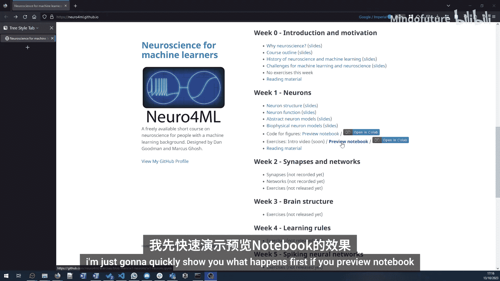
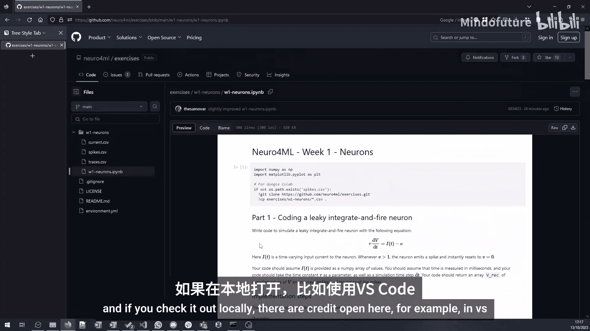
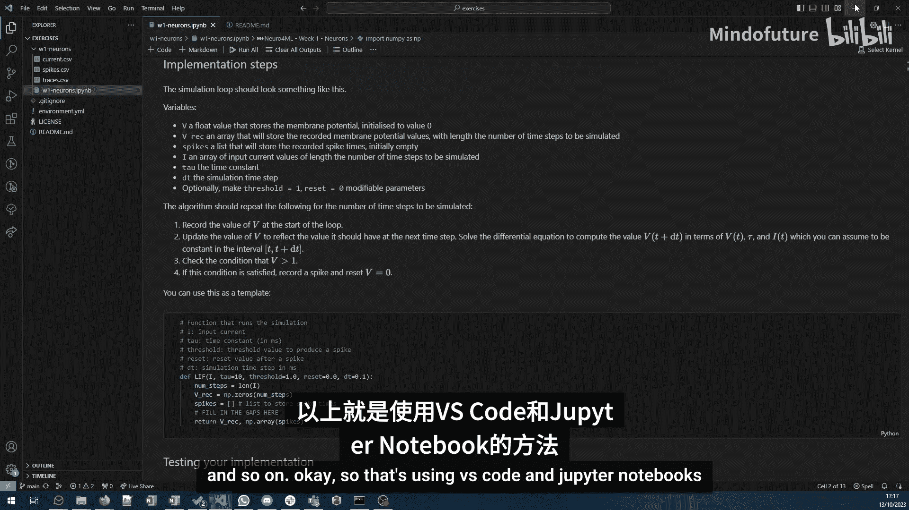
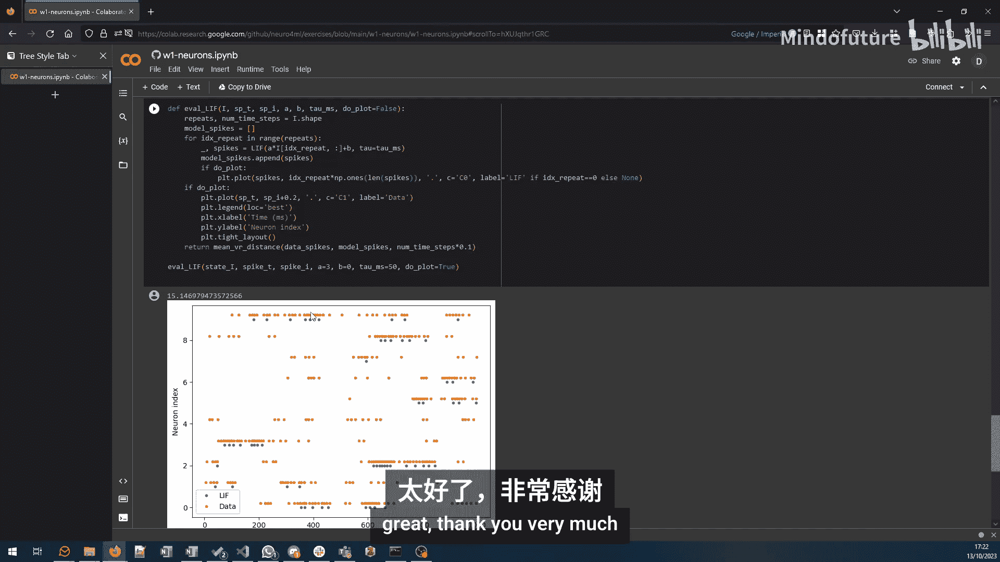

# 009：第一周练习指南 🧠

在本节课中，我们将介绍第一周的练习内容，并展示完成练习的几种不同方式。课程练习分为两个部分：第一部分是模拟一个漏电整合发放神经元模型，第二部分是使用一个简单模型来拟合给定的神经元放电数据。



## 访问练习材料

上一节我们介绍了课程背景，本节中我们来看看如何获取练习材料。



练习材料位于课程网站上。向下滚动到“第一周”部分，可以看到“练习”选项。这里提供两种主要方式访问练习笔记本。



以下是两种访问方式：

*   **预览笔记本**：点击此选项将在GitHub上打开练习仓库。你可以查看内容或在本地克隆仓库使用。
*   **在Google Colab中打开**：点击此选项将在Google Colab中直接打开笔记本。这种方式会自动处理所有环境配置，让你可以立即开始编辑和运行代码。


对于选择本地操作的用户，仓库中提供了在本地安装Python和运行Jupyter Notebook的说明。你可以使用VS Code等编辑器打开并运行笔记本中的代码单元。

## 练习第一部分：模拟LIF神经元

现在，让我们具体看看本周的练习内容。第一部分的目标是将学到的关于漏电整合发放神经元的理论知识转化为代码，实现你自己的模拟。

你需要用Python编写代码，模拟LIF神经元的行为。练习中提供了一个函数模板，你的主要任务是根据以下算法填充关键部分的代码：

```python
# 算法伪代码示例
for each time step:
    # 1. 计算膜电位变化
    dV = (I - (V - V_rest)) / tau_m
    # 2. 更新膜电位
    V += dV * dt
    # 3. 检查是否达到阈值并发放脉冲
    if V >= V_threshold:
        record_spike_time()
        V = V_reset
```

完成代码编写后，运行对应的单元。如果实现正确，你将得到与示例一致的结果图。完成这部分练习预计需要30到40分钟。

## 练习第二部分：拟合神经元数据

完成了基础模拟后，我们进入一个更开放、更接近真实研究情境的练习。第二部分的目标是使用一个简单的抽象模型来近似拟合给定的神经元放电数据。

首先，运行提供的代码单元来加载数据。数据包含一系列输入电流和记录到的神经元响应轨迹与放电时间。你可以将此视为真实实验数据。

你的任务是构建一个模型，使其产生的放电时间与数据中的放电时间尽可能匹配。练习中实现了一个用于评估拟合好坏的**距离度量**——Van Rossum脉冲序列距离。你的模型输出的放电时间与真实数据放电时间之间的距离值由 `eval_LIF` 函数计算并返回。

距离值越小，表示拟合效果越好。值为0代表完美拟合。下图展示了一个使用默认参数的LIF模型的初步拟合结果，你可以看到其表现有改进空间。



第二部分的练习就是尽你所能，通过优化模型参数，来获得最低的距离值，即最佳拟合。有多种方法可以尝试：

*   手动调整参数。
*   使用全局优化包，例如Python中的CMA-ES库。

对于参加线下课程的同学，课程结束时将汇总大家获得的最佳距离值，最优解者可以向其他同学展示其解决方案。

## 总结与提醒

本节课中我们一起学习了第一周练习的概览和完成方式。我们介绍了如何获取练习材料，第一部分LIF神经元模拟的编码任务，以及第二部分数据拟合的开放挑战。

请享受练习过程！对于在线学习的同学，欢迎讨论交流，但请注意不要过早分享完整解决方案，以免影响他人的探索乐趣。


祝你练习顺利！