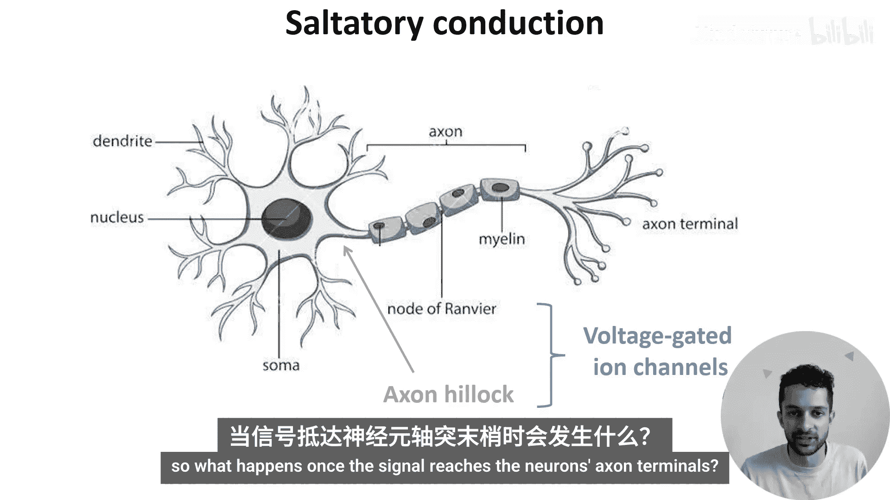
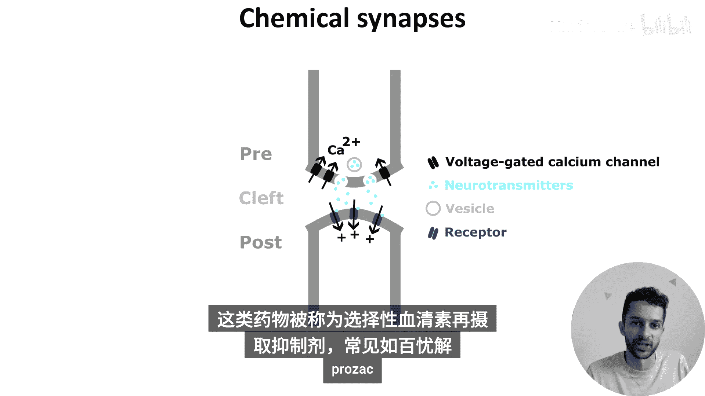
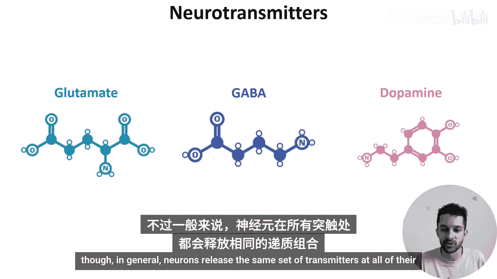
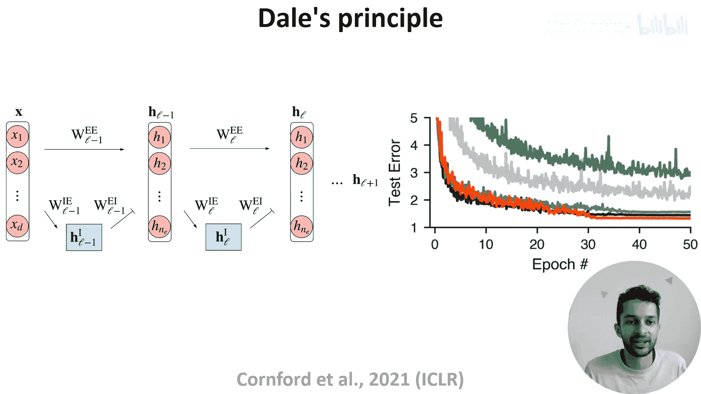
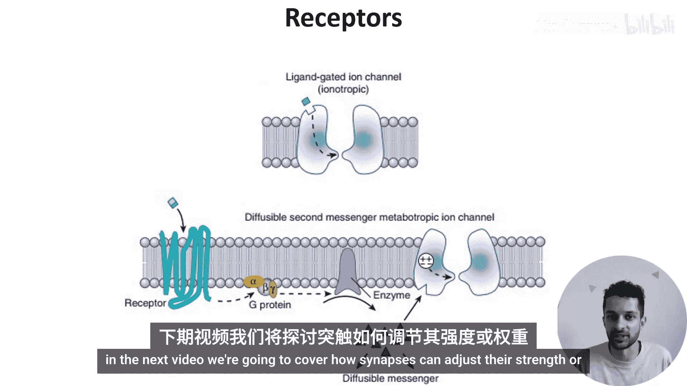

# 010：突触的工作原理

在本节课中，我们将学习神经元之间是如何进行信号传递的。我们将从单个神经元的结构出发，探讨动作电位如何沿着轴突传导，并最终通过一个称为“突触”的特殊连接结构，将信号传递给下一个神经元。我们将详细介绍化学突触的组成、神经递质的释放与作用，以及突触信号的终止机制。最后，我们会将生物神经元与人工神经网络单元的输出特性进行对比，探讨一个有趣的生物学原则。

---

上一节我们介绍了离子运动如何使神经元产生静息膜电位和动作电位。本节中，我们来看看神经元之间是如何相互传递信号的。

从我们的单个神经元示意图开始。

神经元树突的输入会导致钠离子通道打开。遵循浓度梯度，这些离子扩散进入细胞，并沿着树突、胞体和轴丘（富含电压门控通道的区域）传播。

少量的输入不足以将膜电位提升到触发这些通道打开的程度（请回忆上一节提到的阈值）。但大量的输入则可能达到阈值，此时更多的钠离子会流入神经元，并开始沿着轴突扩散。

然而，如果没有额外的帮助，这个信号在沿轴突传播的过程中会逐渐衰减。

那么神经元如何防止这种情况发生呢？解决方案是使用一种称为**髓鞘**的脂肪物质来绝缘轴突。

但是，即使绝缘整个轴突长度也可能不够。因此，轴突被绝缘的髓鞘节段分隔开，节段之间的间隙称为**郎飞结**，这些节点富含电压门控通道。这有效地在信号沿轴突传播时对其进行增强，并产生我们所说的**跳跃式传导**。

那么，一旦信号到达神经元的轴突末梢会发生什么？

---

如果我们放大其中一个末梢，可以看到这是一个神经元与另一个神经元连接的地方。

我们称这种连接为**突触**，并将两侧的神经元分别称为**突触前神经元**和**突触后神经元**。

这些连接可以是电性的（称为**缝隙连接**），也可以是化学性的，就像图中所示。

那么，化学突触由什么组成呢？突触前神经元含有**囊泡**，这些是充满化学信使（称为**神经递质**）的3D球体。

突触后神经元的细胞膜中嵌有称为**受体**的蛋白质，神经递质会与之结合。两者之间的间隙称为**突触间隙**。虽然它通常被画成一个空隙，但实际上有蛋白质跨越其中，将整个连接结构固定在一起。

当动作电位到达轴突末梢时，离子的内流使膜去极化，导致电压门控钙通道打开，钙离子流入细胞。

这导致突触囊泡与细胞膜融合，并将其中的神经递质释放到突触间隙中。

神经递质随后扩散穿过间隙，与突触后受体结合，触发不同的效应。

在图中，结合导致一个离子通道打开，正离子流入突触后神经元，从而升高其膜电位。因此，我们将此描述为**兴奋性突触**，因为一个突触前动作电位会使突触后神经元更有可能发放动作电位。

相反，**抑制性突触**会降低突触后神经元的膜电位，使其发放动作电位的可能性降低。

那么这个信号如何终止呢？一些神经递质分子只是从间隙中扩散走。一些被酶分解，还有一些实际上被重新摄取回突触前神经元。

这里有一个有趣的旁注：有一整类用于治疗抑郁症的药物，其作用机制就是抑制这种重摄取通道。它们被称为**选择性5-羟色胺再摄取抑制剂**，一个常见的例子是**百忧解**。

---

现在让我们更详细地讨论神经递质。

神经递质是由神经元合成的分子，用于向其他神经元传递信号。已知有数百种神经递质，被认为具有不同的功能。这里仅举三个常见的例子。

**谷氨酸**是脊椎动物神经系统中的主要兴奋性神经递质。
**γ-氨基丁酸**是主要的抑制性神经递质。
**多巴胺**通常被认为是愉悦信号，但可能最好描述为**效价信号**。

有趣的是，单个神经元往往包含并释放多种递质。例如，一个神经元可能同时使用GABA和多巴胺。不过一般来说，神经元在其所有突触处都释放相同的一组递质。

---

这被称为**戴尔原则**，并在生物和人工神经网络之间建立了一个有趣的对比：生物神经元会向其所有连接伙伴释放相同的一组神经递质。

但在人工神经网络中，单个单元既有正的输出权重，也有负的输出权重，因此它们的激活会向不同的单元发送不同的信号。

那么，这是生物学的局限性还是优势呢？为了探索这个问题，Jonathan Cornford 及其同事构建了人工神经网络，其中每个单元要么是兴奋性的，要么是抑制性的（如左图中粉色和蓝色所示）。

事实证明，这些网络很难用标准的梯度下降法进行训练，最终表现不如标准的人工神经网络。你可以在右侧图表中看到这一点，其中黑色曲线显示标准人工神经网络的性能，绿色曲线显示简单遵循戴尔原则的网络性能。

因此，作者引入了一些修正，使得遵循戴尔原则的网络能够匹配标准人工神经网络的性能（图中红色曲线所示）。但由于作者只能匹配标准人工神经网络的性能，并且据我们所知，尚未有人通过遵循戴尔原则显示出更好的结果，因此神经元为何倾向于遵循这一原则仍然是一个悬而未决的问题。

---

好的，回到神经传递。一旦被释放，神经递质会扩散穿过突触间隙，找到嵌入细胞膜中的受体，并触发不同的效应。

有数百种受体，它们都对不同的神经递质具有特异性，但它们仅分为两大类。

**离子型受体**（如上图所示）是神经递质结合会触发结构变化从而打开离子通道的受体。

**代谢型受体**是结合会触发突触后神经元内部信号级联反应的受体，这可能最终打开离子通道或引起其他效应。

希望这能让你更好地理解突触的工作原理。在下一个视频中，我们将介绍突触如何调整其强度或权重。

😊

---

本节课中，我们一起学习了神经元间信号传递的核心机制。我们了解了动作电位如何通过髓鞘和郎飞结实现高效传导，深入探讨了化学突触的结构与功能，包括神经递质的释放、结合与清除过程。我们还对比了生物神经元的戴尔原则与人工神经网络单元输出特性的差异。下一节，我们将聚焦于突触可塑性，即突触如何调整其连接强度，这是学习和记忆的神经基础。