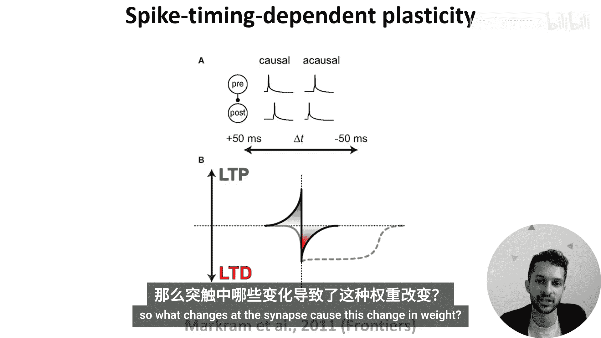
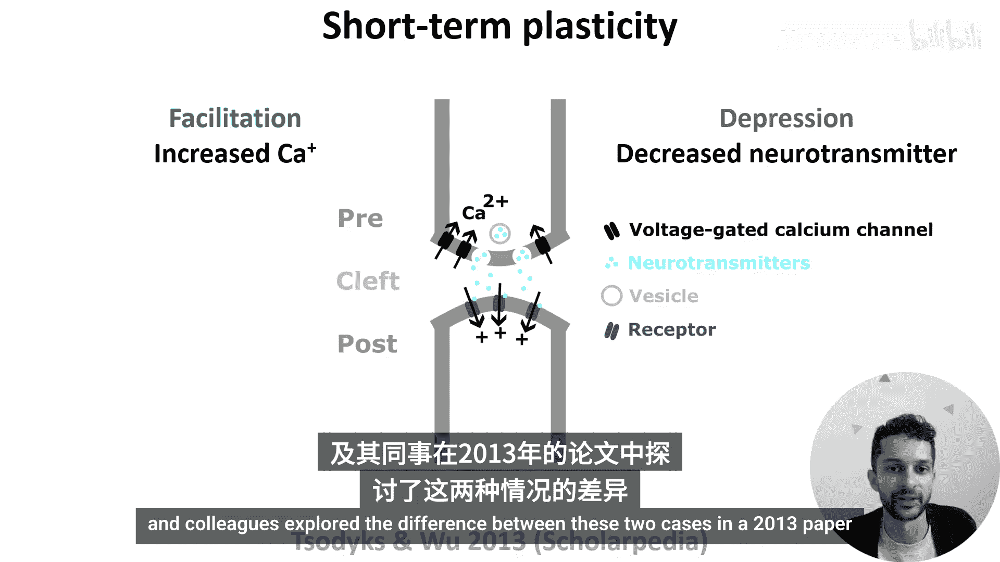
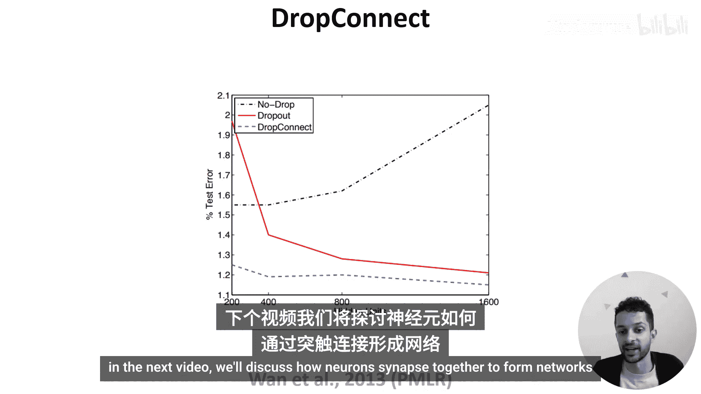

# 011：突触可塑性 🧠

在本节课中，我们将学习生物神经网络如何调整其连接强度，这与训练人工神经网络时调整权重类似。我们将探讨从长期到短期的多种可塑性机制。

上一节我们介绍了突触、神经递质和受体的基本概念。本节中，我们来看看突触如何调整其连接强度或“权重”。

## 赫布学习规则

在人工神经网络中，我们根据学习规则调整连接权重。那么生物学中的等效机制是什么？

早在1949年，唐纳德·赫布提出了一个相对简单的学习规则：如果细胞A的轴突足够靠近细胞B并反复或持续地参与激发它，那么一个或两个细胞中会发生某种生长过程或代谢变化，使得A激发B的效率提高。这一规则后来被实验证实。

该规则常被概括为“一起激发的细胞，连接在一起”。反之，不同步激发的细胞会失去连接。但这忽略了细胞A必须先于细胞B激发并促成其激发的事实，因此相对时序至关重要。

## 脉冲时序依赖可塑性

为了进一步阐述，让我们考虑一对神经元。

*   **图A** 展示了突触前神经元的脉冲是倾向于发生在突触后神经元之前还是之后，从而判断它们的关系是因果性的还是非因果性的。
*   **图B** 展示了该突触的强度（Y轴）将如何根据两个神经元脉冲的时序差进行调整。
    *   如果关系是因果性的（即突触前先于突触后），强度将增加或增强（**长时程增强，LTP**），图中以绿色表示。
    *   如果关系是非因果性的（即突触前跟随突触后），强度将减弱（**长时程抑制，LTD**），图中以红色表示。

这种机制被称为**脉冲时序依赖可塑性**。它通过LTP和LTD过程，倾向于诱导突触强度的长期变化。

## 突触强度的改变机制

那么，突触层面发生了什么变化导致了这种权重改变？

如果我们思考突触的结构，可以看到改变连接强度有多种可能性，例如：
*   增加突触小泡的数量或内部神经递质的密度。
*   增加突触后受体的数量。
*   增加突触的表面积。
*   甚至在两个神经元之间增加额外的突触。

但这些都是长期变化。突触权重也可以在更短的时间尺度上改变，大约在数百到数千毫秒内。这被称为**短期可塑性**，它描述了突触强度如何随着突触前活动水平动态变化。

以下是短期可塑性的两种主要形式：
*   **短期易化**：由动作电位后轴突末梢残留的钙离子水平升高引起，这增加了神经递质释放的概率。
*   **短期抑制**：由突触处可用神经递质水平降低引起，在极端情况下，突触可能完全无法传递信号。

因此，短期可塑性反映了神经元近期的活动状态，其突触的状态会动态地影响其权重。

## 与机器学习的联系：Dropout 与 DropConnect

回到之前，突触有时会传递失败，这可能会让一些人联想到机器学习中的**Dropout**技术。

这里的关键区别在于：
*   在Dropout中，你在训练期间随机**静默整个单元（神经元）**，这有助于减少过拟合。
*   而在生物突触失效的类比中，是**单个连接（权重）** 失效，而不是整个单元。

实际上，Yann LeCun及其同事在2013年的一篇论文中探讨了这两种情况的差异。他们提出了**DropConnect**方法，即随机静默权重（连接）。

为了快速比较两者，图表显示了在MNIST数据集上，测试误差随网络大小的变化函数：
*   **无Drop（黑色）**：误差随网络增大而增加，因为网络越来越过拟合数据。
*   **Dropout（红色）**：误差随网络增大而减小。
*   **DropConnect（蓝色）**：误差更低且更稳定。

该论文提供了更多的实证和理论结果，表明在某些情况下，DropConnect可能比Dropout更具优势。

## 总结

本节课中，我们一起学习了生物突触如何调整其连接强度。我们从**赫布学习规则**及其具体实现——**脉冲时序依赖可塑性**入手，了解了导致长期权重变化的LTP和LTD机制。接着，我们探讨了发生在更短时间尺度上的**短期可塑性**，包括易化和抑制。最后，我们将突触失效的现象与机器学习中的正则化技术**Dropout**和**DropConnect**联系起来，看到了生物机制对人工神经网络设计的启发。

下一节视频，我们将讨论神经元和突触如何共同构成网络并执行功能。