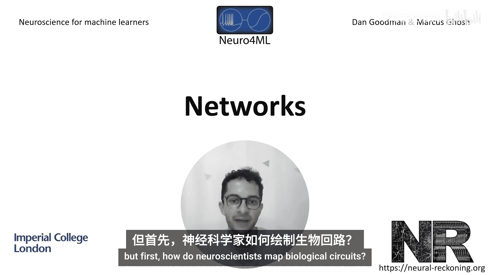
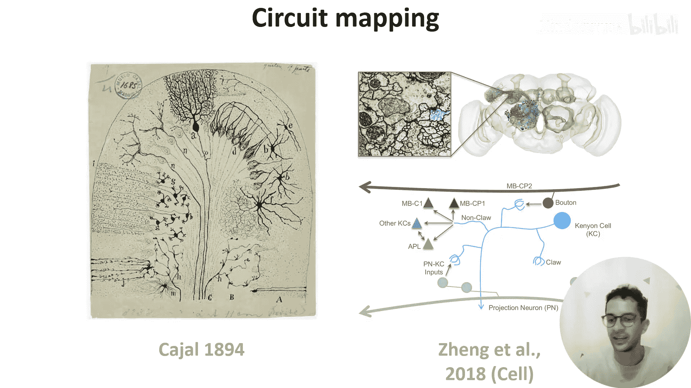

# 012：神经网络

在本节课中，我们将学习神经元如何连接在一起形成网络或回路。我们将通过两个生物学中的具体网络实例来理解这一概念。

在上一节中，我们学习了神经元如何通过突触彼此连接和传递信号。本节中，我们来看看神经元如何组织成更复杂的网络结构。

## 如何绘制生物神经回路？

神经科学家通过以下步骤来绘制生物神经回路：解剖动物大脑，将其切成非常薄的切片，进行染色，在显微镜下观察，然后分析图像。历史上，这项工作完全由手工完成，例如卡哈尔在1894年的绘图。如今，从数据采集到分析的整个过程都在走向自动化，这是一个值得关注的激动人心的领域。

## 示例一：小脑回路 🧠

小脑是大脑中负责协调运动的区域，其回路结构如下图所示。

关于此图，有三点需要注意：
1.  细胞分布在三个标记于左侧的层中。
2.  主要细胞类型（如颗粒细胞和浦肯野细胞）已被标注。
3.  不同细胞类型之间的连接根据其使用的神经递质被标记为兴奋性（exc）或抑制性（true/inhibitory）。

那么，信息如何在这个网络中流动呢？

在右侧的**苔状纤维通路**中，输入信号与颗粒细胞形成突触。颗粒细胞随后将其输出向上发送到上一层，在那里它们分支并扩散通过浦肯野细胞的树突丛，形成成千上万个兴奋性突触。由于其结构，这些颗粒细胞的输出被称为**平行纤维**。浦肯野细胞然后向回路的输出端——深部小脑核——发送抑制性连接。

在左侧的第二个通路，即**攀爬纤维通路**中，其他输入信号直接到达浦肯野细胞。你还可以注意到回路中其他有趣的连接，例如这两个通路都有直接通向输出的连接（即从苔状纤维和攀爬纤维直接到深部小脑核）。

我们如何思考或建模这个网络的功能呢？相关模型已被提出了50多年，一种简化的思考方式是将其视为一个具有我们刚讨论的两个通路的三层网络。输入通过苔状纤维到达，苔状纤维连接到第一层（颗粒细胞）和第三层（核细胞）。然后，信号通过网络进行前馈传递，第三层生成输出预测。这些输出随后与输入观察进行比较，两者之间的差异作为误差信号，通过攀爬纤维通路（在图中以红色显示）反馈给网络。如果你对这个模型感兴趣，可以阅读相关论文，它探讨了一个非常有趣的问题：当传递误差信号到第三层的连接相对较弱时（如图B中细红色箭头所示），网络如何能够学习。

## 示例二：头部方向细胞与环形吸引子 🧭

大约30年前，研究人员在记录大鼠大脑中单个神经元活动时，发现了一些似乎编码动物头部方向的细胞，他们将其命名为**头部方向细胞**。例如，下图显示了三个神经元的放电频率（每秒峰电位数量）随动物头部方向变化的情况。可以看到，每个神经元都对特定方向非常敏感。

这项及后续研究表明，作为一个群体，这些神经元均匀地覆盖了所有可能的头部方向空间，并且这些细胞的活动依赖于视觉和前庭（平衡）输入。

为了更好地理解这些结果，张等人于1995年提出了一个**吸引子模型**。他们将其绘制成一系列环，头部方向细胞在外环，视觉和前庭输入在内环。该模型有许多细节，但最突出的一点是：相邻的头部方向细胞之间有强烈的兴奋性连接，而相距较远的细胞之间有强烈的抑制性连接。这意味着在任何时刻，只会有一个活跃的细胞簇。视觉或前庭对头部方向细胞的输入将迫使这个活动峰值在环上移动。

有趣的是，作者认为这只是一个相对抽象的模型，并在论文中写道：“将网络视为一组圆形层有助于理解，但这并不反映大脑中相应细胞的解剖学组织。”

然而，最近在果蝇中的实验揭示了一组排列成环状的神经元，其单一的活动峰追踪着果蝇的头部方向。在这个实验中，作者让果蝇在一个旋转的跑步机上行走，同时果蝇观看一个带有地标的屏幕（图A中显示为蓝色圆环）。

同时，他们记录果蝇的大脑活动（如下方黑色和红色方框所示）。我们将在课程后面解释他们使用的记录技术，目前只需知道红色表示更高的神经活动。可以看到，随着果蝇的导航，一个单一的活动峰在环上旋转。下方的D和E图显示，这个活动峰确实追踪着果蝇的头部方向。

总而言之，环形吸引子是一个很好的例子，展示了实验与理论如何相互促进。

## 总结

本节课中，我们一起学习了生物神经网络的构成与分析。我们首先了解了绘制神经回路的基本方法，然后深入探讨了两个具体实例：**小脑的三层网络回路**及其在运动协调和误差学习中的可能功能，以及**头部方向细胞系统**及其用**环形吸引子模型**（具有局部兴奋、全局抑制的连接特性）来解释的神经编码机制。这些例子展示了神经系统如何通过特定的连接模式实现复杂的信息处理功能。在接下来的视频中，Dan将更详细地讨论突触和网络的建模。