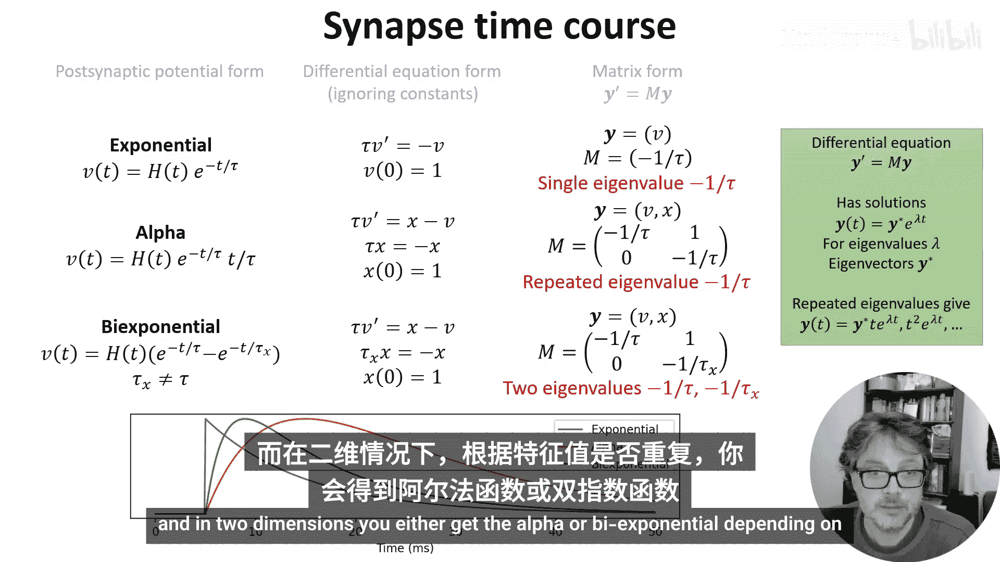
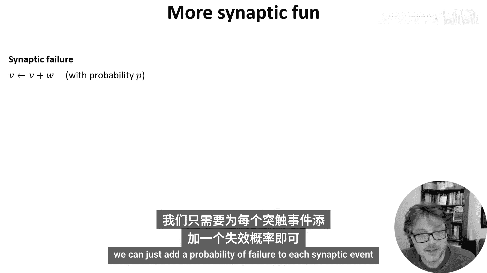
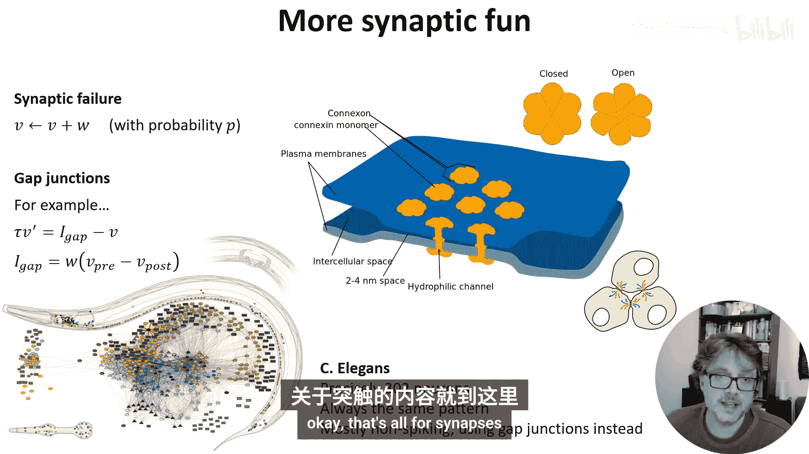

# 013：突触模型

在本节课中，我们将学习如何将复杂的突触生物学过程转化为相对简单的数学模型。我们将探讨不同详细程度的突触模型，从简单的膜电位变化到包含短期可塑性的复杂动态，并简要介绍突触类型、长时程可塑性及其他高级概念。

## 从生物学到方程

上一周我们介绍了许多详细的生物学知识，本节中我们来看看如何将其转化为方程。

马库斯解释了当动作电位到达突触前末梢时，会释放神经递质。这些神经递质导致相关离子通道打开，从而改变接收细胞的电导。这进而产生输入电流，其遵循的方程与我们上周看到的霍奇金-赫胥黎形式主义类似。最终，这会导致霍奇金-赫胥黎神经元或漏电积分发放神经元的膜电位发生变化。

与神经元建模类似，我们需要决定在突触模型中包含多少细节。省略某些细节的一个原因是，某些变化发生得足够快，在我们观察的时间尺度上，模拟其时间动态不会带来太大差异。

## 突触后电位与模型细节

一个有助于理解的概念是突触后电位，有时简称为PSP。它显示了由于动作电位到达接收细胞而导致的该细胞膜电位升高。

下图展示了三个不同详细程度的突触模型：
*   蓝色曲线：将突触建模为膜电位的瞬时增加。
*   橙色曲线：将其建模为电流的瞬时增加，随后电流指数衰减回静息状态。
*   绿色曲线：同样是指数衰减，但瞬时增加的是电导。

接下来，我们先讨论如何直接用电导、电流或膜电位来建模动态，稍后再回来详细讨论神经递质释放的动态。

## 线性时不变模型

一种常见方法是确定关键的突触变量，并用以下三类函数之一进行建模。稍后我会解释为什么是这三类。为简单起见，我将它们描述为突触后膜电位，尽管它们也可用于模拟电流或电导。

以下是三类核心函数：

*   **指数函数**：可以写成一个指数衰减与一个阶跃函数 `H(t)` 的乘积。`H(t)` 在 `t<0` 时返回0，否则返回1。
    *   **公式**：`PSP(t) = A * exp(-t/τ) * H(t)`
*   **Alpha函数**：复杂度更高一级。在这个方程中，我们将指数衰减乘以 `t`，使其在衰减前连续上升。
    *   **公式**：`PSP(t) = A * (t/τ) * exp(1 - t/τ) * H(t)`
*   **双指数函数**：复杂度更进一步，允许我们用两个不同的时间常数分别控制上升和下降时间。
    *   **公式**：`PSP(t) = A * (exp(-t/τ_rise) - exp(-t/τ_decay)) * H(t)`

这三类函数都可以表示为具有常系数的线性时不变微分方程。这有一定道理，因为我们期望物理系统模型具有时不变性，而线性和常系数是最简单的选择。

我们可以进一步将这些方程写成矩阵形式并计算其特征值。对于既是线性时不变又具有常系数的一维或二维系统，这三种形式本质上是仅有的可能性。指数函数是一维系统的唯一可能；在二维系统中，根据特征值是否重复，你会得到Alpha函数或双指数函数。

## 短期可塑性

到目前为止，我们看的是无记忆的突触模型，即先前的活动不影响其后续行为。但这并不完全准确。

神经递质在囊泡中释放，释放后，如果另一个动作电位到来，一部分囊泡将不可用。这意味着后续的脉冲可能比先前的脉冲效果更小，我们称之为**短期突触抑制**。我们可以通过添加一个额外变量 `x` 来跟踪可用囊泡的比例来建模。

然而，也存在后续每个脉冲比前一个脉冲效果更大的情况，我们称之为**易化**。一个包含这两种效应的简单模型是添加一个额外变量 `u`，表示可用囊泡被释放的概率，并允许其在每个脉冲后增加。

以最简单的方式结合这两个想法，我们得到以下模型：
*   在没有任何脉冲的情况下，可用囊泡池将指数增长，直到所有囊泡都可用。同时，释放概率将衰减到零。我们可以用易化时间常数 `τ_f` 和抑制时间常数 `τ_d` 来控制这些过程的速率。
*   当脉冲到达时，我们首先增加 `u`（囊泡释放概率）。注意我们先做这一步，否则第一个脉冲将释放零个囊泡。
*   接下来，我们释放的囊泡数量与 `u * x` 成正比，因为有 `x` 个可用囊泡，我们以概率 `u` 释放。在这个模型中，我让它直接修改膜电位 `V`，但和前面的幻灯片一样，它也可以修改其他变量。
*   最后，由于我们已经释放了 `u * x` 个囊泡，我们必须通过从 `x` 中减去这个量来将它们从可用池中移除。

以下是这两种情况下这些变量的变化示意图。

那么这在功能上有什么作用呢？和往常一样，我们没有完整的答案。可以肯定的是，它赋予了突触比原本更长的记忆，这在许多情况下可能很有用。它还可以让神经元具有更丰富的脉冲频率动态，使其能够充当低通、高通或带通滤波器，并进行增益控制。人们还提出了许多其他想法，我在阅读列表中放了一些链接，供你了解更多关于短期可塑性及其他模型的信息。

## 突触类型：兴奋性与抑制性

正如马库斯提到的，突触可以是兴奋性的或抑制性的。存在一系列不同的离子通道和动态，产生了不同类型的兴奋性或抑制性突触。

最简单的模型是：兴奋性突触导致某个变量增加，而抑制性突触导致其减少。然而，当使用详细的离子通道动态和空间结构对突触建模时，情况会变得更有趣。

**分流抑制**是一个很好的例子。在分流抑制中，一个脉冲导致局部电导增加，但其反转电位接近静息电位。这意味着，在没有任何其他输入的情况下，你观察不到对膜电位的任何影响。然而，它会减少树突上兴奋性突触的效果，而对胞体上或不同树突分支上的兴奋性突触没有影响。这意味着它可以对兴奋性输入产生选择性的、除法效应，这是其他方式难以实现的。

另一个有趣的通道类型是**NMDA受体**，它不能线性建模。有效的NMDA受体激活要求接收神经元的膜电位最近处于高位，这可能在学习中很重要。

## 长时程可塑性与学习

谈到学习，我应该在这里提一下长时程可塑性，但只是简要提及，因为这是第4周的主要主题。马库斯提到了赫布规则，你通常可以通过为突触权重 `w` 添加一个微分方程来建模，该方程是突触前和突触后神经元活动的函数，我们将在后面讨论一些特定的模型。

还有**脉冲时间依赖可塑性**。实验观察到，特定的突触前和突触后脉冲时间配对可以导致突触增强或减弱。我们可以通过增加一个依赖于时间差的 `Δw` 来建模权重，这可以合理地拟合实验数据。这种特定的曲线——如果突触前脉冲倾向于在突触后脉冲之前到来，则突触增强——可以被认为是鼓励网络关注时间因果关系。

关于这一点，我现在就讲这么多，但在课程后面我们会看到更多相关内容。

## 其他突触现象

和往常一样，关于突触建模还有很多可以说的，在结束本视频之前，我将简要提及两点。

第一点是**突触失败**，这很容易建模，因为我们可以为每个突触事件添加一个失败概率。

第二点是**间隙连接**，这是两个神经元通过直接的电连接而非化学突触进行通信。同样，这可以直接建模为另一种电流，在这种情况下与膜电位差成正比。当然，也有更复杂的模型。间隙连接存在于许多物种中，但一个特别有趣的例子是微小的线虫。神经科学家喜欢它，因为它总是恰好有302个神经元，且连接模式相同。它的不寻常之处在于，它们大多是非脉冲性的，而是使用间隙连接进行通信。

## 总结

本节课中我们一起学习了如何为突触建立数学模型。我们从不同详细程度的模型（指数、Alpha、双指数函数）开始，这些模型基于线性时不变系统。接着，我们引入了短期可塑性（抑制和易化）的概念，以模拟突触对脉冲历史的有记忆响应。我们还探讨了兴奋性与抑制性突触的区别，以及分流抑制和NMDA受体等特殊类型。最后，我们简要介绍了长时程可塑性、STDP以及其他现象如突触失败和间隙连接。在下一个视频中，我们将探讨如何对神经网络进行建模。