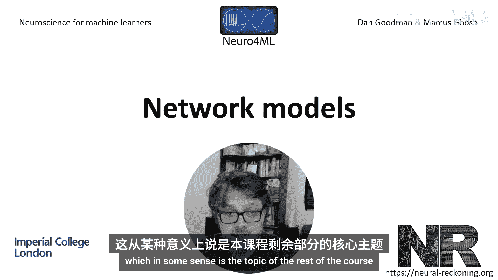
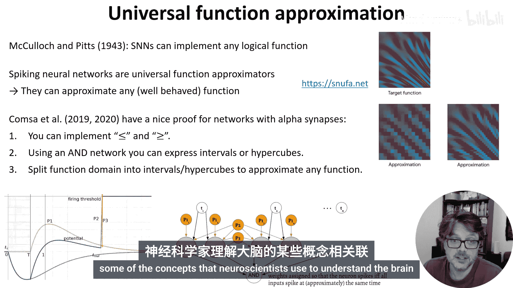
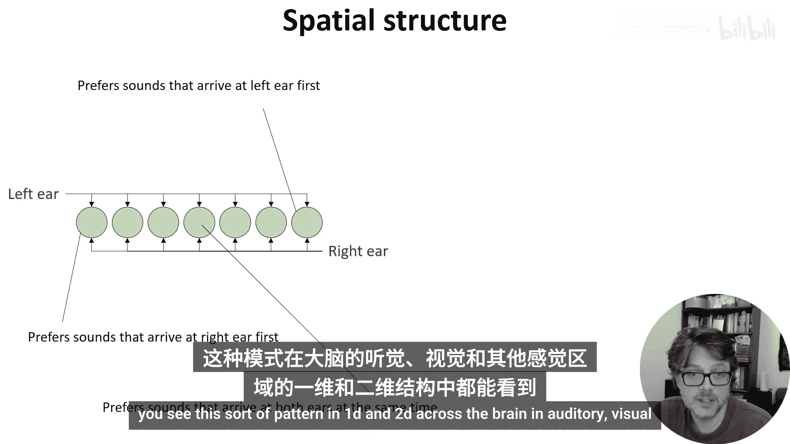
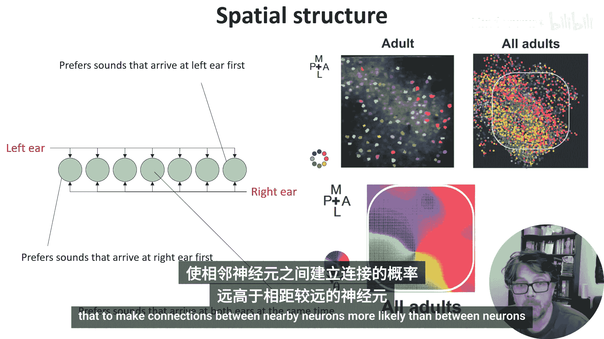
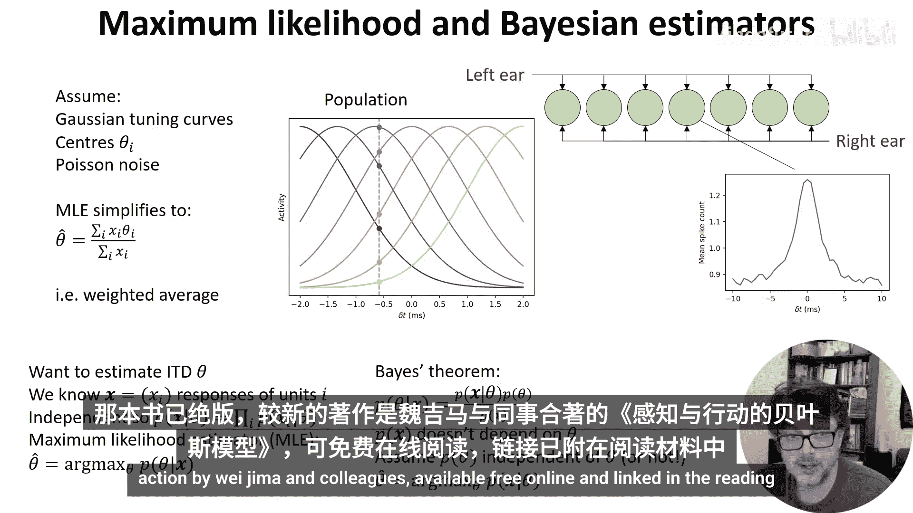
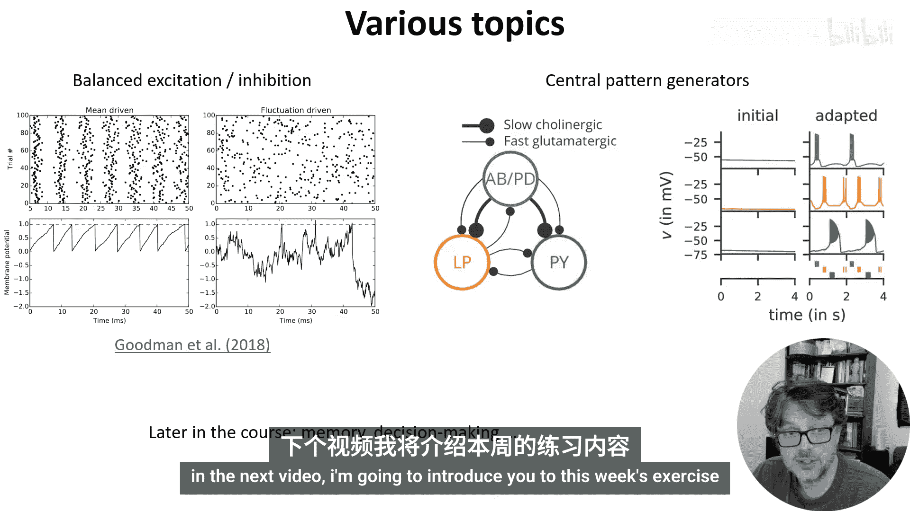

# 014：网络模型 🧠

在本节课中，我们将开始探讨网络建模。从某种意义上说，这是本课程剩余部分的核心主题。

一个关键问题是：网络能完成哪些单个神经元无法完成的任务？简单的答案是：网络可以完成任何任务。这决定了我们无法在一个简短的视频中涵盖所有内容。因此，我们将从一个具体的网络模型入手，深入探讨其工作原理，并展示它如何与神经科学家理解大脑的一些概念联系起来。

## 网络的能力与通用性

上一节我们提出了网络能力的问题，本节中我们来看看其理论基础。

早在1943年，McCulloch和Pitts就证明了脉冲神经网络可以实现任何逻辑函数。不仅如此，就像人工神经网络一样，脉冲神经网络也是一个**通用函数逼近器**。这意味着它们可以逼近任何合理的函数。

Google Research的Yulia Komarova提供了一个简洁而优美的证明。她的思路如下：
1.  首先，证明可以使用脉冲神经元实现“小于”和“大于”运算符。
2.  接着，通过加入实现逻辑“与”的网络，可以表达区间（或高维空间中的超立方体）。
3.  最后，通过组合这些元素，只需将函数划分为越来越小的超立方体，就能以任意精度逼近任何函数。

这个结论或许并不意外，因为我们的大脑本身就是脉冲神经网络，并且功能强大。但这意味着我们无法涵盖网络的所有可能性。因此，我们将聚焦于一个具体的研究案例。

## 案例分析：声音定位电路 🔊

我们将详细探讨一个特定的网络模型：声音定位电路。我们判断声音方向的一个关键依据是声音到达双耳的时间差。对人类而言，最大时间差约为650微秒，但我们能分辨小至20微秒的差异，猫头鹰等动物甚至能分辨几微秒的差异。

那么，我们如何检测这种微小的时间差呢？一个经典模型由Lloyd Jeffress于1948年提出，至今仍见于教科书。在他的模型中，有一排所谓的“重合检测器”神经元。这些神经元只有在同时接收到来自两个突触的输入时才会发放脉冲。

信号从左耳传入，以恒定速度沿这条通路传播，以略微不同的延迟到达每个神经元。同时，信号从右耳传入，以相反方向进行同样的传播。当声学延迟与神经延迟恰好抵消时，信号会同时到达重合检测器并使其发放脉冲。我们可以根据哪个神经元发放了脉冲来判断声音的来源。

以下是该电路的工作原理：
*   声音首先到达左耳。
*   信号从左耳出发向右移动。
*   声音随后到达右耳。
*   信号从右耳出发向左移动。
*   当左右信号在某个神经元处同时到达时，该神经元被激活。

Jeffress的声音定位模型具有几个有趣且更具普遍性的特征，值得我们深入探讨。

## 网络的关键特性

### 重合检测 🔍

重合检测是泄露积分发放神经元的一个普遍特性。如下图所示，当两个脉冲几乎同时到达时，其叠加效应足以使神经元超过阈值并发放脉冲。而当它们到达的时间间隔较大时，脉冲之间的泄露会导致峰值降低，不足以超过阈值。

我们可以绘制一个接收两个脉冲的神经元在存在高斯背景噪声下的响应曲线。结果显示，当输入脉冲的时间差越小时，神经元发放的脉冲越多，这正是我们所需要的效果。

### 调谐曲线 📊

上述响应曲线是神经科学中“调谐曲线”的一个例子。调谐曲线显示了神经元对一个或多个变量定义的刺激的平均响应。在这个案例中，变量是两个脉冲的到达时间差，但它也可以是视觉图像的对比度、声音的振幅或音高等。调谐曲线也可以是二维的，此时可以绘制成图像。我们稍后会再回到调谐曲线。

### 空间结构 🗺️

该网络的另一个在神经科学中常见的特征是空间结构。这里的细胞按照它们偏好的到达时间差排列成一维阵列。这种模式在大脑的听觉、视觉和其他模态中以1D或2D形式广泛存在。

例如，在大鼠的桶状皮层（处理胡须输入的大脑区域）中，彩色斑点显示了在该位置记录的细胞偏好的刺激方向。虽然单个动物的空间结构不明显，但综合多个动物的数据并稍作平滑后，这种结构就变得清晰可见。有趣的是，这种结构是后天习得的，在幼鼠或成年盲鼠中看不到。

在建模中，可以轻松地为每个神经元添加一些元数据来指定其位置，并在模型中使用。例如，可以使附近神经元之间的连接比远距离神经元之间的连接更有可能。

## 信息的编码与解码

了解了调谐曲线和空间结构的概念后，我们可以讨论信息在这个网络中是如何编码和解码的。

本质上，Jeffress提出的模型就是我们今天所说的**独热编码**。知道最活跃神经元的身份或索引，就能告诉你数据的类别（在本例中，是将一个值归入几个离散区间之一）。

然而，在存在神经噪声的情况下，这并不是一种非常鲁棒的解码方式。David McAlpine及其同事提出了另一种观点，认为大脑可能通过计算偏好“右耳领先”的细胞活动总和与偏好“左耳领先”的细胞活动总和之差，来从这个网络解码信息，并使用这个一维变量来回归声音位置。事实证明，这种方法对噪声的鲁棒性更强。从概念上讲，这是因为通过对所有细胞的活动求和（或等效地求平均）来减少噪声的影响。

2013年，我发表了一篇论文，其核心观点是：通过使用标准的**多类感知机**，可以比上述两种方法做得更好。这种方法以一种前两种模型都无法做到的方式利用了所有信息，包括平均掉噪声。巧合的是，同年，我刚加入的同一个实验室发表了另一篇论文，做了基本相同的事情，只是他们使用了贝叶斯解码框架而非感知机。因此，我将用他们的论文来介绍那个框架。

### 概率群体编码 🧮

我们已经看到，如何拥有一个重合检测器阵列，其响应大小取决于声音的到达时间差。

想象我们将这个神经元群体的所有调谐曲线叠加绘制。如果ITD（双耳时间差）位于灰色竖线处，那么我们会在这些圆圈处看到响应。我们的想法是利用这种响应模式来推算出ITD。如果没有噪声，你可以轻松地从图中读出。但这些响应非常嘈杂，因此我们必须使用概率方法。有一种非常常见的方法可以做到这一点。

这需要一点数学推导。我们想估计ITD（记为 θ）。我们知道神经响应是一个向量 **x**。我们假设它们是独立的，因此可以轻松计算给定特定θ值时，观察到响应向量 **x** 的概率。那么，我们的**最大似然估计器**就是使观测到的响应最有可能的θ值。

但我们不知道给定 **x** 时 θ 的概率，只知道反过来。这时就需要**贝叶斯定理**，因为它让我们可以用一个计算另一个。具体来说，由于我们是在对 θ 求最大值，我们可以忽略任何不依赖于 θ 的项，因此可以忽略 P(**x**)。如果我们假设所有 θ 值出现的可能性相同，也可以忽略 P(θ) 项。另一方面，如果我们有关于哪些ITD更可能出现的先验知识，也可以将其纳入，这种方法则被称为**最大后验估计**。

现在，我们可以用我们可以计算的东西来表达我们想要的估计值。这一切可能看起来很抽象。但在本例中，我们可以做一些额外的假设，从而大大简化。

我们将假设所有这些调谐曲线的形状近似为高斯曲线，以某个神经元 i 的偏好ITD θ_i 为中心。我们还假设噪声服从泊松分布，这是一个对神经元相当合理的模型。在这些假设下，最大似然估计简化为：对偏好ITD进行加权平均，权重就是神经响应。

以上就是对概率群体编码的快速介绍。如果你对此感兴趣，我推荐阅读Dayan和Abbott的《理论神经科学》教科书，或者Wei Ji Ma及其同事的《感知与行动的贝叶斯模型》（可在网上免费获取，阅读材料中有链接）。

## 网络的增益与延伸话题

好了，关于声音定位的例子就讲到这里。最后，我想强调一下我们从网络中获得的好处。

单个神经元的时间敏感性受其时间常数控制，最小约为1毫秒，并且噪声很大。我们看到的调谐曲线是10000次重复试验的平均结果，单次试验看起来波动很大，我们不太可能从中做出非常准确的估计。

通过切换到群体并使用群体水平的解码器，我们得到了一个对几微秒时间差敏感的系统，其时间敏感性比网络中最快单元的速度高出几个数量级。

正如我所说，我们无法在这里涵盖关于网络的一切。因此，在结束前，我只想再提两个你可能想进一步阅读的有趣话题。

### 平衡的兴奋与抑制 ⚖️

皮层神经元每秒接收数千个微小输入，那为什么它们不像下图的左侧那样非常有规律地发放脉冲呢？一个可能的答案是存在兴奋和抑制的平衡。如果兴奋性和抑制性输入是平衡且随机分散的，神经元可以非常不规则地发放脉冲，如右侧所示。实际上，大脑中两种行为都能看到，拥有这样一系列行为可能很重要。更广泛地说，平衡的兴奋和抑制可能的作用包括提高网络的敏感性、噪声鲁棒性和响应速度。这方面有大量文献。

### 中枢模式发生器 🔄

另一个我个人觉得非常迷人的是中枢模式发生器。这些是小型网络，似乎只是永远重复地发放相同的脉冲模式。它们被认为参与协调运动，基本上是提供一个有规律的信号，可以转化为我们以标准模式移动肌肉所需的刻板序列。其中一些电路可以非常简单，就像这里示意性展示的龙虾胃神经节中的这个。这个例子特别有趣，因为建模研究发现，这个电路有许多不同的参数组合可以产生相同的输出。后来，实验发现真实的龙虾也是如此，不同个体的这个电路中神经特性可能差异很大，但功能却完全相同。

我在阅读列表中提供了关于这个话题以及其他视频中提到话题的更多阅读材料。此外，我们将在课程后面回到其他一些网络主题，如记忆和决策。

本节课中，我们一起学习了网络建模的基本概念，并通过声音定位电路深入探讨了重合检测、调谐曲线、空间结构以及信息的概率群体编码。我们还简要介绍了平衡的兴奋与抑制以及中枢模式发生器这两个延伸话题。在下一个视频中，我将介绍本周的练习。