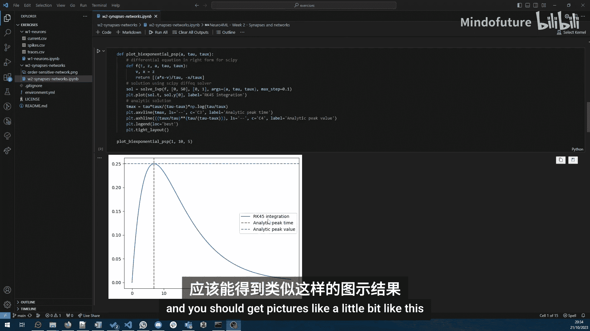
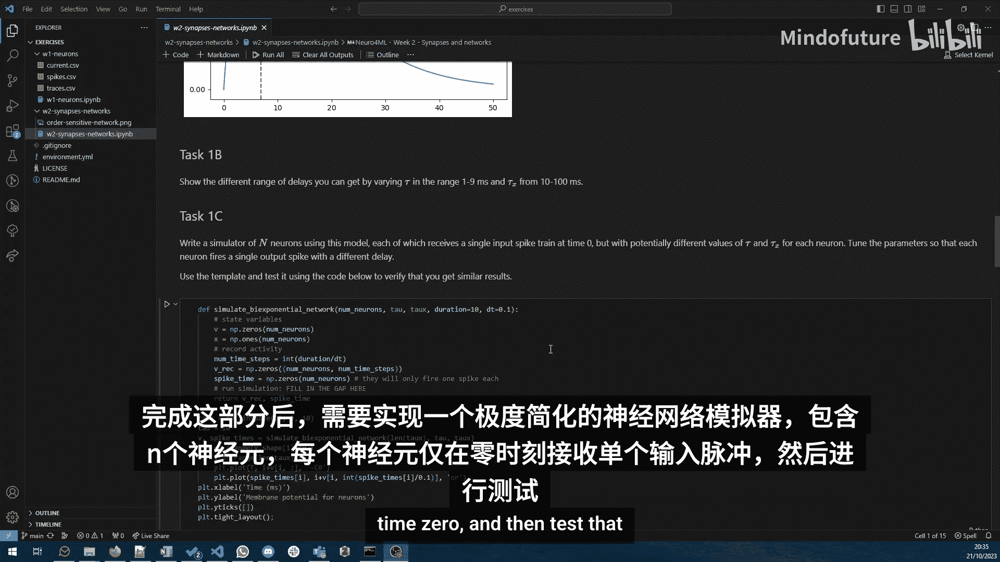
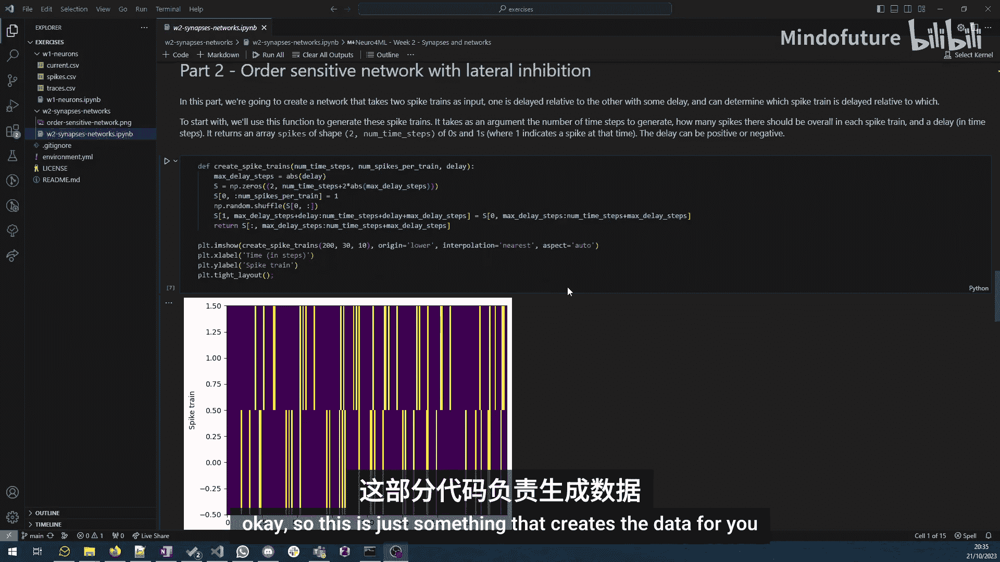
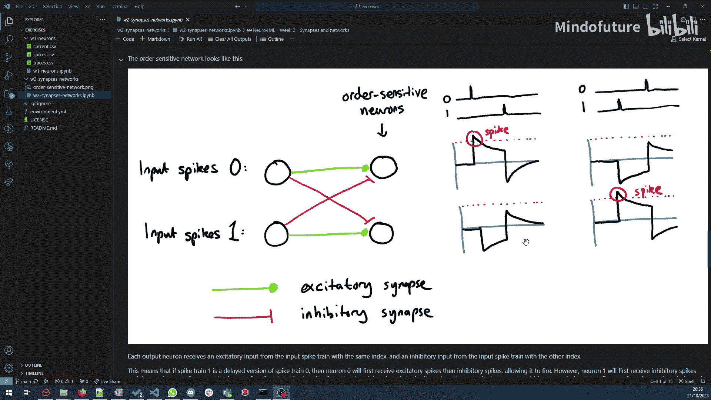
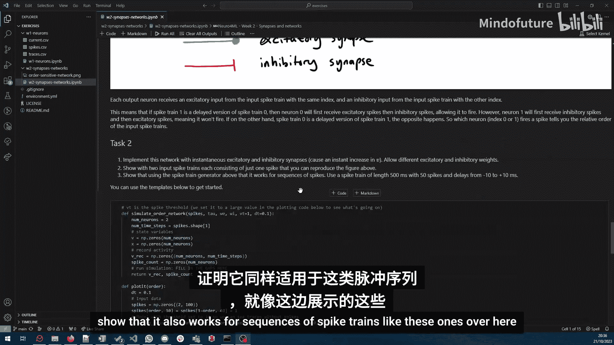
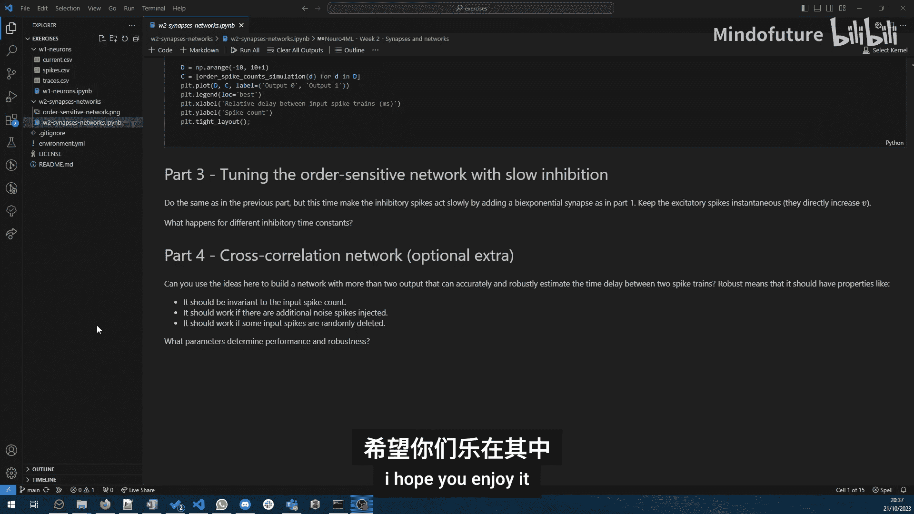

# 015：W2_V5-练习概述 🧠

在本节课中，我们将概述本周关于“突触与网络”的练习内容。本次练习旨在通过实践，加深对复杂突触模型和简单神经网络模拟的理解。

练习笔记本基本是自包含且易于理解的，但这里我们将快速浏览一遍，提供一个大致概览。

## 第一部分：双指数突触模型 📈

上一节我们介绍了基础的突触模型，本节中我们来看看一个更复杂的模型——双指数突触。其核心公式描述了突触后电流 `I(t)` 随时间 `t` 的演化：

`I(t) = (exp(-t/τ_decay) - exp(-t/τ_rise)) * (τ_rise * τ_decay) / (τ_decay - τ_rise)`

以下是你的首要任务：
1.  使用数值积分方法模拟该模型。
2.  将你的数值解与内置的数值解以及解析解进行比较。

完成此部分后，你应能得到类似下图的波形。

## 第二部分：利用突触延迟 ⏱️

在实现了突触模型后，本节我们将探索如何利用它来控制神经元输出的延迟，即动作电位峰值出现的时间。

你的任务是调整模型参数，观察并记录输出峰值的延迟变化。

## 第三部分：构建简单脉冲神经网络 🔌

掌握了单突触的模拟后，我们现在可以构建一个简化的脉冲神经网络模拟器。该网络包含 `N` 个神经元，每个神经元仅在 `t=0` 时刻接收一个输入脉冲。

以下是网络的基本结构示意图。

你的任务是实现这个模拟器并进行测试。这为接下来更有趣的部分做了热身。

## 第四部分：实现顺序敏感网络 🎯

现在，我们将利用之前完成的工作，构建一个“顺序敏感”网络。如果你看过之前的视频，会知道Yeo Comcha的网络实现了“小于等于”或“大于等于”操作。我们这里将使用不同类型的突触和延迟，来实现相同的功能。

以下是用于生成输入数据的代码，以及网络的结构示意图。网络的基本设置是：有两个输入脉冲序列，它们各自直接兴奋一个输出神经元，同时又相互抑制对方。

其工作原理是：如果神经元A先发放脉冲，则输出神经元会发放脉冲，而抑制效应在其之后到来；反之，如果神经元B先发放，则抑制效应先到达，随后到来的兴奋性输入不足以使输出神经元发放脉冲。

你的核心任务是：
1.  实现这个网络。
2.  通过调整参数，复现下图所示的顺序检测功能。
3.  证明该网络对于如下所示的更长的脉冲序列同样有效。

完成以上内容后，你可以进一步尝试使用第一部分开发的慢抑制突触来微调这个网络的性能。

## 可选拓展：构建互相关网络 🔄

第四部分是一个可选的拓展内容，供有兴趣深入探索的同学尝试。其基本思路是：基于已开发的网络，尝试构建一个更复杂的“互相关”网络。该网络能够估计哪些输入是相关的，以及相关的时间延迟是多少，并且其判断应对以下情况保持稳健：
*   输入脉冲的数量变化。
*   存在噪声干扰。
*   随机删除部分脉冲。

你的目标是理解哪些因素控制着该网络的性能和稳健性。但请注意，在课程时间内完成此部分颇具挑战性。

## 总结 📝

本节课中，我们一起学习了如何实现和运用双指数突触模型，并以此为基础构建了能够检测脉冲时序顺序的简单神经网络。从单突触的数值模拟，到多神经元的网络集成，再到实现特定的计算功能（顺序检测），我们完成了一次从基础组件到功能系统的小型实践。希望你能从中获得乐趣并加深理解。😊