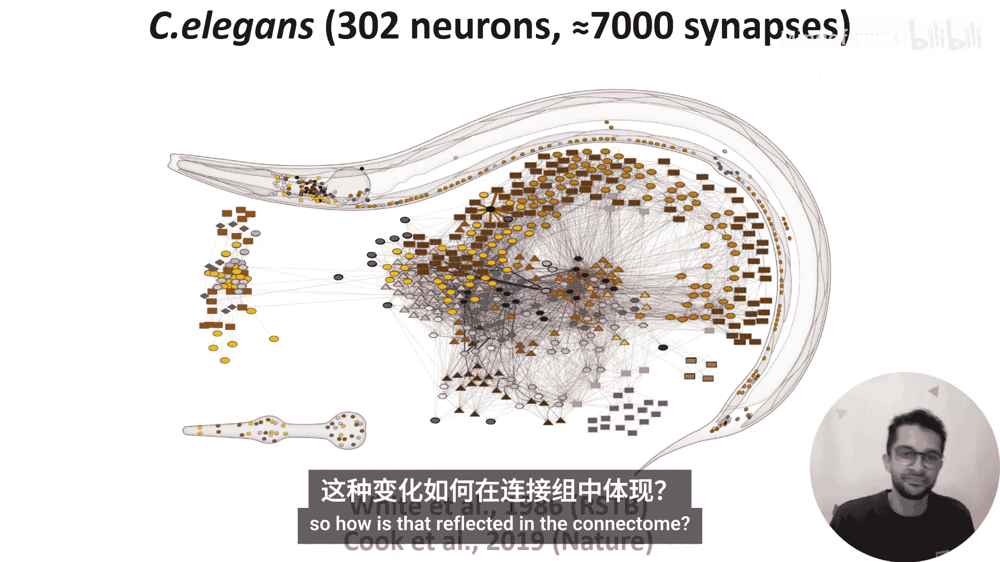
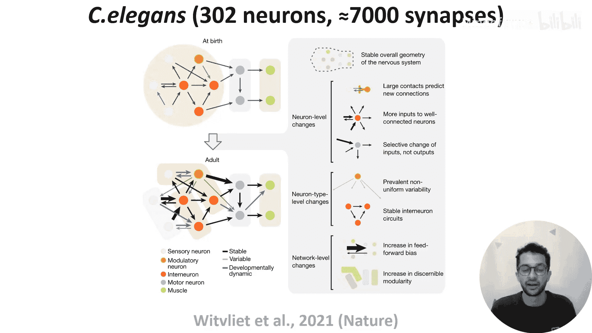
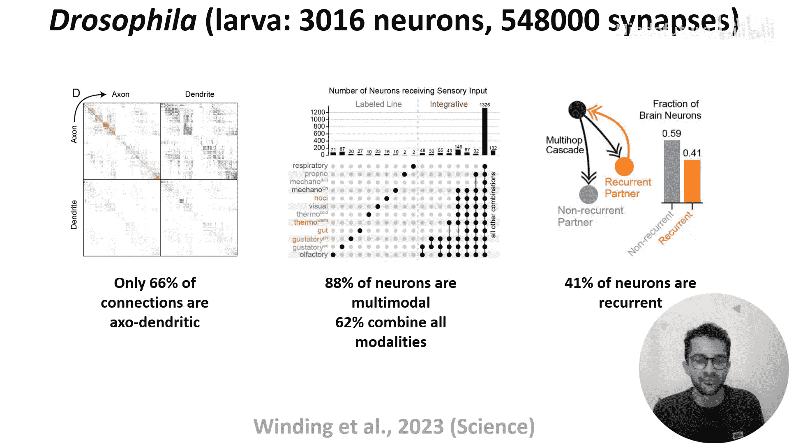
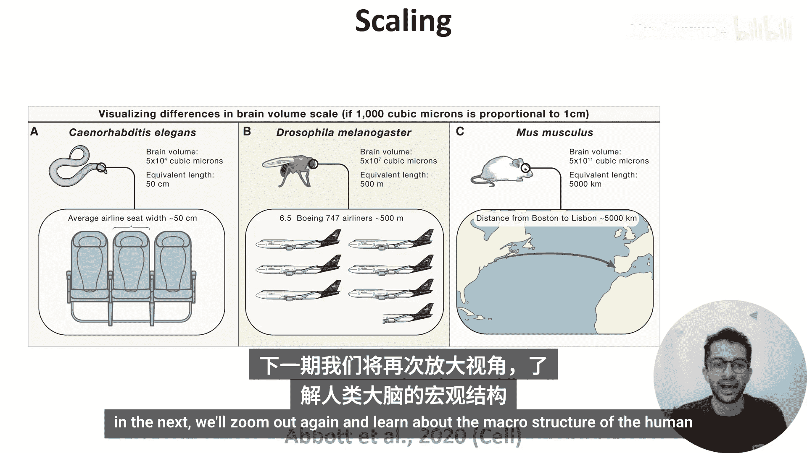

# 016：连接组学 🧠

在本节课中，我们将学习连接组学的概念，即描绘生物体内所有神经元之间连接关系的完整图谱。我们将从简单的线虫开始，了解其连接组的结构与特性，然后探讨连接组如何随发育和学习而变化，最后介绍果蝇幼虫连接组的新发现，并讨论获取更大规模连接组所面临的挑战。

## 从神经元网络到全脑图谱

上一节我们介绍了神经元如何连接形成网络，并观察了果蝇脑中的环状吸引子网络等实例。本节中，我们将视角放大，审视整个大脑的结构，这就引出了“连接组”的概念。

连接组是指描述一个动物体内每个神经元与所有其他神经元之间连接关系的完整图谱。迄今为止，只有四种生物拥有完整的连接组，其中第一种是秀丽隐杆线虫。

## 线虫连接组的发现

线虫连接组于1986年首次完成，并于2019年更新。线虫仅约1毫米长，但为了获取其连接组，研究人员仍需将样本切成约50纳米厚的超薄切片。他们在显微镜下观察每个切片，并手动追踪每个神经元在切片间的连接。

完成后，他们发现了此处展示的连接模式。该连接组仅包含302个神经元和大约7000个突触。

那么，我们能从这种架构中学到什么呢？以下是几个关键发现：

*   **突触类型**：约80%的突触是化学突触，其余为电突触（间隙连接）。
*   **连接稀疏性**：只有约3%的可能连接实际存在，表明连接是稀疏的。
*   **模块化结构**：神经元通常具有密集的局部连接和稀疏的长程连接，这意味着网络具有模块化结构。
*   **网络深度**：从感觉输入到运动输出，网络最多只有约四层深，因此相对较浅。

需要记住的是，尽管这个网络看起来简单，尤其是与机器学习模型相比，但它使线虫能够完成从响应感觉输入、在环境中觅食到交配繁殖后代等一系列行为。因此，即使是一个相对简单的生物网络，其所能实现的复杂性也不应被低估。

这个连接组是通过结合多个同龄动物的数据生成的，因此它为我们提供了大脑结构的代表性静态视图。但大脑会随着我们学习和年龄增长而持续变化，这如何在连接组中体现呢？

## 连接组的动态变化

为了解答这个问题，一篇论文重建了八只不同年龄线虫的连接组并进行比较。他们发现，从出生到成年，突触数量增加了五倍。这些变化并非均匀发生，而是遵循几种模式，总结在下图中。

以下是其中三个主要模式：

*   **前馈连接增加**：新的突触倾向于添加到前馈方向（从感觉输入到运动输出），因此网络随着时间的推移变得越来越前馈化。
*   **模块化增强**：如果将具有相似连接模式的神经元分组为模块或子网，可以观察到网络随着年龄增长而模块化程度越来越高。
*   **经验塑造连接**：尽管这些线虫在基因上是相同的，但每只线虫都拥有其他线虫中没有的连接，这表明经验也塑造了神经回路的结构。

## 超越线虫：果蝇幼虫连接组

好的，除了线虫，其他模式生物的连接组也开始被绘制出来，如果蝇。

例如，一篇论文重建了果蝇幼虫的连接组。在幻灯片顶部可以看到，即使从小小的幼虫开始，其神经元数量已是线虫的10倍，突触数量接近80倍。

那么，我们能从这个连接组中学到什么？以下是一些有趣的特征：

*   **非典型连接**：如果定义每个突触的方向（即哪个神经元是突触前，哪个是突触后），那么与我们通常假设并已教授的知识相反，只有66%的连接是一个神经元的轴突与另一个神经元的树突相连。其余都是非典型连接，可以观察到所有可能的连接类型：轴突到轴突、轴突到树突、树突到轴突以及树突到树突。这意味着整体连接组是四个不同的神经元间连接矩阵的结果，如最左侧图所示。
*   **多模态整合**：另一个有趣的特征是，几乎所有神经元都是多模态的。如果从幼虫的感觉神经元（检测味觉、温度和触觉等输入）开始，然后使用信号级联算法通过网络模型传播信号，你会发现只有12%的神经元接收来自单一模态的输入（如中间图的左侧所示）。其余88%的神经元接收来自不同模态组合的输入（如中间图右侧所示），并且有些令人惊讶的是，62%的神经元接收来自全部12种模态的输入。
*   **循环连接**：作者估计，41%的神经元以多突触方式形成循环连接。换句话说，如果神经元A连接到B，B连接到C，依此类推，最终会有一条连接回到A。最右侧的图用简单的橙色A-B-A连接说明了这一点，但条形图考虑了多达五个突触的循环。

## 更大连接组的挑战与展望

退一步看，我们可能会期望像我们这样具有更复杂行为的动物，其连接组与果蝇和线虫非常相似，只是规模更大。或者，我们可能预期会有额外的特征。无论哪种情况，如果我们能获得更大的连接组进行比较，那将非常有益。

问题在于，大脑体积增长非常迅速。例如，从线虫到小鼠，大脑体积增加了1000万倍。为了形象化理解，如果1立方微米的大脑体积相当于1厘米的线性距离，那么我们讨论过的线虫大脑大约相当于飞机上一个座位的宽度。成年果蝇的大脑相当于六架半飞机的长度。而小鼠的大脑则相当于波士顿到里斯本的距离。

显然，获取更大的连接组在数据采集、存储和分析方面都带来了巨大的挑战。

## 总结与下节预告

本节课中，我们一起学习了连接组学的概念。我们从最简单的线虫连接组入手，了解了其稀疏、模块化且相对较浅的结构特点。接着，我们探讨了连接组并非静态，而是会随发育和经验动态变化。然后，我们看到了果蝇幼虫连接组揭示的非典型连接、广泛的多模态整合以及显著的循环连接等新特征。最后，我们认识到获取更大规模连接组（如小鼠或人类）面临着巨大的技术挑战。

下一节，我们将再次放大视角，学习人类大脑的宏观结构。

