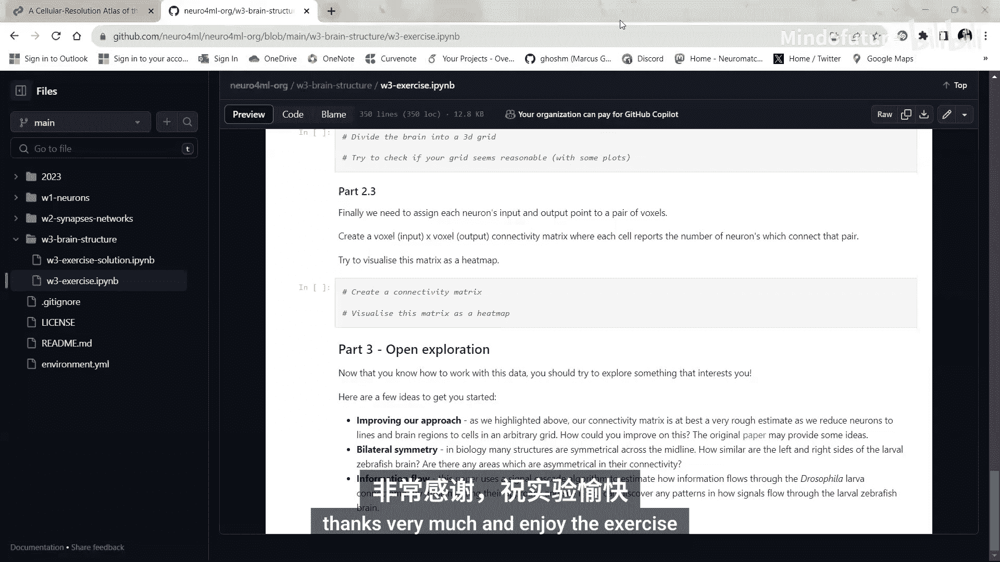

# 018：W3_V2 练习

在本节练习中，我们将处理一份真实的神经科学数据集，学习如何加载、可视化数据，并初步估算大脑区域间的连接性。最后，我们将鼓励你基于数据自由探索感兴趣的问题。

## 📚 数据来源与背景介绍

在开始练习之前，我们先花几分钟了解数据的来源和基本形态。

这些数据主要来源于论文《Cellular resolution outlas of the laval zebrafish brain》。论文中的数据来自斑马鱼幼体，这是神经科学中常用的动物模型。

从俯视图看，一条斑马鱼形态如图所示。鱼头部两侧有眼睛和两个鳍，身体向后延伸至尾部。

研究者在实验中运用了基因技术，将每条鱼大脑中的一到两个神经元进行荧光标记（图中显示为绿色）。随后，他们使用显微镜对每条鱼进行成像，并追踪了所有被标记神经元的形态，从而获得了三维结构数据。

最终，他们得到的是每条鱼中一到两个神经元的集合。为了在不同鱼之间进行比较，研究者使用了**配准算法**，将所有数据对齐到一个公共的参考坐标系中。

由此产生的是一个**图谱**，它包含了数千个神经元及其在鱼脑中的三维形态。这如图E所示（同样是俯视图），其中眼睛是两侧的半球，大脑结构以灰色显示，而所有不同的线条则代表了不同神经元的三维形态，该数据库中包含数千个神经元。

## 🧩 练习内容概览

我们将利用这些数据做什么呢？本次练习主要包含四个部分。

**第一部分：加载数据**
你首先需要加载数据。具体方法取决于你的工作环境（本地或CABAB平台），两种情况的说明都已提供。

**第二部分：数据可视化**
成功加载数据后，我们将从两个角度观察数据：一是查看单个神经元，二是绘制数据集中所有神经元的整体图。我们将进行二维和三维的可视化。

**第三部分：估算粗略的连接矩阵**
完成可视化后，我们将估算鱼脑不同区域之间一个非常粗略的**连接矩阵**。这部分被细分为三个子步骤，每个步骤都有说明，你需要补充代码来完成。

**第四部分：自由探索**
在获得连接矩阵后，我们鼓励你基于此数据探索任何你感兴趣的方向。我们提供了三个思路供你参考：

以下是三个探索思路：

1.  **改进连接矩阵估算方法**：我们在练习中估算的连接矩阵只是一个非常粗略的近似。你可以尝试改进它，原始论文能提供许多改进思路。
2.  **探索大脑的对称性**：研究大脑沿中线的对称程度。换句话说，左右两侧在细胞分布、连接模式等方面有多相似？你也可以尝试寻找大脑中不对称的区域。
3.  **模拟信息流**：你可以使用**信号级联算法**，尝试估算信息在鱼脑中的流动方式。我们提供了一个相关论文的链接，其中详细解释了该方法。

如果你是帝国理工学院的现场学员，在课程结束时我们将简要讨论大家在这部分提出的方法和发现。

如果你是远程参与，欢迎在Discord上分享你的发现或任何想法。

感谢参与，祝你练习愉快！😊

## ✨ 总结

本节课我们一起学习了如何获取并处理真实的斑马鱼脑神经元数据集。我们了解了数据的背景，练习了数据加载与可视化，并初步尝试估算大脑区域间的连接性。最后，我们鼓励你基于此进行自由探索，以深化对神经科学数据的理解。