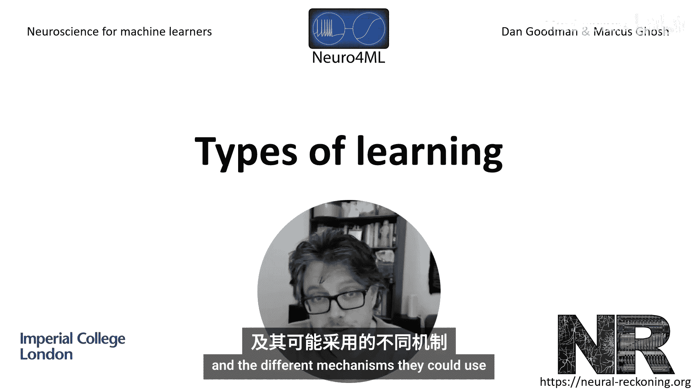
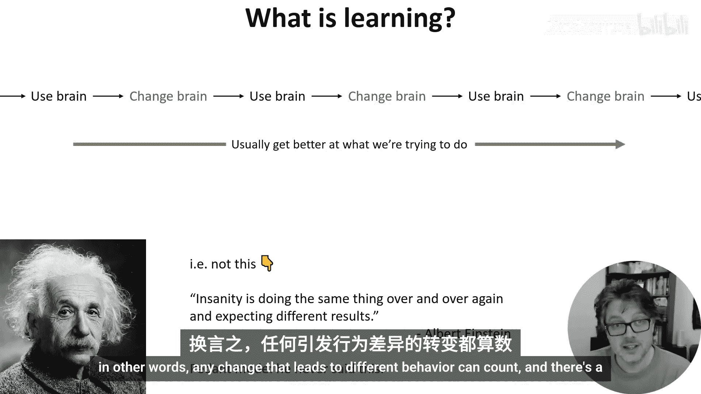
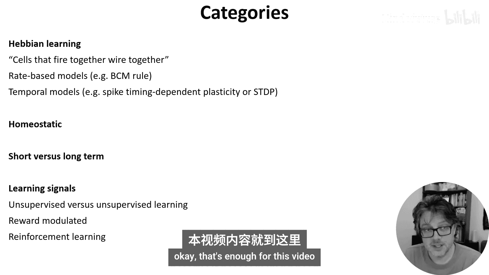

# 019：学习类型概述 🧠

在本节课中，我们将要学习大脑中学习发生的机制，以及这些机制如何与机器学习算法相关联。我们将从概述学习的类型及其可能使用的不同机制开始。

## 什么是学习？

从最广泛的意义上讲，学习是指**面对经验时行为的任何改变**。换句话说，任何导致不同行为的变化都可以算作学习。我们的大脑中有许多可以改变的方面。

## 学习的潜在机制

在原理上，任何能修改我们行为的东西都可以成为学习的组成部分。以下是大脑可能用于学习的一些关键机制。

### 1. 修改突触权重
我们都很熟悉通过修改突触权重来改变神经网络功能的理念。这通常是机器学习语境中所指的“学习”。其核心公式可以表示为：
`Δw = η * (pre * post)`，其中 `w` 是权重，`η` 是学习率，`pre` 和 `post` 是突触前后神经元的活动。

### 2. 结构可塑性
除了改变权重，我们还可以增加或移除突触，这有时被称为**结构可塑性**或**布线可塑性**。这接近于机器学习中的**架构搜索**。

### 3. 改变神经元属性
学习也可以通过改变神经元的其他属性来实现。例如：
*   修改其输入增益、阈值或静息电位。这类似于改变机器学习模型中的**权重和偏置**。
*   通过改变细胞膜上离子通道的分布甚至其形状，来改变神经元的动态特性和信息整合方式。

### 4. 改变输入与背景活动
改变神经元行为的一个关键因素是**其输入的性质**，包括网络的背景活动。学习或记忆不一定非要存储在神经元或突触结构的永久性变化中。

### 5. 工作记忆与化学环境
*   **工作记忆**（为完成任务而暂时保存在大脑中的信息）的常见理论认为，它是由大脑中持续的活动模式实现的，而非永久性变化。
*   大脑细胞外区域的精确化学成分会改变神经元的行为方式。**神经调质**（如多巴胺）是能改变离子通道功能的弥散性化学物质，大脑可用其改变一大群神经元的行为。
*   大脑还可以选择提供更多或更少的能量。通过我们的行为（例如疲倦时喝咖啡），我们可以直接改变这种化学环境。

## 学习的重要概念与分类

在接下来的视频中讨论学习时，我们需要牢记以下几个重要类别。

### 赫布学习
最重要的概念之一是**赫布学习**。这通常被总结为“一起放电的细胞，连接在一起”，可以看作是在大脑中鼓励关联性或因果性连接。
*   一种建模方法是使用一系列基于发放率的模型，这些模型利用突触前后神经元发放率之间的**相关性**。
*   另一种方法是考虑单个尖峰的时序，即**脉冲时序依赖可塑性**。

### 稳态
在思考大脑的变化方式时，考虑**稳态**很重要。这是我们的身体或大脑保持自身某种平衡的过程。例如，如果某些神经元放电过多，那么突触可能会变弱或阈值可能会升高以降低活动。

### 短期与长期变化
区分短期和长期变化也很重要，这类似于**活动变化**与**突触和神经元结构的永久性变化**之间的区别。

### 学习可用的信号
与机器学习类似，我们可以区分**无监督**和**有监督**的学习形式。
*   以机器学习方式定义的**有监督学习**在大脑中可能比较罕见，因为并没有一个来自外部的、神奇的“正确”信号。
*   相反，我们可能会考虑各种形式的**自监督学习**，即大脑的一部分向另一部分提供反馈。一个例子是**奖励**：如果你做了一个动作并得到了美味的糖作为奖励，这就是大脑可以利用的信号。这自然引出了**强化学习**的相关概念。

## 总结

本节课中，我们一起学习了大脑中学习的广泛定义及其多种潜在机制。我们探讨了从修改突触权重、结构可塑性到改变神经元属性和化学环境等多种方式。我们还介绍了赫布学习、稳态、以及区分短期/长期变化和无监督/有监督/强化学习等关键概念，为后续深入探讨具体的数学模型和算法奠定了基础。