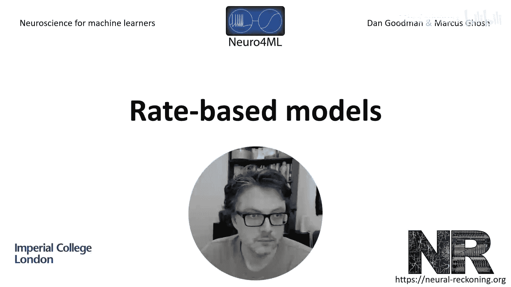
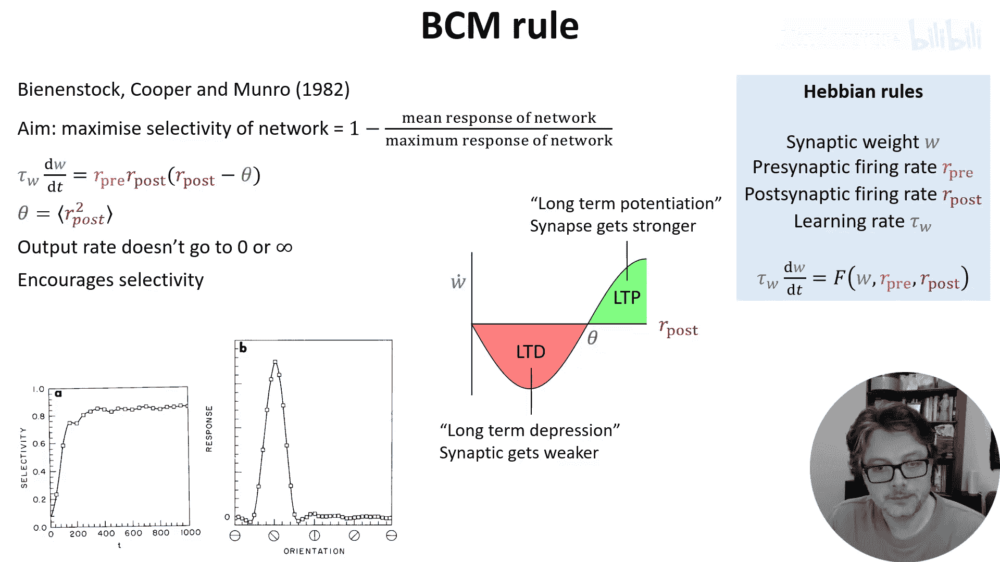
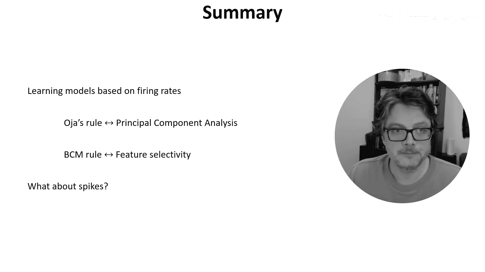

# 020：基于发放率的模型

在本节课程中，我们将学习基于发放率的赫布学习模型。我们将探讨突触权重 **W** 如何根据突触前神经元发放率 **R_pre** 和突触后神经元发放率 **R_post** 的变化而调整。我们将通过微分方程来描述这一学习过程，并分析几种具体的模型及其特性。

## 赫布学习的基本模型

上一节我们介绍了赫布学习的核心思想。本节中，我们来看看如何用数学公式来描述基于发放率的学习。

我们用一个微分方程来建模权重的变化。该方程表示，权重 **W** 的变化率与某个函数 **F** 成正比，而 **F** 是权重本身以及突触前、后发放率的函数。时间常数 **τ_W** 控制着变化的速度。

**公式：**
`τ_W * dW/dt = F(W, R_pre, R_post)`

不同的函数 **F** 对应不同的学习模型。这个概念比较抽象，让我们来看一个具体的例子。

## 简单的相关学习模型

以下是第一种简单的模型。我们选择函数 **F** 为突触前和突触后发放率的乘积。

**公式：**
`τ_W * dW/dt = R_pre * R_post`

这个模型清晰地体现了“一起发放的神经元会连接在一起”的思想。当突触前和突触后发放率同时很高时，权重增长最快。

然而，这个模型存在两个明显的问题：
1.  **权重无界增长**：由于发放率总是正数，权重会无限增大。
2.  **权重只增不减**：模型缺乏使权重减小的机制。

为了解决这些问题，研究者们提出了改进方案。

## 解决权重无界增长问题

针对权重无限增大的问题，主要有两种解决方案：

*   **硬边界**：简单地将权重 **W** 限制在某个最大值 `W_max`。
*   **软边界**：修改学习规则，使权重在接近最大值时变化率降低。

以下是实现软边界的一个示例公式，其中 `W_max` 是目标最大权重：

**公式：**
`τ_W * dW/dt = R_pre * R_post * (1 - W/W_max)`

接下来，我们转向一个更著名的模型，它同时解决了权重无界增长和只增不减的问题。

## Oja学习规则

Oja规则旨在解决权重无界增长的问题。它在标准赫布规则的基础上，减去了一个与权重和突触后发放率平方成正比的项。

**公式：**
`τ_W * dW/dt = R_pre * R_post - α * W * (R_post)^2`

这个规则有两个优良特性：
1.  权重最终会停止增长，保持稳定。
2.  更令人惊讶的是，这个学习规则能让神经元学会提取其输入的第一主成分。

这建立了一个生物学学习规则与统计学/机器学习算法（主成分分析PCA）之间的联系。下面我们来简要分析其原理。

### Oja规则与主成分分析

为了简化分析，我们做出一些假设：输入是一个向量 **x**（代表突触前发放率，均值为0），输出是一个标量 **y**，由权重向量 **w** 和输入 **x** 的点积得到。

**公式：**
`y = w^T * x`

在这些假设下，Oja规则可以重写为：

**公式：**
`dw/dt = γ * (y * x - y^2 * w)`

我们关注学习停止后的稳定状态，即权重变化率的平均值为零。经过推导（涉及协方差矩阵 **C = <x*x^T>**），我们得到稳定状态需满足的条件：

**公式：**
`C * w = λ * w`

其中 `λ = w^T * C * w`。这正是矩阵特征值的定义式，意味着 **w** 是协方差矩阵 **C** 的一个特征向量，而 **λ** 是对应的特征值。实际上，Oja规则会收敛到最大特征值对应的特征向量，即第一主成分。

此外，我们还可以证明，在稳定状态下，权重的模长会归一化到1（`||w|| = 1`）。这体现了Oja规则内在的权重归一化特性。

## BCM学习规则

另一种重要的方法是BCM规则（以Bienenstock, Cooper, Munro命名）。他们的目标是模拟视觉皮层中选择性的发展，因此寻找一个能最大化选择性的学习规则。

他们定义选择性为 `1 - (平均响应 / 最大响应)`。高选择性意味着网络对大多数输入响应很弱，但对某些特定输入响应很强。

BCM规则在简单赫布项上乘以一个可正可负的项：

**公式：**
`τ_W * dW/dt = R_pre * R_post * (R_post - θ)`

其中 **θ** 是一个阈值。当 `R_post > θ` 时，权重增强；当 `R_post < θ` 时，权重减弱。

如果 **θ** 是常数，权重仍可能无限增长。因此，BCM将 **θ** 设为一个动态变量，它追踪突触后发放率平方的平均值（例如滑动平均）。

**公式：**
`τ_θ * dθ/dt = <(R_post)^2> - θ`

这个动态阈值机制确保了输出的发放率既不会趋向于零也不会趋向无穷。它通过制造一个不稳定的平衡点来促进选择性：如果网络对所有输入产生相同输出（低选择性），微小的扰动就会使网络偏离这个状态，最终变得只对某些特定输入产生强响应。

在模拟视觉皮层方位选择性的发展中，BCM规则能产生与生物发育过程定性匹配的结果：随着时间的推移，网络的选择性增加，最终只对某个特定方位有强烈偏好。

## 总结与过渡

本节课中我们一起学习了基于发放率的赫布学习模型。我们看到了简单的相关模型、能进行主成分分析的Oja规则，以及能发展特征选择性的BCM规则。这些模型将赫布原理转化为具体的数学公式，并展现出有趣的计算特性。

然而，这些模型都忽略了一个重要特征：神经元脉冲的精确时序。在下一节视频中，我们将转向基于脉冲时序的学习模型。