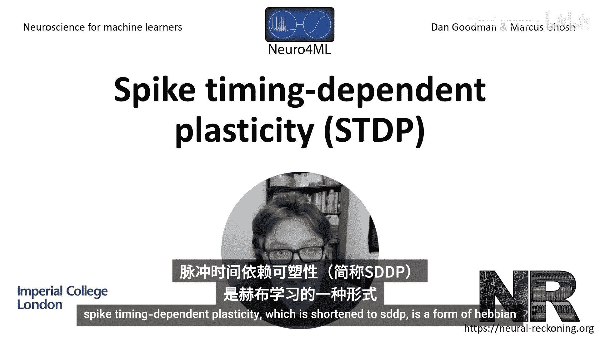
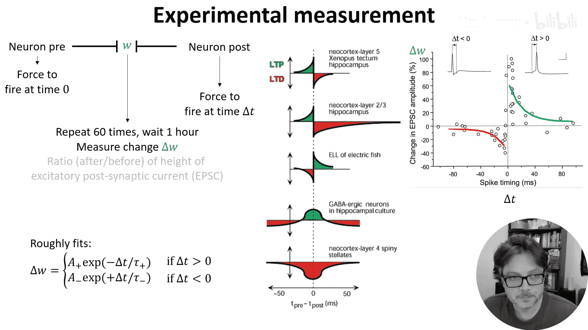
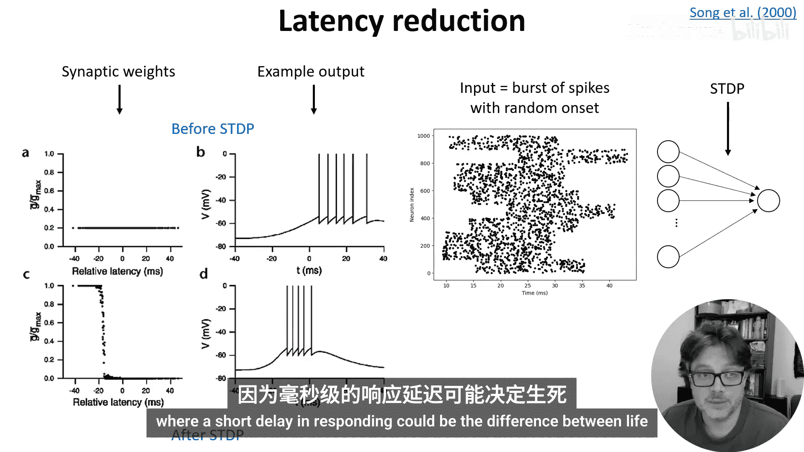
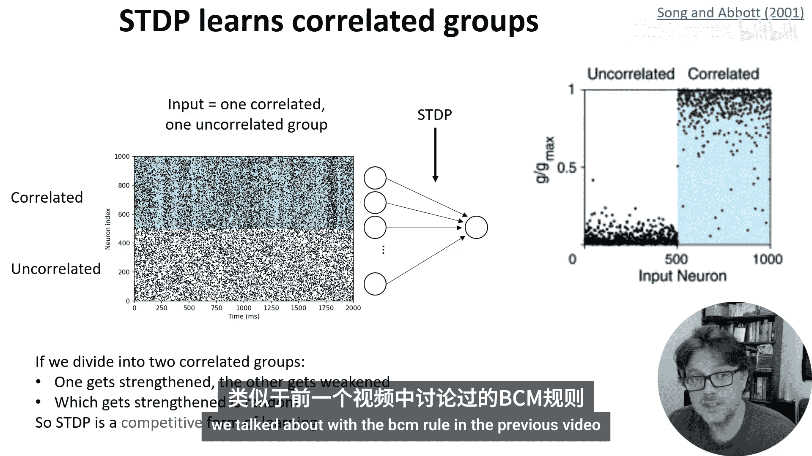
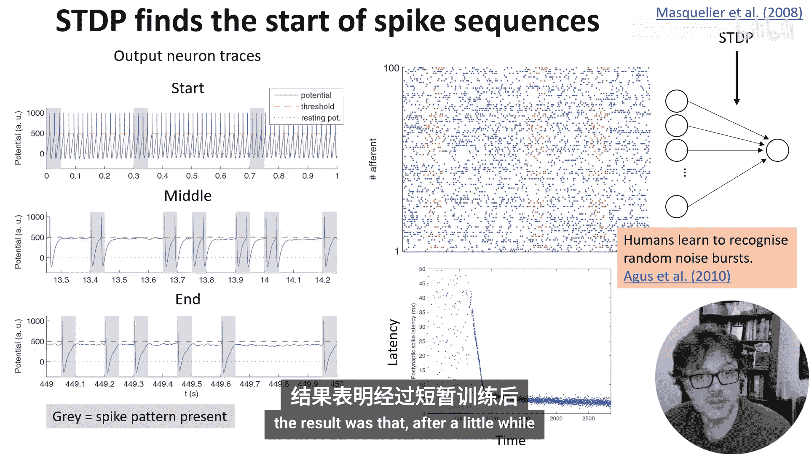
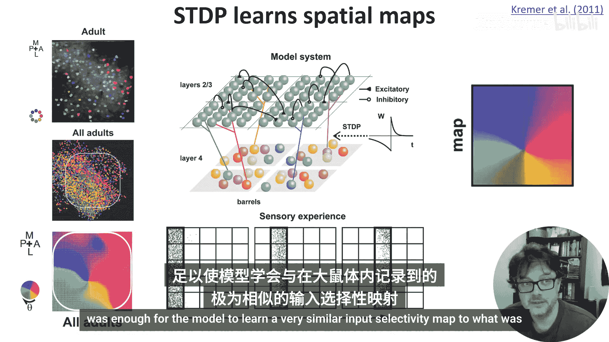
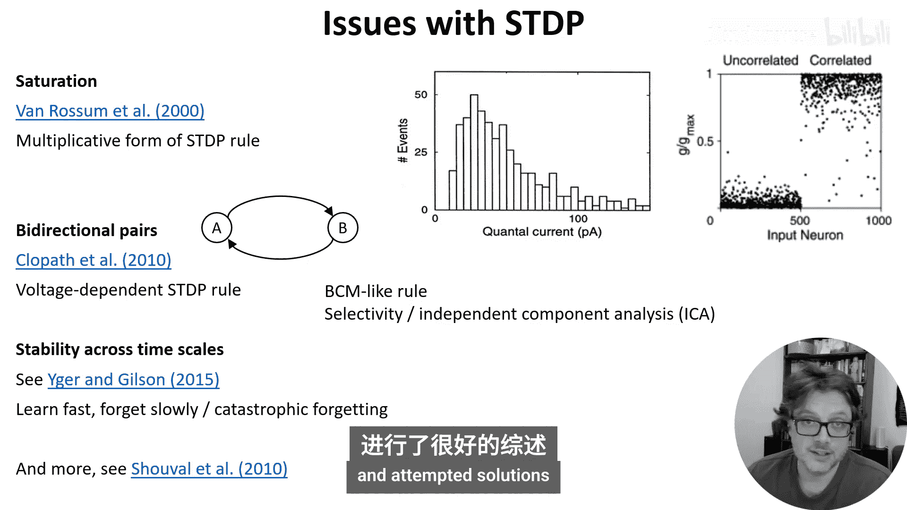
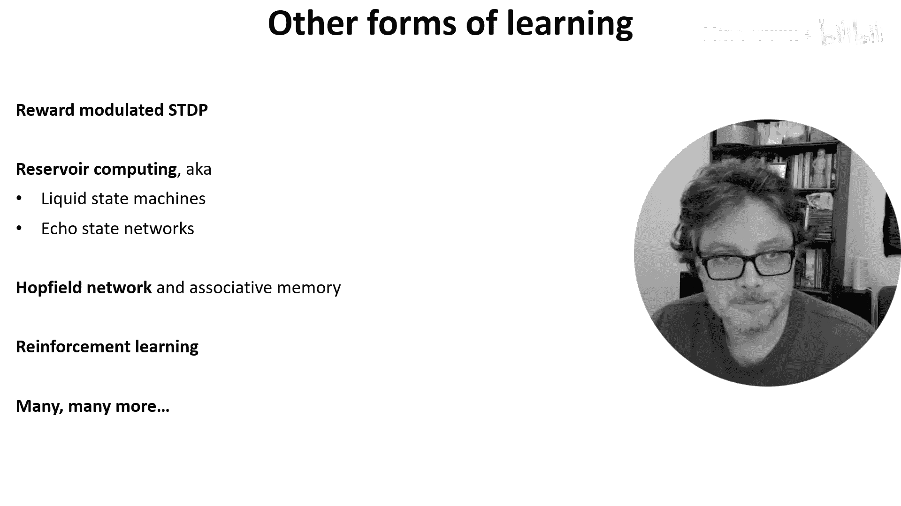

# 021：脉冲时序依赖可塑性 (STDP) 🧠

在本节课中，我们将学习一种重要的突触学习规则——脉冲时序依赖可塑性。我们将了解它的实验发现、数学模型、它能实现的学习功能，以及它存在的一些问题和挑战。

## 实验发现与核心概念

上一节我们介绍了学习规则的概念，本节中我们来看看一种基于精确脉冲时序的学习机制。

脉冲时序依赖可塑性，通常简称为 **STDP**，是一种将单个脉冲的精确发生时间考虑在内的赫布学习形式。

首先介绍它的实验测量方法。
1.  找到一对通过突触连接的神经元。
2.  强制突触前神经元在时间 0 发放脉冲。
3.  强制突触后神经元在时间 ΔT 发放脉冲。
4.  重复这种配对刺激约 60 次。
5.  等待约一小时后，测量突触的变化。
6.  通过计算单个兴奋性脉冲前后突触后电流的高度来测量这种变化。

实验结果大致如下。如果突触后神经元在突触前神经元之后发放脉冲，突触权重会增强。如果突触后神经元在突触前神经元之前发放脉冲，突触权重会减弱。并且，脉冲时间间隔越近，这种效应越强。

我们可以用一对具有不同高度和时间常数的指数函数来大致拟合这个结果。

我们之前讨论过赫布学习，即“一起发放的神经元会连接在一起”。但 STDP 更接近赫布最初提出的想法：当突触前神经元反复促成突触后神经元的发放时，突触会增强。STDP 实现了这个想法，因为如果突触后神经元在突触前神经元之前发放，那么突触前神经元显然不可能促成那次发放。同样，如果脉冲时间间隔很远，它们也不太可能相关。

到目前为止，这看起来是一个完美的故事：为一个直观的理论想法找到了实验证据，然后用一个简单的模型来拟合数据。

但大脑从不会让我们如此轻松。除了发现赫布可能预测的形状外，我们还发现了相反的形状，以及无论符号如何，只要脉冲时间接近突触就会增强等多种不同形状。

尽管如此，“前-后”形状是我们通常讨论的 STDP，也是本视频的重点。

## 数学模型与高效计算

上一节我们看到了 STDP 的实验现象，本节中我们来看看如何用数学模型来描述它，并实现高效计算。

最简单的建模方法是对所有脉冲对引起的权重变化求和。

问题是这种方法的计算成本很高。假设有 N 个神经元连接到另外 N 个神经元，每个神经元发放约 R 个脉冲。那么，计算这个求和大约需要 **N²R²** 次运算，且每次运算都包含对指数函数的调用，这本身就很耗时。

但利用指数函数是线性求和的指数这一特性，有一个技巧可以简化计算。

为每个突触前神经元引入一个称为“迹变量”的 **A_pre**，对突触后神经元也做同样处理，引入 **A_post**。

以下是更新规则：
*   在没有脉冲时，它们像我们在漏电积分发放神经元中看到的那样呈指数衰减。突触前迹以时间常数 **τ_plus** 衰减，突触后迹以 **τ_minus** 衰减。
*   当突触前脉冲到达时，**A_pre** 增加一个常数 **A_plus**，然后权重 **W** 增加 **A_post**。
*   类似地，当突触后脉冲到达时，**A_post** 增加 **A_minus**，然后权重 **W** 减少 **A_pre**。

现在，尝试理解为什么这能给出相同的结果是一个很好的练习。你应该先检查单个脉冲对（例如，突触前神经元在时间 0 发放，突触后神经元在时间 ΔT > 0 发放）会发生什么。绘制 **A_pre** 和 **A_post** 的变化图，以及在每个脉冲时间 **W** 的变化。然后对突触后脉冲先发生的情况做同样操作，这应该会得到顶部的单脉冲对权重变化方程。最后利用所有方程都是线性的这一事实，对所有可能的脉冲对求和，就会得到全脉冲对权重变化规则。

在计算上，我们现在只需要进行 **N²R** 次运算。而且，与指数运算不同，现在都是算术运算，速度更快、效率更高。不仅如此，这实际上是“免费”的，因为无论如何我们都必须进行这些最小运算。对于突触前神经元的每个脉冲，我们必须向其连接的每个突触后神经元添加一个值。每个脉冲影响 N 个神经元，并且有 N*R 个突触前脉冲，所以这是我们无论如何都必须进行的 N²R 次运算。

需要指出的一点是，模型与实验数据在此略有不同。在实验数据中，大约需要一小时才能看到完整的权重变化，且变化是随时间缓慢增加的。在第一种实现中，我们可以在想要学习的脉冲之后一小时运行权重变化规则，但这仍然与实验中看到的缓慢变化不匹配。在第二种实现中，它会在每个脉冲后立即自动更新。

还需要注意延迟的一些细微差别。根据延迟是树突的、轴突的还是两者的组合，你应该做略有不同的事情。无论如何，关于延迟的实验数据不太明确，因此甚至不清楚这里是否有正确的做法。

## STDP 能学习什么？

现在我们已经知道如何建模 STDP，让我们开始看看它能学习的一些东西。

### 学习最早响应 🏃‍♂️

以下是第一个模型：设置一层输入神经元，通过具有 STDP 的突触权重连接到单个输出神经元。

我们让这些输入神经元在 20 毫秒内发放一串脉冲，但具有随机的潜伏期，然后观察网络学到了什么。

我们看到，潜伏期低的神经元其突触权重增强到了最大水平。这里，学习前所有潜伏期的权重相同。学习后，低潜伏期神经元具有高权重，高潜伏期神经元具有低权重。输出神经元在学习后的发放时间也比学习前更早。

一种解释是，如果一个动物有多个信息来源，它会优先响应最早到达的信息。这在响应延迟短可能决定生死（例如被猎杀）的环境中显然是有利的。

### 学习相关性与竞争 🤝

在下一个模型中，我们将输入神经元分为两组。白色背景的一组发放不相关的脉冲。蓝色背景的一组发放相关的脉冲。经过 STDP 后，不相关组神经元的权重变为 0，而相关组神经元的权重变为最大值。

这在生物学上是有意义的，因为能够捕捉环境中的输入相关性非常有用。

我们也可以做同样的事情，但让两组神经元各自与组内其他神经元相关，而与另一组神经元不相关。我们发现 STDP 会学会选择两组中的一组，但具体选择哪一组是随机的。换句话说，STDP 在学习内容上具有某些竞争性方面，你可以认为这有点像我们在上一个视频中讨论的 BCM 规则的选择性。

### 学习重复序列 🔁

下一个模型结合了前两个模型的思想，学习对重复的脉冲序列做出响应。

我们采用相同的设置，一组神经元通过 STDP 突触连接到单个输出神经元。在这种情况下，输入是随机的不相关脉冲，其中嵌入了重复的模式，这些模式在随机时间重复出现。

这里，蓝色点是不相关的脉冲，这些间歇出现的红点是重复的模式。

这里发生的情况是，输出神经元最初在随机时间发放脉冲。但最终，它学会只在脉冲模式出现时发放一次。事实上，到最后，它学会在脉冲模式呈现开始时发放。

如果更仔细地观察，发生的情况是：首先，它学会随机选择脉冲模式组中同时发放的神经元子集。这是来自上一张幻灯片的“相关性和竞争”机制，它导致输出脉冲在序列中的某个随机点（这里大约是三分之二或四分之三处）发放。这可能早也可能晚，因为它选择哪些神经元完全是随机的。

但随后，STDP 对低潜伏期的偏好开始起作用，它转向模式中发放更早的神经元，直到到达模式的开始。

有趣的是，后来的一项研究发现，人类确实可以在噪声中学习随机模式。具体来说，他们向人类听众播放成对的随机噪声脉冲串，听众必须指出是重复的相同噪声脉冲串还是两个不同的。他们不知道的是，有时重复的噪声脉冲串与他们之前听到的相同。结果是，过了一小段时间后，听众学会更准确地识别他们以前听过的重复噪声脉冲串，而不是全新的噪声脉冲串，尽管所有的脉冲串都是完全无意义的白噪声样本。

### 学习方向选择性地图 🗺️

在第二周关于网络模型的视频中，我们看到了大鼠桶皮层空间地图的例子。提醒一下，这是处理大鼠胡须输入的系统。我们看到这些神经元对特定方向的运动有偏好，并且这种偏好具有空间结构。

为了模拟这一点，我们使用了一个比之前研究稍复杂的设置，旨在匹配桶皮层第 2 到 4 层的结构。输入是活动波，以线性模式在胡须上移动，每次随机选择方向。这种输入结构，加上 STDP 突触，足以让模型学习到与在大鼠中记录的非常相似的输入选择性地图。

## STDP 的问题与挑战 ⚠️

上一节我们看到了 STDP 强大的学习能力，本节中我们来看看它面临的一些问题和挑战。

STDP 很酷，可以学习一些有趣的东西，但也存在一些问题。

我们在关于基于速率的模型的视频中看到，如果没有仔细控制，权重往往会趋向极端。在本视频前面，你也可以看到 STDP 发生同样的情况：权重会被推向允许的最小值或最大值。这与实验中看到的更均匀的分布不匹配。

这个问题可以通过使用 STDP 学习规则的噪声乘法版本来解决，尽管用这种形式的 STDP 更难获得强烈的竞争和特异性。

另一个问题是，STDP 总是迫使神经元之间的突触连接是单向的，不可能出现 A 兴奋 B 且 B 兴奋 A 的情况。然而，这在大脑皮层中非常常见。同样，你可以用更复杂的 STDP 规则来解决这个问题，在这种情况下，是一个考虑电压的规则。这类模型的性质仍在研究中。它在结构上类似于我们在上一个视频中看到的 BCM 规则，并且也能产生类似独立成分分析的选择性。

一个更根本的、尚未解决的问题是如何处理跨多个时间尺度的学习稳定性。这篇论文从动力系统的角度很好地回顾了许多模型，表明当你结合不同时间尺度的不同学习形式时，各种问题开始出现，比如破坏记忆的振荡。总的来说，我们知道结合多个时间尺度很重要，因为我们想要学得快，但忘得慢。但这似乎很难实现，这与机器学习中灾难性遗忘的类似问题有关。解决这个问题的方案，无论是在神经科学还是机器学习中，都可能对另一个领域有所帮助。

这不是 STDP 所有问题的完整列表。如果你有兴趣进一步研究，这篇论文很好地回顾了一些问题和尝试的解决方案。

## 扩展与总结 🎯

好了，本周关于学习规则的视频到此结束。这里还有很多内容可以涵盖，我以后可能会补充。

如果你有兴趣，本幻灯片上是一些可以进一步研究的关键词。这包括奖励调节的 STDP，它让你可以将 STDP 与奖励结合以学习更有趣的任务。还有储备池计算，它将线性读出层应用于带有或不带 STDP 的随机网络，结果证明在某些假设下能够学习任意复杂的函数。还有著名的霍普菲尔德网络和联想记忆。当然，还有强化学习，以及更多内容。

**本节课中我们一起学习了：**
1.  **脉冲时序依赖可塑性** 的实验基础与核心思想：突触前脉冲先于突触后脉冲发放导致增强，反之则减弱。
2.  使用**迹变量**对 STDP 进行高效数学建模的方法，将计算复杂度从 O(N²R²) 降低到 O(N²R)。
3.  STDP 能够实现的多种学习功能，包括**学习最早响应**、**检测输入相关性**、**引入竞争机制**、**学习重复时空模式**以及**形成方向选择性地图**。
4.  STDP 模型当前面临的**主要问题和挑战**，如权重饱和、双向连接缺失以及跨时间尺度学习稳定性等。

STDP 为我们理解大脑如何利用精确的脉冲时序进行学习提供了一个强有力的框架，尽管它并非完美，但仍然是连接赫布学习理论与复杂神经计算的关键桥梁。