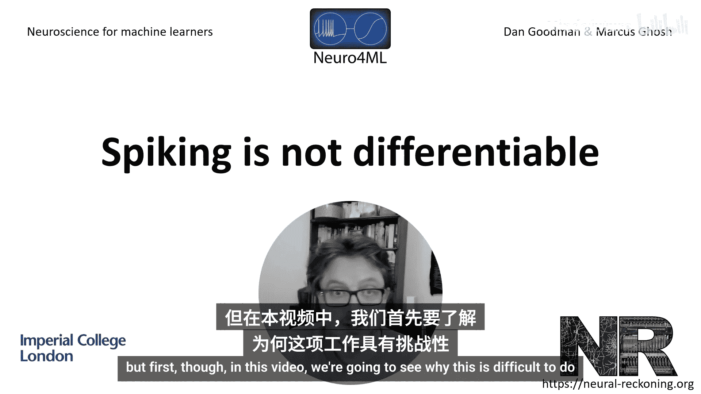
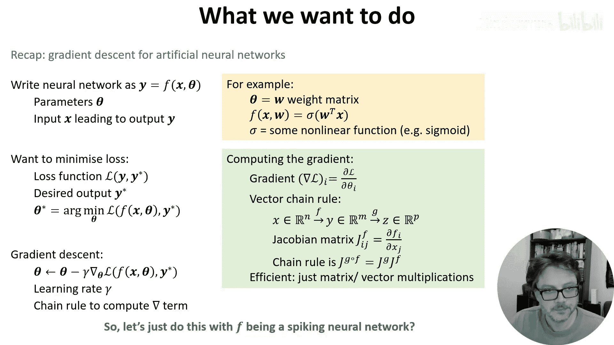
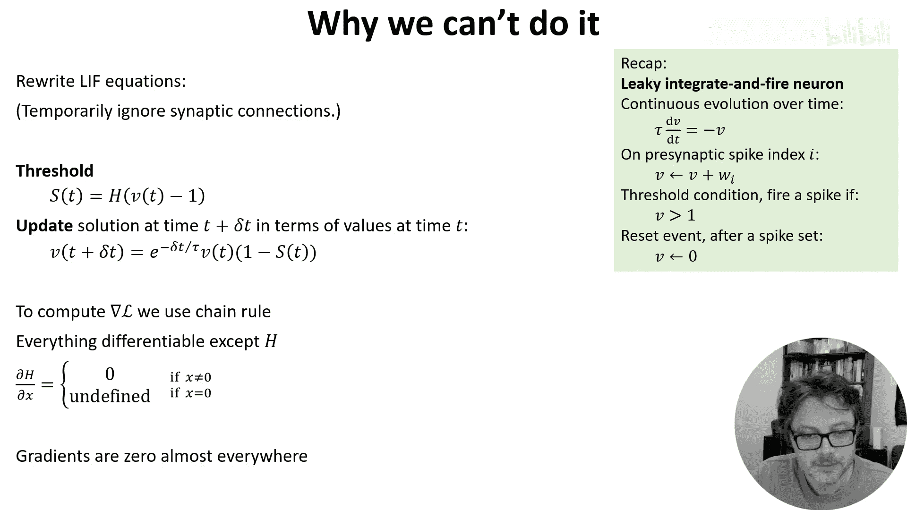
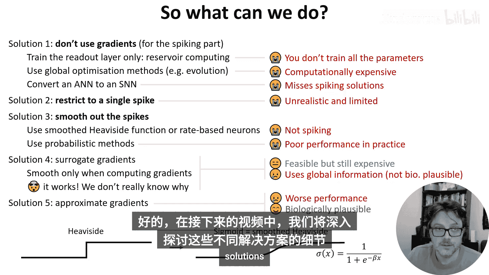

# 022：脉冲不可微性问题

在本节课中，我们将探讨如何训练脉冲神经网络。但在开始之前，我们需要先理解为什么训练脉冲神经网络是困难的。

## 概述

我们希望借鉴人工神经网络中成熟的训练方法，因为它们已被证明非常有效。然而，将梯度下降法直接应用于脉冲神经网络时会遇到一个根本性障碍：脉冲发放过程本身是不可微的。本节视频将详细解释这个问题，并简要概述研究人员为解决此问题提出的多种思路。

## 从人工神经网络到脉冲神经网络

上一节我们回顾了人工神经网络的基本训练流程。本节中我们来看看如何将其应用到脉冲神经网络上。

首先，我们快速回顾一下人工神经网络的训练过程。这并非一个完整的指南，如果你不熟悉，建议先阅读相关入门材料。

1.  **定义网络函数**：将神经网络表示为一个关于输入和参数的函数。例如，对于一个单层网络，参数可以是权重，函数可以是权重向量与输入向量点积后应用Sigmoid激活函数：`output = sigmoid(W * x)`。
2.  **定义损失函数**：该函数衡量网络输出与期望输出之间的差距。
3.  **应用梯度下降**：沿着损失函数相对于参数的梯度反方向更新参数，以最小化损失。
4.  **高效计算梯度**：使用向量、矩阵运算和链式法则可以高效地计算梯度。

那么，我们能否对脉冲神经网络直接这样做呢？答案并不简单。

## 脉冲神经元的不可微性

为了看清问题所在，我们先回顾之前介绍过的漏电积分发放神经元模型。

该模型的膜电位 `V` 随时间演化遵循一个微分方程，并在接收到脉冲时有瞬时效应。每当膜电位 `V` 超过阈值（例如 `V > 1`），神经元就会发放一个脉冲，并瞬间重置为 `0`。

为了分析，我们暂时忽略突触连接以简化公式，但这不影响核心结论。

我们可以将阈值判断写为 `S(t)`，它是膜电位 `V(t) - 1` 的赫维赛德阶跃函数。当神经元发放脉冲时，`S(t)` 等于 `1`，否则为 `0`。

接着，我们将微分方程改写为离散更新规则。为了得到 `t + Δt` 时刻的膜电位 `V`，我们将 `t` 时刻的 `V` 乘以一个指数衰减项。同时，我们通过将结果乘以 `(1 - S(t))` 来合并处理脉冲重置：如果发放了脉冲（`S(t)=1`），则乘以 `0`（即重置为 `0`）；否则乘以 `1`。

如果我们想使用梯度下降法，就必须使用链式法则计算梯度。这个更新规则中的每个部分计算梯度都没有问题，除了赫维赛德阶跃函数 `S(t)`。

**问题在于**：赫维赛德阶跃函数在除零点外的所有点导数都为 `0`，而在零点处导数未定义。这意味着梯度几乎处处为零。因此，梯度下降法将永远无法更新任何参数，这使得它对于训练脉冲神经网络完全无效。

## 解决方案概览

那么，如何解决这个问题呢？研究人员尝试了许多不同的方法，本周接下来的视频会详细讨论。目前尚无完美的解决方案。

以下是人们尝试过的主要思路及其各自的一些问题：

*   **避免使用梯度（至少对脉冲部分）**：
    *   **储备池计算**：使用一个未经梯度训练的脉冲神经网络作为“储备池”，外加一个可训练的读出层。这种方法效果出奇地好，但学习效率不高，因为没有利用所有可调参数。
    *   **全局优化方法**：如进化算法。这方法有效，但需要巨大的计算资源。

*   **转换与近似**：
    *   **ANN-to-SNN转换**：先训练一个人工神经网络，然后将其转换为脉冲神经网络。效果尚可，但找到的解决方案通常未能充分利用脉冲特性，效率不高。

*   **利用脉冲时间**：
    *   **单脉冲假设**：假设每个神经元只发放一个脉冲，然后对脉冲发放时间这个可微的量求导。这是一个巧妙的解决方案，在实践中效果很好。缺点是假设每个神经元只发放一个脉冲不现实，限制了其应用范围。

*   **平滑或概率化**：
    *   **平滑阶跃函数**：将不可微的赫维赛德函数平滑为一个可微的Sigmoid函数。在某些案例中被证明有效，但这改变了网络的行为。
    *   **概率神经元模型**：使用概率模型，其分布参数是可微的。这在理论上很优雅，但在实践中似乎难以扩展到大规模网络。

*   **替代梯度法**：
    *   **核心思想**：仅在计算梯度时进行平滑操作，而在前向传播时仍使用原始的不可微函数。这听起来有些令人惊讶，但它确实有效。我们是在为一个与我们优化的函数不同的函数提供梯度，但这能引导我们找到好的解。我们对其工作原理有一些理解，但尚无完全严谨的解释。这种方法计算量仍然较大，但对于几千个神经元的网络是可行的。一个缺点是它需要全局信息，这在生物环境中是神经元无法获得的。

*   **局部与近似学习规则**：
    *   为了同时解决计算复杂性和生物合理性问题，人们使用近似方法来降低计算复杂度，并使学习规则仅使用局部信息。虽然性能往往有所下降，但这些规则更具生物可解释性。

## 总结

本节课中，我们一起学习了训练脉冲神经网络的核心挑战：脉冲发放过程的不可微性导致标准梯度下降法失效。我们回顾了漏电积分发放神经元模型，并指出了赫维赛德阶跃函数是梯度无法回传的关键。最后，我们简要概述了为解决此问题而提出的多种研究思路，包括避免梯度、转换网络、利用脉冲时间、平滑函数以及目前较为流行的替代梯度法等。在接下来的视频中，我们将深入探讨其中一些解决方案的细节。