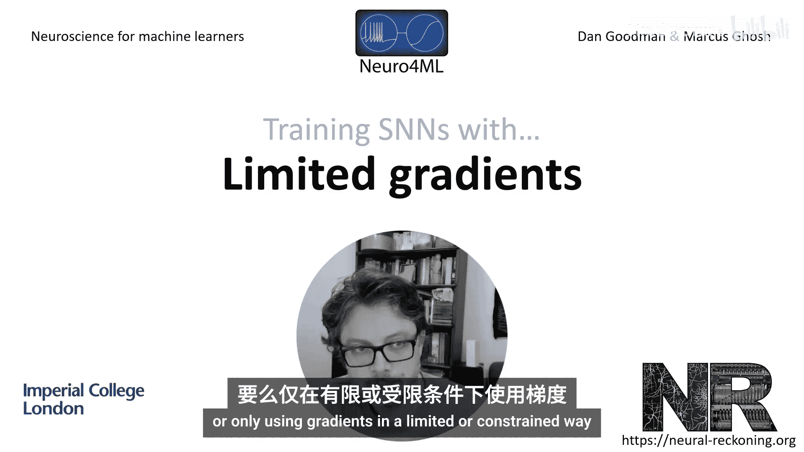
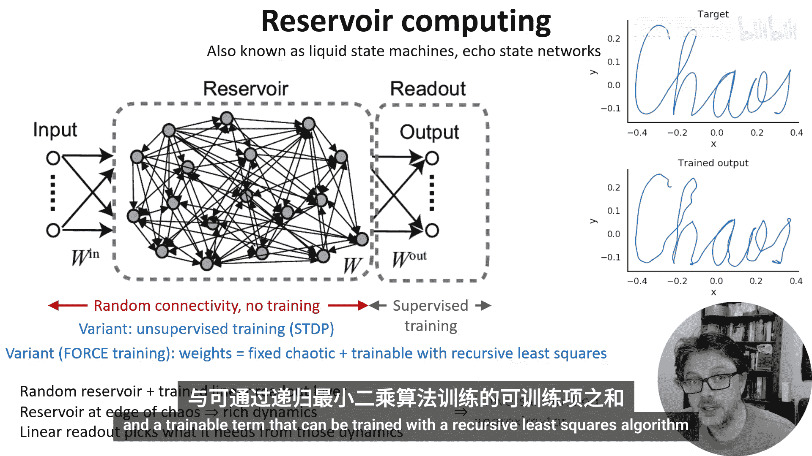
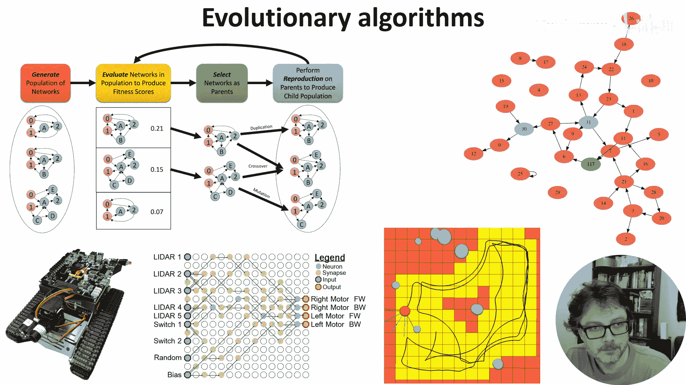
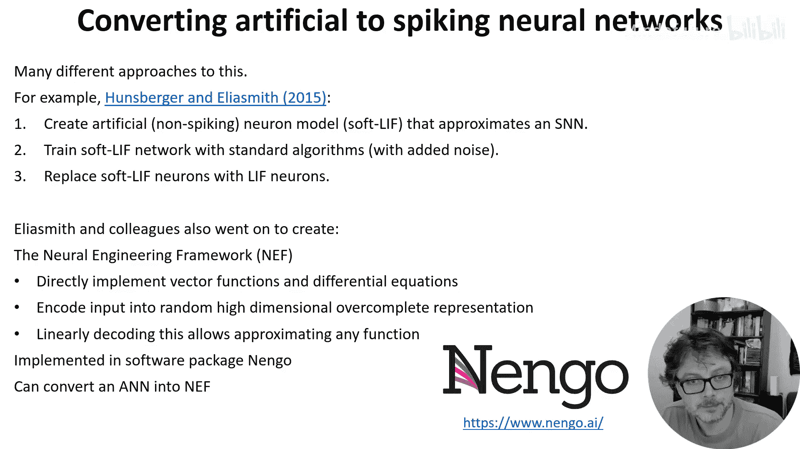
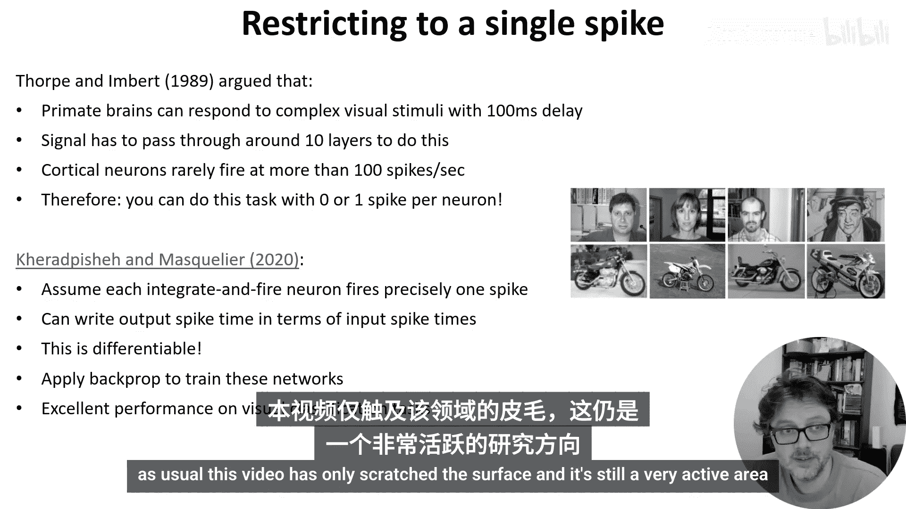

# 023：有限梯度方法 🧠

在本节课中，我们将学习几种训练脉冲神经网络的方法。这些方法要么完全不使用梯度，要么仅以有限或受约束的方式使用梯度。它们为处理传统反向传播难以直接应用的脉冲网络提供了替代方案。

## 储层计算

上一节我们介绍了不使用梯度的基本概念，本节中我们来看看第一种具体方法：储层计算。这种方法也被称为液态状态机或回声状态网络。

在这种设置中，我们从一个随时间变化的输入序列开始，该序列连接到一个随机、循环连接的神经元群。这些随机连接是固定的，不进行训练。这个循环神经元群连接到一个线性读出层，该层使用监督学习算法进行训练，以复现期望的随时间变化的输出。

其核心思想是，通过将循环神经元的权重初始化为使网络动态处于接近混沌的状态。在接近混沌时，这些神经元的动态中会包含丰富的轨迹。通过一个线性读出层，你可以近似任何你想要的动态。这种方法被证明是有效的，理论上，只要有足够多的神经元，这种设置可以近似任何时变函数。

以下是储层计算的一个变体示例：
*   例如，对于脉冲神经网络，你可以使用STDP规则对储层神经元进行无监督训练。
*   一个特别有趣的变体是“强制训练”，它将循环权重写为一个诱导混沌的固定项和一个可通过递归最小二乘算法训练的可训练项之和。

## 进化算法

除了基于动态系统的方法，另一种思路是使用不需要导数的全局优化算法。由Katie Schumann开创的一种特别成功的方法是使用进化算法。

在这些算法中，你生成一个网络种群，评估它们的性能，然后通过混合最成功的网络来创建新的网络，不断重复直到获得良好的性能。

以下是使用该方法的一些关键点：
*   **优势**：这种方法可以发现令人惊讶的网络架构，这些架构可能通过其他方式永远无法找到。它还能轻松适应可用的硬件类型，例如现场可编程门阵列。
*   **局限性**：它往往计算量很大，并且仅限于相当小的网络。
*   **应用**：它已被用于训练本课程后面会讨论的神经形态硬件，例如为这个轮式机器人训练控制器。

## 转换法

与其直接处理脉冲神经网络，我们可以从做我们知道如何做的事情开始，比如训练一个人工神经网络，然后将结果转换为脉冲神经网络。这方面的文献很多，这里主要介绍Chris Eliasmith及其同事的两种方法。

第一种方法首先创建一个称为“软LIF”的非脉冲人工神经元，它近似脉冲神经元的输入输出行为。然后用标准算法训练这个软LIF网络，可能会添加训练噪声以增强其抗噪鲁棒性。最后，只需将这些软LIF神经元替换为真实的LIF神经元，效果相当不错。

后来，Eliasmith及其同事将这种方法进一步发展，创建了一个非常通用的方法，称为**神经工程框架**。在这种方法中，你可以通过将输入值编码为随机、高维、过完备的表示，然后线性解码，来直接实现向量函数和微分方程。他们证明这允许你近似几乎任何函数。他们在综合软件包**Nengo**中实现了这一点，因此如果你感兴趣，可以轻松尝试。一旦你有了这些构建模块，就很容易将由此类模块组成的ANN转换到他们的框架中，并用脉冲神经元实现。

## 单脉冲网络

我们今天要看的最后一种方法，是通过限制每个神经元只能发放一个脉冲，从而使网络可微分。这听起来像是一个疯狂的限制，但Simon Thorpe及其同事的研究为此提供了很好的理由。

他们指出，灵长类大脑能够以短至100毫秒的延迟，对相当复杂的视觉刺激进行分类和响应。从解剖学研究中他们知道，信号从视觉系统传递到记录反应的运动系统，需要经过大约10层。由于皮层神经元通常每秒最多只发放约100个脉冲，这意味着在每层只有10毫秒的处理时间内，一个神经元很可能只发放0或1个脉冲。因此，每个神经元只发放0或1个脉冲，也必定能够完成相当复杂的任务。

Tim Masquelier及其同事实现了这个想法。他们建立了一个整合发放神经元网络（注意，不是泄露整合发放模型），并且只允许它们在每次呈现刺激时发放一个脉冲。有了这个限制，他们就可以根据输入脉冲的时间和权重，解析地写出神经元的输出脉冲时间。而这个函数是**可微分的**。这意味着我们可以应用反向传播来训练这些网络。他们发现，这种方法在Simon Thorpe早先在灵长类动物中研究的同类视觉分类任务上表现优异。例如，他们可以非常可靠地区分这个数据集中的面孔和摩托车。

## 总结

本节课中，我们一起学习了几种训练脉冲神经网络的“有限梯度”方法。我们探讨了**储层计算**的动态系统近似能力，**进化算法**在发现新颖架构和硬件适配上的优势，通过**转换法**利用成熟ANN技术的便捷性，以及**单脉冲网络**通过巧妙限制实现可微分的创新思路。当然，本视频仅触及了这些活跃研究领域的表面。这些方法为绕过脉冲神经网络中梯度计算的难题，提供了多样且富有启发性的路径。