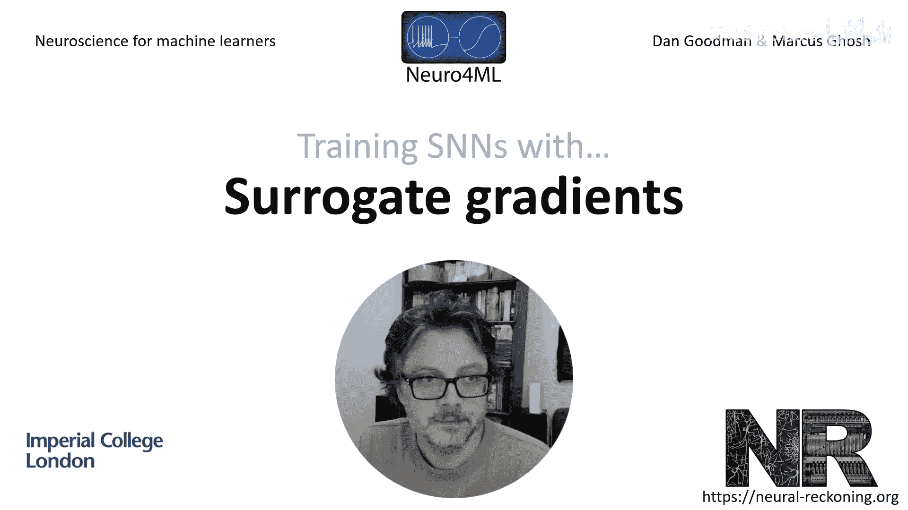
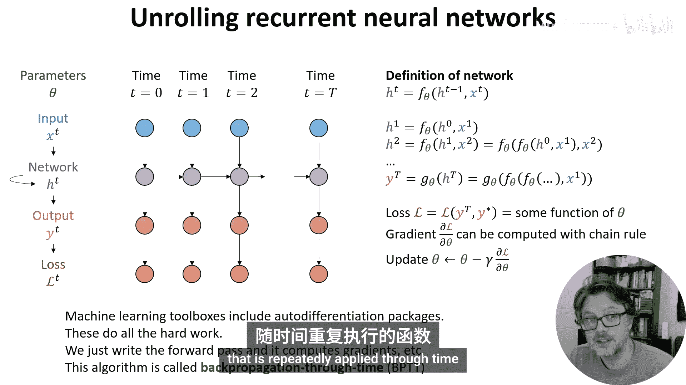
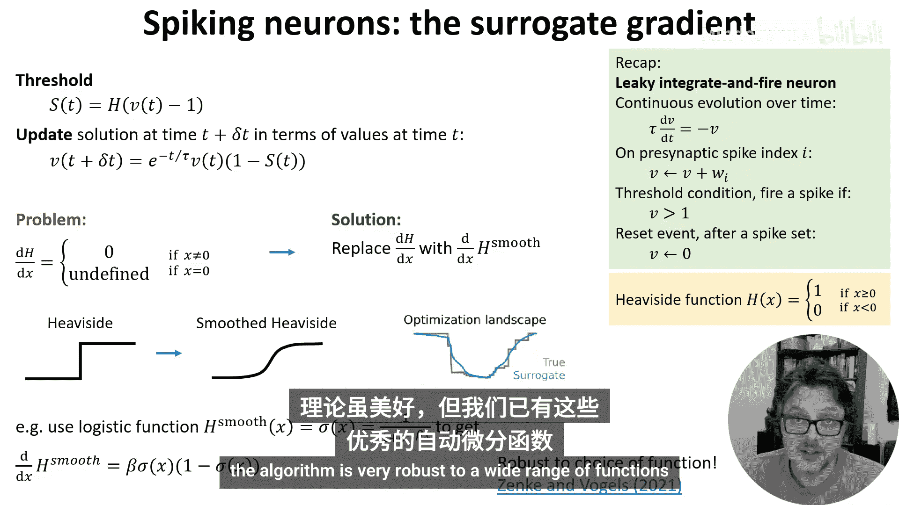
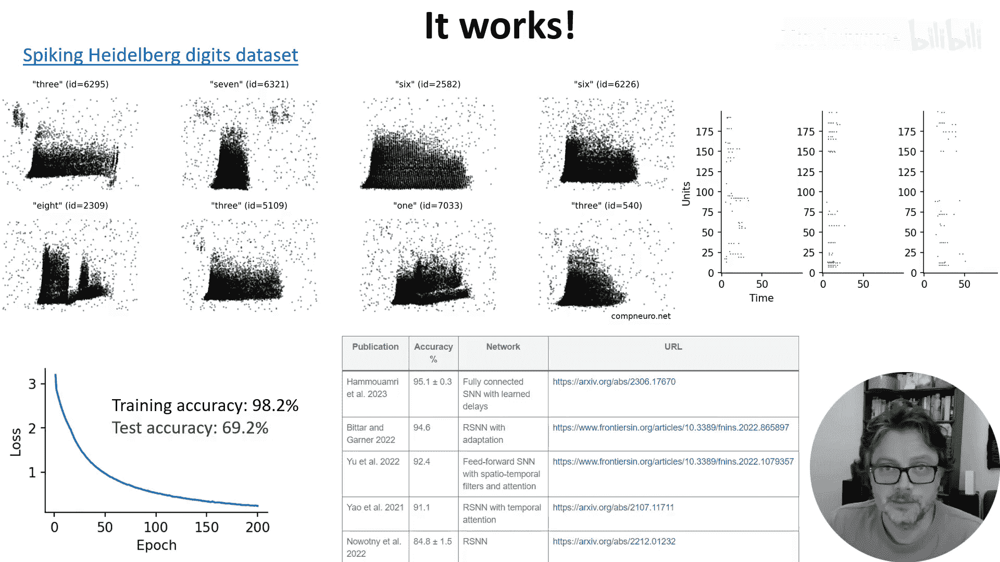
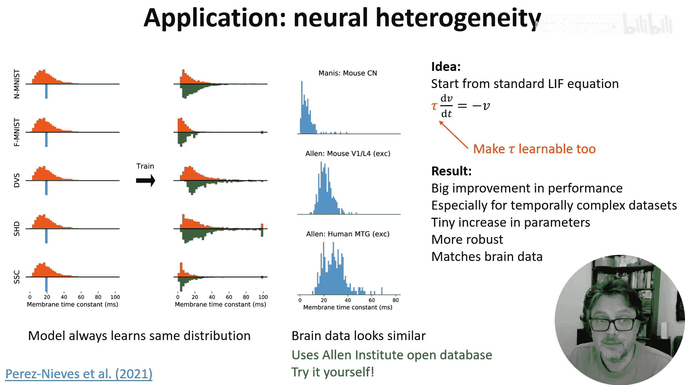
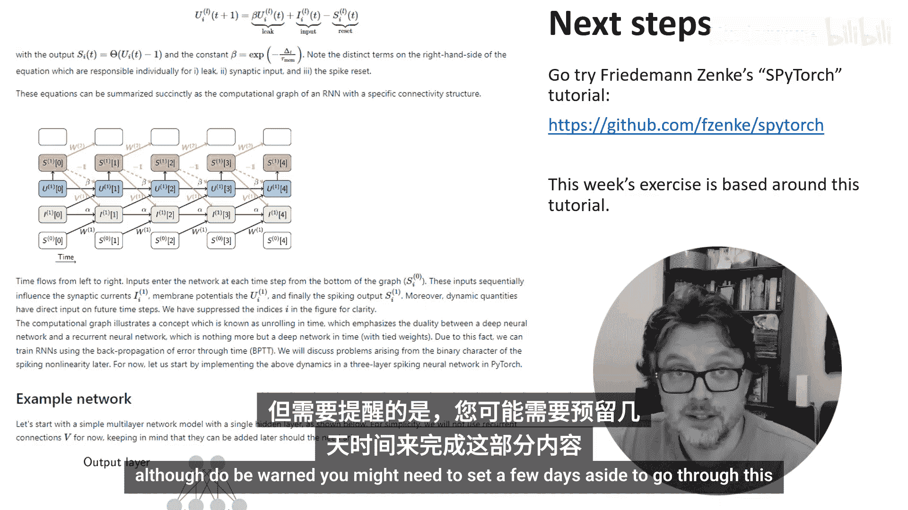

# 024：替代梯度法

在本节课中，我们将学习如何使用替代梯度法来训练脉冲神经网络。这种方法虽然并非完美，但在灵活性和效率之间取得了很好的平衡，是目前该领域的主流方法之一。

## 从循环神经网络到脉冲神经网络

上一节我们介绍了替代梯度法的基本思想。本节中，我们来看看如何将训练循环神经网络的方法应用到脉冲神经网络上。

脉冲神经网络可以被视为一种特殊的循环神经网络。即使网络中没有显式的循环连接，由于神经元在某一时刻的内部状态依赖于其前一时刻的状态，这使得网络具有了隐式的循环特性。

理解了这一点后，我们快速回顾一下循环神经网络的训练方法。

首先，我们这样定义一个神经网络。我们有参数 θ，它可以是权重或偏置等。我们有一个随时间变化的输入 X，它被送入一个内部状态为 H 的循环网络。然后，H 被送入一个输出层 Y，该层有一个相关的损失函数 L。

为了更清晰地看到依赖关系，我们将其在时间上展开。例如，你可以看到时间 T=1 时的网络状态，不仅受到 T=1 时输入的影响，也受到 T=0 时网络状态的影响。

我们可以用方程来定义网络：**H_T = F_θ(H_{T-1}, X_T)**。这里，F_θ 是一个函数，它接收网络状态、输入和参数，并返回更新后的网络状态。这个函数可以是单层的应用，也可以是应用多层的结果。

我们可以展开这个函数来感受前几个时间步发生了什么。在第一个时间步，你得到上述定义。在第二个时间步，我们可以展开 H1，得到仅用参数 θ、初始状态 H0 和输入表示的结果。我们可以对所有其他时间步继续这样做。

在最终时间步，我们应用另一个函数 G_θ。然后，我们得到一个仅用参数 θ 和输入表示的损失表达式。这意味着我们可以使用链式法则计算损失相对于参数的梯度。有了梯度，我们就可以像以前一样写出梯度下降更新规则。

这一切看起来很复杂，但现代机器学习工具箱中的自动微分包为我们完成了所有工作。我们只需编写前向传播，它就能使用链式法则高效地计算梯度、应用更新规则等。这个算法被称为**随时间反向传播**，因为它是应用于随时间重复应用的函数的标准反向传播算法。

## 应用替代梯度法

现在，让我们将这个想法应用到脉冲神经网络上。我们从本周第一个视频中回顾的漏积分发放神经元开始。

关键点在于，我们可以写出方程来更新网络从一个时间步到下一个时间步的内部状态，就像上一张幻灯片中的函数 F_θ 一样。

这完全由可微函数组成，只有一个例外：**Heaviside 阶跃函数**，它用于计算神经元是否超过阈值并发放脉冲。这个函数是不连续的，其导数在除 x=0 外的所有地方都为 0。这意味着当我们使用链式法则或自动微分包计算梯度时，只会得到零，不会发生更新。

解决方案有点奇特：在前向传播中保持函数 H 不变。但每当我们看到 H 的导数时，就用平滑后的 Heaviside 阶跃函数的导数来替代它。这里的直觉是，如果损失函数景观中存在不连续的跳跃（对应于梯度变化导致多一个或少一个脉冲），那么平滑 Heaviside 函数将平滑损失函数景观中的跳跃。

我们可以使用的一个示例函数是 **logistic sigmoid 函数**。它有一个简单漂亮的导数。但实际上，平滑函数的选择并不那么重要，该算法对多种函数都非常鲁棒。

## 代码实现

理论上听起来不错，但我们有这些优秀的自动微分函数，实现这个想法看起来像一场噩梦。但实际上，情况并没有那么糟。PyTorch 等库允许你覆盖梯度计算的默认实现。

以下是如何在 PyTorch 中实现替代梯度的代码示例。

我们首先定义一个类 `surrogate_heaviside`。它继承自 PyTorch 的 `torch.autograd.Function` 类，以使其与 PyTorch 兼容。我们将用它来创建一个新的、具有魔力的替代版 Heaviside 函数，它将完全按照我们的意愿工作。

PyTorch 要求你实现两个方法。第一个是前向传播中发生什么。我们只想返回标准的 Heaviside 函数。`ctx.save_for_backward` 只是一些样板代码，使其能与 PyTorch 良好配合。

第二个方法是反向传播。它同样以一些样板代码开始，让我们获取输入和输出的梯度（因为我们是反向传播）。然后我们计算新的导数。我们设置一个参数 `beta` 来指定 sigmoid 函数的陡峭程度，然后使用上一张幻灯片的公式计算导数。注意，我们将导数乘以 PyTorch 给我们的输出梯度。

就这样。我们实例化这个类，然后直接用它代替 Heaviside 函数。现在，通过魔法，我们的脉冲神经网络就可以与自动微分一起使用了，我们可以使用任何优化算法，如随机梯度下降、Adam 学习规则等。

## 实际应用示例

它确实有效。这里有一个使用**脉冲海德堡数字数据集**的例子。这个数据集是通过让几位不同的说话者用英语和德语朗读数字 0-9 构建的。获取声波后，将其输入一个相当详细的早期听觉系统处理声音的模型，以产生类似这些的脉冲响应图。

在每个图中，Y 轴是神经元索引，底部行对应低频声音，上部行对应高频声音。X 轴是时间。如果你以前见过声音的频谱图，这看起来应该有些熟悉，因为在非常粗略的层面上，这就是听觉系统早期部分正在做的事情。

我们可以训练一个脉冲神经网络模型，将这些作为输入，并要求它对数字进行分类，它能够完成这项任务。以下是训练后模型神经元的一些中间脉冲序列。

你可以看到，经过训练，损失曲线具有熟悉的形状，最终我们得到大约 70% 的测试准确率。对于一个机会准确率为 5%、仅使用 200 个脉冲神经元的分类任务来说，这不算太差。构建这个数据集的 Friedemann 和 Zenke 保留了一个最佳表现者表格，在录制本视频时，最佳准确率约为 95%。那里的关键创新是允许神经元之间存在可训练的延迟。这是很好的性能，但我相信它会更高。也许你们中的一位可以打破这个记录。

## 方法的局限性

在我们过于兴奋之前，这种方法存在一些问题。第一个问题是，尽管它使得训练脉冲神经网络完成复杂任务变得可行，但它仍然相当消耗资源。

为了感受这一点，假设我们有 N 个神经元彼此全连接，并且我们运行网络 T 个时间步。该算法每个时间步将使用 **O(N²)** 的计算时间，以及 **O(NT)** 的存储空间。这才是真正的瓶颈，因为如果你想快速运行这些算法，你希望在 GPU 上运行。这意味着你可用的 RAM 非常有限。你本质上是在为模拟的每个时间步复制一份完整的网络状态，这会迅速累积。对于 1 毫秒的时间步长，你每秒模拟时间要制作 1000 份网络状态的副本。

另一个问题是很难很好地初始化这些网络。你希望初始状态具有几个关键属性。首先，它应该在每一层产生合理数量的脉冲，既不太多也不太少，否则将很难找到一个好的解决方案。其次，你希望网络初始化的状态是梯度既不会消失也不会爆炸的状态。这是训练深度或循环神经网络时的常见问题。

为此已经提出了各种想法，包括但不限于：初始化为类似大脑的状态，以及通过分析计算前向和反向传播中的方差。我必须说，这方面的数学推导很快就会变得非常复杂，并且高度依赖于你使用的神经元类型，这意味着这种解析解决方案在实践中部署起来比我们希望的更困难。

我想提到的最后一个问题是，像任何随时间反向传播算法一样，它使用了非局部信息，这些信息对于大脑中的真实神经元来说是不可用的。这意味着，如果没有一些额外的工作，它并不是大脑自身如何进行学习的好候选方法。然而，这并不意味着它不是训练脉冲神经网络的好方法，也不妨碍我们用它来以其他方式模拟大脑的工作。

## 前沿研究：可训练的时间常数

说到这里，我想通过谈论我的一位博士生使用替代梯度法进行的一项研究来结束，这项研究告诉我们大脑可能如何工作。

这个想法是从标准的漏积分发放神经元方程开始，但不仅仅是训练突触权重，我们还使这些时间常数 τ 成为可训练的参数。在 PyTorch 中实现这一点，几乎只需要对代码进行单行修改，尽管需要做一些工作来防止算法陷入停滞或遇到数值积分问题。

结果非常简洁。我们获得了巨大的性能提升，特别是对于像我们之前看到的**海德堡数字数据集**这样时间上复杂的数据集。我们仅以极小的参数数量增加就实现了这一点，因为我们只为每个神经元添加了一个新的可训练参数，即 **O(N)** 个参数，而没有增加突触权重的数量（那是 **O(N²)** 个）。我们还发现，当在训练集分布之外进行测试时，这种方法更加鲁棒。

我们学习到的时间常数与实验记录的大脑数据相匹配。具体来说，无论我们如何为每个数据集初始化时间常数，它们总是会找到一种特征分布，该分布大致呈对数正态分布或伽马分布。这正是你在包括人类在内的多种不同脑区和动物类型的大脑中看到的情况。这并非结论性的，但我们认为这表明，拥有不完全相同的神经元可以使大脑在不大量增加所需资源的情况下做更多的事情。

顺便说一下，这些实验记录的分布是从艾伦研究所的数据库中获得的，该数据库是开放和免费探索的，并有一个很好的 Python API。所以你应该去尝试一下。

## 总结与后续学习

好的，这就是关于替代梯度下降法的全部内容。我强烈建议你花些时间更详细地了解它，可以从 Friedemann 和 Zenke 的优秀 PyTorch 教程开始，该教程逐步构建代码，从零开始运行，直到你拥有一个可以解决脉冲海德堡数字数据集的网络。

本周的练习从学习本教程的第一部分开始，然后将其应用于一个不同的问题。如果你希望更深入地了解替代梯度下降的数学原理，我还包含了一些阅读材料，但请注意，你可能需要留出几天时间来学习这些内容。

本节课中我们一起学习了如何使用替代梯度法训练脉冲神经网络，理解了其理论基础、代码实现、实际应用以及当前的局限性。这种方法为在复杂任务上训练脉冲神经网络打开了大门，是连接机器学习和计算神经科学的重要工具。