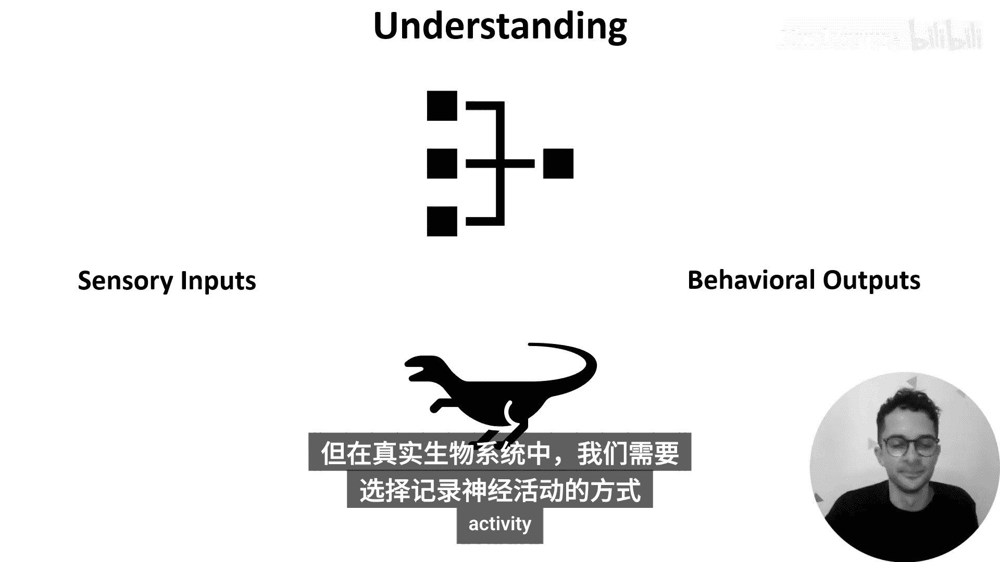
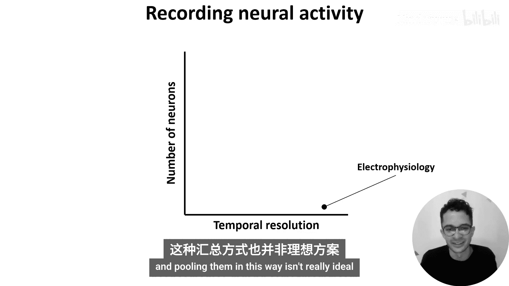
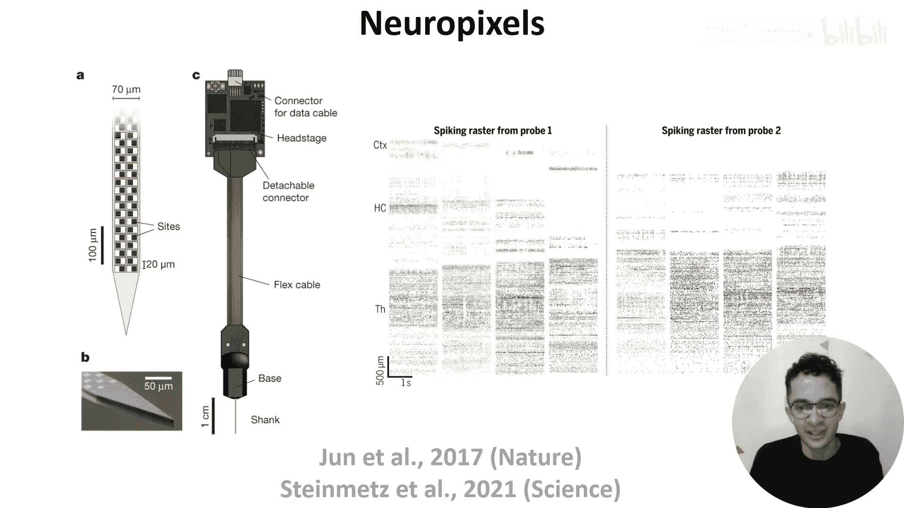
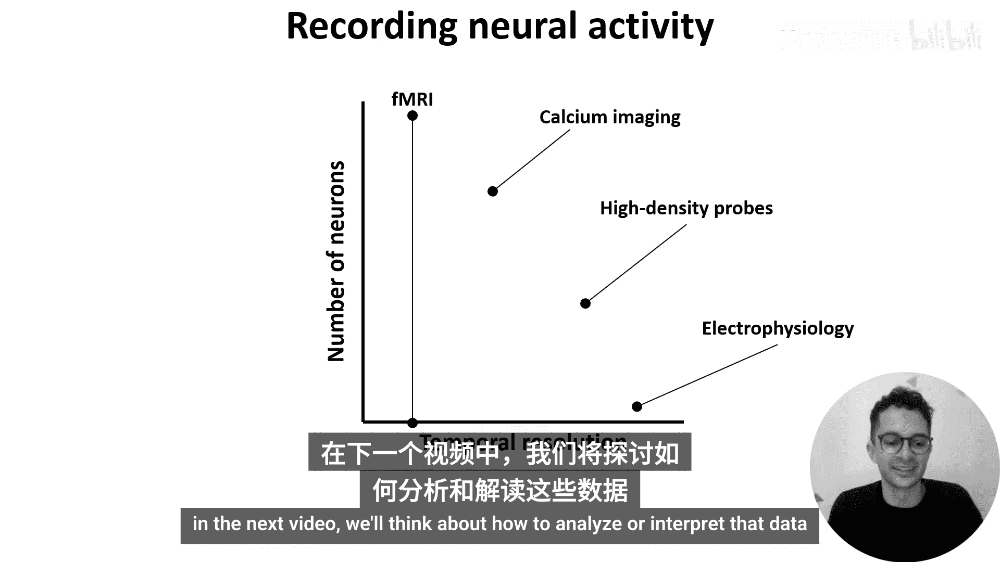

# 025：观察神经活动

在本节课中，我们将探讨研究人员如何尝试理解神经网络。首先，我们需要明确理解神经网络意味着什么。

我们可以将人工神经网络和大脑都视为计算系统，它们执行从感觉刺激到行为的输入-输出转换。但网络的所有特征，如单元特性、架构和活动模式，是如何结合起来实现这些转换的呢？神经科学家和机器学习研究人员都对这个问题感兴趣，原因多种多样，例如利用生物学知识改进人工神经网络，或构建脑机接口来记录神经活动并控制各种设备。

本周的视频将涵盖与理解神经网络相关的三个主题：如何观察神经活动、如何分析它以及如何操控它。

上一节我们介绍了理解神经网络的目标，本节中我们来看看如何观察神经活动。

## 观察神经活动的方法

在人工神经网络中，观察活动很简单，只需运行一次前向传播并计算单元激活值即可。在脉冲神经网络中，我们可以向网络输入脉冲并记录其隐藏单元的膜电位或脉冲输出。然而，在真实的生物系统中，我们需要选择记录神经活动的方法。

有多种不同的神经活动记录方法，各有优缺点。一种描述它们的方式是使用一个二维坐标轴，其中X轴表示方法的时间分辨率，Y轴表示该方法可以同时记录的神经元数量。

在之前的视频中，我们介绍了电生理学技术，它可以高时间分辨率地记录单个神经元，在图中位于这个位置。为了用这种方法获取更多神经元的数据，研究通常会在不同试验中顺序记录不同的神经元，然后跨试验和受试者汇总数据。即便如此，通常也仅限于数十到数百个神经元，并且以这种方式合并数据并不理想。那么，我们如何能同时记录更多神经元呢？

以下是几种主要的记录技术：

*   **高密度探针（如Neuropixels）**：这种探针的主体是一个极薄的杆，通过手术插入大脑，上面覆盖着数百个记录位点。每个位点记录附近的电活动，因此每个位点的信号是许多神经元活动的总和。通过利用不同神经元具有不同脉冲波形等特征的**尖峰排序算法**，可以从这些数据中推断出单个神经元的基础脉冲活动。这种探针允许同时记录数百到数千个神经元的活动。
*   **钙成像**：当动作电位到达轴突末梢时，会导致电压门控钙通道打开，钙离子流入细胞。因此，我们可以利用钙离子浓度的变化来推断神经活动。使用这种方法测量神经活动大致有四个步骤：
    1.  需要一种**钙指示剂**，它在钙离子存在时会改变荧光。
    2.  需要将这种指示剂放入神经元内部，可以通过注射或基因改造使神经元自身产生指示剂来实现。
    3.  将样本置于显微镜下，测量每个神经元随时间变化的荧光。
    4.  分析连续的荧光变化，或使用**反卷积算法**推断基础的脉冲活动。
*   **功能磁共振成像（fMRI）**：这是人类最常用的方法之一，它测量大脑区域血流的变化。由于更活跃的区域需要更多氧气，反之亦然，因此这可以作为神经活动的另一种间接测量。fMRI被广泛使用，因为它是非侵入性的，能提供全脑信息，并具有毫米级和秒级的合理空间与时间分辨率。但需要注意的是，它是神经活动的间接测量，并且即使空间分辨率在毫米级，最小的测量空间单元（体素）仍包含约一百万个神经元。

现在，让我们将这些技术大致映射到我们的坐标轴上。高密度探针（如Neuropixels）具有高时间分辨率，可以记录数百到数千个神经元。钙成像具有中等时间分辨率，但可以记录数千到数万个神经元。fMRI时间分辨率较慢，就神经元数量而言，它记录的是无法解析单个神经元的全脑信号。

在继续之前，还有两点需要提及。首先，还有许多其他记录神经活动的方法，例如，**脑电图（EEG）**使用外部电极测量大脑的电活动，**电压成像**使用荧光随神经元膜电位变化的指示剂。人们认为电压指示剂将是神经科学的下一个重大进展。其次，除了方法的时间和空间分辨率之外，还有许多其他因素需要考虑，例如，大多数神经记录是在静态受试者身上进行的，但人们对能够在自由运动期间记录神经活动的方法越来越感兴趣。

本节课中我们一起学习了观察神经活动的几种主要技术：高密度电生理记录、钙成像和功能磁共振成像。每种方法在时间分辨率、空间覆盖范围和侵入性方面各有优劣。理解这些工具的局限性对于正确解释神经数据至关重要。

在下一节中，我们将探讨如何分析这些记录到的数据。