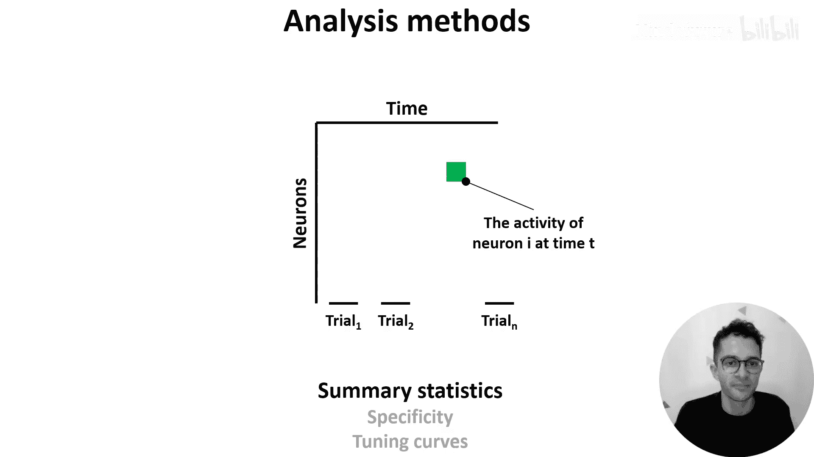
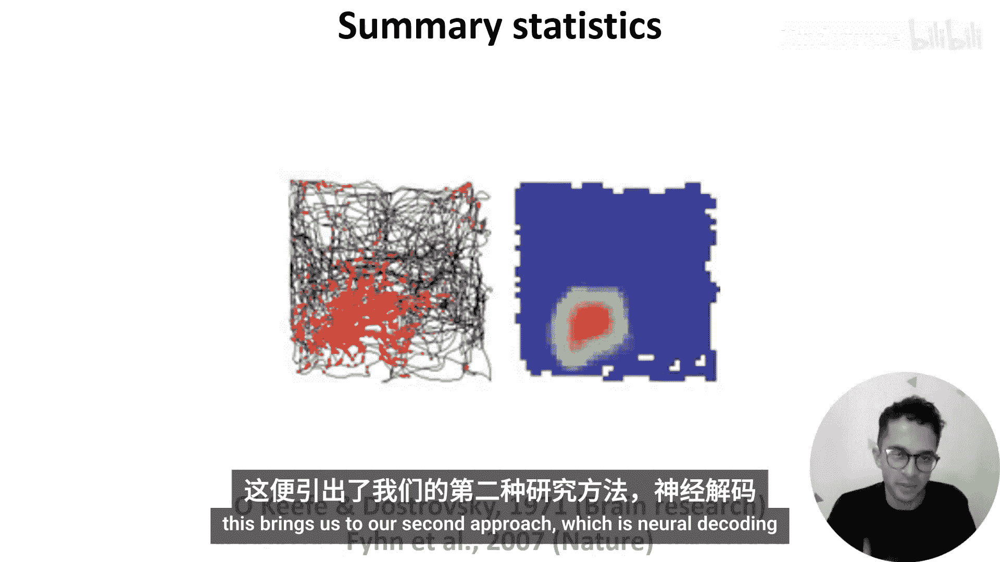
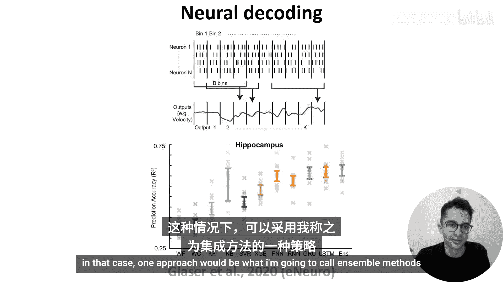
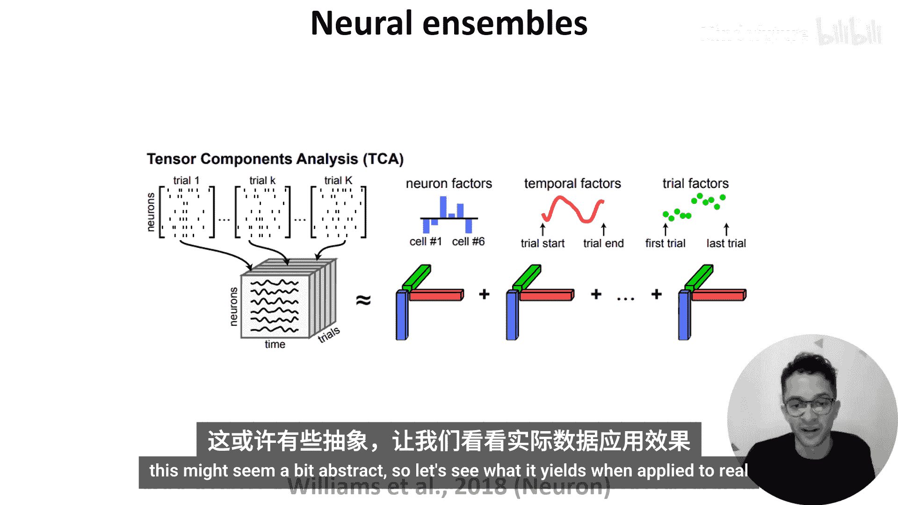
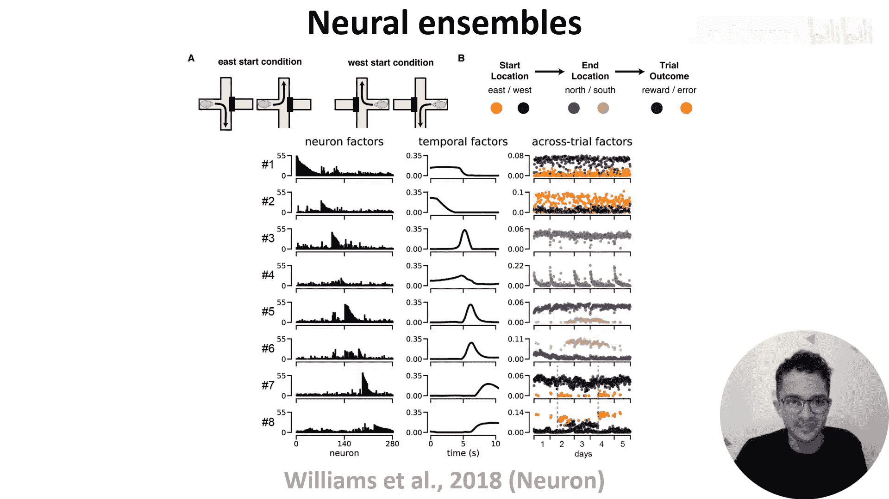
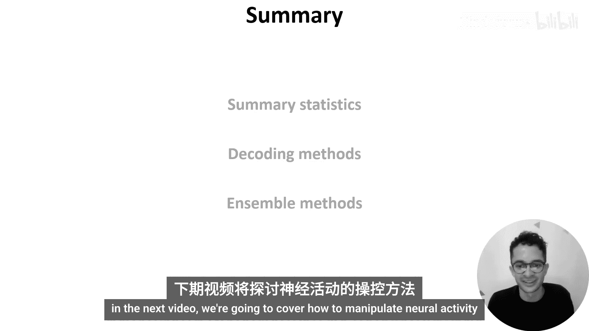

# 026：神经数据分析 🧠

在本节课中，我们将学习如何分析和解读神经活动数据。上一节我们介绍了神经数据的采集方法，本节中我们来看看如何从这些数据中提取有意义的信息。

无论使用何种方法采集数据，我们最终都会得到一个矩阵，其中一个维度是时间，另一个维度是神经元。矩阵中的每个单元格代表一个神经元在某个时间点的活动水平。这里的“活动”可以是二元的（如动作电位），也可以是连续的（如钙成像数据），或者通过计算每个时间窗口内的动作电位数量得到的连续发放率。

需要注意的是，实验者通常不会连续记录神经活动，而是进行多次固定时长的试验，因此时间维度可能是不连续的。例如，一个实验可能包含多个试次，在每个试次中，受试者观看图像并进行分类，图像之间会有休息间隔。

面对这类数据，我们可以提出许多不同的问题：不同神经元的行为如何？是否存在只在某些试次或试次的某些阶段活跃的神经元？神经元的活动是否会随着试次发生变化，例如随着动物学习任务或感到无聊而变化？如果我们知道所记录神经元在大脑中的位置，我们还可以观察具有不同反应特性的神经元是否位于不同的空间位置。如果我们处理的是人工神经网络的数据，等效的方法是比较不同层的单元。

一旦明确了问题，我们就可以决定采用何种分析方法。分析神经数据的方法多种多样，本视频将重点介绍三种。

一种简单的方法是计算汇总统计量。例如，在一个分类任务中，我们可以计算每个神经元对每个类别的反应强度，然后观察其反应在不同类别间的特异性。或者，当我们连续改变一个刺激参数（如屏幕亮度）时，我们可以观察神经元对该参数的调谐程度，即其活动如何随该参数变化。

以下是这种分析的一个实例：

在这篇论文中，作者让一只大鼠在一个方形场地中自由移动，同时记录其海马体（大脑的一部分）中神经元的活动。左图中，黑线显示动物在环境中的移动路径，红点显示某个神经元发放动作电位时的空间位置。右图则显示了该神经元发放率的热图，红色表示高发放率。这个热图相当于一个二维的调谐曲线，我们可以看到该神经元对这个环境中的特定位置有调谐反应。具有此类反应的神经元被称为“位置细胞”，它们于1971年被首次发现，至今仍是活跃且令人兴奋的研究领域。

然而，许多神经元并非如此清晰地调谐于特定的环境特征。与其将单个神经元视为编码变量，不如尝试理解神经元群体编码了哪些信息。这引出了我们的第二种方法：神经解码。

神经解码的目标是利用神经活动来估计环境或受试者的某些状态。例如，对于上一张幻灯片中的大鼠，我们可以获取其神经活动，并尝试估计它在环境中的速度或位置。

具体做法是，从我们的“神经元 x 时间”矩阵开始，将动作电位分箱以获得连续的发放率（这更易于处理），然后使用多个时间箱的数据来预测我们在特定时间点感兴趣的变量。由于这本质上变成了一个回归问题，我们可以采用多种不同的方法，例如使用滤波器甚至神经网络模型。幻灯片底部提到的论文详细比较了这些方法。

例如，在下图中，X轴上的每个点代表一种不同的解码方法，Y轴显示每种方法解码大鼠位置的准确度。可以看到，尽管数据集只记录了50个神经元，但有些方法可以相当准确地完成解码。

但是，如果我们尝试从大脑其他区域的神经元群体（如视觉皮层或听觉皮层）解码位置，结果会差很多。因此，我们可以利用解码准确度来估计不同脑区中存在哪些信息。

然而，解码依赖于我们有一个或多个感兴趣的变量来估计，有时我们可能没有这样的变量。例如，如果我们只是记录自发的脑活动，即静息状态下的脑活动。

在这种情况下，一种方法可以被称为“群体方法”。

这些方法试图识别出那些活动模式随时间相关的神经元群体。一种方法是使用聚类算法，将具有相似活动模式的神经元分组。另一种是此处展示的方法，称为张量成分分析。

我们将记录到的“神经元 x 时间 x 试次”的二维矩阵重塑为一个三维张量（神经元 x 时间 x 试次）。然后，我们用一组“群体”来描述这个张量，每个群体由三个向量组成（图中用红、绿、蓝三色表示）：
*   **神经元因子**：表示每个神经元与该群体的关联强度。
*   **时间因子**：表示该群体的活动在单个试次过程中如何随时间变化。
*   **试次因子**：表示该群体的活动在不同试次间如何变化。

这听起来可能有些抽象，让我们看看将其应用于真实数据时能得到什么。

这个实验仍然关注空间导航，但对象换成了小鼠，使用的是所谓的“十字迷宫”（见A图）。基本上，小鼠从东臂或西臂开始，必须导航到北臂或南臂，如果正确，就会获得奖励。那么，将张量成分分析应用于该实验记录的神经数据揭示了什么？

这里，每一行显示八个群体中的一个，每一列显示该群体的神经元因子、时间因子和试次因子。
*   **神经元因子列**：X轴显示所有280个记录的神经元，每个Y轴显示每个神经元与每个群体的关联强度。可以看到，不同的神经元与不同的群体相关联。
*   **时间因子列**：X轴显示每个试次的时间进程，每个Y轴显示每个群体的活动。可以看到，不同的群体在试次的不同时间点活跃。
*   **试次因子列**：每个点代表一个试次，X轴显示试次的顺序，每个Y轴显示每个群体在给定试次中的活跃程度，点的颜色根据B图中显示的不同试次属性进行编码。

例如，如果我们关注群体2，它的时间因子显示这些神经元主要在试次开始时活跃。它的试次因子显示，当小鼠从迷宫的东臂开始时（黄色点），这些神经元比从西臂开始时（紫色点）更活跃。现在，鼓励你暂停视频，尝试自己解释其他群体。

希望本视频让你对如何使用汇总统计量、解码方法和群体方法分析神经活动数据有了一些了解。当然，还有许多其他方法，鼓励你广泛阅读相关资料。在下一个视频中，我们将介绍如何操控神经活动。

**本节课总结**：
本节课我们一起学习了三种主要的神经数据分析方法：
1.  **汇总统计与调谐分析**：用于描述单个神经元对特定刺激或行为参数的响应特性。
2.  **神经解码**：将神经活动视为输入，使用回归等方法预测行为或环境变量，以评估神经群体编码的信息。
3.  **群体分析方法（如张量成分分析）**：用于发现具有协同活动模式的神经元群体，并解析其活动在时间、试次等维度上的结构，尤其适用于没有明确外部变量或研究自发活动的情况。