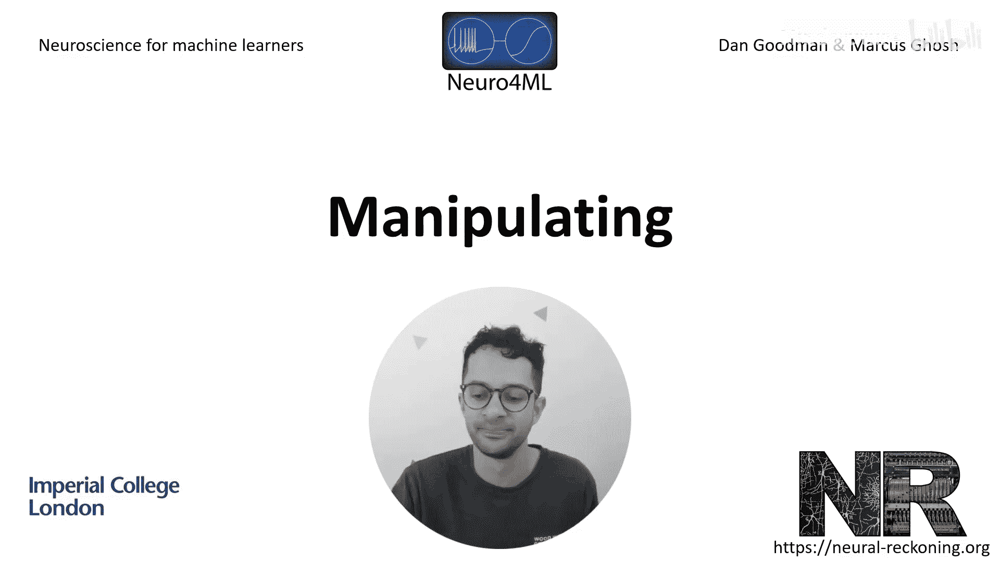
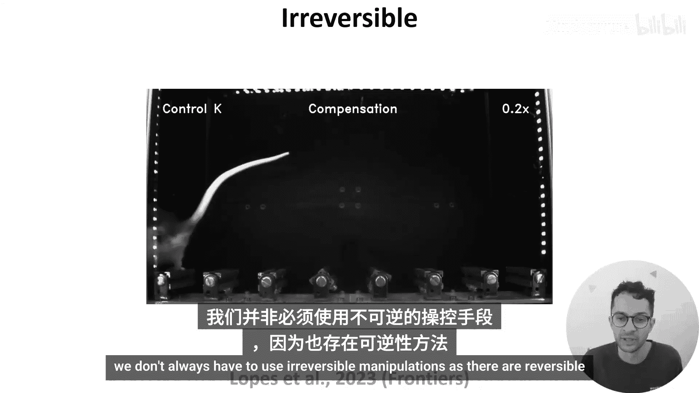
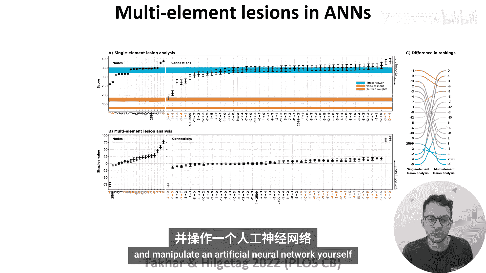

# 027：神经活动操控 🧠

在本节课中，我们将学习如何通过操控神经活动来验证神经元或脑区功能的重要性。我们将探讨不可逆与可逆的操控方法，并了解这些方法如何应用于生物神经系统和人工神经网络。

## 概述

在前两节视频中，我们探讨了如何记录和分析神经活动。然而，这些方法主要是在神经活动与不同变量之间建立相关性，我们无法完全确定这些发现具有因果关联。换句话说，一旦我们发现某些神经元对特定刺激或行为有反应，我们想知道干扰这些神经元是否会影响动物对该刺激的反应能力或执行该行为的能力。这可以通过操控神经活动来实现，操控可以是不可逆的，也可以是可逆的。

## 不可逆操控

不可逆操控通常涉及永久性地改变或破坏神经组织。在人类中，这种变化通常源于意外、疾病过程或外科手术干预。例如，在本课程早期提到的一篇论文中，研究者使用功能磁共振成像研究了胼胝体受损的两名患者。

在动物模型中，我们可以不可逆地破坏单个神经元甚至整个脑区，并研究其影响。例如，一篇论文使用大鼠研究了运动皮层的作用。运动皮层是一个在许多研究中观察到与运动相关的神经活动的脑区。

在这项研究中，作者将一组大鼠分为两组：一半大鼠的运动皮层被破坏（损伤组），另一半作为对照组（无运动皮层损伤）。然后，他们训练所有大鼠穿越台阶，如下方视频所示。

视频显示了一只运动皮层受损的动物（标记为“损伤A”）和一只对照动物学习任务的过程。最初，两只动物的运动模式看起来非常相似。令人惊讶的是，作者发现两组动物在简单任务表现上没有差异。

一个可能的结论是，运动皮层对于此类简单任务并非必需。因此，作者通过使越来越多的台阶变得不稳定来增加任务难度。然而，他们再次惊讶地发现两组动物之间没有差异。

直到他们非常仔细地分析数据后，才发现差异。他们发现，当动物首次遇到不稳定的台阶时，会以三种方式之一作出反应，如下方视频所示。

*   一些对照动物会停下来探查不稳定的台阶。
*   一些对照动物会通过调整运动来补偿。
*   但运动皮层受损的动物会停止移动数秒钟。

这表明，该脑区的主要作用可能是帮助动物适应意外情况。更广泛地说，这篇论文很好地说明，虽然我们可以通过观察神经活动来推测神经元或脑区的功能，但只有通过操控它们，我们才能真正确认或反驳这些功能。

## 可逆操控

然而，我们并非总是必须使用不可逆的操控方法，因为也存在可逆的方法。

在人类中，一种方法称为经颅磁刺激（TMS），它利用磁场来改变脑区的活动。

在动物模型中，我们可以更精确地控制神经活动，一个出色的方法是**光遗传学**。它利用光控蛋白来控制神经活动。

一些光控蛋白是基因工程改造的，但也有一些天然存在于藻类等生物中。例如，本图左侧显示的**通道视紫红质**是一种离子通道。当暴露在蓝光下时，它会改变结构，允许正离子流入神经元，从而增加其膜电位和放电活动。

相比之下，本图右侧显示的蛋白质对黄光产生反应，要么将氯离子移入神经元，要么将氢离子移出。这两种情况都会降低神经元的膜电位和放电活动。

因此，通过在神经元中表达这些通道并用光触发它们，我们可以通过可逆地激活或沉默神经元来研究它们的功能。

## 人工神经网络中的操控

虽然这看起来与机器学习有些脱节，但我们实际上可以使用相同类型的操控方法来研究人工神经网络。

例如，在一篇论文中，作者通过广泛“损伤”一个人工神经网络来研究它。为了创建这个人工神经网络，作者使用了一种名为“ME”的进化算法，演化出一个可以玩街机游戏《太空侵略者》的网络。

演化出的网络结构如本图所示。左侧是网络的12个输入节点，接收压缩后的视频游戏画面。右侧是网络的6个输出节点，对应“左移”、“右移”、“开火”等动作。中间是一个隐藏节点和许多连接，其权重用颜色编码。

为了操控网络，他们依次沉默每个节点，并检查网络在每个节点被单独沉默时的表现。本图显示了他们的结果。Y轴表示网络得分，越高越好。作为对比，蓝色条纹表示网络的正常表现，红色条纹表示如果打乱其权重（性能下限）时的表现。

在图左侧，X轴上的每个点对应沉默一个节点。可以看到，损伤不同的节点会导致不同的得分，这意味着某些节点对游戏更重要。有趣的是，损伤两个节点反而提高了网络得分，表明这些节点实际上阻碍了网络。

在图右侧，作者还依次沉默了每个权重，并研究了对性能的影响。有趣的是，他们的结果表明许多权重可以被移除而影响不大。

然而，此类单元素操控的结果可能会产生误导。例如，想象一下，如果网络中的两个单元并行执行相同的功能。那么单独沉默其中任何一个可能都不会导致网络得分变化，我们可能会错误地得出结论，认为这两个单元都不重要。

进一步来说，由于网络（无论是人工的还是生物的）中元素之间存在复杂的相互作用，很可能存在许多此类问题的变体。那么，我们如何克服这个问题呢？

作者提出的一个解决方案是使用**多元素损伤方法**。在这种方法中，对损伤组合进行采样。例如，沉默节点1并检查网络得分，然后同时沉默节点1和2，再同时沉默节点1、2和3，依此类推。然后，通过比较节点在不同组合中存在与否时的网络得分，来计算每个节点的重要性。

结果如之前一样显示在图B中。在右侧的图C中，可以看到单元素和多元素损伤方法对不同的节点赋予了不同的重要性。

这些以及其他结果使作者得出结论：即使是小型人工神经网络也可能非常难以解释。因此，在解释对更大、更复杂系统的操控结果时，我们或许应该保持谨慎。如果您想了解更多关于这种方法及其结果的信息，强烈推荐阅读下方显示的论文。

## 总结

本节课我们一起学习了如何通过操控神经活动来建立神经功能的因果联系。我们探讨了不可逆操控（如脑损伤研究）和可逆操控（如光遗传学）的方法，并了解了这些原理如何应用于分析人工神经网络。操控实验是验证观察性研究发现的关键步骤，但需要注意网络内部复杂相互作用可能带来的解释挑战。在下一个视频中，我将概述本周的练习，它将挑战您亲自观察和操控一个人工神经网络。