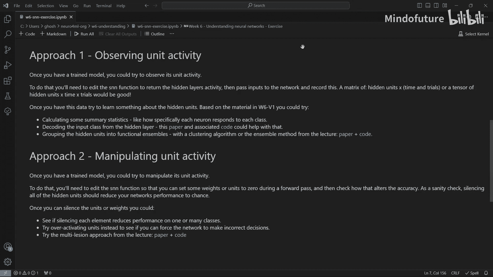

# 028：W6_V4-练习

在本周的课程中，我们探讨了如何通过观察、分析和操控神经网络的**活动**来理解它们。本次练习的目标是将同样的技术应用于一个人工神经网络，以探索我们能学到什么。

## 🎯 概述

在本练习中，我们将首先训练一个用于**声音定位任务**的**脉冲神经网络**模型。随后，我们将运用课程中介绍的技术，通过**观察**或**操控**模型的内部活动，来探究其工作机制。

## 🏗️ 第一步：训练模型

首先，我们需要训练一个模型。本练习将使用一个在声音定位任务上训练的脉冲神经网络。随附的 **Colab Notebook** 包含了完成此步骤所需的所有代码。

## 🔍 第二步：探究模型工作原理

获得训练好的模型后，你的目标是探究其工作原理。我们概述了两种不同的方法：**观察模型单元活动**或**操控模型单元活动**。你可以按任意顺序或组合尝试这些方法，甚至可以根据自己的想法采取完全不同的方法。

以下是每种方法的简要说明。

### 方法一：观察模型单元活动

如果你想观察模型的单元活动，需要编辑少量代码以记录模型的**隐藏层**活动。然后，你需要向网络输入数据并记录这些活动。获得数据后，你可以尝试我在 **W6 V1** 讲座中概述的一些分析方法。

以下是几种可行的分析思路：

*   **计算汇总统计量**：例如，计算每个神经元对每个输入类别的响应特异性。
*   **从活动解码输入**：尝试从隐藏层活动中解码出输入类别。我已链接了可能对你有帮助的论文和代码。
*   **识别功能集群**：使用聚类算法或我在论文中讨论的集成方法，将隐藏单元分组为功能集群。同样，相关论文和代码链接已提供。

### 方法二：操控模型单元活动

如果你对操控神经活动感兴趣，需要编辑代码，以便在**前向传播**过程中将某些权重或单元设置为零，然后观察这如何改变模型的准确性。

获得此能力后，你可以进行以下尝试：

*   **沉默单个元素**：观察沉默每个节点或权重是否会降低模型在一个或多个类别上的性能。
*   **过度激活单元**：尝试过度激活单元，看看是否能迫使网络做出错误决策。
*   **多重损伤分析**：如果你有足够的雄心，还可以尝试我在讲座中概述的多重损伤方法。相关论文和代码也已链接。

## 🤝 分享与讨论

如果你是帝国理工学院的课堂学生，在课程结束时，我们将简要讨论你的发现。如果你是在线学习者，欢迎在 **Discord** 上分享你的成果，我们非常期待看到你的发现。

## 📝 总结

在本练习中，我们一起学习了如何将神经科学的分析思路应用于人工神经网络。我们首先训练了一个脉冲神经网络模型，然后通过**观察其隐藏层活动**或**主动操控其内部状态**两种途径来探究模型的工作原理。希望你能通过动手实践，更深入地理解神经网络的内部机制。