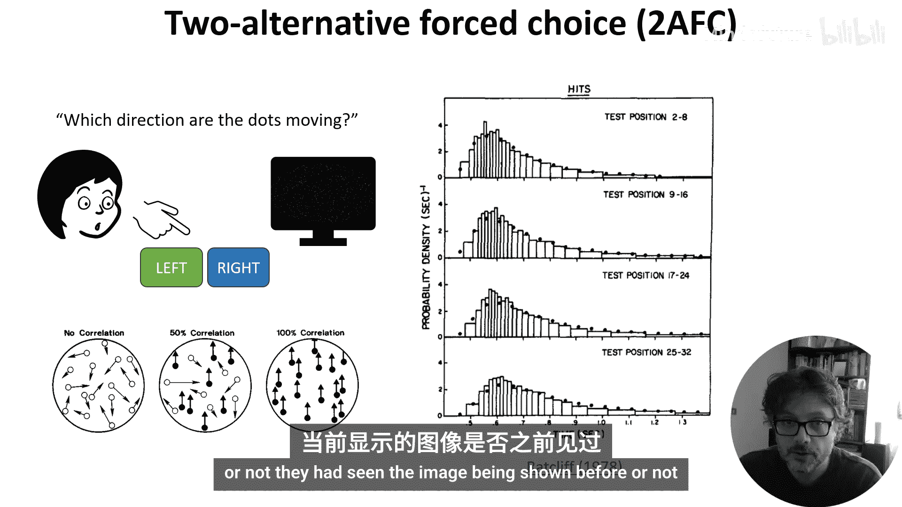
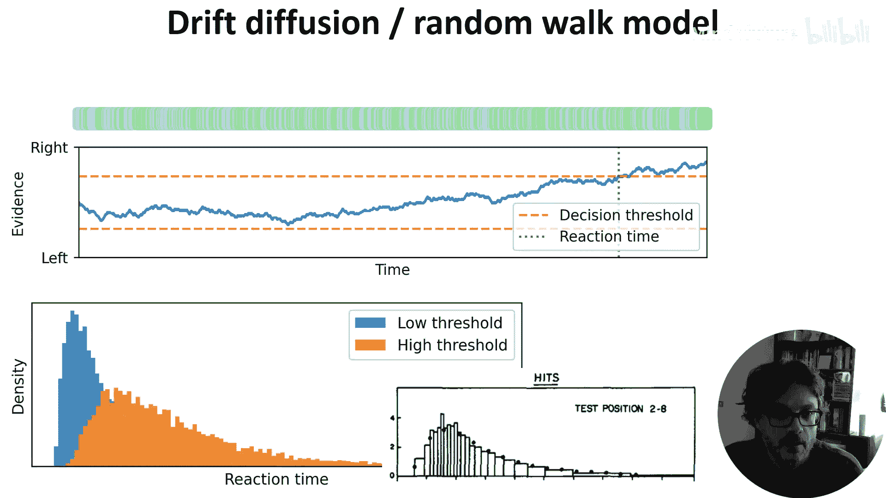
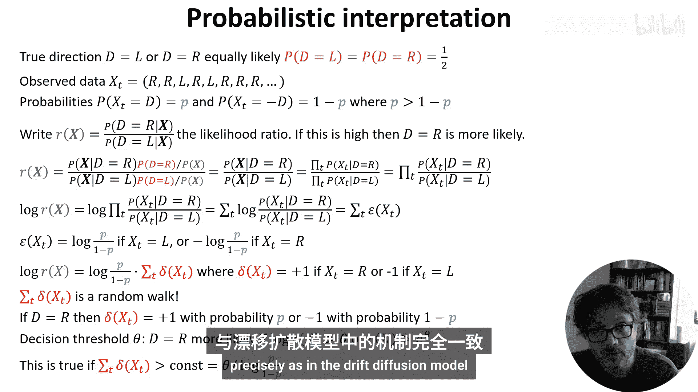

# 029：决策制定 🧠

在本节课中，我们将学习神经科学中一个对机器学习或量化背景人员可能特别有趣的主题：决策制定。我们将聚焦于决策制定的一个特定方面——反应时间，并探讨一个能解释其分布的数学模型。这个模型不仅与行为数据吻合，还拥有严谨的概率论解释，并且得到了神经生理学实验的支持。

本周的视频内容并非围绕单一主题展开。我们将探讨神经科学中几个不同的研究方向，这些方向可能对具有机器学习或定量背景的人士有所启发。未来我们可能会增加更多相关内容。

## 决策制定与反应时间

上一节我们介绍了本节课的总体范围。本节中，我们来看看我们将要重点关注的决策制定具体方面：反应时间。从某种意义上说，大脑所做的一切都可以被视为决策。然而，我们将聚焦于神经科学和机器学习中研究得很多的一个特定方面：反应时间。即，基于随时间连续到达的信息流做出决策需要多长时间？

## 双项迫选任务

为了更具体地探讨，我们引入一种非常具体的任务类型：双项迫选任务。

在此任务中，参与者会看到某种图像或视频，并被要求在两个选项之间做出决定。一个常见的例子是随机点运动图：屏幕上显示随机移动的点，其中一部分点一致地向左或向右移动，另一部分点则随机移动。参与者需要判断一致移动的点是哪个方向。有时，他们被要求尽快做出决定。反应时间就是从视频开始到参与者按下按钮之间的时间间隔。

如果你进行这个实验，你会观察到特征性的、偏态分布的反应时间。下图实际上来自一个略有不同的任务，参与者被要求判断他们之前是否见过所展示的图像。

## 漂移扩散模型

有一个非常简洁的理论可以解释我们如何做出这些决策，并能说明这些反应时间的分布。想象一下，随着时间的推移，有时会到达一些证据片段，每个片段本身并不可靠，但暗示着点更可能向右移动而非向左。接着是另一个证据，然后是一个暗示向左移动可能性更大的证据，依此类推。

我们持续追踪一个累计总量，记录我们收到的支持“向右”相对于“向左”的证据有多少。一旦这个累计量超过某个阈值，我们就做出决策。

这是一个有偏的随机游走过程，其中向正确方向迈出一步的概率高于向错误方向迈出一步的概率。随着时间点从10增加到30，再从30增加到100，一直到1000，这个随机游走看起来越来越像带有漂移的布朗运动。

这为我们提供了一个数学模型，让我们可以解析地计算反应时间分布的表达式，或者像这里一样，用数值方法进行模拟。我们可以设置一个低决策阈值或高决策阈值进行模拟。果然，我们得到的结果与实验数据非常相似。

## 模型的概率论解释

这个模型看起来不错，但可能仍显得有些特设。幸运的是，事实证明这个模型有一个巧妙的概率论解释。

让我们为任务建立一个概率模型。我们假设存在一个真实方向 **T**，可以是 **L** 或 **R**，且两种可能性相等。你也可以修改此模型，使选项具有不同的先验概率。

我们在时间 **t** 观察到的数据是一系列符号 **X_t**，每个符号是 **R** 或 **L**。观察到正确符号的概率是 **p**，观察到错误符号的概率是 **1-p**。

现在，给定我们已知观察数据 **X**，我们想要推断未知值 **D**，我们计算这两个选项中哪一个更可能。我们将其写为似然比 **R(x)**：

**R(x) = P(D=R | X) / P(D=L | X)**

如果这个比值很高，则 **D=R** 的可能性大得多；如果比值很低，则 **D=L** 的可能性更大。

我们使用贝叶斯定理来重写条件概率。**P(D=R | X)** 可以写为 **P(X | D=R) * P(D=R) / P(X)**，分母 **P(D=L | X)** 同理。**P(X)** 项抵消，且先验概率 **P(D=R)** 和 **P(D=L)** 都是 **1/2**，所以也抵消。

不同时间点的观测是独立的，因此我们可以将其展开为每个时间点概率的乘积。这个乘积在分子和分母中是相同的，所以可以提出来。

为了更清楚地看到发生了什么，我们取这个比值的对数，得到对数似然比 **LLR**：

**LLR = log R(x) = Σ_t [ log( P(x_t | D=R) / P(x_t | D=L) ) ]**

对数的乘积等于对数的和。我们将单个项写为时间 **t** 的证据 **ε(x_t)**。当 **x_t = R** 时，**ε(x_t) = log( p / (1-p) )**；当 **x_t = L** 时，**ε(x_t) = log( (1-p) / p ) = -log( p / (1-p) )**。

因此，我们可以将对数似然比写为一个常数项乘以一系列项 **δ(x_t)** 的和，其中 **δ(x_t)** 在 **x_t = R** 时为 **+1**，在 **x_t = L** 时为 **-1**。

**LLR = log( p / (1-p) ) * Σ_t δ(x_t)**

但这个和正是我们在上一张幻灯片中看到的随机游走。当 **D=R** 时，和以概率 **p** 增加1，以概率 **1-p** 减少1；当 **D=L** 时则相反。

现在，我们可以从概率角度理解决策阈值。我们等待直到对数似然比大于某个阈值 **θ**，或者等价地，似然比大于 **e^θ**。这恰好发生在 **δ(x_t)** 的和大于某个阈值时，与漂移扩散模型完全一致。

## 神经科学证据与模型扩展

最后，关于这个理论最棒的一点或许是：在基于拟合行为观察提出模型并找到严谨的概率论解释之后，电生理学实验在多个物种的多个不同脑区都发现了这种证据累积过程的痕迹。

当然，实际情况从未像理论那样清晰纯粹，人们已经提出了各种修改模型。例如，随时间推移而向原点靠近的自适应阈值，以代表做出某种决策的紧迫性增加；或者能以各种方式适应更广泛背景的阈值。

此外，还有更全面的贝叶斯决策理论，其中这个模型只是一个特例。如果你有兴趣阅读更多，本周的阅读材料中提供了一些建议的起点。

## 总结

本节课中，我们一起学习了神经科学中关于决策制定的一个核心视角。我们重点探讨了反应时间，并通过双项迫选任务将其具体化。我们介绍了一个简洁的漂移扩散模型，该模型通过证据累积的随机游走来解释反应时间的分布。更重要的是，我们深入探讨了这个模型的概率论基础，揭示了它本质上是计算对数似然比并设定决策阈值的过程。最后，我们了解到该模型得到了神经生理学证据的支持，并且存在多种扩展和更一般的理论框架。这个例子很好地展示了如何用数学和计算模型来理解和解释大脑的复杂功能。