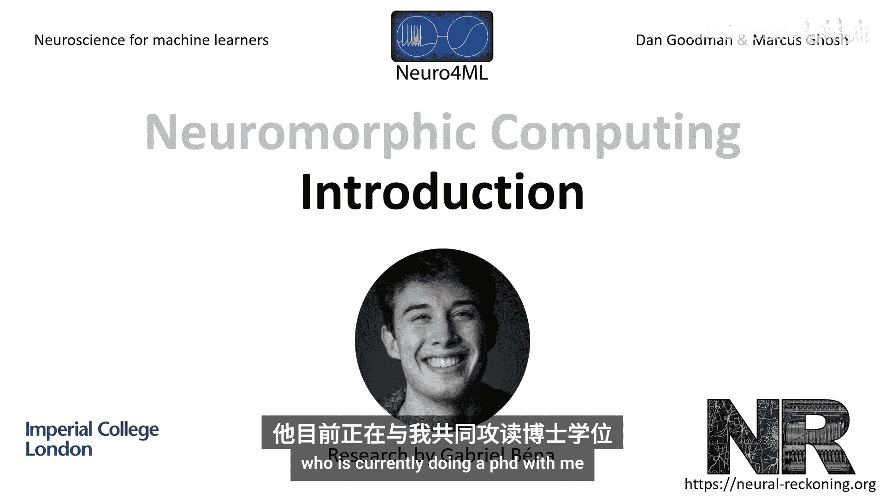
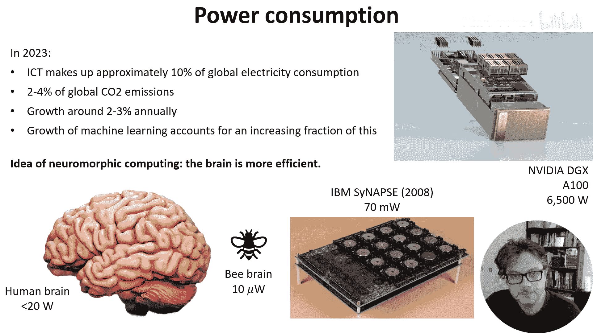
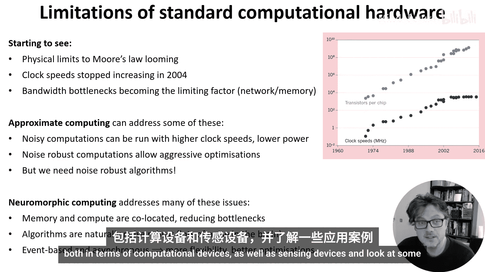

# 030：神经形态设备简介 🧠

在本节课中，我们将要学习神经形态计算。这是一种使用专门硬件的方法，这种硬件要么直接模仿大脑功能，要么受到大脑计算方式的某些方面启发。本周视频的研究主要由正在攻读博士学位的Gabriel Mayner完成。

---

## 为何关注神经形态计算？⚡

上一节我们介绍了神经形态计算的概念，本节中我们来看看它为何在当前备受关注。一个主要原因是**电能消耗**。

*   据估计，到2023年，信息与通信技术（ICT）消耗了全球约10%的电力供应，导致了约2%至4%的全球二氧化碳排放。
*   这一消耗正以每年约2%至3%的平均速度增长。显然，这种情况必须得到改变。
*   部分增长源于机器学习应用日益增长的需求。例如，一台配备8块A100 GPU的NVIDIA DGX GPU服务器功耗约为6.5千瓦。

神经形态计算的理念是从大脑中汲取灵感，而大脑是已知的非常节能的系统。

*   人脑最多消耗约20瓦功率，实际可能远低于此，因为该数值包含了维持头部温度等所需的能量。
*   凭借这20瓦功率，大脑能进行大量复杂的计算，在许多任务上的表现远超功耗高出数个数量级的机器学习系统。
*   再以蜜蜂的大脑为例，它仅消耗约10微瓦功率，就足以完成复杂的导航、模式识别和社交沟通。

神经形态硬件如何降低功耗？以下是一个例子：
*   2009年的IBM Synapse芯片在执行视频处理任务时，仅消耗70毫瓦功率。

---

## 超越功耗：传统计算的局限 🚧

神经形态计算的优势不仅在于降低功耗。标准的计算范式正开始显现其局限性，神经形态计算是解决其中一些问题而被提出的若干思路之一。

以下是当前计算面临的一些挑战：

*   **物理极限**：著名的摩尔定律所概括的计算能力指数增长正面临物理极限。事实上，作为计算能力关键指标的时钟速度在2004年就已停滞。
*   **内存带宽瓶颈**：加速代码时，瓶颈常常是内存带宽而非计算能力。如果你进行过GPU编程，就会知道关键在于确保海量核心获得足够数据，避免它们空转等待。
*   **移动设备限制**：移动设备没有足够的功率预算来运行全尺寸的机器学习模型。在这种情况下，它们受限于与更强大服务器通信的网络带宽。

---

## 近似计算与噪声鲁棒性 🔀

近似计算是一个有趣的发展方向，可以解决上述部分问题。

*   **核心思想**：如果在计算中允许存在噪声，就可以实现一些原本不可能的事情。
*   **举例**：如果不介意随机比特翻转（即1随机变为0，或反之），就可以大幅降低电压，从而降低功耗并以更高的时钟速度运行。
*   **关键**：要实现所有这些优化，需要计算本身对噪声具有鲁棒性。然而，设计这种鲁棒性对我们而言通常很困难或不自然。

神经形态计算为这些问题提供了一个很好的解决途径。

---

## 神经形态计算的优势 💡

神经形态计算从多个方面应对了传统计算的挑战：

1.  **内存与计算协同定位**：由于内存和计算在物理上是共位的，可以减少一些瓶颈问题。这既体现在设备内部，也体现在移动设备上——可以在本地运行一些计算，避免将数据发送到服务器。
2.  **算法天然噪声鲁棒**：神经形态算法受大脑启发，而大脑本身充满噪声且具有极强的噪声鲁棒性。这使得近似计算的许多目标得以实现。
3.  **事件驱动与异步性**：整个系统天然基于事件且是异步的。这再次允许了各种巧妙的优化，这些优化在保证操作按固定、确定顺序执行的系统上是不可能实现的。

---

## 本周内容预告 📺

在接下来的视频中，我们将探讨神经形态硬件的现状，包括计算设备和传感设备，并了解一些应用实例。

---

## 总结

本节课中我们一起学习了神经形态计算的基本概念。我们了解到，它通过模仿大脑高效、鲁棒、异步的计算方式，旨在解决传统计算在功耗、内存瓶颈和物理极限等方面面临的挑战。神经形态硬件将内存与计算单元紧密结合，其算法天然对噪声鲁棒，并以事件驱动的方式运行，为未来计算技术的发展提供了新的可能性。