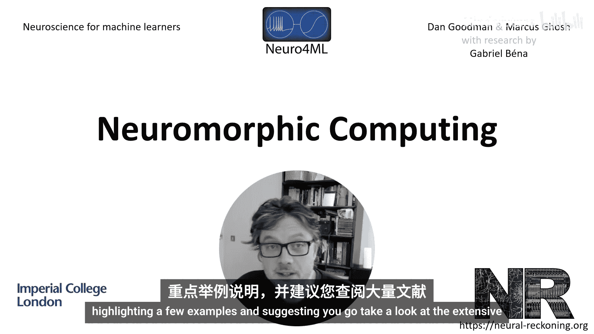
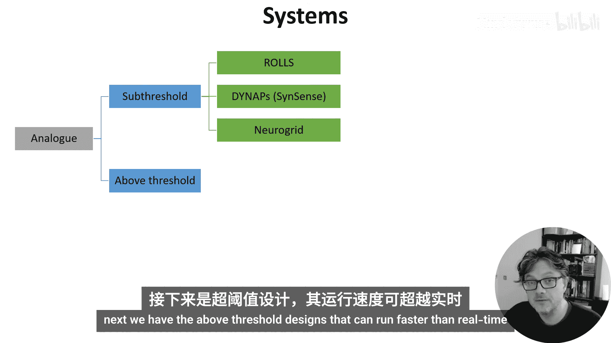
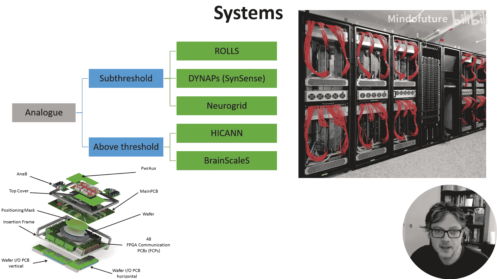
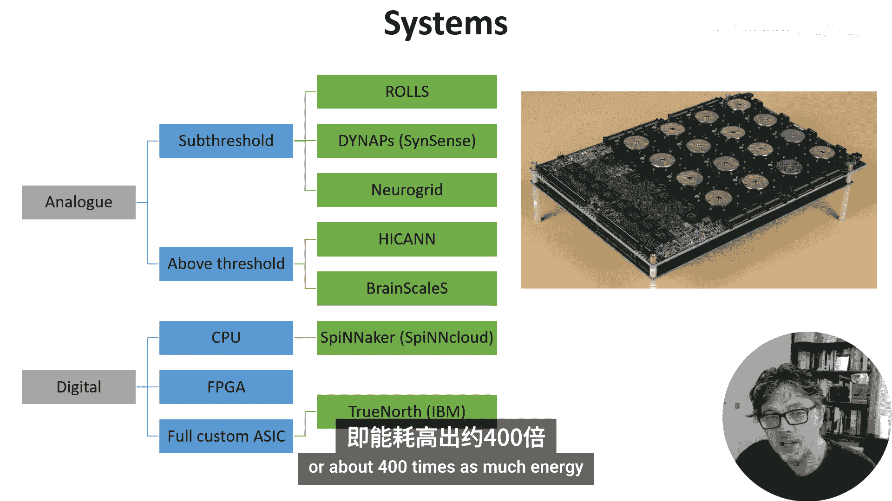
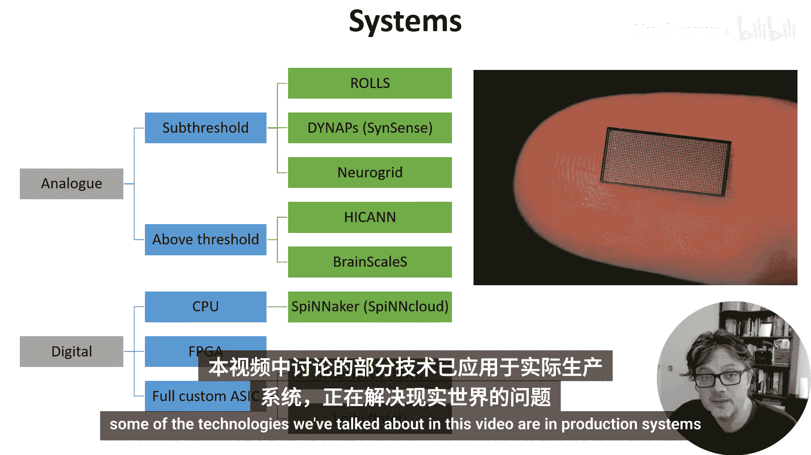

# 031：类脑计算详解 🧠

在本节课中，我们将深入探讨类脑计算。这是一种非标准计算架构，旨在模仿大脑工作的某些方面。它不一定意味着使用脉冲信号，但许多类脑计算方案确实以某种形式利用了脉冲。

## 概述

类脑计算设备的设计方案众多。一篇综述论文引用了多达2700篇文献。因此，我们无法涵盖所有尝试。本节将概述一些最常见的特性，并举例说明。如果你希望了解更多，建议查阅相关文献。

## 核心组件概览

类脑计算系统通常包含几个关键部分。以下是其主要构成要素：

*   **神经元模拟技术**：核心是模拟神经元功能的技术。这可以是模拟过程，使用新材料或电路来模拟神经元动态；也可以是数字过程，基于传统CPU或为模拟神经动力学和脉冲而定制的硬件；还可以是两者的结合。
*   **脉冲处理**：硬件需要处理可能数量庞大的输入脉冲。一种常见方法是忆阻器交叉阵列。
*   **脉冲通信**：神经元需要一种方式将其产生的脉冲传递给其他神经元。地址事件表示是一种标准协议，并有几种不同的路由方法。
*   **学习机制**：理想情况下，学习应在类脑设备本身上进行以实现最高效率，但这通常难以实现。因此，训练常常在芯片外低效地进行，只有前向传播或推理过程在芯片上运行。

上一节我们介绍了类脑计算系统的整体框架，接下来我们逐一深入其核心组件。

## 模拟神经元

第一步是模拟神经元或其组件。

一种非常传统的方法是**亚阈值模拟方法**。这种方法设计一个行为类似于神经元模型的电路，其时间常数与生物神经元相当，因此可以实时运行。相关论文展示了一系列使用晶体管和电容器构建的、日益复杂的电路，这些电路越来越接近地模拟了突触动力学。

此外，还有**超阈值模拟方法**，其速度比生物过程快数千到数十万倍，因此可用于加速模拟。其缺点是电流通常更高，电路设计更复杂。

值得注意的是，这些模拟电路是有噪声的。例如，你可以看到其中一种技术的电导如何随时间变化。这是我们必须考虑的因素，但如果底层网络（如大脑）对噪声具有鲁棒性，这可能不是问题。

## 数字方法

现在让我们看看数字方法。最简单的一种就是使用标准CPU，例如像ARM这样的精简指令集处理器。其巧妙之处在于如何将这些处理器连接在一起。这种方法在模拟内容方面非常灵活，但能效不如更定制化的方案。

**现场可编程门阵列** 是迈向完全定制化的第一步。它们允许对硬件进行部分配置。虽然比CPU的灵活性稍差，但在速度和功耗方面可以更高效。

最后，你可以选择开发**完全定制的芯片**。这是灵活性最低、开发成本最高的方案，但能效可能高得多。

当然，也存在以不同方式结合这些元素的**混合方法**。

在模拟了神经元之后，我们需要一种方式来接收并处理输入的脉冲。

## 处理输入脉冲

这里的关键问题，也是人工神经网络和脉冲神经网络共同面临的问题，是**矩阵向量乘法**。这通常是神经网络模拟中最耗时的部分，因此加速此过程或降低其功耗是类脑系统设计的关键。

一个常见的解决方案是**忆阻器交叉阵列**。忆阻器是一种具有可编程电导的电子元件。如果将它们连接成网格，就可以用它来实现矩阵向量乘法。

*   行（V_i）代表输入，以电压表示。
*   列（I_j）代表输出，以电流表示。
*   在每个网格点，可以有一个忆阻器，其电导代表突触权重。
*   网格点的电流是输入电压和忆阻器电导的乘积。
*   一列的总输出电流是所有网格点电流之和，这正是矩阵向量乘法所需的计算。

除了处理接收到的脉冲，我们还需要传递脉冲。

## 传递脉冲

大脑的做法是简单地为每个输入到每个输出连接一根导线。我们能照做吗？可以。但如果你有N个输入和N个输出，你可能需要多达N²根导线，这成本很高，尤其是在芯片仅限于二维空间，而大脑是三维的情况下。

另一种方法是**地址事件表示**方案。在该方案中，每个输入事件首先被解码为二进制，这需要log₂(N)个比特。这些事件通过一个非常高速的数字总线进行时分复用传输。路由表允许你将事件分发到目标，然后目标可以重建输入脉冲序列。这只需要与log₂(N)成比例的导线数量，要好得多。

然而，由于多个事件可能同时发生，你不得不对同时发生的事件进行排队（这会引入时间误差）或完全丢弃它们。如果你的目标是完美模拟，这在理论上有问题，但如果你训练的网络对噪声（如某种形式的时间抖动和突触丢失）具有鲁棒性，这可能不是大问题。因此，AER方案在类脑系统中被广泛使用。

我们需要的最后一个要素是学习。

## 实现学习

最简单的做法是在类脑设备之外进行学习，然后将突触权重和其他参数复制过来。这种方法非常灵活，因为你可以使用任何你喜欢的学习规则，但这意味着你失去了在类脑设备上模拟学习的好处，并且这常常限制了可扩展性。

另一种方法是在芯片本身上进行学习。从效率的角度来看这是理想的，但也有一些缺点。

*   我们无法使用全局梯度信息，这排除了像在替代梯度下降中使用的随时间反向传播这样的学习规则。
*   即使大脑知道如何仅用局部信息进行学习，我们目前还不知道如何做得和用全局信息一样好。
*   此外，这些局部信息需要被管理并传输到正确的位置，因此必须将其纳入硬件设计中，这限制了灵活性。

在实践中，我们经常使用STDP或其近似，或一种称为SDSP（脉冲时间依赖可塑性）的变体。这些规则是无监督的，如果你想在分类或回归任务上进行训练，这是一个限制，但你可以使用资格迹来恢复监督元素（此处不深入讨论）。

在某些方面，学习是类脑计算故事中缺失的重要部分，这可能也是因为我们还不完全理解大脑如何仅用局部信息进行学习。

## 现有产品示例

最后，我们快速浏览一些现有的产品，看看它们如何运用我们讨论过的组件。这不是一个详尽的列表。

我们从**实时运行的亚阈值模拟系统**开始：

*   **Rolls 和 DAPS**：现已由Sence商业化。基本Rolls芯片每片有256个自适应指数积分发放神经元，带有64K个具有短期可塑性的突触和64K个使用SDSB学习规则的突触。在Dynaps中，通过脉冲路由架构，神经元数量可达数万个。
*   **Neurogrid**：拥有百万神经元，但突触权重存储在片外，增加了延迟。

接下来是**运行速度快于实时的超阈值设计**：

*   **HICANN芯片**：拥有512个自适应指数积分发放神经元和112K个STDP突触，每个突触4比特。
*   **BrainScaleS**：由352个上述芯片组成，因此每个晶圆有18万个神经元和4000万个突触。

然后是**数字设计**，从基于CPU的开始：

*   **SpiNNaker**：最初由曼彻斯特的Steve Furber设计。它通过将大量ARM芯片与一个巧妙的高容量事件路由系统连接起来工作。由于使用通用CPU，它非常可定制，尽管这带来了相对较高的能耗。第一代SpiNNaker系统可扩展至百万核心，7TB RAM，并能实时模拟十亿神经元（约人脑的1%），但功耗约为100千瓦。其后续产品SpiNNaker2由SpinCloud商业化，旨在构建一个规模大100倍的系统，即能够模拟与人脑一样多的神经元。

最后是**由大型芯片公司投资的完全定制芯片**：

*   **IBM TrueNorth**：每片芯片可模拟一百万个神经元和2.56亿个二进制非可塑性突触，具有固定的神经元到突触映射。
*   **Intel Loihi**：每片芯片有13万个神经元，突触数量可以从13万个（每突触9比特）到100万个（每突触1比特）配置。它具有可配置的神经元模型和一个名为Lava的开源工具箱，鼓励了许多研究人员尝试。

还有许多其他系统，这里只是快速介绍了一些我们讨论过的技术如何应用于实际生产系统并解决现实世界问题。

## 总结

本节课我们一起学习了类脑计算的详细内容。我们概述了其核心组件，包括模拟神经元的多种技术（模拟与数字）、处理输入脉冲的关键方法（如忆阻器交叉阵列）、传递脉冲的协议（如地址事件表示），以及实现学习的挑战与现有方案。最后，我们浏览了一些现有的类脑计算产品，了解了不同设计理念的实际应用。类脑计算是一个快速发展的领域，旨在通过模仿大脑的高效计算模式，为机器学习和其他计算任务开辟新的可能性。