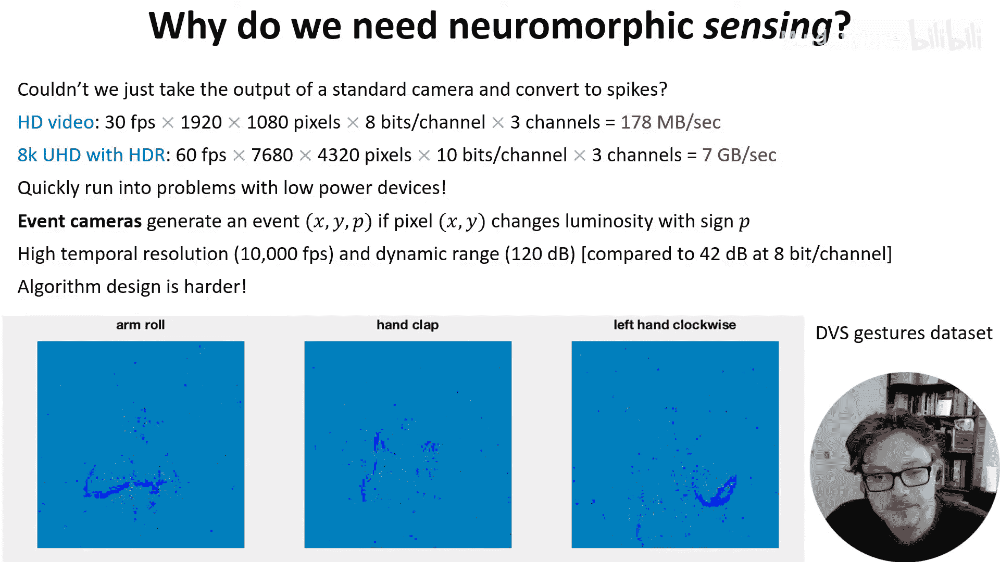
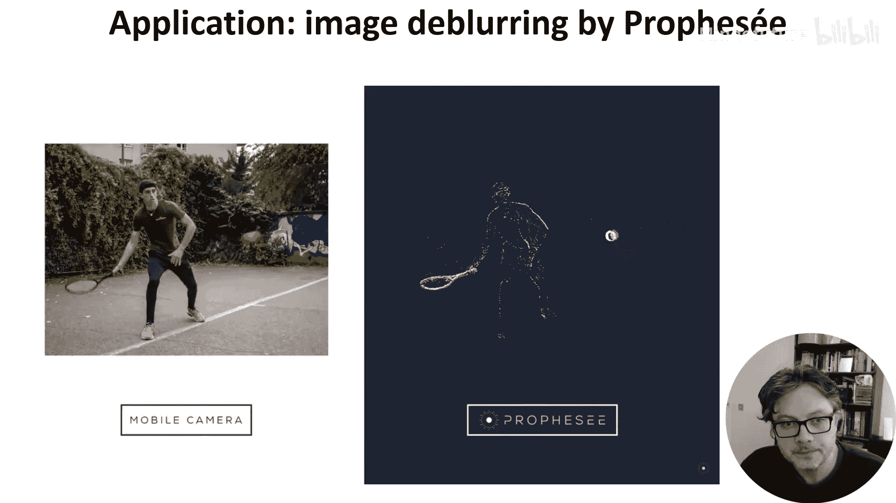
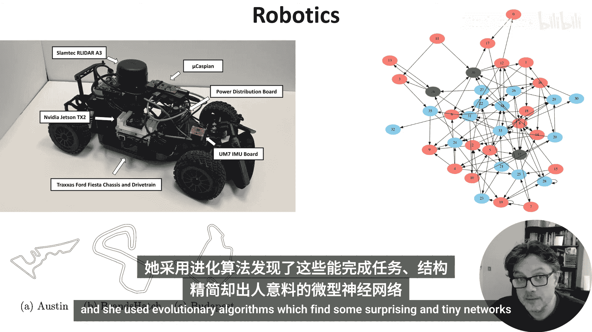

# 032：神经形态传感与应用

在本节课中，我们将快速介绍一些神经形态传感设备，并了解它们如何实现独特的低功耗应用。

## 为什么需要神经形态传感设备？

上一节我们介绍了神经形态计算，本节中我们来看看与之配套的传感设备。首先需要思考一个问题：为什么需要专门的神经形态传感器？我们能否直接将标准摄像头（例如）的输出转换为脉冲，然后输入到神经形态计算设备中？

答案是肯定的。但当我们开始考虑所涉及的数据传输量时，问题就显现了。

以下是标准视频数据量的计算：
*   每秒30帧的高清视频每秒产生约 **178 MB** 的数据。
*   而具有高动态范围的超高清视频，数据量会达到每秒 **7 GB**。

对于低功耗设备而言，如此大的数据量是非常棘手的问题。

## 事件相机：一种解决方案

针对上述数据量问题，事件相机提供了一种解决方案。其核心思想是：在连续帧之间，场景中的大多数像素通常不会发生变化，这也是视频压缩算法的基础。

事件相机将这一理念提升到了传感层面。它只在底层像素发生变化时才传输一个“事件”。

以下图片来自动态视觉传感器手势数据集，展示了这类相机的输出效果：

除了能极大减少数据传输量，事件相机还有另一个优势。它不再以每秒60帧运行，而是能以相当于每秒数千帧的速率运行，同时拥有更大的动态范围。

其不足之处在于，正如我们在整个课程中看到的，针对这种数据流的算法设计要困难得多。

## 实际应用案例：消除运动模糊

我们想展示一个来自法国公司Prophesee的近期的优秀案例。他们在手机上混合使用标准相机和事件相机，以消除快速运动图像中的模糊。

在这段视频中，你可以看到事件相机的高帧率如何让你以更高的时间分辨率观察运动。他们随后利用这一点，从变化最快的像素中消除模糊，从而获得更清晰的图像。

## 其他神经形态传感器

视觉并非唯一拥有神经形态对应物的感官。以下是其他类型的神经形态传感器：
*   **听觉传感器**：例如，你可以在此看到该系统产生的一些脉冲信号。
*   **嗅觉传感器**：用于感知气味。
*   **触觉传感器**：用于感知触摸。

## 机器人学应用示例

本周课程的最后，我们将介绍凯蒂·舒曼的一个优秀机器人应用。

她使用了由Loihi神经形态计算设备控制的机器人小车。该小车在模拟的微型方程式赛道上进行训练，如下图所示：

她采用了进化算法，该算法找到了一些能够完成任务的、令人惊讶的小型网络。

最终，在模拟环境中完成训练后，他们在先前未见过真实环境中进行了测试，小车成功地绕赛道行驶。

## 总结

在这些视频中，我只触及了神经形态设备领域的表面。但我希望这能让你对这个领域正在进行的研究有所了解。本节课中，我们一起学习了神经形态传感设备（如事件相机）如何通过仅传输变化信息来大幅降低数据量与功耗，并探讨了其在消除运动模糊、机器人控制等多个方面的应用潜力。