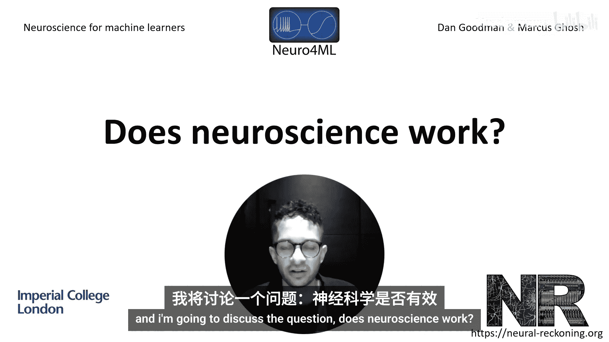
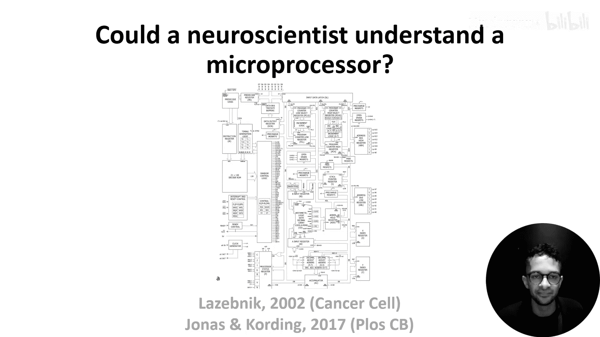
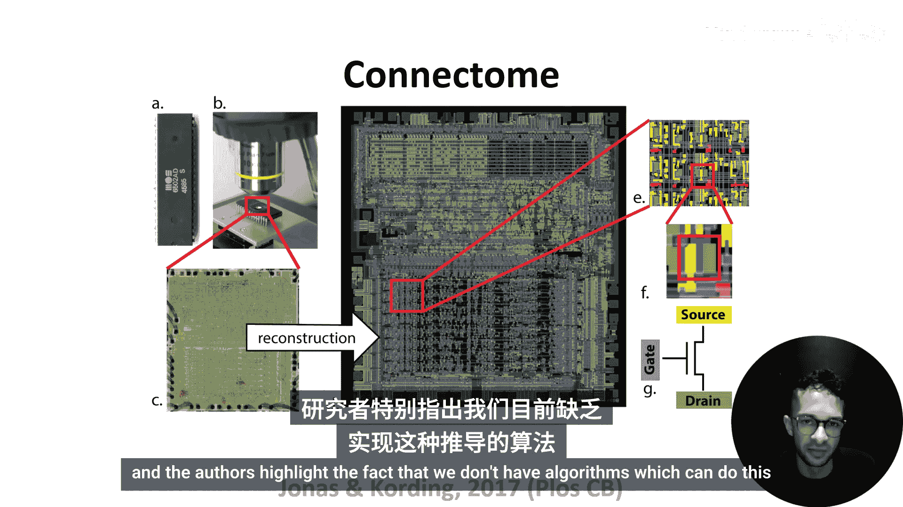

# 033：神经科学有效吗？🧠

在本节课中，我们将探讨神经科学领域内一些我们认为悬而未决的问题。核心议题是：神经科学的方法有效吗？我们如何能知道它是否有效？

---

## 概述：一个关键问题

在课程的大部分时间里，我们展示了神经科学家如何收集越来越大规模的神经元形态和活动数据，并讨论了从这些数据集中能学到什么。这些努力背后隐含着一个假设：**更多的数据会带来更深的理解**，并且只要有足够的数据，我们就能理解大脑。

但这个假设成立吗？一篇名为《神经科学家能理解一个微处理器吗？》的论文探讨了这个问题，该论文灵感来源于更早的《生物学家修理收音机》。在这篇论文中，作者们选取了一个运行三款视频游戏的旧微处理器，并尝试应用神经科学的方法来理解它的工作原理。

---

## 微处理器作为“模型大脑”

这个想法看似奇特，但微处理器在某些方面与大脑并无太大不同。例如：
*   它的晶体管及其连接方式类似于神经元。
*   这些晶体管随时间变化的活动将输入转化为输出。

当然，也存在许多差异，比如晶体管是确定性的且易于观察和操控。然而，这些差异实际上应该让微处理器比生物数据**更容易解释**。这为我们提供了一个理想的“地面真相”系统来测试神经科学方法。

---

## 尝试一：分析连接组

首先，作者们获取了微处理器的“连接组”，即描述每个晶体管如何连接到其他晶体管的图谱。他们对此图谱进行了一些分析。

**以下是他们的发现：**
*   虽然发现了一些有趣的结果，但很难看出如何直接从网络结构推导出其功能。
*   作者们强调了一个事实：我们目前**没有算法**能够做到这一点。

因此，仅靠结构分析不足以理解系统。

---

## 尝试二：观察与记录活动

接下来，他们模拟微处理器并观察其晶体管的活动模式，就像神经科学家记录和分析神经活动一样。

**以下是他们收集和分析的数据类型：**
1.  **尖峰状活动**：晶体管从“关”到“开”的转换随时间的变化图，看起来非常像神经元放电的栅格图。
2.  **调谐特性**：分析单个晶体管的活动如何作为像素亮度的函数而变化。结果发现，有些晶体管表现出简单的调谐（与单一亮度值相关），而有些则表现出更复杂的调谐，这与大脑中的神经元类似。

然而，这有助于我们理解微处理器的工作原理吗？答案是否定的。实际上，这些晶体管都不直接控制亮度。

---

## 尝试三：识别功能集群

既然分析单个晶体管效果有限，作者们尝试识别**功能集群**，即具有相关时间动态的晶体管组。

**以下是他们的方法：**
*   在三款不同游戏运行时，同时记录所有3510个晶体管随时间变化的活动。
*   使用**非负矩阵分解**等方法来分析这些大规模数据。

这次，他们发现了一些与微处理器特征（如时钟和读写信号）匹配的动态模式。但这仍然无法为我们提供关于微处理器如何工作的实质性理解。

---

## 尝试四：操控系统

也许仅仅观察系统还不够，我们应该尝试**操控**它。为此，作者们依次“沉默”（禁用）每个晶体管，并检查三款游戏是否能启动。

**以下是操控实验的结果分布：**
*   **1565个晶体管**：移除后无任何影响。
*   **1560个晶体管**：移除后导致微处理器无法启动任何游戏。
*   **一小部分晶体管**：移除后阻止一款或两款游戏启动。

那些对特定游戏至关重要的晶体管位置被映射到了芯片图上。我们很容易将这些晶体管标记为“大金刚晶体管”或“太空侵略者晶体管”，就像我们可能将神经元标记为视觉或听觉神经元一样。但这是误导性的，因为这些晶体管并非专属于单一游戏，而是实现如**全加器**这样的简单功能，这些功能可能也参与了我们未考虑的其他游戏，甚至在这些游戏中除了启动之外的其他过程。

---

## 启示与开放性问题

那么，什么才能真正帮助我们理解微处理器（或大脑）呢？

**以下是论文作者提出的两个建议：**
1.  **设计更好的实验**：例如，如果只在玩家尝试向左移动时记录和操控晶体管，就可以尝试弄清楚微处理器如何将“向左”的控制器输入转化为屏幕上的向左移动。这有助于隔离特定的行为或计算。
2.  **开发更好的方法**：例如，在第六周我们讨论过，为什么**多元素损伤**可能比单元素损伤提供更多信息。但如何理解复杂网络，这本身仍是神经科学中的一个开放性问题。

---

## 总结

回到最初的问题：神经科学有效吗？这篇论文表明，**当前的主流方法可能不足以达成“理解”这一最终目标**。我们需要更好的方法，也需要像微处理器这样的“地面真相”系统，以便在其中验证这些新方法。

在下一节视频中，Dan将继续带领我们深入探讨。本节课我们一起审视了通过一个已知系统来检验神经科学方法的局限性，并认识到在通往理解复杂系统的道路上，我们仍需在方法论上不断创新。