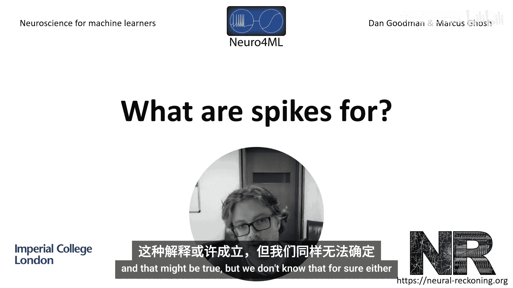
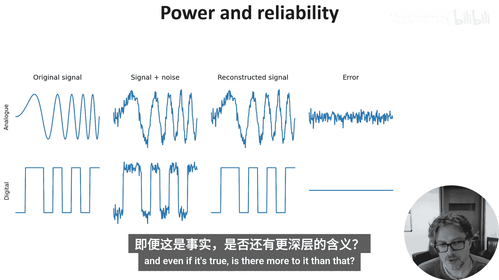
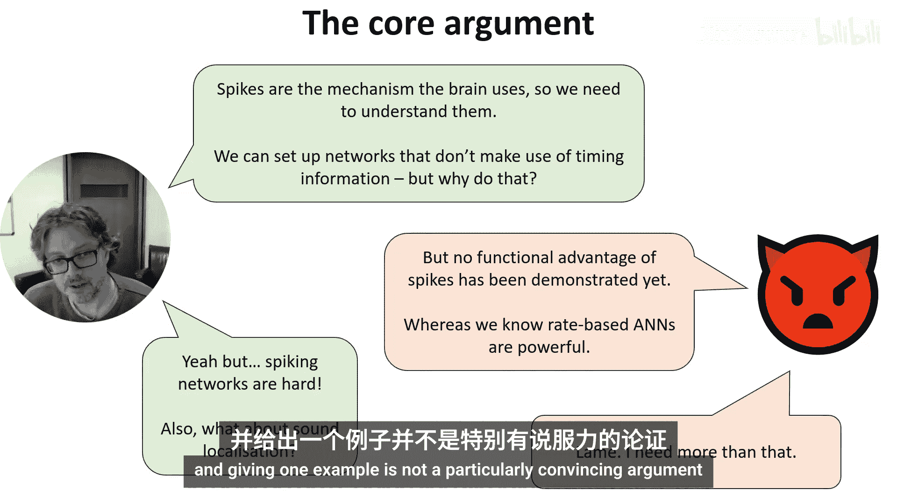
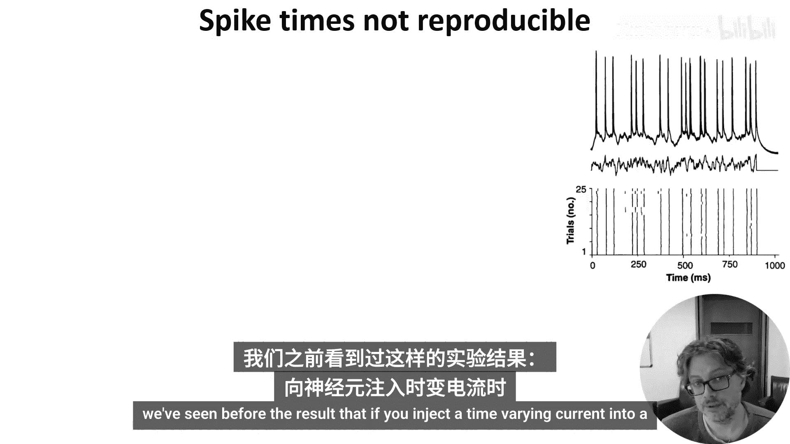
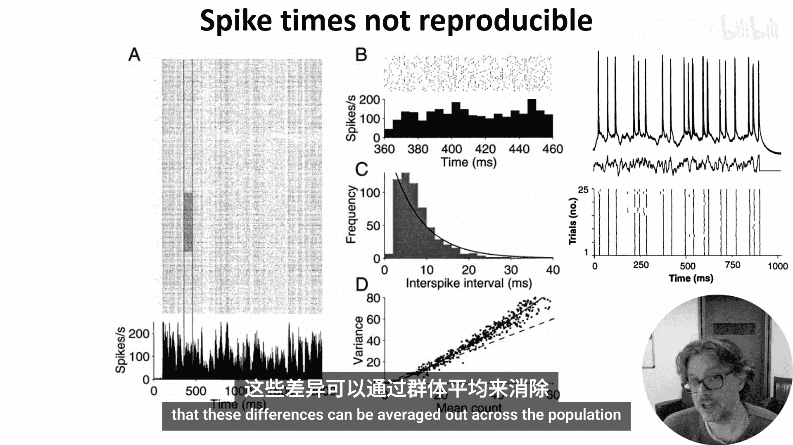
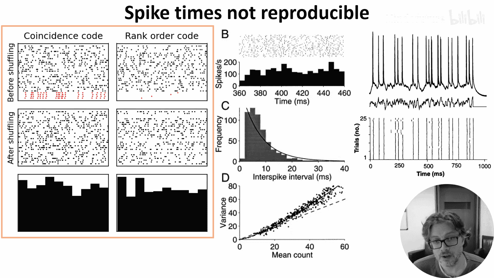
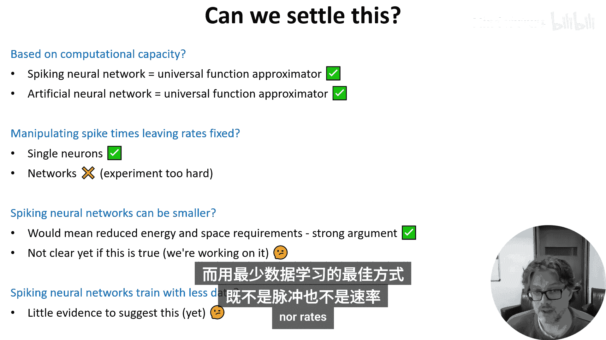

# 034：脉冲的作用是什么？🧠

在本节课中，我们将探讨神经科学中一个核心但悬而未决的问题：神经元为何使用离散的动作电位（即脉冲）进行通信和计算？我们将梳理关于脉冲功能的几种主要观点和争论，并尝试理解这对我们理解大脑以及构建类脑计算模型的意义。

神经科学中最令人惊讶的事情之一，是神经元使用一种非凡的方法进行通信和计算，即离散的动作电位或脉冲。但我们并不知道大脑为何要这样做。在哲学层面上，这可能是一个没有答案的问题。大脑这样做，只是因为这是进化选择的路径。它本可以选择不同的路径。这可能是事实，但我们对此也并不确定。因此，让我们来看看关于这个问题的一些观点和争论。

## 论点一：能量效率与可靠性 ⚡️

上一节我们提出了核心问题，本节中我们来看看第一个主要论点。

第一个论点是，脉冲的主要功能仅仅是一种能量高效的机制，用于沿着长距离的“导线”可靠地发送信号。这基本上是通信和计算中数字信号通常优于模拟信号的原因。**数字信号**即使在有一定噪声的条件下也能完美重建，而噪声总会使**模拟信号**劣化。这是一个非常有效的论点，并且很可能是原因的一部分。它无疑是上周讨论的神经形态设备的关键灵感来源。

但是，当我们知道大脑中神经元存在许多其他噪声源（如突触传递失败）时，这个论点有多大的有效性？即使它是真的，是否还有更深层的原因？我们是否需要理解脉冲才能理解大脑在做什么？

## 论点二：脉冲时间 vs. 发放率 ⏱️

我的观点是，我们知道大脑确实使用脉冲，因此如果我们想理解大脑，就需要理解这一点。即使我们认为大脑只使用脉冲的发放率，我们也必须理解大脑如何能够丢弃非发放率信息（即脉冲时间信息）。人们已经在这方面做了研究，展示了如何设置脉冲神经网络，使其表现得好像只传递发放率。但大脑为何要主动丢弃一个潜在有用的信息源或丰富性呢？

我的看法是，如果你想声称大脑只使用发放率，那么你需要证明使用脉冲时间信息在某种程度上是有害的，以至于值得付出努力去丢弃它。但对此有一个反论点，我在这里用一个完全中立的表情符号来代表。😊

如果脉冲时间携带了所有这些潜在有用的信息和丰富的动态行为，对计算有益，那为什么我们从未能证明脉冲模型在性能上优于非脉冲模型？我们知道基于发放率的人工神经网络很强大，但我们还不能对脉冲神经网络模型说同样的话。你在前几周已经看到，训练脉冲神经网络正在取得巨大进步，但我们仍远未达到人工神经网络的性能水平。

我个人认为，虽然这显然是事实，但部分原因在于，我们拥有处理连续和可微分系统的良好理论和技术，而对于混合的、离散和连续系统的技术还不够成熟。😊 这是我们数学技术的局限性，但没有理由认为大脑的生物机制会受到同样的限制。此外，这也不完全正确，我们确实知道一些系统，其中精确的脉冲时间绝对重要，比如声音定位回路。尽管如此，我承认仅仅说它很难并给出一个例子并不是一个特别有说服力的论点，而我研究的很大一部分正是试图在这方面做得更好。😊

## 论点三：概念上的等价性？🤔

在我们进一步深入讨论之前，值得一问：我们在这个问题上没有取得进展，是否因为这个问题本身并不存在？如果我们把脉冲时间平滑处理为一种近似的发放率，我们可以看到，这确实没有捕捉到脉冲时间的结构。这是人们通常持有的观点。但如果我们使用一个狭窄的时间窗口，这种区别就变得不那么明显，直到最终发放率和发放时间之间没有区别。

那么，这是否意味着我们可以忽略脉冲时间和发放率之间的区别？并不完全如此。首先，虽然脉冲可以在任何时间尺度上告诉你关于发放率所需知道的一切，但反之则不成立。只有狭窄的平滑窗口能告诉你关于脉冲时间的信息。其次，争论点不仅在于发放率的概念能否做到时间信息能做到的任何事，而在于脉冲实际上是由一个脉冲时间不重要的过程产生的，这是一个更强有力的陈述。从表面上看，这令人惊讶。我们知道单个神经元不会丢弃其输入中的脉冲时间信息，并且它们会对时变输入电流产生可靠的脉冲时间。

可以建立一个丢弃时间信息的神经元网络，但正如我之前所说，这似乎是一件奇怪且不必要的事情。😊 当然，这并不意味着大脑不是这样做的，大脑常常出人意料。

那么这张幻灯片的结论是什么？结论并不像说发放率和脉冲时间在数学上是同一件事那么简单，但这是在这场辩论中需要牢记的一个有用观点。😊

## 论点四：信息论视角 📊

让我们回到这一点：知道脉冲时间就能知道关于脉冲发放率的一切，但反之则不一定。我们能量化这一点吗？这并不完全直接，但人们已经尝试使用信息论方法。😊

思路是记录一些感觉信息（在本例中是大鼠胡须偏转的程度），同时记录一组神经元的活动。然后你问：知道脉冲序列能告诉我多少关于胡须偏转程度的信息（以比特为单位）？然后，你使用完整的脉冲时间集，或者仅仅使用脉冲发放率或计数（如图中所示）来进行计算。当然，由于脉冲时间信息告诉了你发放率或计数，其信息量必须至少一样大，但这里的发现是它要大得多。知道脉冲时间所提供的信息几乎是仅知道计数的两倍。😊

这是一个在不同感觉模态和不同物种中多次发现的结论。😊 乍一看，这像是一个支持脉冲时间编码的决定性论据，但它并不那么清晰。首先，在这些非常高维度的设置中测量互信息非常困难，因此很难100%确信我们所做的是有意义的。😊 其次，仅仅因为信息存在，并不意味着动物会利用这些信息。😊

## 论点五：可重复性与相关性 🔄

另一个反对脉冲时间重要的论点是，它们通常不可重复，因此不能用作神经编码的基础。我们之前看到过，如果你向神经元注入一个时变电流，你会得到可重复的脉冲时间。

但相比之下，如果你反复向动物呈现相同的刺激，你通常会得到非常不同的脉冲时间。尽管计数也高度可变，但论点是这些差异可以在群体中被平均掉。😊

然而，你不一定会看到明显可重复的脉冲时间模式。😊 这里有两种脉冲时间编码，它们产生的直方图乍一看与那些没有有意义脉冲时间的编码无法区分。😊 在顶行，你看到脉冲的排序使得四个神经元在时间上彼此有特殊关系。😊 在左边，它们会在相同的时间（加上一点噪声）发放，在右边，它们彼此之间有固定的顺序。然而，如果你随机打乱绘制它们的顺序或计算脉冲时间的直方图，你看不到任何明显的脉冲时间编码。😊

排序编码有点棘手，它意味着网络结构有很多约束。但巧合编码则非常自然，这引出了下一个论点。

下一个论点是，如果巧合是神经编码的重要组成部分，我们预计会看到神经元脉冲序列之间存在高的成对相关性，而我们在记录中并没有看到。确实，我们预计会看到相关性，但一个令人惊讶的事实是，时间编码并不需要它们那么高。事实上，小到与噪声无法区分的输入相关性，可能对下游神经元的发放产生巨大影响。😊

Ceral Russell 及其同事生成了成对相关性从 0 到 0.01 变化的模拟输入脉冲序列。将这些脉冲作为输入电流注入皮层神经元，然后测量输出神经元的发放率。正如你所见，神经元对这些微小的相关性差异极其敏感。😊 在神经元 C1 的情况下，其发放率从零增加到每秒近 10 个脉冲。😊 他们还表明，同样的情况可以在漏电积分发放神经元中看到。

因此，我们没有在脉冲序列中看到巨大的相关性，并不意味着时间信息对网络功能不重要。😊 事实上，我们可以更进一步。你可以认为，无论编码是基于时间还是基于发放率，你都期望看到局部关系和单个脉冲序列的统计特性，与它们由没有有意义时间信息的泊松过程生成的情况一致。这些统计特性是在每个单独脉冲携带最大信息量的任何情况下都会得到的。

Sophie Deev 已经将其发展成一个有趣而详细的理论，我在阅读列表中放了一个很好的入门链接。😊

## 结论与未来方向 🚀

当然，这些论点远不止这个简短的概述，但你可以开始看到问题所在。这是一场持续了数十年的辩论，似乎离解决还遥遥无期。那么，需要什么才能解决呢？

我们不能纯粹基于计算能力来决定。我们已经看到脉冲神经网络是通用函数逼近器，基于发放率的人工神经网络也是如此。我们可以尝试以破坏脉冲时间但不破坏发放率的方式来操控回路，看看它是否会改变网络的功能。我们可以对单个神经元这样做，但对于基于群体的脉冲网络，这个实验目前超出了我们的能力范围。

我们正在研究的一种方法是试图证明脉冲让你能用更少的神经元和突触做更多的事。这将意味着降低能量和空间需求，这两者对生物网络都至关重要。目前尚不清楚这是否属实，但我们在研究中看到了一些暗示性的迹象。最后，也许脉冲神经网络需要更少的训练数据。这确实会是一个巨大的差异，这可能吗？嗯，有可能时间稀疏性或阈值机制对此很重要，但我还没有看到任何能说服我这一点的证据。

如果我现在必须猜测，我会说最可能的情况是，大脑主要使用脉冲来减少资源（包括能量和空间），而用最少数据学习的最佳方式最终将既不是脉冲也不是发放率，而是我们尚未想象出来的东西。也许你们中的一位会发现它。

---

本节课中我们一起学习了关于神经元为何使用脉冲进行通信和计算的多种观点。我们探讨了能量效率、脉冲时间与发放率的关系、信息论证据、可重复性问题以及相关性在编码中的作用。尽管争论仍在继续，但理解这些论点对于构建更接近大脑工作原理的计算模型至关重要。最终，答案可能在于资源优化，或者一个我们尚未发现的崭新机制。