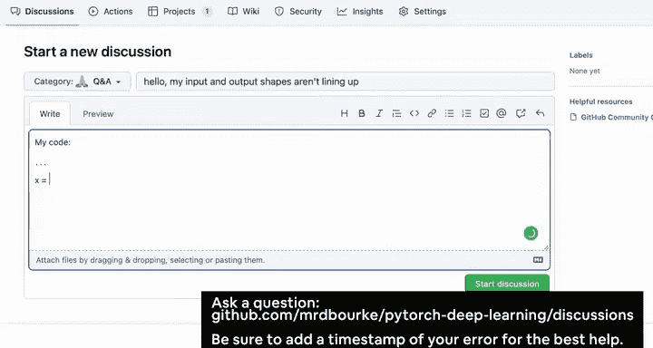
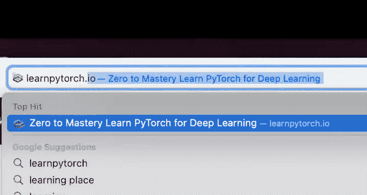
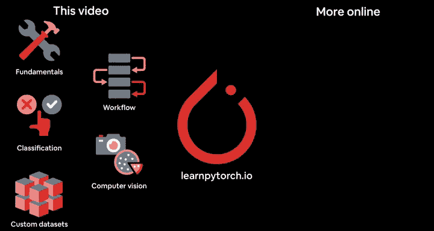
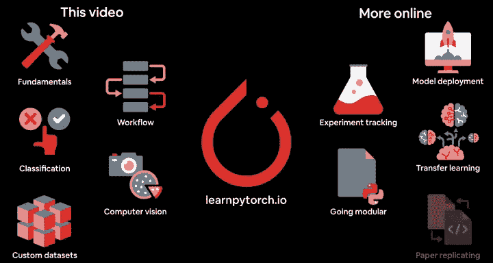
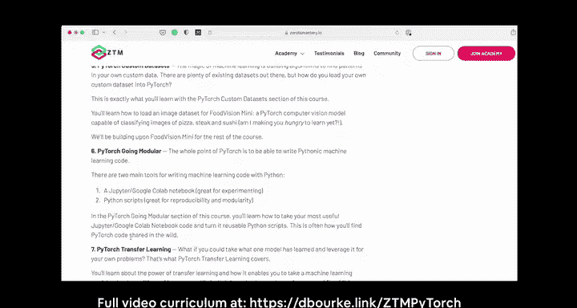

# 1：PyTorch深度学习入门概述 🚀

在本课程中，我们将学习如何使用PyTorch进行机器学习和深度学习。本教程专为具有约3到6个月Python编码经验的初学者设计。

我们将通过编写PyTorch代码，涵盖一系列重要的机器学习概念。

如果你在学习过程中遇到困难，可以在视频下方留言，或在课程的GitHub讨论页面发帖。你可以在GitHub上找到我们涵盖的所有材料，也可以在`learnpytorch.io`找到本课程的在线可读版本。

完成本视频后，如果你发现自己仍想学习更多PyTorch知识，这是很自然的。毕竟，视频标题“一天学会”更多是文字游戏，指视频的长度。

你可以在`learnpytorch.io`找到另外五个章节的内容，涵盖从迁移学习到模型部署、实验跟踪等所有主题。与这些章节配套的视频可在`zerotomastery.io`观看。

介绍就到这里。让我们开始机器学习的旅程，视频里见。

---

## 总结

在本课程中，我们一起了解了本PyTorch深度学习教程的定位、目标受众以及可获取的额外学习资源。我们明确了本课程适合有一定Python基础的初学者，并知道了遇到问题时可以寻求帮助的渠道。接下来，我们将正式进入PyTorch代码与实践的学习阶段。