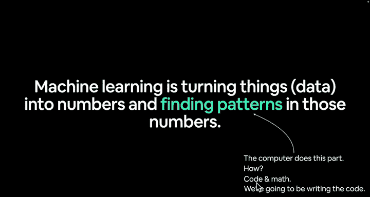
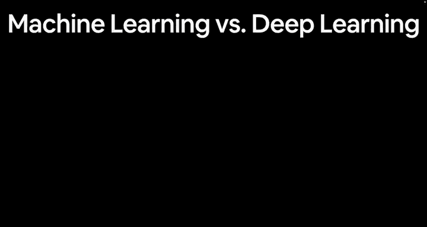
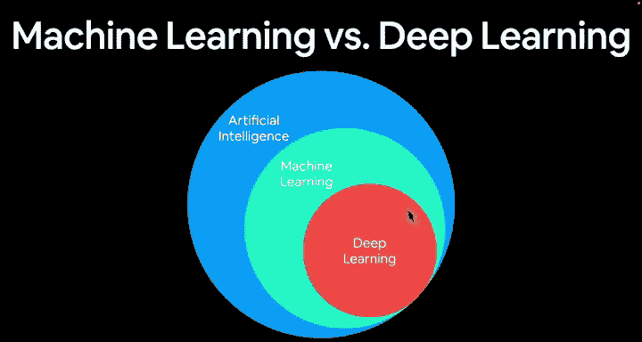
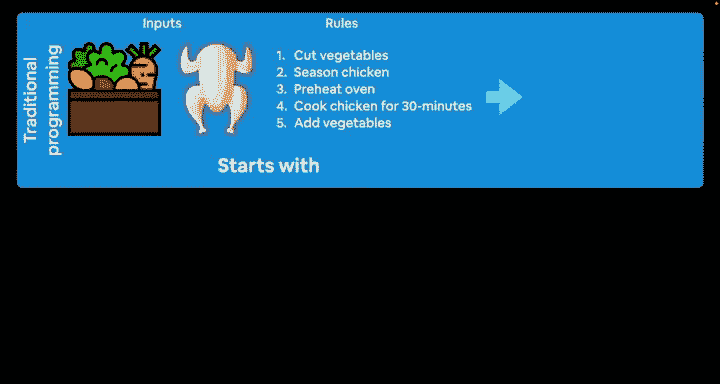
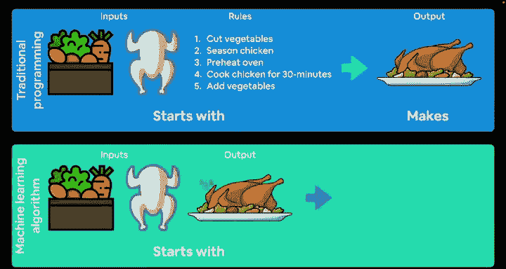
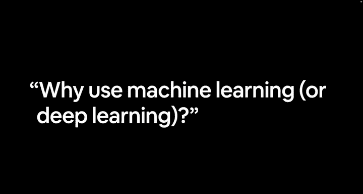
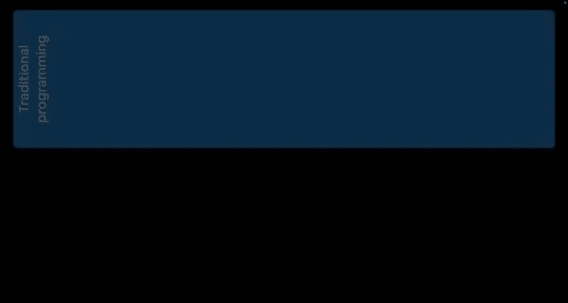
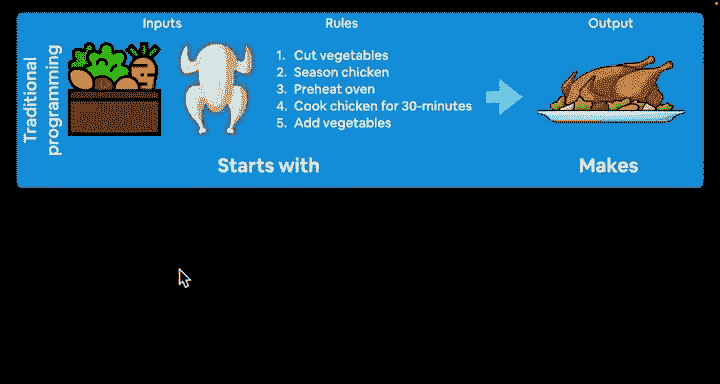
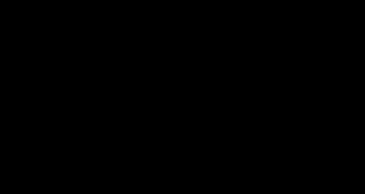

# 2：欢迎与深度学习简介 🎯

在本节课中，我们将学习深度学习的基本概念，了解它与机器学习和传统编程的区别，并明确本课程的核心目标：通过编写代码来实践深度学习。

大家好，我是Daniel，欢迎来到PyTorch深度学习课程。

欢迎来到PyTorch深度学习课程。

这非常令人兴奋。

你会多次看到那个动画，因为它很有趣。

PyTorch的标志是一个燃烧的火炬。

让我们开始吧。

如果你来学习这门课程，你可能已经研究过什么是深度学习。

但我们会非常简要地介绍它。

我们只介绍学习本课程需要了解的内容。

本课程的重点不是定义概念，而是注重实践，观察事物如何运作。

因此，我们定义什么是机器学习，因为深度学习是机器学习的一个子集。

机器学习是将数据（几乎可以是任何东西，如图像、文本、数字表格、视频、音频文件）转化为数字的过程。

计算机喜欢数字，然后在这些数字中寻找模式。

我们如何找到这些模式？

计算机完成这部分工作，具体来说是机器学习算法或深度学习算法，也就是我们将在本课程中构建的内容。

这涉及代码和数学。

本课程以代码为重点。

在开始之前，我想强调这一点。

我们专注于编写代码。

在幕后，这些代码将触发一些数学运算，以在这些数字中寻找模式。

如果你想深入了解代码背后的数学原理，我会提供额外的资源链接。

然而，我们将动手编写大量代码来完成这些工作。

为了进一步分解，我们来看机器学习与深度学习的区别。

如果我们这里有一个代表人工智能的大圆圈，你可能在互联网上看到过类似的东西。

我只是复制了它，并为这门课程配上了漂亮的颜色。

你有一个涵盖人工智能主题的大圆圈，你可以将其定义为几乎任何你想要的东西。

通常在人工智能内部，有一个称为机器学习的子集，这是一个相当广泛的主题。

在机器学习内部，还有另一个主题称为深度学习。

这就是我们将要重点学习的内容：使用PyTorch编写深度学习代码。

但同样，你可以使用PyTorch处理许多不同的机器学习任务。

说实话，我经常交替使用这两个术语。

是的，机器学习是更广泛的主题，深度学习则更细致一些。

但如果你想形成自己的定义，我强烈鼓励你这样做。

本课程的重点不是定义事物是什么，而是观察它们如何运作。

这就是我们关注的重点。

为了分解说明，如果你熟悉机器学习的基础知识，你可能理解这个范式，但我们还是要再复习一下。

我们考虑传统编程。

假设你想编写一个计算机程序，能够复制你祖母最喜爱或著名的烤鸡菜肴。

我们这里可能有一些输入，比如一些漂亮的蔬菜、你在农场养的鸡。

你可能会写下一些规则，这可能是你的程序：切蔬菜、给鸡调味、预热烤箱、将鸡烤30分钟、加入蔬菜。

这可能不这么简单，或者实际上可能就这么简单，因为你的西西里祖母是一位出色的厨师。

她已经将事情变成一门艺术，可以一步一步地完成。

然后，这些输入与这些规则结合，就做出了这道美味的烤鸡菜肴。

这就是传统编程。

现在，机器学习算法通常接受一些输入和一些期望的输出，然后找出规则，即输入和输出之间的模式。

在传统编程中，我们必须手写所有这些规则。

理想的机器学习算法将找出连接我们输入和理想化输出的桥梁。

在机器学习意义上，这通常被称为监督学习，因为你会有某种输入和某种输出，也称为特征和标签。

机器学习算法的任务是找出输入（或特征）与输出（或标签）之间的关系。

因此，如果我们想编写一个机器学习算法来找出我们西西里祖母著名的烤鸡菜肴，我们可能会收集一堆输入食材，比如这些美味的蔬菜和鸡肉，然后有一堆最终产品的输出，看看我们的算法是否能找出我们应该做什么才能从这些输入到输出。

就定义而言，这几乎足以涵盖传统编程和机器学习之间的区别。

我们将在整个课程中动手编写这类算法的代码。

现在，让我们进入下一个视频，提出一个问题：为什么要使用机器学习或深度学习？

实际上，在我们开始之前，我希望你思考一下这个问题。

回顾我们刚刚看到的内容，传统编程和机器学习之间的范式，你为什么想使用机器学习算法，而不是传统编程？

如果你必须手动编写这些规则，会不会变得很繁琐？

请思考一下，我们将在下一个视频中讨论。

---

本节课中我们一起学习了深度学习的基本定位，它是机器学习的一个子集，而机器学习又是人工智能的一部分。我们通过对比传统编程（手动定义规则）与机器学习（从数据中自动学习规则）的范式，理解了机器学习的核心思想。本课程将聚焦于使用PyTorch进行实践编码，而非深究理论定义。