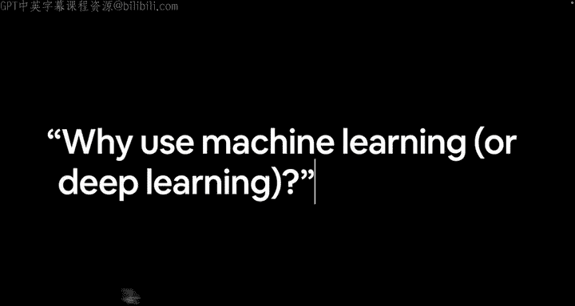
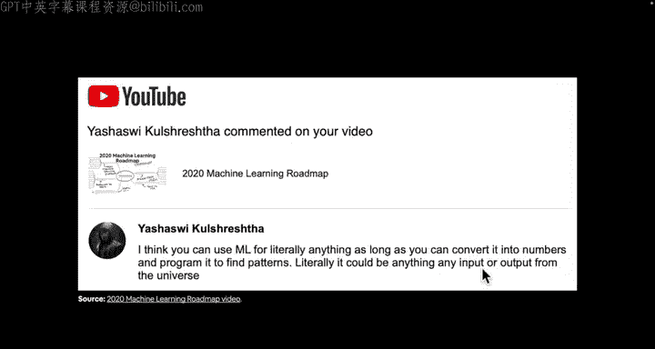
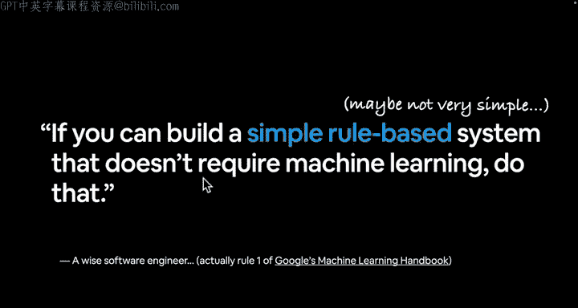

#  3：为何使用机器学习与深度学习？🤔

在本节课中，我们将探讨为何要使用机器学习与深度学习，并理解它们适用的场景。

上一节我们简要介绍了传统编程与机器学习的区别。本节中，我们来看看为何需要机器学习。

一个直接的原因是：对于复杂问题，手动编写所有规则可能非常繁琐。例如，要复现Alice祖母的烤鸡食谱，如果每次都需要写下所有手工规则，会相当麻烦。

---

## 复杂问题的挑战 🚗

以下是另一个更重要的原因：对于极其复杂的问题，你能否想到所有规则？

想象一下，我们试图构建一辆自动驾驶汽车。学会驾驶可能需要20到100小时，但若要写下关于驾驶的每一条规则，例如：

*   如何从车道倒车
*   如何左转并驶入街道
*   如何进行倒车入库
*   如何在十字路口停车
*   如何判断行驶速度

我们刚刚列出了半打规则，但实际上规则数量可能达到数千条。对于驾驶这类复杂问题，你很可能无法想到所有规则。这正是机器学习和深度学习发挥作用的地方。

---

## 机器学习的强大之处 💪

关于机器学习的强大能力，我想分享一条来自我YouTube视频下的精彩评论（视频名为“My 2020 Machine Learning Roadmap”，评论者Yahuwi）：

> “我认为你可以将机器学习用于任何事物，只要你能将其转化为数字。正如之前所说，机器学习就是将事物转化为计算机可读的数字，然后编程让其寻找规律——只不过通常是我们编写算法，由算法（而非我们自己）来发现规律。因此，理论上它可以是宇宙中的任何输入或输出。”

这确实道出了机器学习非常酷的一点：其潜在应用范围极广。

---

## 何时不应使用机器学习？🚫

但是，仅仅因为机器学习能用于任何事物，就意味着你应该总是使用它吗？

我想向你介绍谷歌的机器学习第一法则：

> **如果你能构建一个简单的基于规则的系统（例如，仅用五个步骤就能将食材映射到我们西西里祖母的烤鸡食谱），并且这个系统每次都能良好工作，那么你很可能应该这样做。**

换句话说，如果你能构建一个不需要机器学习的简单规则系统，那就使用规则系统。

当然，问题可能并不那么简单，但也许你仍然可以编写一些规则来解决你正在处理的问题。这是一位睿智的软件工程师提出的建议，也是谷歌机器学习手册中的第一条法则。我强烈建议你阅读该手册，虽然本视频不会深入探讨。你可以搜索“Google’s machine learning handbook”找到它。

请记住这一点：尽管机器学习非常强大、有趣且令人兴奋，但这并不意味着你应该总是使用它。我知道在深度学习与机器学习课程的开头说这个有点特别，但我希望你能记住：简单的基于规则的系统仍然很有用，机器学习并非解决一切问题的万能药。

---

## 深度学习的优势 📈

现在，让我们看看深度学习擅长处理哪些问题。不过，我要留一个悬念作为“课后作业”，因为我们将在下一个视频中详细探讨这一点。

---

本节课中，我们一起学习了：
1.  使用机器学习的主要原因：处理手动编写规则过于繁琐或不可能的复杂问题。
2.  机器学习的核心是将问题转化为数字并寻找模式。
3.  重要原则：优先考虑简单的规则系统，机器学习并非适用于所有场景。
4.  预告了下一节将探讨深度学习的具体优势。