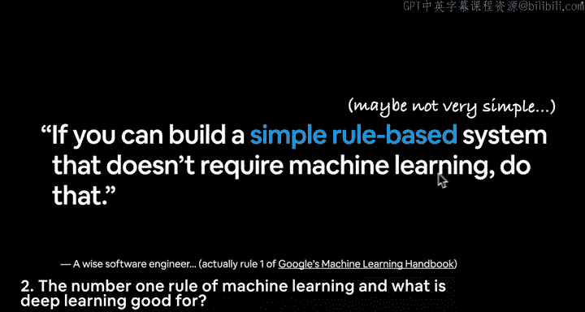
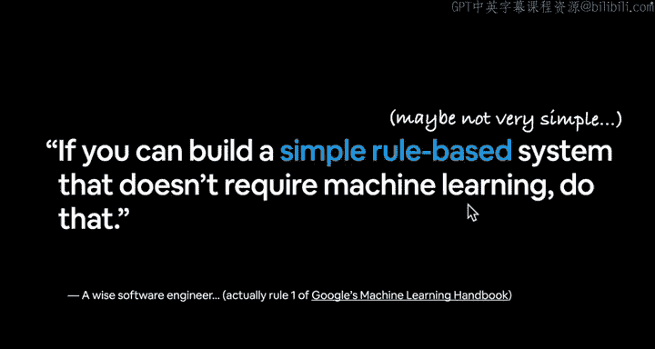
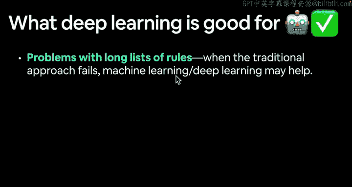
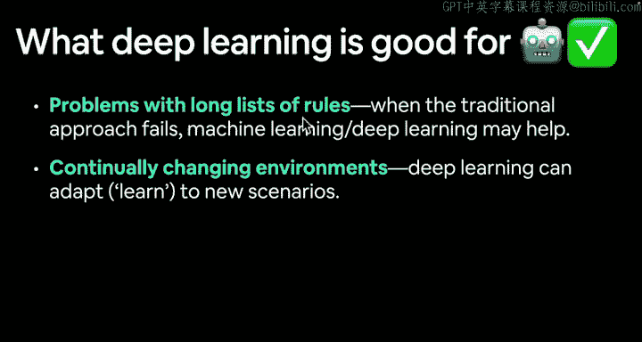
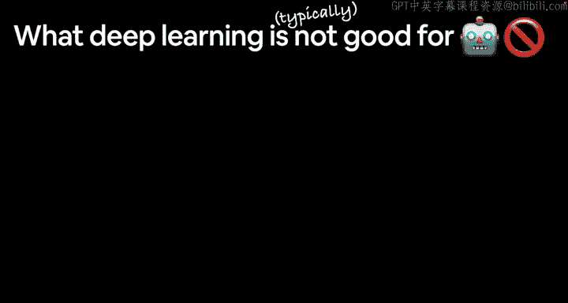
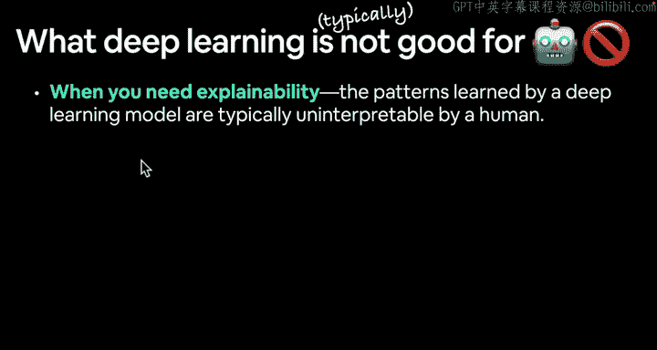
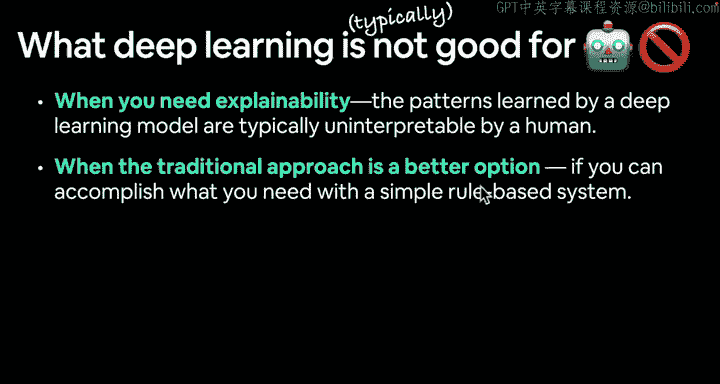
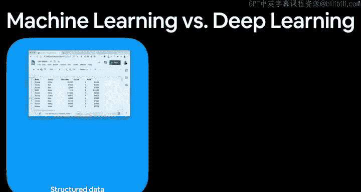

#  4：机器学习第一法则 🧠

在本节课中，我们将学习机器学习的首要法则，并探讨深度学习适合与不适合的应用场景。理解这些原则有助于我们在实际项目中做出明智的技术选择。

## 概述

上一节我们介绍了机器学习的第一法则：“如果不需要，就不要使用它”。基于这一原则，本节我们将探讨哪些问题适合使用机器学习或深度学习来解决，哪些则不适合。

## 深度学习擅长解决的问题

以下是深度学习通常表现出色的三类问题。

### 1. 规则列表冗长的问题
当传统方法失效时，深度学习可能是一个好选择。传统方法是：你有一些数据输入，编写一系列规则来处理这些数据，然后得到已知的输出。但如果规则列表非常长，例如驾驶汽车的规则可能有数百、数千甚至数百万条，这时机器学习和深度学习就能提供帮助。目前，在自动驾驶汽车领域，深度学习正是最先进的方法。

### 2. 持续变化的环境
深度学习的优势之一是，如果需要，它可以持续学习。因此，它能够适应并学习新的场景。如果你更新了模型训练所用的数据，它就能在未来调整以适应不同类型的数据。这类似于你开车：你可能非常熟悉自己的社区，但当你去一个从未到过的地方时，虽然可以借鉴已知的基础知识，但仍需要适应——应该开多快、在哪里停车等。

### 3. 处理大型数据集
深度学习在技术世界中蓬勃发展，正是因为它擅长从海量数据中发现洞见。让我们举个例子：我最喜欢的数据集之一是 Food-101，你可以在网上搜索到，它包含了 101 种不同食物的图片。之前我们简要地看过，为制作你祖母著名的西西里烤鸡菜肴编写规则列表会是什么样子。

但是，想象一下，如果你想构建一个能识别不同食物照片的应用程序。要区分 101 种食物，你的规则列表会有多长？它会非常长，因为你需要为每一种食物都制定一套规则。以香蕉为例，你如何编写一个程序来识别香蕉的样子？你不仅需要编码香蕉的样子，还需要编码所有“不是香蕉”的东西的样子。

请记住深度学习擅长什么：规则列表冗长的问题、持续变化的环境，或者从海量数据集中发现洞见。

## 深度学习不擅长解决的问题

我在这里使用“通常”一词，因为这同样取决于具体问题。目前深度学习非常强大，未来情况也可能变化。请保持开放的心态。本课程的目的不是告诉你确切的答案，而是激发你的好奇心，让你自己去探索和发现，甚至去辨别什么不是答案。

以下是深度学习通常不擅长的几类情况。

### 1. 需要可解释性时
正如我们将看到的，深度学习模型学习到的模式（由大量称为权重和偏置的数字组成，我们稍后会看到）通常是人类无法解释的。有时，深度学习模型可能拥有百万、千万、亿级甚至万亿级的参数。当我说参数时，我指的是数据中的数字或模式。记住，机器学习就是将事物转化为数字，然后编写机器学习模型来发现这些数字中的模式。有时，这些模式本身可能就是包含数百万个数字的列表。想象一下，要理解一个涉及百万个不同数字的列表，这将会非常困难。我觉得理解三四个数字都很难，更不用说一百万个了。

### 2. 当传统方法是更好的选择时
再次强调，这是谷歌的机器学习第一法则：如果你能用简单的基于规则的系统完成所需工作，那么你可能不需要使用机器学习或深度学习。我将深度学习和机器学习这两个术语互换使用，我并不太纠结于定义。你可以形成自己的定义，但要知道，从我的角度来看，机器学习和深度学习非常相似。

### 3. 当错误不可接受时
由于深度学习模型的输出并不总是可预测的（我们将看到深度学习模型是概率性的），这意味着当它们进行预测时，是在做一个概率性的“赌注”。而在基于规则的系统中，你每次都能知道输出会是什么。因此，如果你不能接受基于概率性错误产生的误差，那么你或许不应该使用深度学习，而应回归简单的基于规则的系统。

### 4. 当你没有太多数据时
深度学习模型通常需要相当大量的数据才能产生出色的结果。然而，这里有一个注意事项。在开头我说“通常”，是因为我们将看到一些技术，它们可以在没有海量数据的情况下也能取得很好的结果。同样，我在这里写“通常”，是因为存在一些技术。你可以研究“深度学习可解释性”，会发现一大堆资料；你可以查找机器学习和深度学习的应用实例；至于错误不可接受的情况，也有方法可以使你的模型具有可重复性，从而能预测出已知的结果。我们也会做大量测试来验证这一点。

## 总结

本节课我们一起学习了机器学习的首要法则，并深入探讨了深度学习擅长与不擅长的应用领域。我们了解到，深度学习在解决规则复杂、环境多变或数据量巨大的问题时表现出色，但在需要高度可解释性、错误零容忍、数据稀缺或传统方法更简单有效的情况下，可能并非最佳选择。理解这些原则是合理应用深度学习技术的第一步。

---

下一节，我们将探讨机器学习与深度学习的区别，并主要根据你拥有的数据类型，来了解一些不同的问题领域。我们不会在本视频中展开，以免内容过长。我们将在下一个视频中涵盖所有这些色彩缤纷、美丽的图片。