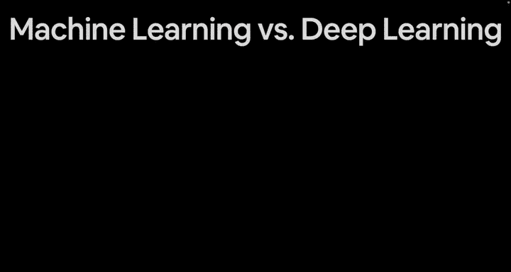
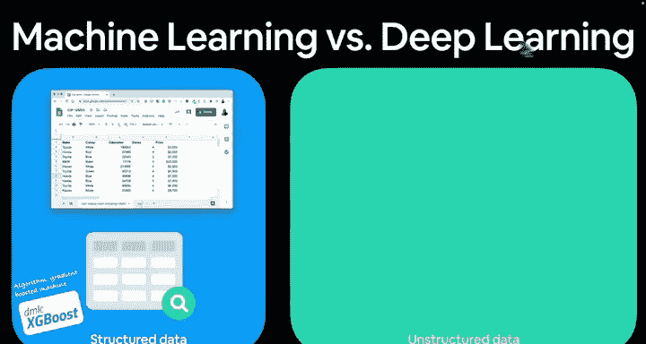
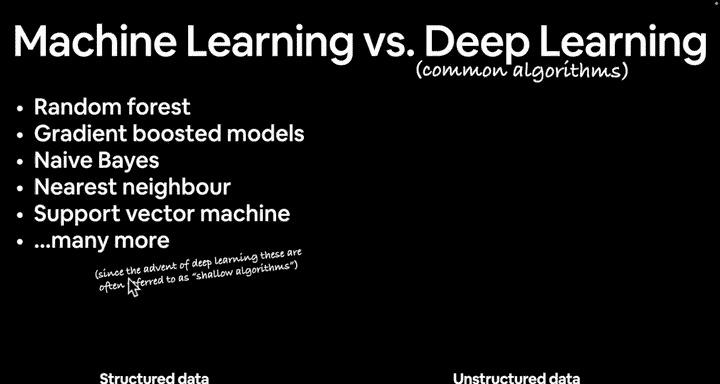
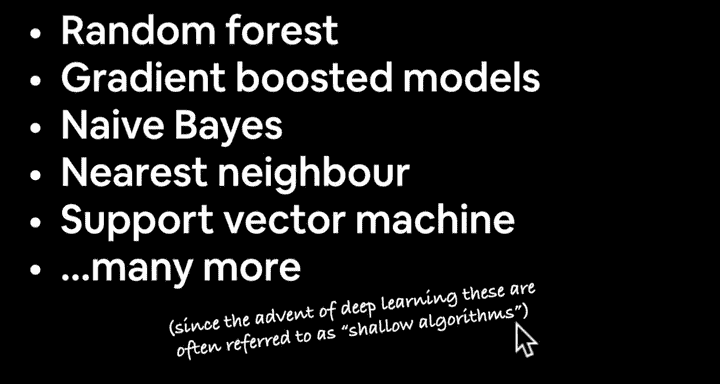
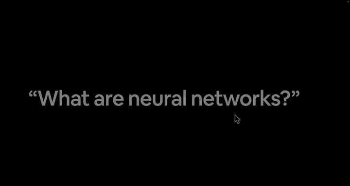

#  5：机器学习 vs 深度学习 🤖🧠

## 概述
在本节课中，我们将要学习机器学习与深度学习之间的主要区别，了解它们各自适用的数据类型和常见算法，并初步认识神经网络。

欢迎回来。在上一节视频中，我们介绍了深度学习擅长处理的任务以及它通常不擅长的领域。

接下来，让我们更深入地比较一下机器学习与深度学习。我会交替使用这些术语，但传统机器学习技术与深度学习之间确实存在一些特定的适用场景。不过，这些界限也在不断变化。因此，我并非在谈论绝对规则，而是一般情况。我鼓励你运用自己的好奇心去研究这两者之间的具体差异。





## 结构化数据 vs 非结构化数据

上一节我们介绍了两种技术的大致分野，本节中我们来看看它们各自最适合处理的数据类型。


通常，传统的机器学习算法适用于**结构化数据**。所谓结构化数据，指的是表格形式的数字数据，即由行和列组织的数据。

对于这类数据，目前最优秀的算法之一是**梯度提升机**，例如 **XGBoost**。这个算法在众多数据科学竞赛和实际生产环境中都备受青睐。这里的“生产环境”指的是你在互联网上可能交互或日常使用的应用程序。

**核心算法示例**：
```python
# 例如，使用 XGBoost 处理结构化数据
import xgboost as xgb
model = xgb.XGBClassifier()
```

相比之下，**深度学习**通常更擅长处理**非结构化数据**。非结构化数据指的是那些没有固定行列格式、形式多样的数据。

例如：
*   **自然语言**：比如一条推文：“如何学习机器学习？你需要听的是：学习Python，学习数学，从概率开始，学习软件工程，动手构建。你需要做的是：谷歌搜索，深入探索，6到9个月后重新评估。”
*   **大量文本**：例如维基百科上关于深度学习的定义。
*   **图像**：如果你想构建一个“汉堡拍照”应用，就需要处理图像数据。虽然图像本身没有明显的结构，但我们会看到，通过张量的魔力，深度学习可以赋予这类数据某种结构。
*   **音频文件**：例如你与语音助手对话时产生的数据。

对于非结构化数据，你通常会希望使用某种**神经网络**。

**核心概念总结**：
*   **结构化数据** -> 梯度提升机、随机森林等基于树的算法（如XGBoost）。
*   **非结构化数据** -> 神经网络。

## 常见算法对比

以下是两种范式下常见的算法示例。

对于**结构化数据（机器学习）**，常见的算法包括：
*   随机森林
*   梯度提升模型
*   朴素贝叶斯
*   K-近邻算法
*   支持向量机
*   以及更多其他算法

在深度学习兴起之后，这些算法常被称为“浅层”算法。

那么，为什么叫“深度学习”呢？正如我们将要看到的，深度学习模型可以包含许多不同的算法层，例如一个输入层、中间100个隐藏层，然后是一个输出层。我们稍后会动手实践。

对于**深度学习（神经网络）**，常见的架构包括：
*   全连接神经网络
*   卷积神经网络
*   循环神经网络
*   近年来占据主导地位的Transformer架构
*   当然，还有更多变体

深度学习和神经网络的美妙之处在于，其可应用的问题种类几乎与其可构建的架构方式一样多。





## 选择与艺术

这部分信息可能有些密集，特别是如果你对机器学习或深度学习经验不多的话。但好消息是，我们使用PyTorch重点构建的将是**全连接神经网络**和**卷积神经网络**，它们是深度学习的基础。令人兴奋的是，一旦我们掌握了这些基础构建模块，就能进一步探索其他类型的架构。

机器学习与深度学习既是科学，也是艺术。根据你如何定义问题以及问题本身的性质，上面列出的许多算法实际上可以交叉使用。

我知道这可能会让你感到困惑：一方面说这些用于深度学习，那些用于机器学习；另一方面又说根据情况两者都可能适用。这正是机器学习有趣的一部分——运用你的好奇心，为你正在处理的问题找到最佳方案。

## 总结
本节课中我们一起学习了机器学习与深度学习的主要区别。我们了解到，传统机器学习算法（如XGBoost）通常更适合处理**结构化数据**（表格数据），而深度学习神经网络则更擅长处理**非结构化数据**（如文本、图像、音频）。我们还列举了两者常见的算法，并认识到在实际应用中，选择哪种方法往往取决于具体问题，这既是科学也是艺术。

谈了这么多关于神经网络的内容，在下一个视频中，我们将探讨**什么是神经网络**。我建议你在观看下个视频前先谷歌搜索一下，因为关于神经网络的定义有成百上千种。我希望你开始形成自己对神经网络的理解。



下个视频见。😊