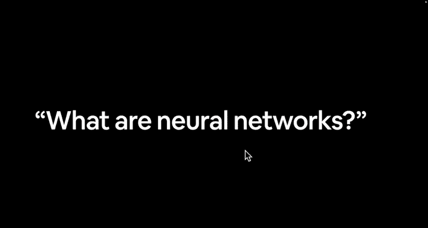
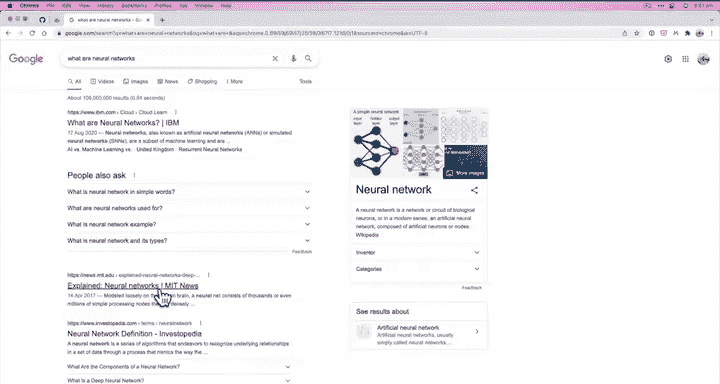
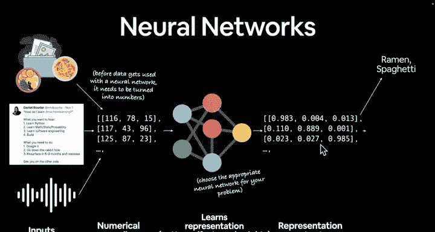
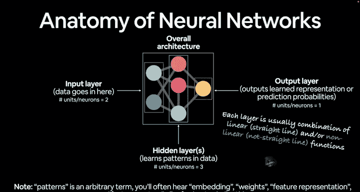
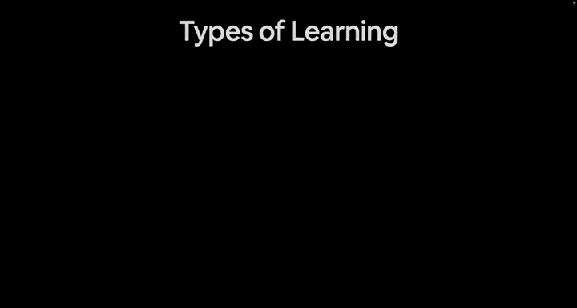

#  6：神经网络解剖学 🧠

在本节课中，我们将学习神经网络的基本构成。我们将了解数据如何被转换为数字，如何通过神经网络进行处理，以及最终如何输出人类可理解的结果。

---

欢迎回来。在上一个视频中，我留下了一个悬念问题：什么是神经网络？我给了你们一个挑战，去谷歌搜索这个问题。但你们可能已经搜索过了。让我们一起来搜索一下。

如果我输入“什么是神经网络”，我已经搜索过了。什么是神经网络？解释神经网络。神经网络定义。网上有数百个这样的定义，比如“五分钟了解神经网络”。3Blue1Brown频道。我强烈推荐那个关于神经网络的系列视频，那将是课外资料。StatQuest也非常棒。

这里有数百种不同的定义。你可以阅读10个、5个或3个定义，然后形成自己的理解。但为了本课程的目的，我将这样定义神经网络。

我们有一些数据。无论是什么数据，可能是食物图片、推文或自然语言，也可能是语音。这些是非结构化数据的输入示例，因为它们不是行和列。这些是我们拥有的输入数据。

那么，我们如何在神经网络中使用它们呢？在数据能被神经网络使用之前，需要将其转换为数字。因为人类喜欢看拉面和意大利面的图片。我们看到一两次就知道那是拉面，那是意大利面。我们喜欢阅读好的推文，喜欢听美妙的音乐或听朋友在电话里的音频文件。

然而，在计算机理解这些输入内容之前，需要将它们转换为数字。这就是我所说的数字编码或表示。这个数字编码，方括号表示它是矩阵或张量的一部分，我们将在本课程中大量接触。所以我们有输入，将其转换为数字。然后我们将其传入神经网络。

现在这是一个神经网络的图示。然而，神经网络的图示，正如我们将看到的，可能会变得相当复杂。但它们都代表相同的基本原理。

例如，如果我们看这个图示，有一个输入层，然后有多个隐藏层。你可以根据需要设计这些层。然后有一个输出层。所以我们的输入会以某种数据形式进入。隐藏层将对输入（即数字）执行数学运算，然后我们得到输出。

但回到这里。我们有输入，将其转换为数字，然后有我们的神经网络，我们将输入放入其中。这通常是输入层、隐藏层。你可以有任意多个不同的层。每个小点称为一个节点。这里有很多信息，但我们将动手看看这具体是什么样子。

然后我们有某种输出。你应该使用哪种神经网络呢？你可以为你的问题选择合适的神经网络，这可能涉及手动编码这些步骤中的每一步，或者你可以找到一个在类似问题上有效的神经网络。例如，对于图像，你可能使用CNN（卷积神经网络）；对于自然语言，你可能使用Transformer；对于语音，你可能也使用Transformer。但基本上，它们都遵循相同的原则：输入、处理、输出。

因此，神经网络将自行学习一种表示。我们不会定义它学习什么。所以它会以某种方式操纵这些模式。当我说学习表示时，我也会称之为学习数据中的模式。很多人称之为特征。特征可能是“do”这个词在多种语言中通常跟在“how”后面。特征几乎可以是任何东西。同样，我们不定义这个，神经网络自行学习这些表示、模式或特征，也称为权重。

然后我们从那里去哪里呢？我们有一些数字，数字编码将我们的数据转换为数字。我们的神经网络学习了一种它认为最能代表我们数据模式的表示，然后输出那些表示输出，我们可以使用。你经常会听到这被称为特征、权重矩阵、权重张量，学习表示也是另一个常见的术语。这些东西有很多不同的术语。

然后，它将输出。我们可以将这些输出转换为人类可理解的输出。所以如果我们看这些，这些可能又是表示或模式。一个神经网络单独可以有数百万个数字。这里只有9个。想象一下，如果这些是数百万个不同的数字，我几乎无法理解这里的9个数字。所以我们需要一种方法将这些转换为人类可理解的术语。

对于这个例子，我们可能有一些输入数据，即食物图片，然后我们希望我们的神经网络学习拉面图片和意大利面图片之间的表示，最终我们将利用它学到的模式，并将其转换为它认为这是拉面图片还是意大利面图片。或者对于这条推文，这是关于自然灾害的推文还是非自然灾害的推文。

所以我们的神经网络已经……我们已经编写了代码将其转换为数字，通过我们的神经网络传递。我们的神经网络学习了一些模式，然后我们理想地希望它将这条推文表示为非灾害。然后我们可以编写代码来执行这里的每一步。对于这些作为语音的输入也是如此，将其转换为你可能对你的智能音箱说的话，我不会说出来，因为我的一堆设备可能会启动。

---

## 神经网络的解剖结构

我们已经暗示过这一点，但这是神经网络解剖学101。同样，这个东西实际上是高度可定制的。我们稍后将在PyTorch代码中看到它。

数据进入输入层，在这种情况下，单元/神经元/节点的数量是2。

隐藏层，你可以有多个。我在这里加了一个“s”，因为你可以有一个隐藏层，而深度学习中的“深度”来自于拥有很多层。这里只显示了四个层。你可能拥有非常深的神经网络，例如ResNet-152。它有152个不同的层。所以，哦，这是ResNet-34，但ResNet-152有152个不同的层。顺便说一下，这是一个常见的或流行的计算机视觉算法。我们在这里抛出了很多术语，但随着时间的推移，你会开始熟悉它们。

所以隐藏层几乎可以是你想要的任意多个。我们这里只画了一个。在这种情况下，有三个隐藏单元/神经元。

然后我们有一个输出层。所以输出是学习到的表示或来自这里的预测概率，取决于我们如何设置，我们稍后会看到这些是什么。在这种情况下，它有一个输出单元。所以是2个输入，3个隐藏，1个输出。你可以自定义这些的数量。你可以自定义有多少层，你可以自定义这里输入什么，你可以自定义那里输出什么。

现在，如果我们讨论整体架构，这是描述所有层的组合。所以当你听到神经网络架构时，它谈论的是输入层、隐藏层（可能不止一个）和输出层。这就是整体架构的术语。

我说模式是一个任意的术语。你可能会听到嵌入，嵌入可能来自隐藏层、权重、特征表示、特征向量，所有这些都指类似的东西。所以再次强调，我们如何将数据转换为某种数字形式？构建一个神经网络来找出模式，以输出我们想要的期望输出。

现在，为了更技术性一些，每一层通常是线性和非线性函数的组合。我的意思是，线性函数是一条直线，非线性函数是一条非直线。如果我让你用无限多的直线和非直线画任何你想画的东西，你可以使用直线或曲线，你能画出什么样的模式？在基本层面上，这基本上就是神经网络正在做的事情。它使用直线和非直线的组合来绘制我们数据中的模式。我们稍后会看到这是什么样子。

---

## 总结

在本节课中，我们一起学习了神经网络的基本解剖结构。我们了解到神经网络通过将输入数据转换为数字表示，经过多个隐藏层的数学运算（结合线性和非线性函数），最终输出学习到的模式或预测结果。神经网络的架构（包括输入层、隐藏层和输出层）可以根据具体问题高度定制。下一节，我们将简要探讨不同类型的学习范式。