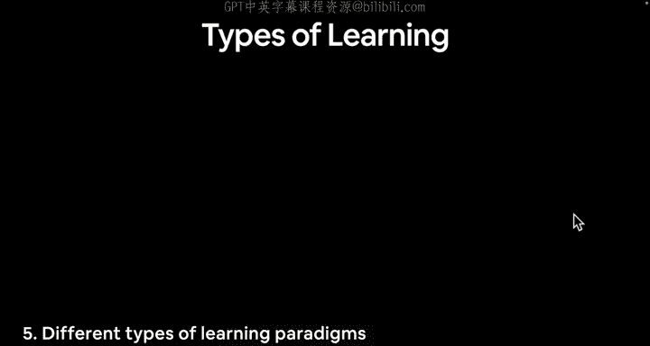
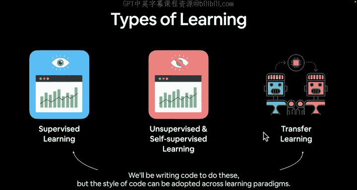
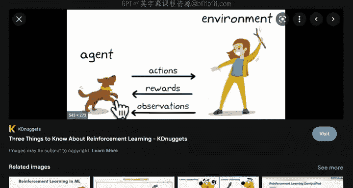
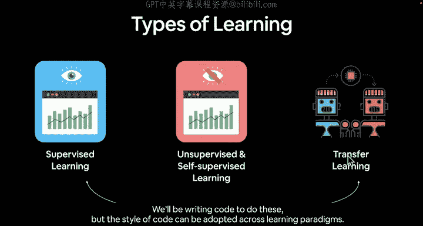
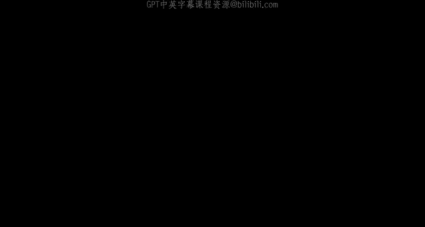

#  7：不同的学习范式 🧠

在本节课中，我们将要学习深度学习中几种核心的学习范式。理解这些范式是构建有效机器学习模型的基础。

上一节我们简要介绍了神经网络的基本构成，本节中我们来看看几种不同的学习方式。

## 概述：主要学习范式

深度学习主要围绕几种范式展开。以下是三种关键范式：

1.  **监督学习**
2.  **无监督与自监督学习**
3.  **迁移学习**

---

## 1. 监督学习 📝

监督学习是指你同时拥有**数据**和**标签**。

例如，在本课程开始时提到的例子：构建一个神经网络或机器学习算法来学习烹饪西西里祖母著名烤鸡的规则。在监督学习中，你会拥有大量数据（输入，如蔬菜和鸡肉等原材料）以及这些输入在理想状态下应该是什么样子的许多示例。

另一个例子是区分猫和狗的照片。你可能拥有1000张猫的照片和1000张狗的照片，并且你知道哪些照片是猫，哪些是狗。你将把这些照片传递给一个机器学习算法进行区分。

在这种情况下，你拥有数据（照片）和标签（每张照片对应的“猫”或“狗”）。

**核心概念**：监督学习 = **数据 + 标签**

---

## 2. 无监督与自监督学习 🔍

无监督和自监督学习是指你只有**数据本身**，没有任何标签。

以猫狗照片为例，你只有照片，没有“猫”或“狗”的标签。在自监督学习中，你可以让机器学习算法学习数据的内在**表示**。

> 当我提到“表示”时，我指的是模式、数字、权重、特征等，这些是描述同一事物的不同名称。

你可以让一个自监督学习算法找出狗和猫图像之间的基本模式，但它不一定知道两者之间的区别。之后，你可以介入并说：“展示你学到的模式。”它可能会展示这些模式，然后你可以判断：“看起来像这样的模式是狗，看起来像那样的模式是猫。”

因此，自监督和无监督学习**仅基于数据本身**进行学习。

---

## 3. 迁移学习 🚀

迁移学习是深度学习中一个非常重要的范式。

它指的是将一个模型在某个数据集上学到的**模式**，迁移到另一个模型中。

例如，如果我们试图构建一个用于区分猫狗照片的监督学习算法，我们可能会从一个已经学习过图像模式的模型开始，然后将这些基础模式迁移到我们自己的模型中，从而使我们的模型获得一个“先发优势”。

**核心概念**：迁移学习 = **复用已学模式** + **加速新任务学习**

迁移学习是一种非常强大的技术。在本课程中，我们将编写代码来重点学习**监督学习**和**迁移学习**，这是机器学习和深度学习中两种最常见的范式。当然，这种代码风格也可以适应不同的学习范式。

---

## 扩展：强化学习 🎮

还有一种范式值得单独一提，那就是**强化学习**。我将其留作扩展内容，供你自行查阅。

简单来说，强化学习的核心思想是：你有一个**环境**和一个在该环境中执行**动作**的**智能体**，然后你向该智能体提供**奖励**和**观察**反馈。

例如，如果你想教你的狗在室外小便，你会奖励它在室外小便的行为，可能不会奖励它在你的沙发上小便的行为。

因此，强化学习自成一体。下图很好地解释了无监督学习、监督学习（用于区分事物）以及强化学习（类似于奖励机制）之间的区别。

> 再次说明，我建议你在自己的时间里进一步研究不同的学习范式。

正如所说，本课程将重点编写代码来实现**监督学习**和**迁移学习**，特别是使用 PyTorch 框架。

---

## 挑战与预告 🎯

现在，我们已经涵盖了这些概念。接下来，让我们看几个深度学习实际应用的例子。

在进入下一个视频之前，我要向你提出一个挑战：**自行搜索“深度学习目前有哪些用途？”这个问题，并提出一些你自己的看法。**

尝试一下吧，我们下个视频见！

---

## 总结

本节课中我们一起学习了深度学习的几种核心范式：
*   **监督学习**需要带标签的数据进行训练。
*   **无监督/自监督学习**仅从数据本身发现模式。
*   **迁移学习**通过复用已有模型的知识来加速新任务的学习。
*   **强化学习**则通过智能体与环境的交互，基于奖励来学习最优策略。

理解这些范式将帮助你为不同的问题选择合适的机器学习方法。