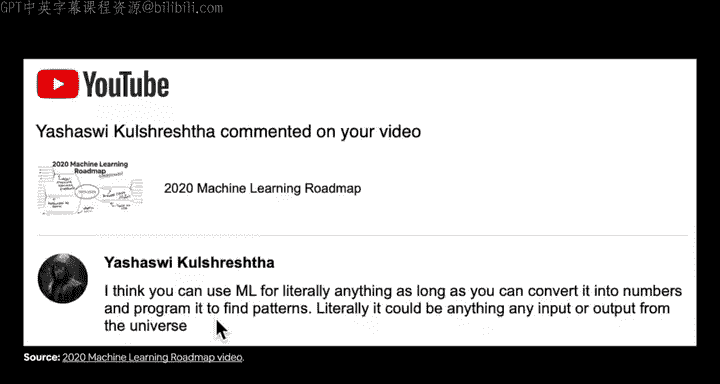
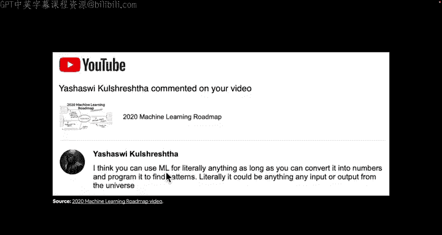
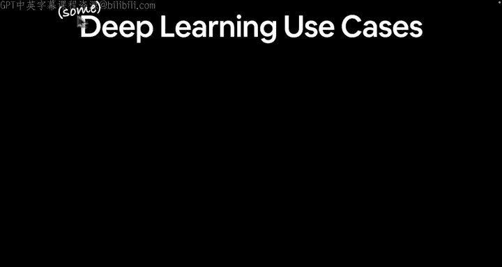
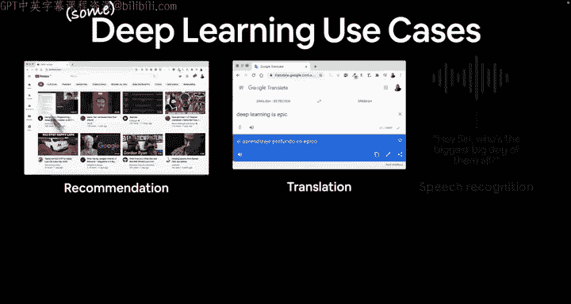
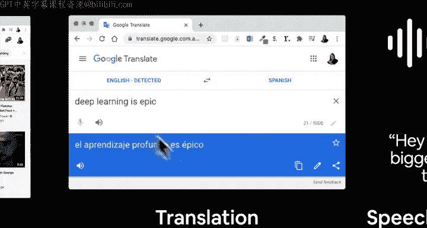
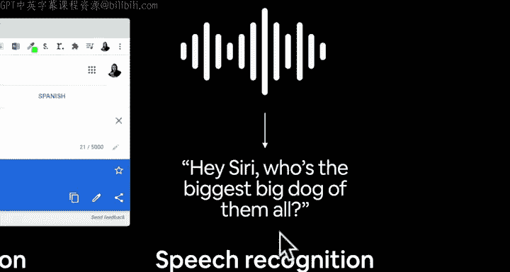
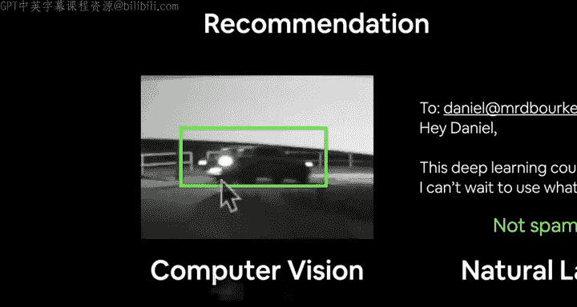
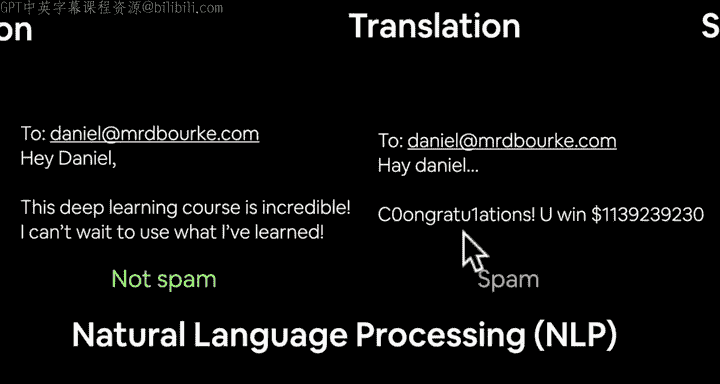
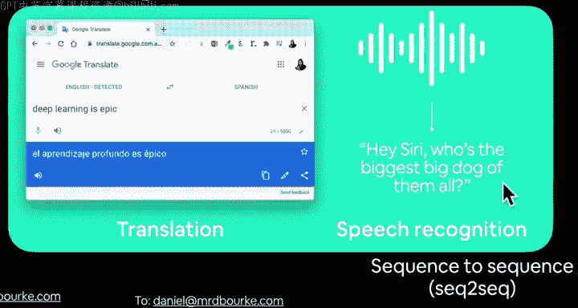
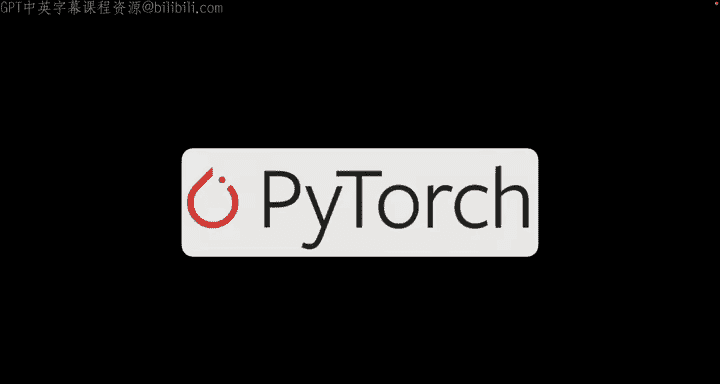

#  8：深度学习能做什么？🤖

在本节课中，我们将探讨深度学习的具体应用领域。我们将了解深度学习如何被用于解决现实世界中的问题，并理解其背后的核心概念。

---

上一节我们介绍了深度学习的基础，本节中我们来看看深度学习的具体应用场景。

Yasha Sui 在 2020 年机器学习路线图视频中的评论很好地总结了这一点：只要你能将事物转化为数字并编程让其寻找规律，你就可以将机器学习（ML）用于几乎任何事情。深度学习作为机器学习的一部分，同样遵循这个原则。机器学习是艺术与科学的结合，科学家希望实验成功，而艺术家则对“可能成功，也可能失败”的探索过程感到兴奋。请记住机器学习的第一条规则：如果不需要，就不要使用它；但如果使用，它几乎可以用于任何事情。

---

现在，让我们具体了解一些深度学习的应用案例。以下是我日常生活中接触到的一些例子：

*   **推荐系统**：例如 YouTube 的推荐页面，它由深度学习驱动。
*   **翻译**：近十年来，机器翻译质量显著提升，这同样得益于深度学习。
*   **语音识别**：例如谷歌翻译的语音功能或智能语音助手，它们都运用了深度学习技术。
*   **计算机视觉**：例如通过摄像头进行物体检测。一个具体的例子是，如果我的车载摄像头配备了计算机视觉算法，它就能自动检测到撞车事件并识别车牌。
*   **自然语言处理**：例如电子邮件中的垃圾邮件过滤器，它能有效区分正常邮件和垃圾邮件。

---

如果我们将这些问题稍作分类，可以归纳为以下几种类型：

*   **序列到序列**：输入一个序列，输出另一个序列。例如机器翻译（文本到文本）和语音识别（音频到文本）。
*   **回归**：预测一个数值。例如在物体检测中，预测边界框的角点像素坐标。公式可以表示为：`边界框坐标 = 模型(图像像素)`。
*   **分类**：预测某个事物属于哪个类别。例如垃圾邮件检测（“正常邮件”或“垃圾邮件”）。在代码中，这通常体现为：`预测类别 = 模型(输入特征)`。

---

本节课中我们一起学习了深度学习的多种应用，包括推荐系统、翻译、语音识别、计算机视觉和自然语言处理。我们还了解了如何将这些应用归类为序列到序列、回归和分类问题。现在，我们已经为课程打下了基础，接下来就让我们开始学习 PyTorch 吧。我们下个视频见。