#  9：什么是 PyTorch 以及为何选择它？🤔

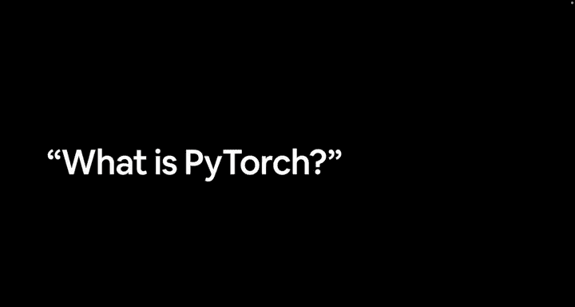

在本节课中，我们将学习 PyTorch 的基础知识。我们将了解 PyTorch 是什么，它为何在深度学习领域如此流行，以及它如何帮助我们利用 GPU 加速代码。课程最后，我们将为下一节关于张量的内容做好准备。

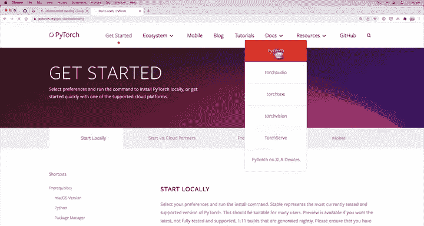

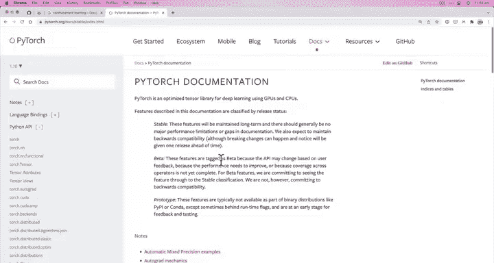

## 什么是 PyTorch？🔍

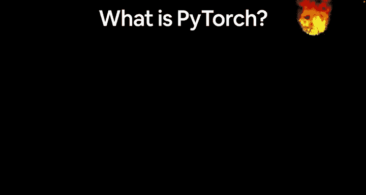

首先，你可能会问，PyTorch 是什么？当然，我们可以直接访问 PyTorch 的官方网站 `pytorch.org` 来寻找答案。

这是 PyTorch 的主页。本课程并非要替代该网站上的所有内容。这个网站应是你了解 PyTorch 一切信息的权威来源。从这里，你可以开始了解其庞大的生态系统、本地安装方法、各种资源、文档、GitHub 仓库、搜索功能、博客等等。在学习本课程并编写 PyTorch 代码的过程中，这个网站应是你最常访问的地方。

但为了本课程的目的，让我们来分解一下 PyTorch 的核心。

PyTorch 是最流行的研究用深度学习框架。它允许你用 Python 编写快速的深度学习代码。如果你熟悉 Python，就会知道它是一种非常用户友好的编程语言。PyTorch 使我们能够用 Python 编写最先进的深度学习代码，并利用 GPU 进行加速。

它让你能够访问 Torch Hub 上的许多预构建深度学习模型。Torch Hub 是一个包含大量模型的网站。如果你还记得，迁移学习是一种利用他人训练的深度学习模型来赋能我们自己项目的方法。Torch Hub 就是实现这一目标的资源库，Torchvision 模型库也是如此，我们将在课程中详细探讨。

PyTorch 为机器学习的整个流程栈提供了一个生态系统：从数据预处理开始，将数据转换为张量。例如，如果你有一些图像，如何将它们表示为数字？然后，你可以构建模型，如神经网络，来对这些数据进行建模。最后，你甚至可以将模型部署到你的应用程序或云环境中。当然，具体部署方式取决于你使用的云平台，但通常都会运行某种 PyTorch 模型。

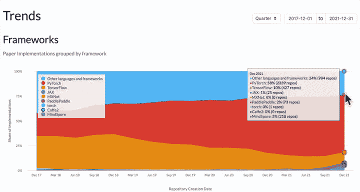

PyTorch 最初由 Facebook（现已更名为 Meta）内部设计和使用的，但现在它已开源，并被特斯拉、微软和 OpenAI 等公司广泛采用。

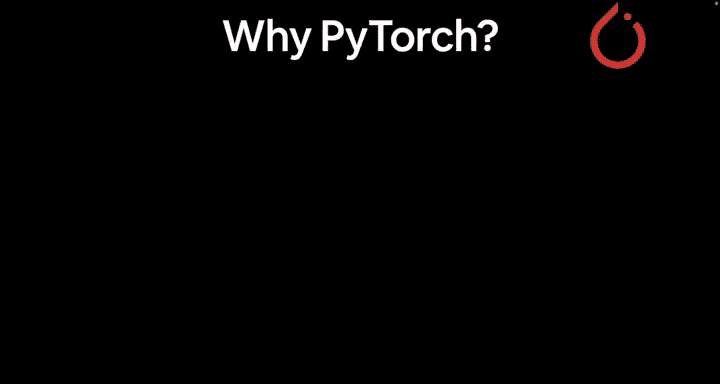

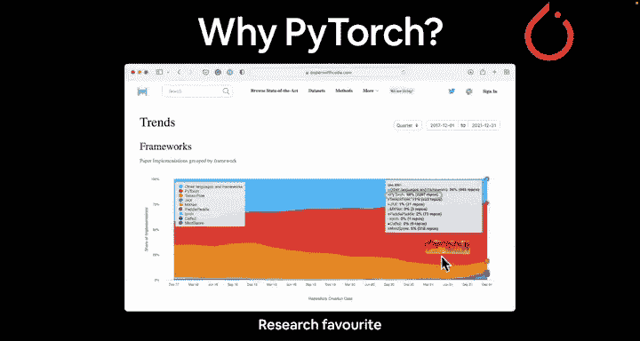

当我说 PyTorch 是最流行的深度学习研究框架时，并非空口无凭。让我们看看 `paperswithcode.com/trends` 这个网站的趋势数据。如果你不了解 Papers with Code，它是一个追踪最新、最优秀机器学习论文的网站，并会标注论文是否附有代码。

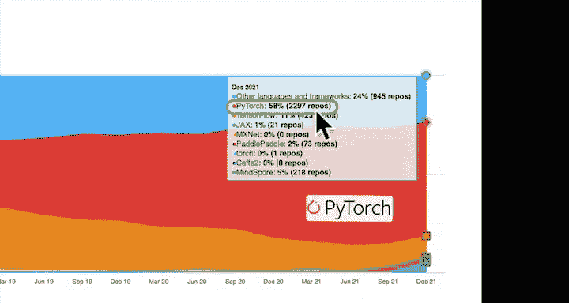

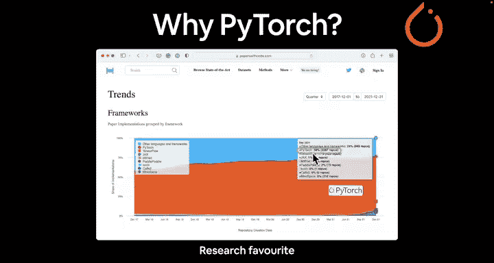

该网站追踪了其他深度学习框架，如 TensorFlow、JAX、MXNet、PaddlePaddle，以及更早的 Torch（PyTorch 是其基于 Python 的演进版本）。截至 2021 年 12 月的数据显示，PyTorch 以 58% 的占比遥遥领先。这意味着，在用于实现最先进机器学习算法的代码框架中，PyTorch 是迄今为止最受欢迎的研究用机器学习框架。

在 Papers with Code 网站追踪的 65,000 篇论文中，有 58% 使用 PyTorch 实现。这正是我们要学习的内容。

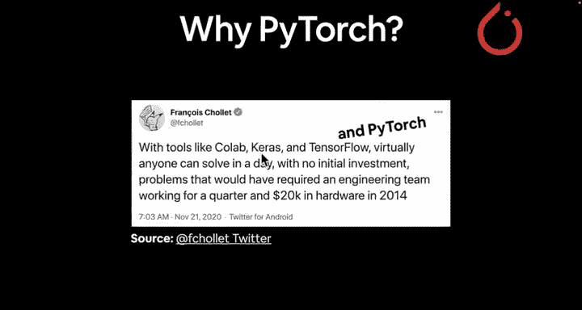

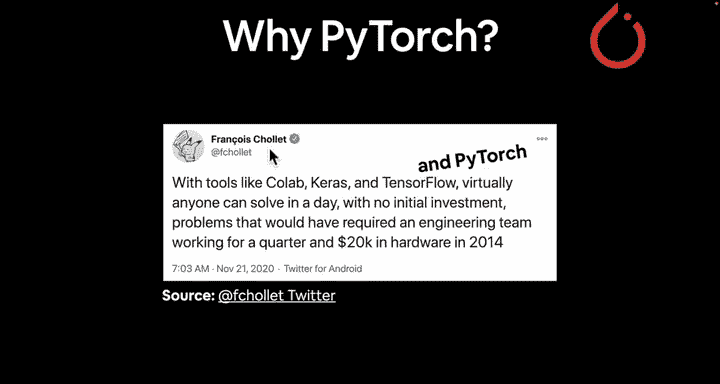

## 为何选择 PyTorch？🚀

除了我们刚刚讨论过的原因，PyTorch 是研究领域的最爱。这一点在数据中得到了凸显：近 58% 的代码仓库使用 PyTorch。如果你不清楚“仓库”是什么，它是在线存储所有代码的地方。通常，如果一篇机器学习论文发表了优秀的研究成果，它会附带可供你访问和用于自己应用或研究的代码。

以下是选择 PyTorch 的更多理由。看看这些正在使用 PyTorch 的地方，它几乎无处不在。

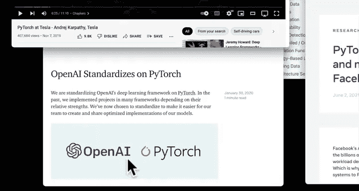

*   **特斯拉**：特斯拉的人工智能总监 Andrej Karpathy 曾表示，特斯拉使用 PyTorch 来构建其自动驾驶系统的计算机视觉模型。
*   **OpenAI**：作为世界上最大的人工智能研究实体之一，OpenAI 已标准化使用 PyTorch。他们在 2020 年 1 月的博客文章中宣布了这一点。
*   **广泛的生态系统**：有一个名为“The Incredible PyTorch”的仓库，收集了大量基于 PyTorch 构建的项目。PyTorch 的美妙之处在于你可以在其基础上进行构建。例如，在农业领域，有农业机器人使用 PyTorch 进行目标检测，以识别需要施肥的杂草类型。
*   **Meta (Facebook)**：Meta AI 在内部将所有机器学习应用都基于 PyTorch。
*   **微软**：微软在 PyTorch 生态中扮演着重要角色。

如果这些还不足以成为你使用 PyTorch 的理由，那么也许你选错了课程。除了上述原因，我还要再补充一个关键点：它能帮助你在 GPU 上加速运行机器学习代码。

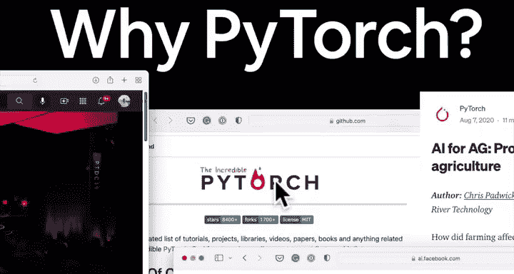

## GPU 加速与 CUDA ⚡

GPU 是图形处理单元，最初为电子游戏设计，本质上非常擅长快速处理数字运算。PyTorch 的美妙之处在于，它允许你通过一个名为 CUDA 的接口来利用 GPU。

CUDA 是一个并行计算平台和应用程序编程接口。它允许软件使用特定类型的图形处理单元进行通用目的计算，而这正是我们所需要的。PyTorch 利用 CUDA 使你能在 NVIDIA GPU 上运行机器学习代码。

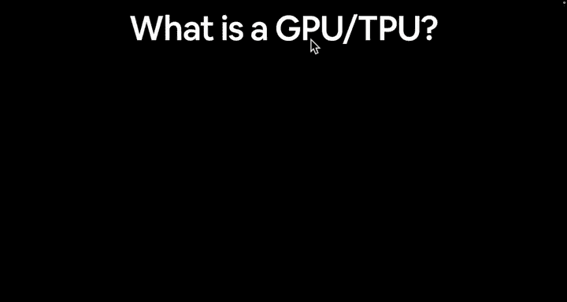

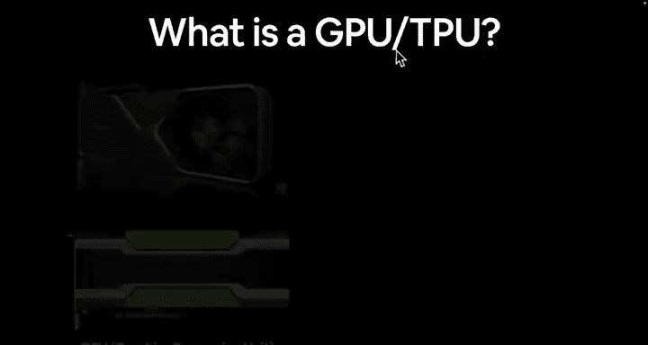

当然，也存在在 TPU 上运行 PyTorch 代码的能力。TPU 是张量处理单元。然而，在实践中，GPU 远比 TPU 更常见，因此我们将重点学习如何在 GPU 上运行 PyTorch 代码。

这些芯片之所以被称为“张量”处理单元，是因为机器学习和深度学习大量处理的对象就是张量。

## 总结与下节预告 📚

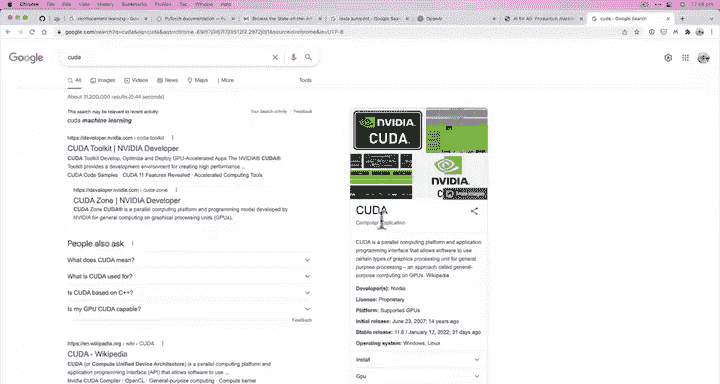

本节课我们一起学习了 PyTorch 的基础知识。我们了解到 PyTorch 是一个强大且流行的开源深度学习框架，它基于 Python，拥有丰富的生态系统和预训练模型，并被众多顶尖公司和研究机构广泛使用。其核心优势之一是能够便捷地利用 GPU 进行加速计算，这通过 CUDA 接口实现。

在进入下一个主题之前，我想请你先自行研究一个问题：什么是张量？请打开你常用的搜索引擎，输入“what is a tensor”，看看你能找到什么答案。

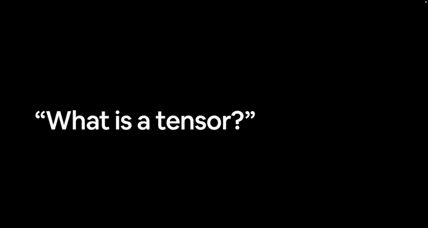

我们下个视频再见，届时将详细解答“什么是张量”这个问题。