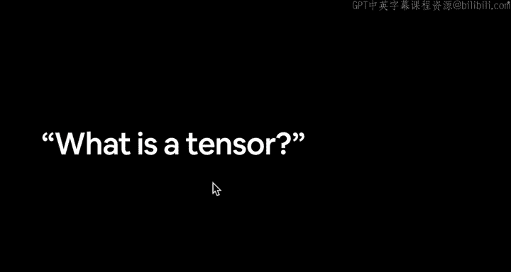
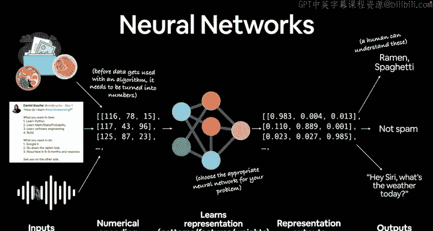
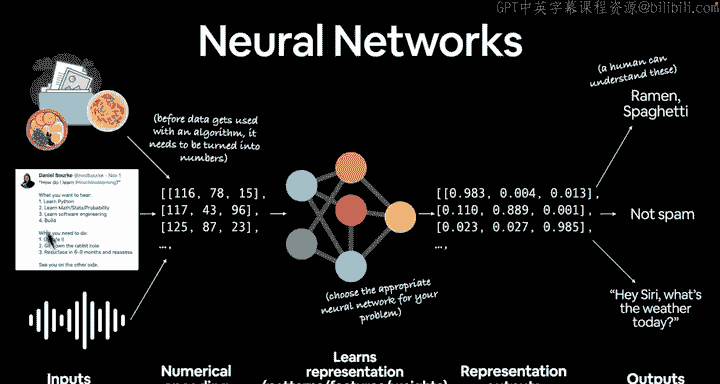
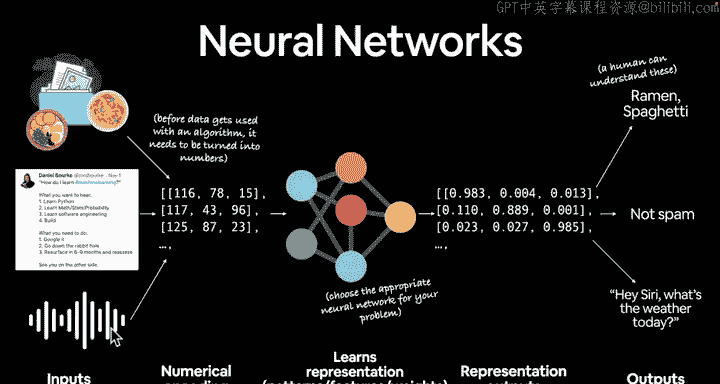
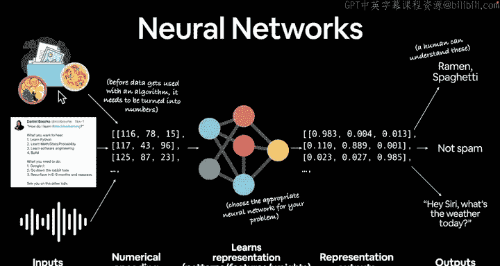
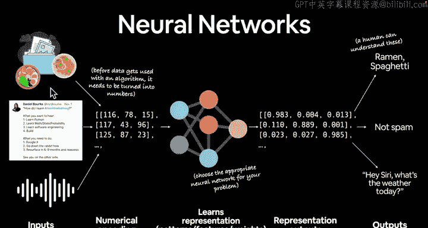
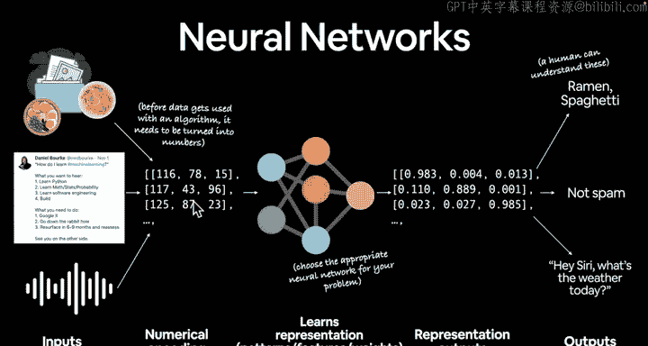
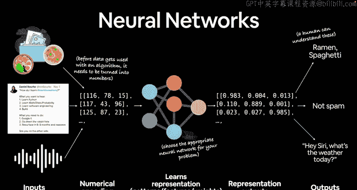
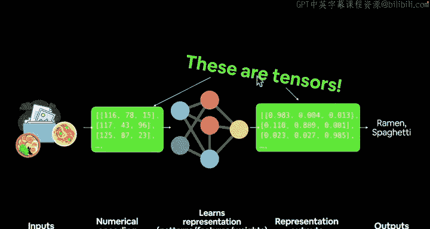

#  10：什么是张量？🧮

在本节课中，我们将要学习深度学习的核心数据结构——张量。我们将探讨张量的定义、作用，以及它在神经网络中扮演的角色。

上一节我们介绍了深度学习和神经网络的基本概念，本节中我们来看看构成这些模型的基础元素：张量。

## 什么是张量？

在上一视频结束时，我留下了一个悬念问题：什么是张量？我也向你们发出了挑战，让你们自己去研究什么是张量。正如我所说，这门课程的目的并非直接告诉你所有事物的确切定义，而是更多地激发你的好奇心，让你自己发现这些问题的答案。

让我们来看一看。什么是张量？如果你还记得这张图，这里展示的是我们的神经网络。我们有某种输入，某种数字编码。

在我们的案例中，我们从这个数据开始。它是非结构化数据，因为我们这里有图像、文本和音频文件。这些数据不一定同时全部输入。

这个图像可以专注于专门处理图像的神经网络。这个文本可以专注于专门处理文本的神经网络。这个声音片段或语音可以专注于专门处理语音的神经网络。然而，该领域也在朝着构建能够处理所有三种输入类型的神经网络发展。

目前，我们将从小处着手，然后逐步构建算法。我们将专注于处理单一类型数据的神经网络。

但前提仍然相同。你有某种输入。你必须以某种形式对其进行数字编码，将其传递给神经网络，以学习该数字编码中的表示或模式。

输出某种形式的表示，然后我们可以将该表示转换为人类可以理解的事物。

你可能已经见过这些，我也可能已经提到过，这些就是张量。因此，当问题出现时，什么是张量？张量几乎可以是任何东西，它几乎可以是数字的任何表示形式。

我们将非常实际地操作张量。这实际上是 PyTorch 深度学习的基本构建模块。神经网络组件的基础是 `torch.Tensor`。我们很快就会看到它。

但这是一个非常重要的要点：你有一些输入数据。你将对该数据进行数字编码，将其转换为某种张量。具体是哪种张量取决于你正在处理的问题。

然后，你将把它传递给一个神经网络，该网络将对该张量执行数学运算。这些数学运算中的许多都由 PyTorch 在幕后处理。因此，我们将编写代码来对这些张量执行某种数学运算。

我们创建的神经网络，或者我们为问题使用的现成神经网络，将输出另一个张量。这个张量与输入类似，但已按照我们编程的方式进行了某种操作。然后，我们可以将这个输出张量转换为人类可以理解的东西。

为了更清晰，我们去掉周围的文字。

如果我们专注于构建一个图像分类模型，我们想分类这张照片是拉面还是意大利面，我们将以图像作为输入，将这些图像转换为由张量表示的数字。我们将这个数字张量传递给神经网络。这里可能有很多张量，我们可能有 10,000 张图像，也可能有一百万张图像，或者在某些情况下，如果你是谷歌或 Facebook，你可能一次处理 3 亿或 10 亿张图像。

原则仍然成立：你将数据编码为某种数字表示形式，即张量，将该张量或多个张量传递给神经网络。神经网络对这些张量执行数学运算。输出一个张量，我们将该张量转换为人类可以理解的东西。

说到这里，我们已经涵盖了许多基础知识。什么是机器学习？什么是深度学习？什么是神经网络？我们已经触及了这些事物的表面。你可以根据自己的兴趣深入研究。我们已经介绍了为什么使用 PyTorch。什么是 PyTorch。现在，深度学习的基本构建模块是张量。我们已经介绍了这一点。

在下一个视频中，让我们更具体地了解我们将在第一个模块中从代码层面涵盖的内容。我非常兴奋。我们很快就要开始写代码了。😊

下个视频见。

现在是时候具体说明我们将在代码层面涵盖的内容了。😡

---

本节课中我们一起学习了张量的核心概念。我们了解到张量是数据的数字表示形式，是神经网络处理的基本单位。它可以是标量、向量、矩阵或更高维度的数组。在 PyTorch 中，张量通过 `torch.Tensor` 类实现，是构建和训练深度学习模型的基础。我们看到了数据如何被编码为张量，输入神经网络进行数学运算，并最终输出人类可理解的结果。下一节，我们将开始动手编写代码，实际操作张量。