#  11：大纲与学习方法 📚

在本节课中，我们将概述整个PyTorch基础模块的学习内容，并介绍一种高效的学习方法。我们将了解课程的核心主题，并学习如何像机器学习工程师一样，通过主动搜索来解决问题。

---

## 概述

在基础模块中，我想重申上一个视频中提出的挑战：去查找“张量（tensor）是什么”。这正是我会采取的做法。

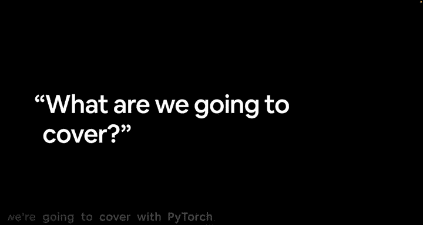

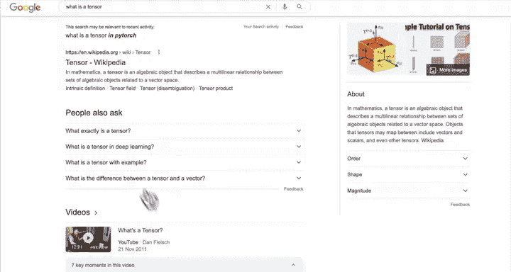

我会打开谷歌，输入问题：“What is a tensor in PyTorch?”。谷歌知道我们想了解PyTorch中的张量是什么。但张量是一个非常通用的概念，并非仅与PyTorch相关。

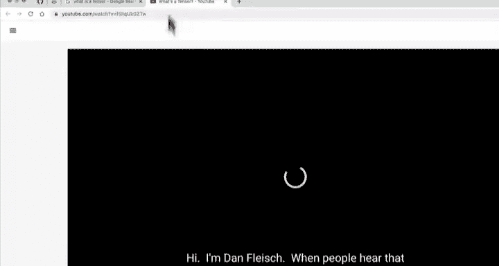

现在，我们可以在维基百科上找到“张量”的词条。此外，还有一个关于“什么是张量”的视频，由Dan Fleisch讲解，这可能是我最喜欢的解释视频。

观看这个视频将是本视频和上一个视频的额外学习任务。你可能会想，我是来学习PyTorch的，为什么讲师（或你，Daniel）总是在遇到问题时去谷歌搜索，而不是直接告诉我答案？

如果我要告诉你关于深度学习、机器学习、PyTorch的一切，这个课程会变得无比冗长。我这样做是故意的。我故意搜索这类问题，因为这正是我作为一名机器学习工程师的日常工作方式。

我编写代码，就像我们即将要做的那样。如果遇到不懂的东西，我 literally 会打开搜索引擎（通常是谷歌），输入我遇到的错误，或者搜索“PyTorch 张量是什么”之类的问题。

因此，我不仅要告诉你搜索这类问题是完全可以的，而且要鼓励你这样做。请在整个课程中记住这一点，你会经常看到我这么做。

现在，让我们进入正题，看看我们将要涵盖哪些内容。

## 学习路径参考

这里有一张来自埃隆·马斯克的推文图片。我决定，让我们以这条推文为基础来构建整个课程。

图片展示了学习机器学习和深度学习的几种途径：
*   **大学课程**：让你拥有一个小脑袋。
*   **在线课程**（比如本课程）：脑袋开始膨胀。
*   **YouTube视频**：如果你在YouTube上看这个，脑袋会像放烟花一样。
*   **文章**：天啊，脑袋简直要炸了。
*   **本课程提供的在线书籍格式**：幸好有这个课程。

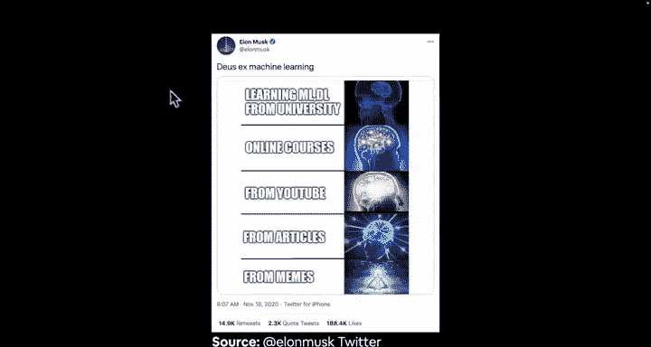
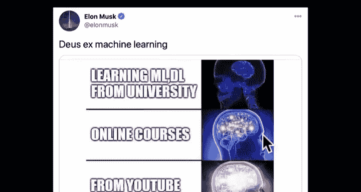
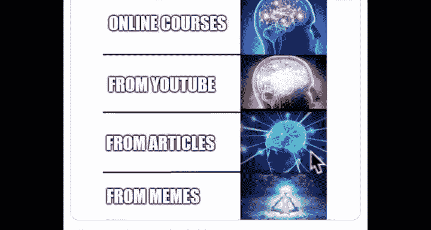

所有课程材料都以在线书籍的形式提供，网址是 `learnpytorch.io`。我们很快就会深入这个基础部分。如果你想参考，课程材料就是基于这本书构建的。到你观看时，这里可能会有更多章节。我们正在覆盖所有基础。

最后，通过**梗图（memes）**，你将晋升到某种“神级”理解。我认为这就是学习机器学习的最佳方式。所以，我们将从大学课程、在线课程、YouTube、文章，甚至梗图中汲取营养。不，不完全是，但也有点像。

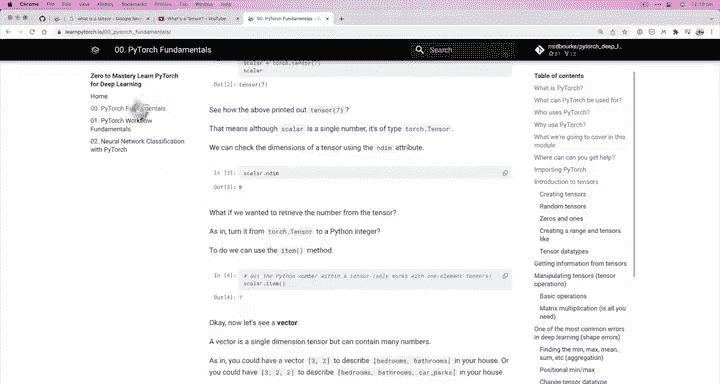
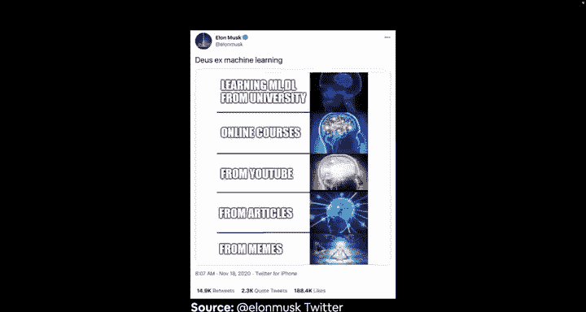
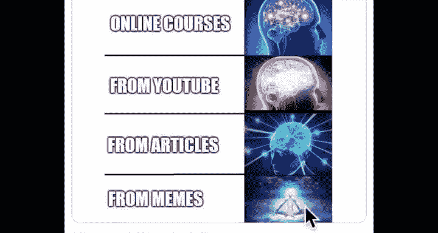
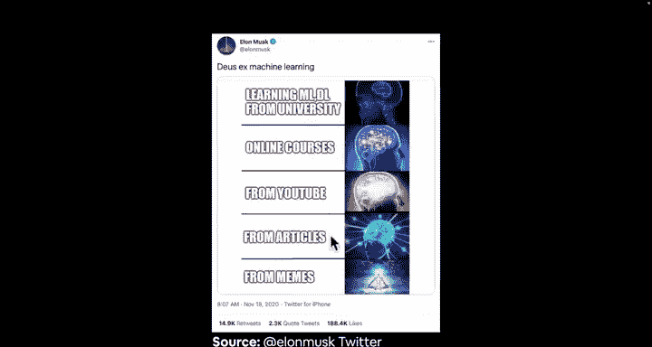

## 本模块涵盖内容

现在，在这个模块中，我们将广泛涵盖以下内容：

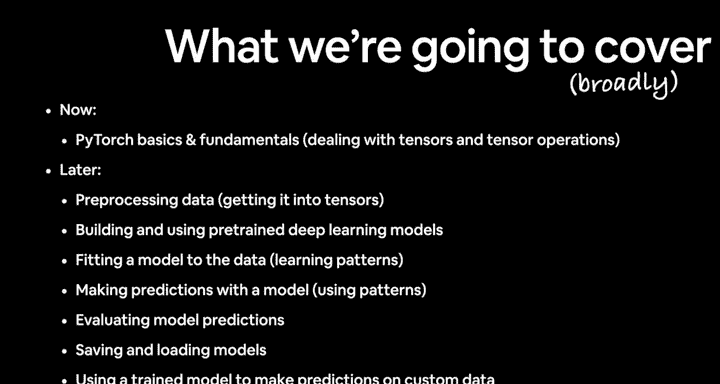

我们将学习PyTorch的基础和核心，主要处理**张量（tensors）**和**张量运算**。请记住，神经网络就是关于输入张量、对这些张量执行操作并产生输出张量。

随后，我们将专注于**数据预处理**，将原始数据（如图像）转换为数值编码，也就是张量。

接着，我们将学习**构建和使用预训练的深度学习模型**，特别是神经网络。我们将让模型拟合数据，即编写代码让模型学习我们预处理过的数据中的模式。

我们将看到如何用我们的模型进行**预测**，因为深度学习和机器学习的核心就是利用过去的模式预测未来。

然后，我们将**评估模型的预测结果**。

我们将学习如何**保存和加载模型**，例如，如果你想将模型从开发环境导出到应用程序中。

最后，我们将学习如何使用训练好的模型对我们自己的、自定义的数据进行预测，这非常有趣。

图片中的科学家形象有些淡出，但这并不完全准确。我们将像厨师而不是化学家那样工作。化学家非常精确，一切都必须分毫不差。而厨师则更像：“嗯，加点这个，来点黄油。味道好吗？好的，那就行了。”但机器学习两者都有一点。

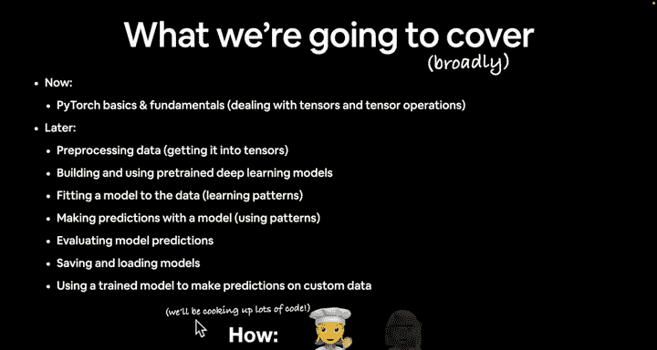
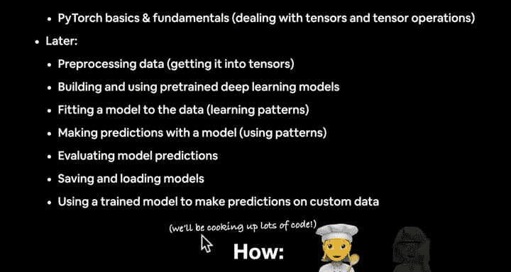

一点科学，一点艺术。这就是我们的做法。我喜欢把它想象成一个机器学习烹饪节目。欢迎来到“与Daniel一起烹饪机器学习，烹饪PyTorch”。

## PyTorch工作流程

最后，我们有一个PyTorch工作流程，这是众多流程中的一种。我们将在整个课程中使用这个流程。

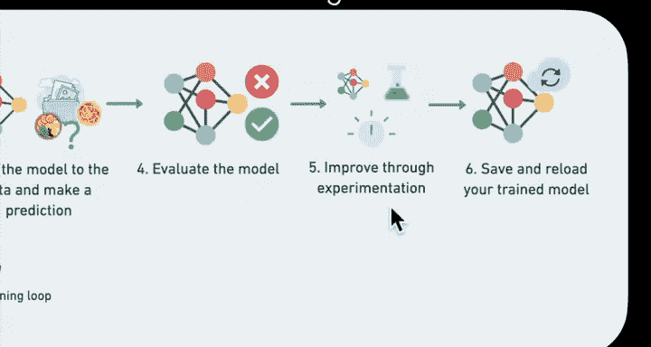

以下是步骤：

**步骤 1**：准备数据。

**步骤 2**：构建或选择一个适合我们处理问题的预训练模型。
*   **步骤 2.1**：选择损失函数和优化器。别担心它们是什么，我们很快就会讲到。
*   **步骤 2.2**：构建训练循环。这基本上是步骤2的一部分，所以有2.1和2.2。稍后你会明白这意味着什么。

**步骤 3**：将模型拟合到数据并进行预测。例如，如果我们正在做拉面或意大利面的图像分类，我们如何构建神经网络，或将图像输入该网络，以获得图像内容的某种判断。

**步骤 4**：评估模型，看它的预测是“垃圾”还是真的有效。

**步骤 5**：通过实验进行改进。这是机器学习以及本课程中的一个重要特点：它非常具有实验性，部分是艺术，部分是科学。

**步骤 6**：保存并重新加载训练好的模型。

我按数字顺序列出了这些步骤，但它们可以根据你在学习过程中的位置进行混合和匹配。不过，目前按数字顺序更容易理解。

---

在开始编写代码之前，我们可能还有一两个视频。在下一个视频中，我将介绍一些关于你应如何对待本课程的非常重要的观点。

我们下个视频见。

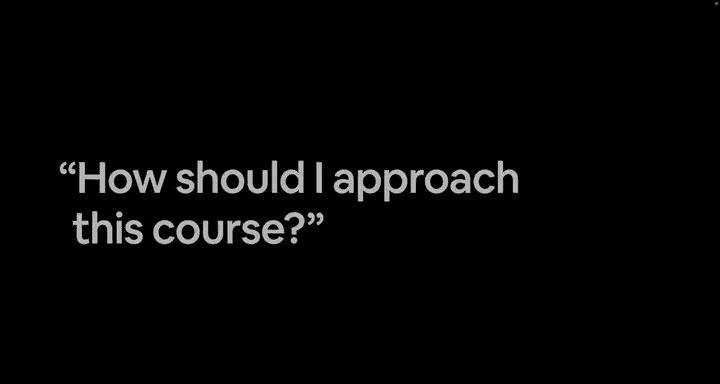

---

## 总结

本节课中，我们一起学习了本PyTorch基础模块的总体大纲，它涵盖了从张量基础到完整模型部署的完整流程。更重要的是，我们强调了一种关键的学习方法：**主动搜索和解决问题**，这是机器学习工程师日常工作的核心技能。记住，学习过程结合了科学性（精确的步骤）和艺术性（实验与调整），就像厨师烹饪一样。下一节课，我们将深入探讨如何高效地学习本课程。