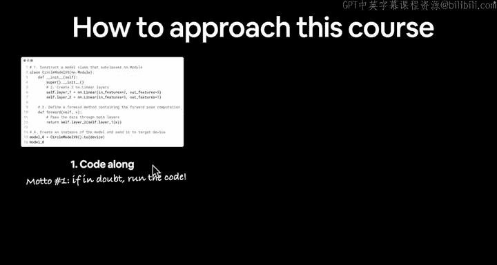
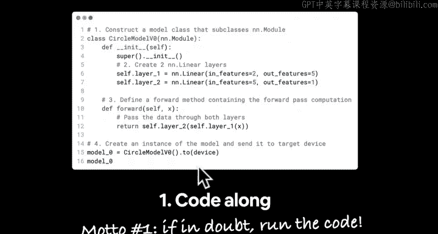
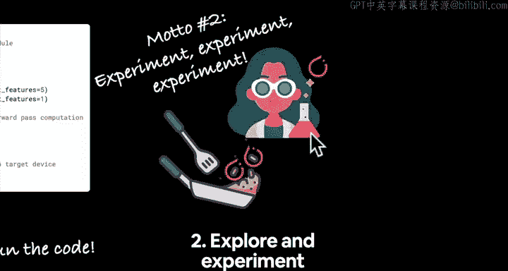
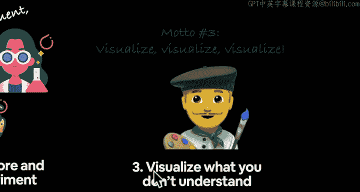
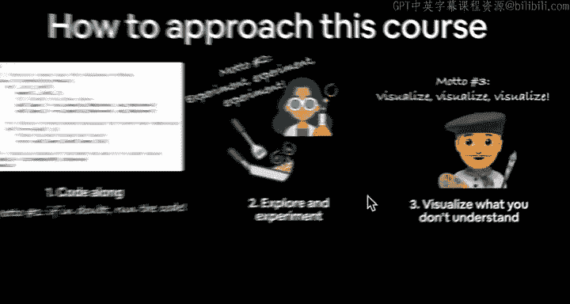
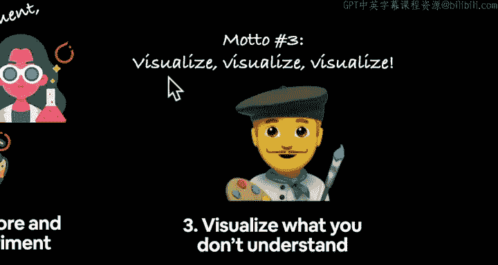
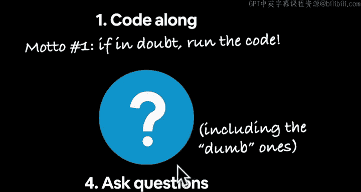
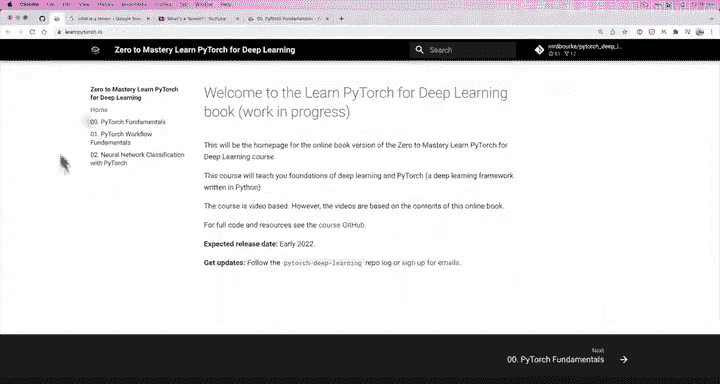
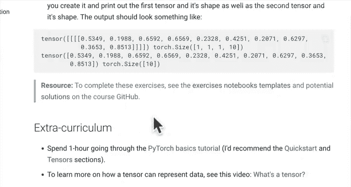
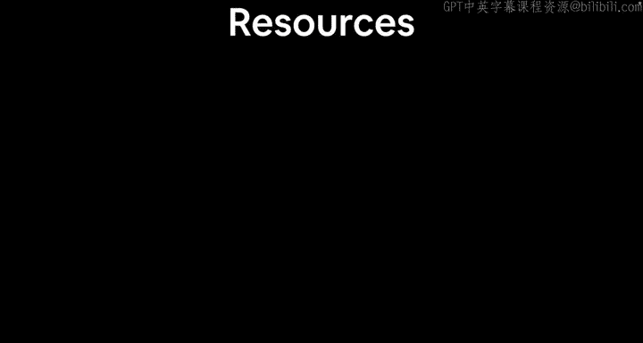

# 12：如何（以及如何不）学习本课程 🧭

在本节课中，我们将学习如何高效地学习这门PyTorch深度学习课程，并了解应避免哪些学习方式。我们将介绍六个核心学习原则，帮助你从实践中掌握知识。

---

## 概述

学习机器学习与编写机器学习代码是两件不同的事。本课程将专注于编写PyTorch代码，而非理论讲解。因此，首要的学习方法是动手编码。

## 如何学习本课程

以下是六个核心学习原则。

上一节我们介绍了课程的整体学习方法，本节中我们来看看具体的原则。

### 1. 动手编码

首要步骤是跟随课程一起编写代码。由于本课程专注于代码实践，我会提供额外的学习资源，帮助你理解代码背后的原理。我的教学理念是：通过一起编写和运行代码，观察其运行方式，从而激发你探索背后原理的好奇心。

**核心原则**：如有疑问，就运行代码。编写它，运行它，观察结果。

### 2. 探索与实验

以科学家和厨师的心态来学习这门课程。像科学家一样严谨地尝试，也像厨师一样为了乐趣而尝试。不断实验是学习的关键。

### 3. 可视化不理解的内容

这一点再怎么强调也不为过。我们目前有三个原则：如有疑问就运行代码、不断实验、以及可视化。机器学习涉及大量数据和数字，将数字以图表等形式可视化，而非仅仅看页面上的数字，能帮助你更好地理解。我将链接一些优秀的额外资源，它们能将代码转化为出色的可视化效果。

### 4. 提出问题，包括“愚蠢”的问题

实际上，没有所谓“愚蠢”的问题。每个人只是处于学习旅程的不同阶段。如果你有一个“愚蠢”的问题，很可能很多人也有同样的问题。请务必提问。我会提供一个可以提问的资源链接。不仅向社区提问，也可以向谷歌、互联网或任何地方提问，甚至向自己提问。对代码提出问题，并通过编写代码来寻找答案。

### 5. 完成练习

我为每个模块都创建了很好的练习。在课程书籍版本的各章节底部，都有练习和课外拓展内容。我强烈建议你不要仅仅跟随课程和我一起编码。请务必尝试完成练习，因为这将拓展你的知识。我们会一起进行大量编码实践，而练习将给你机会应用所学知识。当然，课外拓展内容也为你提供了深入学习的机会。

### 6. 分享你的成果

我无法充分强调，通过Github、不同代码资源或社区分享我的深度学习学习心得或工作成果，对我的学习帮助有多大。如果你学到了关于PyTorch的很棒的东西，我很乐意看到。请通过Discord聊天或Github等方式链接给我。分享你的工作不仅是学习的好方法（因为当你分享或撰写时，你会思考如何让他人理解），也是帮助他人学习的好途径。

---

## 如何不学习本课程

我们讨论了如何学习本课程。现在，来看看应避免的学习方式。

我希望你避免过度思考这个过程。想象这是你的大脑，这是你大脑“着火”的样子。应避免让你的大脑“着火”，那不是一个好状态。我们正在使用PyTorch（火炬），所以可能会很“热”——这只是对名字“torch”的文字游戏。但要避免你的大脑“着火”，并避免说“我学不会XXX”。我曾多次对自己说过这句话，但通过练习后发现，我实际上可以学会那些东西。所以，让我们在上面画一条红线，一条更粗的红线。现在这看起来有点像一个被划掉的“避免”标识，但意思就是：不要说“我学不会”，并防止你的大脑“着火”。

---

## 总结

本节课中，我们一起学习了高效学习本PyTorch课程的六个核心原则：动手编码、探索实验、可视化、积极提问、完成练习以及分享成果。同时，我们也了解了应避免过度思考和自我设限。在下一节视频中，我们将介绍课程资源，然后正式开始编码学习。