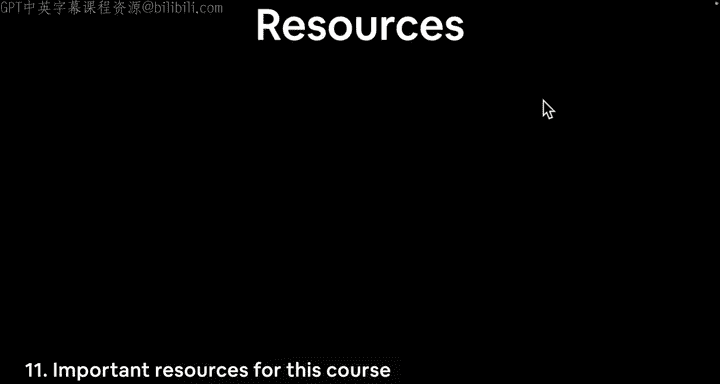
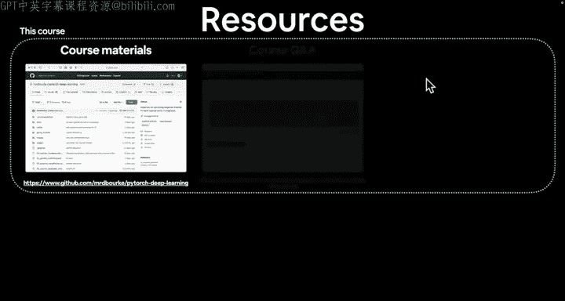
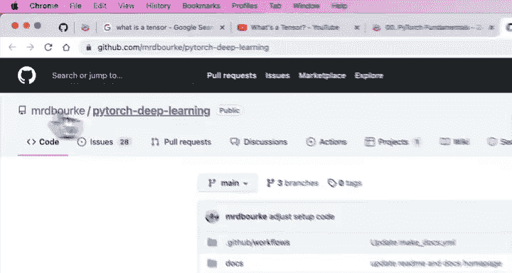
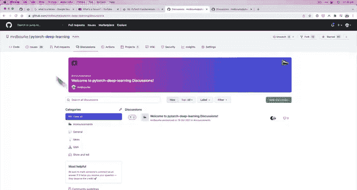
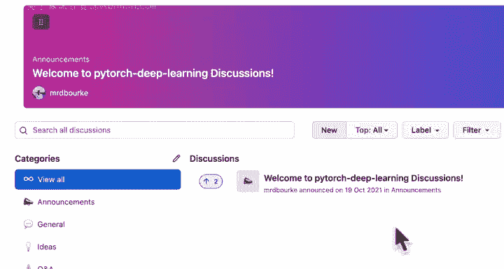
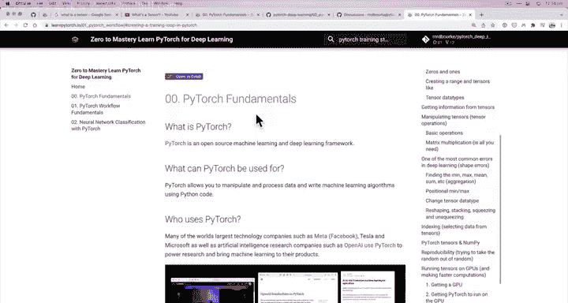
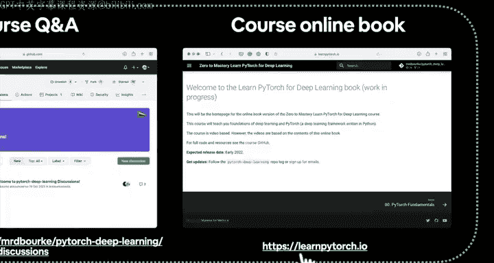
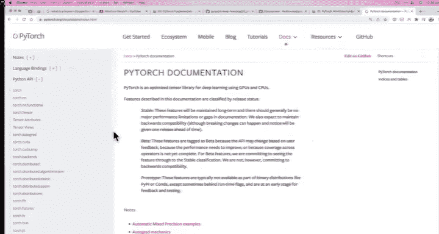

# 13：重要资源 📚

在本节课中，我们将了解学习本课程前必须掌握的几个核心资源。这些资源对于后续的学习和实践至关重要。






---

## 概述

在深入学习之前，我们需要熟悉三个核心资源：课程材料所在的GitHub仓库、课程问答讨论区以及在线书籍。此外，我们还会介绍通用的PyTorch学习资源，包括官方网站和论坛。

---

## 课程核心资源



以下是本课程专属的三个重要资源。

### 1. GitHub仓库

所有课程材料都存放在GitHub仓库中。仓库地址是：`https://github.com/mrdbourke/pytorch-deep-learning`。在录制视频时，该仓库仍在不断完善，但当你学习时，大部分材料应该已经就绪。

仓库包含以下内容：
*   **材料大纲**：展示课程涵盖的主题。
*   **练习与扩展内容**：提供相关链接。
*   **课程所需的一切**：代码、笔记等均在此处。

建议你在学习过程中将此链接添加到浏览器书签，以便快速访问。

### 2. 课程问答讨论区

问答讨论区同样位于上述GitHub仓库中。你只需进入仓库，点击顶部的 **“Discussions”** 标签页即可。

这是提问和解决问题的地方。如果你在学习中遇到困难，可以按照以下步骤发起讨论：
1.  点击 **“New discussion”**。
2.  选择 **“Q&A”** 类别。
3.  在标题中注明视频名称（例如：“PyTorch Fundamentals”）。
4.  在正文中清晰描述你遇到的问题。
5.  使用代码块格式化你的代码，这有助于他人理解。格式如下：

    ```python
    import torch
    # 你的代码 here
    ```
6.  如果程序报错，请附上完整的错误信息。
7.  点击 **“Start discussion”** 发布。

发布后，我或其他学习本课程的同学会尽力为你提供帮助。将所有问答集中在一处的好处是便于搜索，随着课程推进，这里积累的解决方案会越来越多。

此外，如果你认为课程代码有需要改进的地方，也可以在仓库的 **“Issues”** 页面提交问题。

### 3. 课程在线书籍

这是一个非常实用的资源，网址是：`https://www.learnpytorch.io/`。该网站通过自动化工具，将GitHub仓库中的所有Jupyter Notebook材料转换成了易于阅读的在线书籍。





在线书籍的优势包括：
*   **结构清晰**：拥有完整的章节标题。
*   **阅读方便**：所有内容都在网页上，并包含图片。
*   **支持搜索**：你可以使用搜索功能快速查找特定内容，例如“training loop in PyTorch”。

本书籍是学习所有课程材料的绝佳伴侣。

---

## 通用PyTorch资源

除了课程专属资源，以下两个是学习PyTorch本身必不可少的通用资源。



### 1. PyTorch官方网站

官方网站是：`https://pytorch.org/`。这是你获取一切PyTorch信息的“大本营”。



网站核心部分是 **官方文档**。本课程并非官方文档的替代品，恰恰相反，课程内容正是基于官方文档，并以更易于学习的方式组织起来的。你会在课程中经常看到我引用官方文档，因此请务必习惯使用它。

### 2. PyTorch官方论坛

如果你遇到的问题与课程无关，而是更广泛的PyTorch使用问题，我强烈推荐你访问PyTorch官方论坛：`https://discuss.pytorch.org/`。

论坛上有来自全球的PyTorch开发者和使用者，是寻求帮助和讨论技术问题的绝佳场所。

---

## 总结

本节课我们一起梳理了学习所需的关键资源。我们介绍了本课程的三个核心资源：**GitHub仓库**、**课程问答讨论区**和**在线书籍**。同时，我们也了解了通用的PyTorch学习资源：**官方网站**和**官方论坛**。熟悉并善用这些资源，将让你的学习之路更加顺畅。



---


准备好了吗？接下来，让我们开始动手写代码吧！我们下一个视频见。