#  14：环境搭建 🛠️

在本节课中，我们将学习如何为 PyTorch 深度学习设置编程环境。我们将主要介绍如何使用 Google Colab 这一在线工具，它能让初学者免去复杂的本地安装过程，快速开始编写和运行 PyTorch 代码。

---

## 从理论到实践

上一节我们介绍了足够多的理论基础。本节中，我们来看看如何开始实际编码。

我将打开 Google Chrome 浏览器，并向你介绍本课程将全程使用的主要工具之一：**Google Colab**。


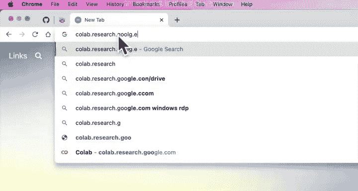

我建议你跟随本课程学习的方式是：**边看边敲代码**。

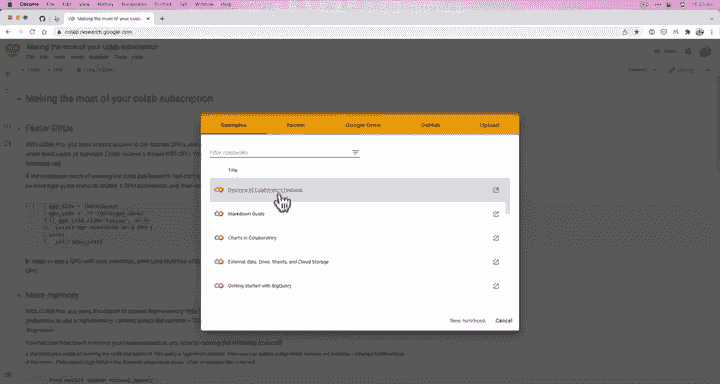

---

## 访问 Google Colab

以下是访问 Google Colab 的步骤：

1.  在浏览器中访问 `colab.research.google.com`。
2.  页面将加载 Google Colab 的界面。

你可以跟随我的操作。如果你想全面了解 Google Colab 的功能，可以浏览其官方概述文档。我推荐阅读“Colaboratory 功能概述”。

本质上，Google Colab 允许我们创建新的 **Notebook**。这就是我们练习编写 PyTorch 代码的方式。

如果你参考 `learnpytorch.io` 网站的文档，会发现它们实际上就是以在线书籍格式呈现的 Colab Notebook。这些是构建本课程的基础材料。随着课程深入，我们会添加更多内容。

---

## 创建第一个 Notebook

每一个新模块，我们都会开启一个新的 Notebook。

我将放大界面。第一个模块的编号是 `00`，因为 Python 的索引从 0 开始。我们将其命名为 **PyTorch 基础**。

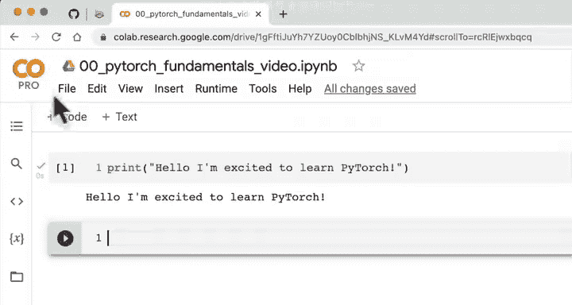

我会把我的 Notebook 命名为 `video`，以便区分这是视频教程中使用的 Notebook。

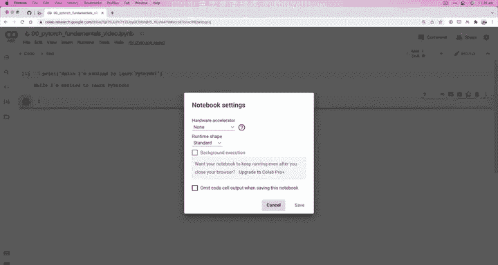

点击“连接”后，它会为我们提供一个编写 Python 代码的空间。

例如，我们可以输入：
```python
print("Hello, I'm excited to learn PyTorch.")
```
然后按下 `Shift + Enter` 来运行这行代码。

---

## Google Colab 的版本与硬件加速

Google Colab 的一个巨大优势是它提供了免费的硬件加速器。我正在使用专业版，每月费用大约 10 美元（价格可能因地区而异）。我使用专业版是因为我经常使用 Colab。

然而，**你不需要付费版本也能完成本课程**。Google Colab 提供免费版本，足以满足本课程的需求。如果你觉得物有所值，可以考虑专业版。

现在，让我们看看 Google Colab 的硬件加速功能。

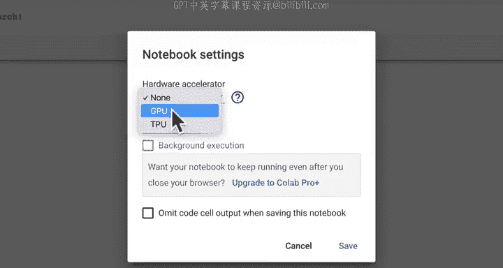


1.  点击菜单栏的 **运行时**。
2.  选择 **更改运行时类型**。
3.  在 **硬件加速器** 下拉菜单中，我们可以选择 `GPU` 或 `TPU`。

我们将专注于使用 **GPU**。如果你对 TPU 感兴趣，可以自行探索。

选择 `GPU` 并点击保存。现在，我们编写的代码（如果以特定方式编写）将在 GPU 上运行。我们稍后会看到，在 GPU 上运行的代码，特别是在深度学习领域，计算速度会快得多。

例如，我们可以运行 `!nvidia-smi` 命令来查看我们可用的 GPU 信息。在我的例子中，我获得了一个 Tesla P100，这是一款相当不错的 GPU。

通常，付费版本的 Google Colab 会提供更好的 GPU。免费版本也提供 GPU，只是速度可能不如付费版本提供的 GPU 快。请记住这一点。

Colab 功能非常多，我不可能一一介绍。但我们已经涵盖了需要了解的基本内容。

---

## 组织 Notebook：代码与文本单元格

回到 Notebook 顶部，我将创建一个文本单元格。输入标题，例如 “00. PyTorch 基础”，并在这里链接资源 Notebook。

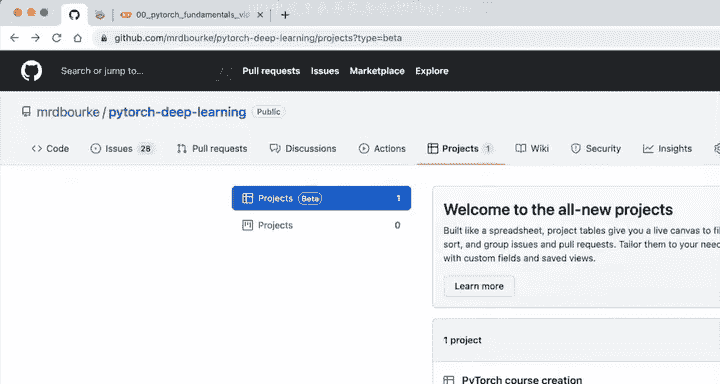

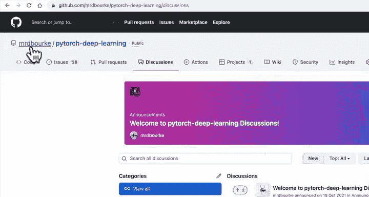

你可以访问 `learnpytorch.io`，所有 Notebook 都是同步的。对于 `00` 模块，我们可以把资源链接放在这里。本视频的 Notebook 就是基于那个资源 Notebook 创建的。

如果你对这个 Notebook 的内容有疑问，可以访问课程 GitHub 仓库。在 `PyTorch-Deep-Learning` 项目中，你可以查看当前进展。你还可以在 `mrdbourke/pytorch-deep-learning/discussions` 页面通过点击“New discussion”来提问。任何与本 Notebook 相关的讨论都可以在那里进行。

目前这是一个代码单元格。Colab 主要由代码单元格和文本单元格构成。

我可以按 `Cmd + M + M`（在 Mac 上）将其转换为文本单元格，然后按 `Shift + Enter`。现在我们就有了一个文本单元格。

如果我们想要另一个代码单元格，可以点击“+ 代码”按钮。如此反复，可以交替创建文本和代码单元格。但这里我将删除多余的单元格。

---

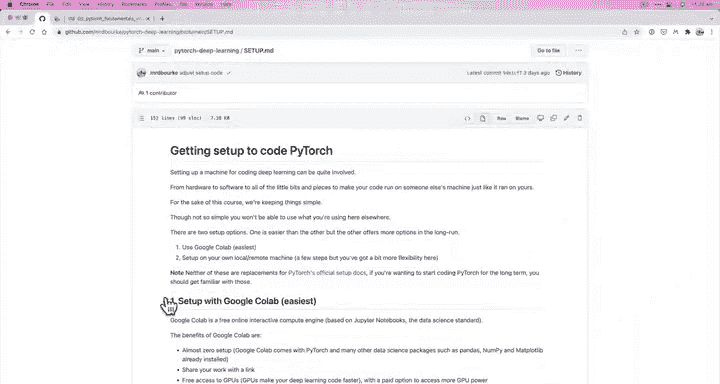

## 导入必要的库

为了结束本视频，我们将导入 PyTorch。

我们输入：
```python
import torch
print(torch.__version__)
```
Google Colab 的另一个优点是它**预装了 PyTorch** 以及许多其他常用的 Python 数据科学包。

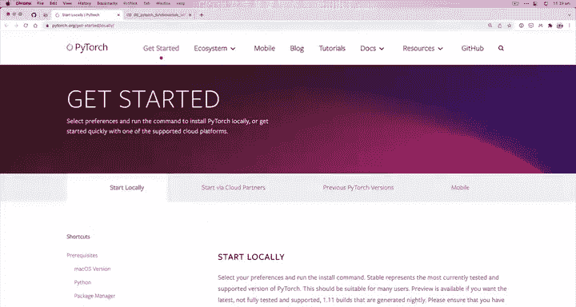

我们也可以同时导入其他常用库：
```python
import pandas as pd
import numpy as np
import matplotlib.pyplot as plt
```
对于本课程来说，**Google Colab 是入门的最简单方式**。

当然，你也可以在本地运行代码。如果你想这么做，我建议你参考 `pytorch.org` 上的官方安装文档，或者课程资料中的 `setup.md` 文件。但如果你想尽快开始，我强烈推荐使用 Google Colab。事实上，整个课程都可以通过 Google Colab 完成。

---

## 环境验证与总结

让我们完成这个视频，确保 PyTorch 准备就绪。

运行导入代码块的输出显示，我们拥有 PyTorch 1.10.0 版本。如果你的版本号远高于此（例如，几年后你看到这个视频时 PyTorch 已是 2.11 版），可能本 Notebook 中的部分代码无法工作。但 1.10.0 版本对于我们即将进行的学习已经足够。

输出中的 `cu111` 代表 CUDA 版本 11.1。CUDA 是 NVIDIA 的并行计算平台和编程模型，它使我们能够在 NVIDIA GPU 上运行 PyTorch 代码，而我们在 Google Colab 中正好可以访问这些 GPU。

截至录制本视频时，最新的 PyTorch 版本是 1.10.2。要完成本课程，你至少需要 PyTorch 1.10 和 CUDA 11.3 工具包。

---

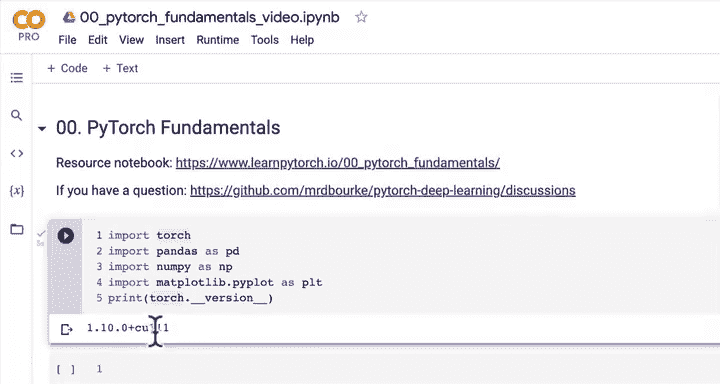

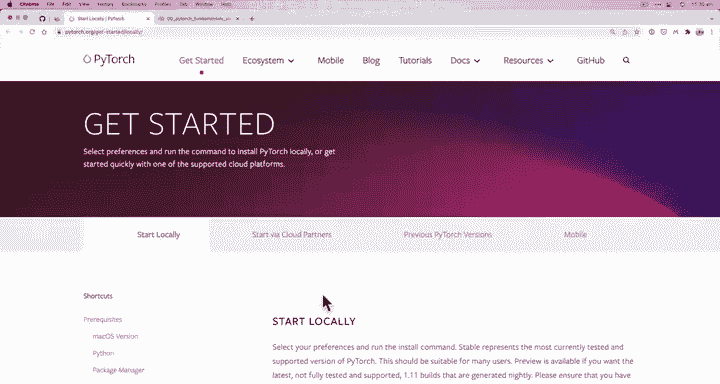

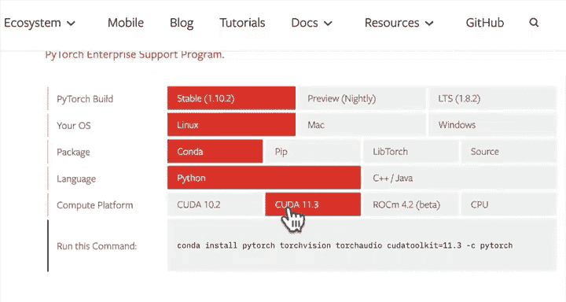

## 准备就绪

很好，我们的环境已经搭建完毕，准备好编写代码了。

让我们在下一个视频中开始编写一些 PyTorch 代码吧。这非常令人兴奋。

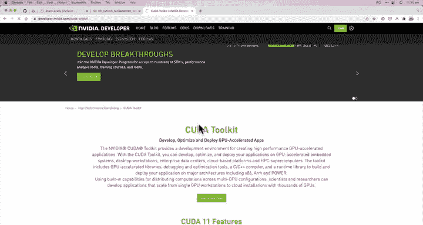

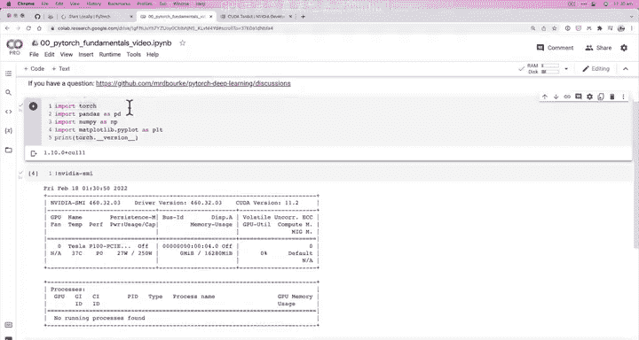

我们下个视频见。