#  15：张量介绍 🧮

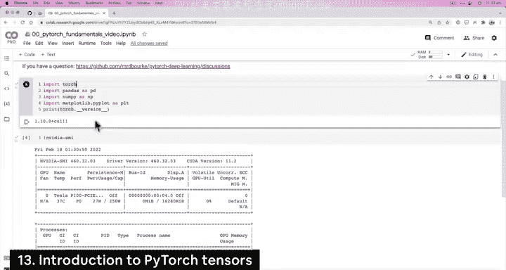

在本节课中，我们将学习 PyTorch 的核心构建模块——张量。我们将了解什么是张量，如何创建不同维度的张量，并探索它们的基本属性。

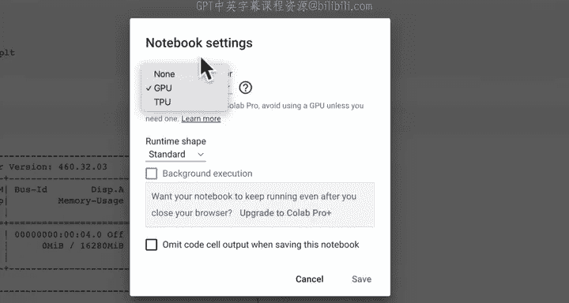

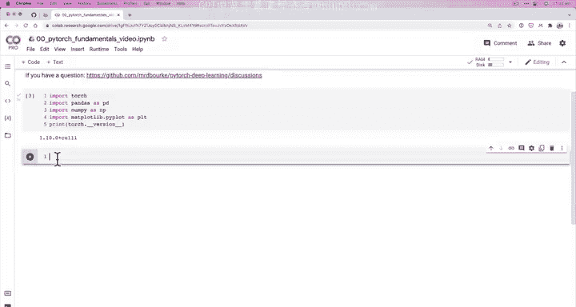

---


## 环境设置与学习建议

我们已经完成了环境设置，可以访问 PyTorch，并且正在运行一个 Google Colab 实例。我们已通过“运行时”->“更改运行时类型”->“硬件加速器”获得了 GPU 访问权限。虽然本笔记本的全程学习不一定需要 GPU，但提前展示如何获取 GPU 是为了后续课程的使用。

我推荐以分屏模式学习本课程。例如，您可以在屏幕左侧播放本视频（包含代码讲解），在屏幕右侧打开您自己的 Colab 笔记本，并新建一个笔记本。您可以边看视频边在右侧编写相同的代码。如果遇到问题，可以参考本课程的参考笔记本或在社区提问。

现在，让我们开始学习。在 PyTorch 中，我们首先要看的是张量介绍。

---

## 什么是张量？

张量是深度学习和数据表示的主要构建模块。在本课程中，张量是一种表示数据的方式，特别是多维数值数据，而这些数值数据通常代表其他事物。

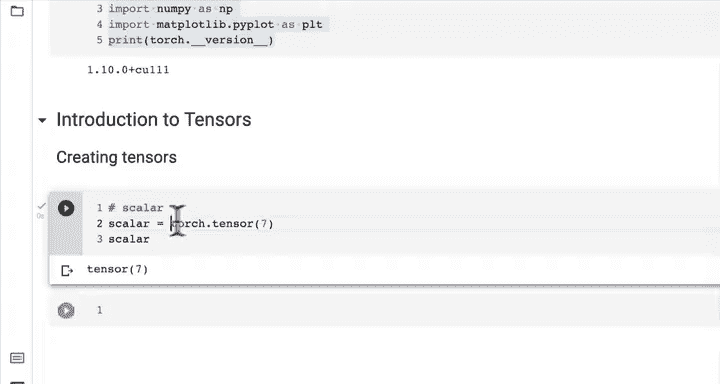

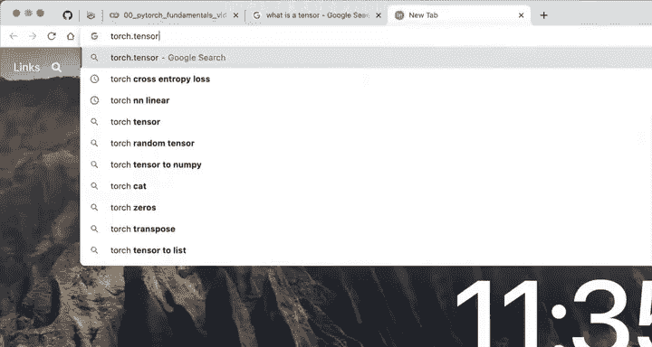

以下是创建张量的几种类型。

### 标量

首先，我们将创建一种称为**标量**的张量。在 PyTorch 中，几乎所有东西都被称为张量，但存在不同类型的张量。标量是其中最简单的一种。

使用 `torch.tensor()` 函数可以创建张量。要了解 `torch.tensor` 的详细信息，可以查阅其官方文档，这是 PyTorch 中最常用的类之一。

```python
# 创建一个标量张量
scalar = torch.tensor(7)
print(scalar)
# 输出: tensor(7)
```

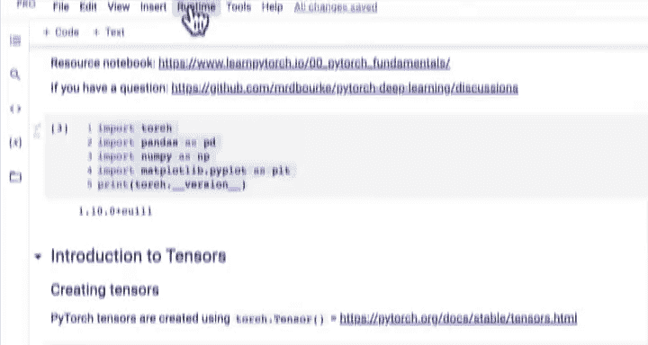

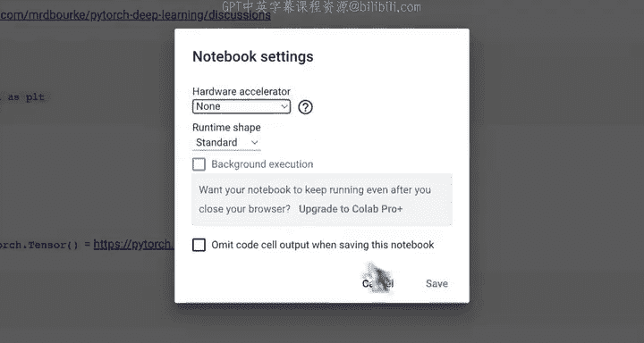

标量没有维度，它只是一个单独的数字。我们可以使用 `.item()` 方法将张量中的数值提取为标准的 Python 数据类型。

```python
# 获取标量的 Python 数值
scalar_value = scalar.item()
print(scalar_value)
# 输出: 7
```

---

## 向量

接下来，我们看看**向量**。向量通常具有大小和方向，但在本课程中，我们更简单地记住：向量包含多个数字。

```python
# 创建一个向量张量
vector = torch.tensor([7, 7])
print(vector)
# 输出: tensor([7, 7])
```

向量有一个维度。判断维度的一个方法是数张量表示中外层方括号的对数。这里有一对方括号，所以维度为 1。向量的形状（`.shape`）表示其大小，这里形状是 `(2,)`，表示它包含两个元素。

```python
print(vector.ndim)   # 输出维度: 1
print(vector.shape)  # 输出形状: torch.Size([2])
```

---

## 矩阵

现在，让我们升级到**矩阵**。矩阵是二维张量。

```python
# 创建一个矩阵张量
matrix = torch.tensor([[7, 8],
                       [9, 10]])
print(matrix)
# 输出:
# tensor([[ 7,  8],
#         [ 9, 10]])
```

矩阵有两对方括号，因此维度为 2。它的形状是 `(2, 2)`，表示它是一个 2 行 2 列、总共包含 4 个元素的矩阵。我们可以通过索引来访问矩阵中的元素。

```python
print(matrix.ndim)    # 输出维度: 2
print(matrix.shape)   # 输出形状: torch.Size([2, 2])
print(matrix[0])      # 访问第一行: tensor([7, 8])
print(matrix[1])      # 访问第二行: tensor([9, 10])
```

---

## 高阶张量

最后，我们创建一个更高维度的张量，通常直接称为**张量**。我们将使用三对方括号。

```python
# 创建一个三维张量
tensor = torch.tensor([[[1, 2, 3],
                        [3, 6, 9],
                        [2, 5, 4]]])
print(tensor)
# 输出:
# tensor([[[1, 2, 3],
#          [3, 6, 9],
#          [2, 5, 4]]])
```

这个张量有三对方括号，因此维度为 3。它的形状是 `(1, 3, 3)`。这表示：
*   最外层的维度大小为 1（对应第一对方括号）。
*   中间层的维度大小为 3（对应第二对方括号，包含三个子列表）。
*   最内层的维度大小也为 3（对应每个子列表中的三个数字）。

```python
print(tensor.ndim)    # 输出维度: 3
print(tensor.shape)   # 输出形状: torch.Size([1, 3, 3])
print(tensor[0])      # 访问第一个（也是唯一一个）二维切片
# 输出:
# tensor([[1, 2, 3],
#         [3, 6, 9],
#         [2, 5, 4]])
```

理解张量的维度需要练习。一个直观的方法是：形状中的数字从左到右，分别对应从最外层到最内层的方括号所包含的元素数量。

---

## 练习建议

在实际应用中，我们很少手动创建包含大量数字的张量，PyTorch 会在后台处理这些。然而，理解这些基本构建模块对于构建深度学习模型至关重要。

为了巩固理解，我建议您进行以下练习：
*   尝试创建具有不同数量方括号和数字组合的张量。
*   使用 `.ndim`、`.shape` 和索引操作来探索您创建的张量。
*   通过反复实践来熟悉张量的维度和形状概念。

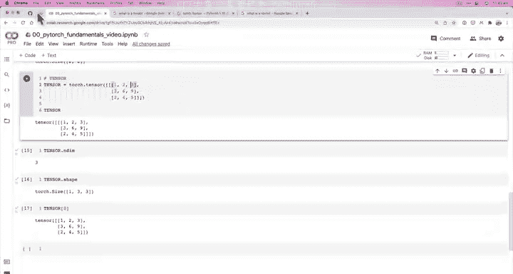

---

## 总结

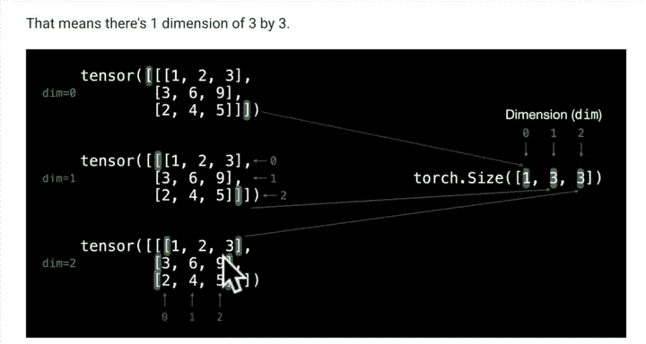

本节课中，我们一起学习了 PyTorch 中张量的基础知识。我们介绍了：
1.  **标量**：零维张量，表示单个数值。
2.  **向量**：一维张量，表示一系列数值。
3.  **矩阵**：二维张量，表示表格状数据。
4.  **高阶张量**：三维及以上的张量，用于表示更复杂的数据结构。

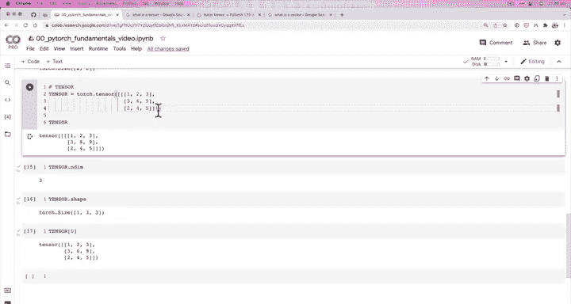

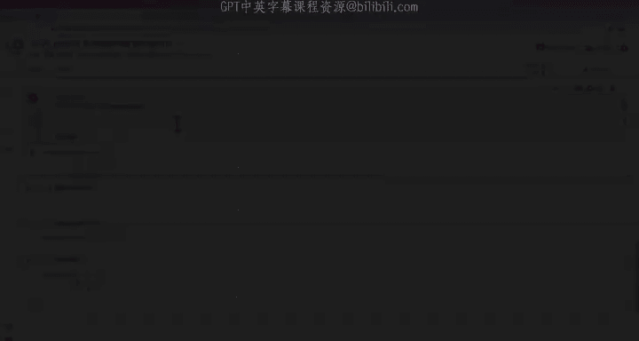

我们了解到，所有这些都是 `torch.Tensor` 类型，维度可以通过外层方括号的对数来判断，而形状 `.shape` 属性则描述了每个维度的大小。掌握这些概念是进行后续深度学习编程的坚实基础。