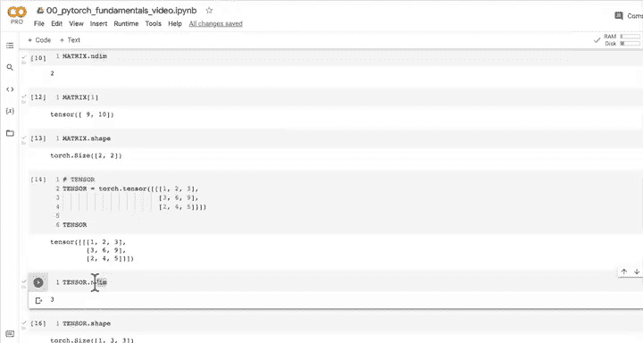
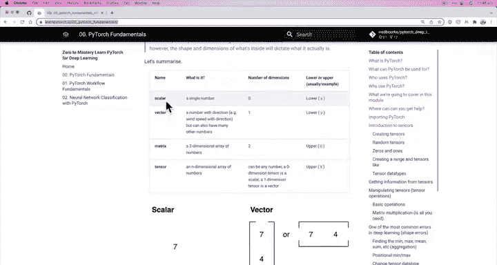
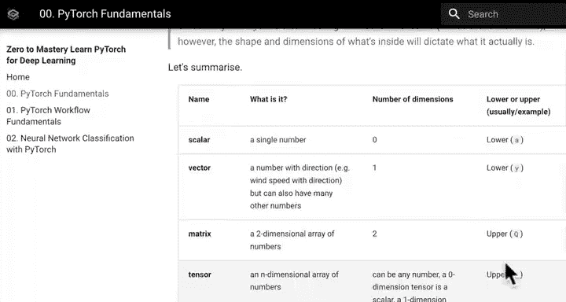
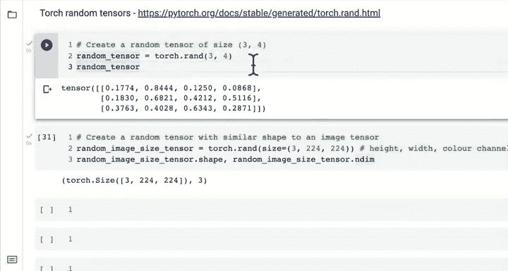
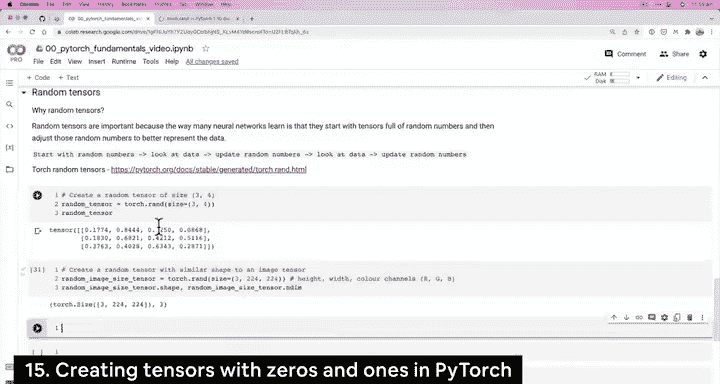
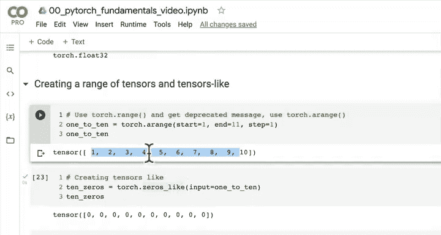
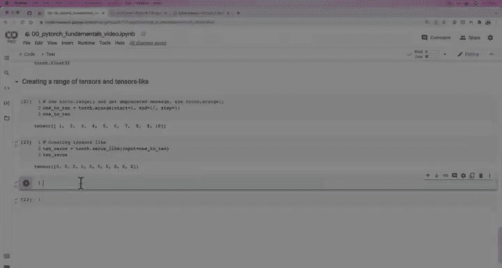

# 16：创建张量 🧮

## 概述

在本节课中，我们将学习如何在PyTorch中创建不同类型的张量。我们将涵盖随机张量、全零张量、全一张量以及如何创建特定范围的张量。理解这些创建方法是构建和操作深度学习模型的基础。





---

## 张量类型回顾

上一节我们介绍了深度学习数据表示的基本构建块——张量。在PyTorch中，这具体指的是`torch.Tensor`。我们了解了标量、向量、矩阵和张量的概念，并挑战大家创建自己的张量。



以下是不同类型张量的命名约定：

*   **标量**：单个数字，维度数为0，通常用小写变量名表示（例如 `y`）
*   **向量**：具有方向的数字，维度数为1，通常用小写变量名表示
*   **矩阵**：二维数组，通常用大写变量名表示（例如 `Y`）
*   **张量**：可以是任意维度的数组，通常用大写变量名表示

这种命名方式在机器学习和深度学习的代码及研究论文中很常见。

---

## 随机张量 🎲

现在，让我们深入探讨张量的另一个重要概念：随机张量。

随机张量在PyTorch中非常重要，因为许多神经网络的学习方式是从充满随机数的张量开始，然后调整这些随机数以更好地表示数据。

**神经网络的核心流程可以用以下伪代码表示：**
```python
# 1. 从随机数开始
# 2. 查看数据
# 3. 更新随机数
# 4. 重复步骤2和3
```

让我们在PyTorch中创建一个随机张量。我们可以使用`torch.rand()`函数，并指定其大小（size）或形状（shape）。在PyTorch中，size和shape通常可以互换使用。

```python
random_tensor = torch.rand(3, 4)
```

这将创建一个形状为3x4的随机张量。我们可以检查它的维数：

```python
random_tensor.ndim  # 输出: 2
```

我们可以创建任意形状的随机张量。例如，创建一个模拟图像张量形状的随机张量。图像张量通常具有`[颜色通道, 高度, 宽度]`的形状。

```python
# 创建一个形状为 (3, 224, 224) 的随机图像张量，模拟一个224x224像素的RGB图像
random_image_tensor = torch.rand(3, 224, 224)
```

**关键点**：PyTorch可以轻松创建张量，神经网络从随机数开始，查看数据（如图像张量），然后调整这些随机数以更好地表示数据，并不断重复此过程。

---

## 全零张量与全一张量 0️⃣1️⃣

有时，您可能需要创建不是随机数的张量，例如全零或全一的张量。



全零张量可用于创建掩码（mask）。如果将目标张量与零张量相乘，目标张量中的对应元素将变为零，这可以用于指示模型忽略某些数据。



以下是创建全零和全一张量的方法：

```python
# 创建全零张量
zeros_tensor = torch.zeros(size=(3, 4))

# 创建全一张量
ones_tensor = torch.ones(size=(3, 4))
```

默认情况下，这些张量的数据类型是`torch.float32`。全零张量在实际应用中可能比全一张量更常见。

---

## 创建范围张量与相似张量 🔢

接下来，我们看看如何创建具有特定数值范围的张量，以及如何创建与现有张量形状相同的新张量。

**创建范围张量**：可以使用`torch.arange()`函数。注意，旧版的`torch.range()`函数已被弃用。

```python
# 创建一个从0到9的张量
range_tensor_1 = torch.arange(10)

# 创建一个从1到10的张量
range_tensor_2 = torch.arange(1, 11)

# 创建具有特定步长的张量，例如从0开始，到1000结束，步长为77
range_tensor_3 = torch.arange(start=0, end=1000, step=77)
```

**创建相似形状的张量**：如果您想创建一个与现有张量形状相同但内容不同的新张量（例如全零），可以使用`torch.zeros_like()`函数。

```python
# 假设我们有一个张量
original_tensor = torch.arange(10)

# 创建一个与original_tensor形状相同的全零张量
zeros_like_tensor = torch.zeros_like(original_tensor)
```

这种方法在需要复制某个张量的形状但填充不同内容时非常有用。

---

## 总结

本节课我们一起学习了在PyTorch中创建张量的多种方法：

1.  **随机张量**：使用`torch.rand()`创建，是神经网络初始化的基础。
2.  **全零与全一张量**：使用`torch.zeros()`和`torch.ones()`创建，常用于初始化或掩码操作。
3.  **范围张量**：使用`torch.arange()`创建具有特定数值序列的张量。
4.  **相似形状张量**：使用`torch.zeros_like()`等函数创建与现有张量形状相同的新张量。





掌握这些张量创建方法对于后续构建和训练深度学习模型至关重要。请尝试使用这些方法创建不同形状和类型的张量，以加深理解。