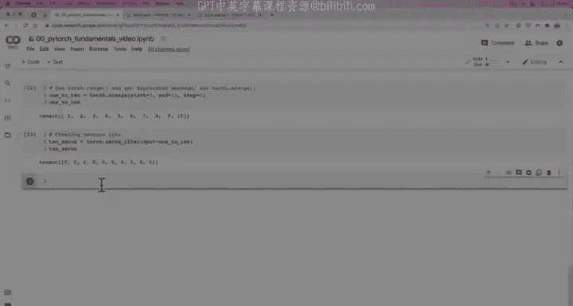
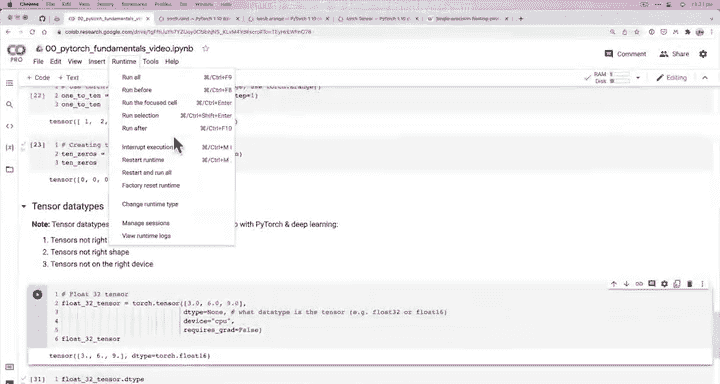
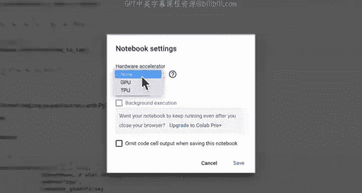
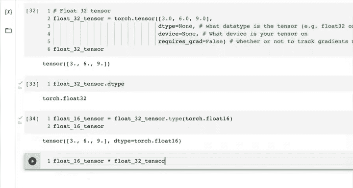

#  17：张量数据类型 🧮



在本节课中，我们将要学习 PyTorch 中一个非常重要的主题：张量数据类型。我们将探讨不同数据类型（如 `float32` 和 `float16`）的含义、它们的重要性，以及创建张量时需要注意的关键参数。

---

## 概述

张量是 PyTorch 的核心数据结构，而数据类型决定了张量中元素的存储方式和计算精度。理解数据类型对于避免常见的深度学习错误至关重要。

---

## 张量数据类型简介

上一节我们介绍了张量的基本概念，本节中我们来看看张量的数据类型。数据类型定义了张量中数值的存储格式和精度。

创建一个张量时，我们可以指定其数据类型。例如，创建一个 `float32` 类型的张量：

```python
import torch
float_32_tensor = torch.tensor([3, 6, 9], dtype=None) # 默认是 float32
print(float_32_tensor.dtype) # 输出：torch.float32
```

即使我们将 `dtype` 参数设为 `None`，PyTorch 的默认数据类型也是 `float32`。

---

## 数据类型的种类与含义

PyTorch 支持多种数据类型。最常见的是 `float32`（32位浮点数）和 `float16`（16位浮点数）。这些数字代表计算机内存中用于存储一个数值的比特位数。

在计算机科学中，**精度**指的是表达一个数值时所使用的细节程度，通常以比特或十进制位数来衡量。

*   **`float32`（单精度）**：使用 32 比特存储一个数，精度较高，是默认类型。
*   **`float16`（半精度）**：使用 16 比特存储一个数，占用内存更少，计算速度可能更快，但精度较低。
*   **`float64`（双精度）**：使用 64 比特，精度最高，但占用内存也最多。

选择数据类型的权衡在于：**精度 vs 内存/速度**。对于大多数深度学习任务，`float32` 是良好的起点。当需要节省内存或进行特定优化时，可能会使用 `float16`。

---

## 创建张量的关键参数

在创建张量时，有三个参数尤为重要：

1.  **`dtype`**： 张量的数据类型。
2.  **`device`**： 张量所在的设备（如 CPU 或 GPU）。
3.  **`requires_grad`**： 是否跟踪该张量的梯度（用于自动微分）。

以下是这些参数的简要说明：

*   **数据类型 (`dtype`)**： 确保参与运算的张量具有兼容的数据类型，否则会引发错误。
*   **设备 (`device`)**： 确保参与运算的张量位于相同的设备（CPU 或 GPU）上。跨设备操作会导致错误。
*   **梯度跟踪 (`requires_grad`)**： 若设置为 `True`，PyTorch 将跟踪对此张量的所有操作，以便后续计算梯度（在训练神经网络时至关重要）。





---

## 转换张量数据类型

如果遇到张量数据类型不匹配的错误，我们可以轻松地进行转换。例如，将 `float32` 张量转换为 `float16` 张量：

```python
float_16_tensor = float_32_tensor.type(torch.float16)
# 或者使用 .to() 方法
float_16_tensor = float_32_tensor.to(torch.float16)
print(float_16_tensor.dtype) # 输出：torch.float16
```

---

## 实践与探索

现在，请尝试以下操作来加深理解：

*   查阅 `torch.tensor` 的官方文档，了解更多关于 `dtype`、`device` 和 `requires_grad` 的信息。
*   创建几个不同数据类型的张量（如 `float32`、`float16`、`int64`）。
*   尝试对不同数据类型的张量进行运算（例如，将 `float16` 张量与 `float32` 张量相乘），观察会发生什么。

---

## 总结



本节课中我们一起学习了 PyTorch 张量的数据类型。我们了解了 `float32` 和 `float16` 等常见类型的含义及其在精度和效率上的权衡。我们还介绍了创建张量时的三个关键参数：`dtype`、`device` 和 `requires_grad`，并学习了如何转换张量的数据类型。掌握这些概念是避免后续深度学习开发中常见错误的基础。