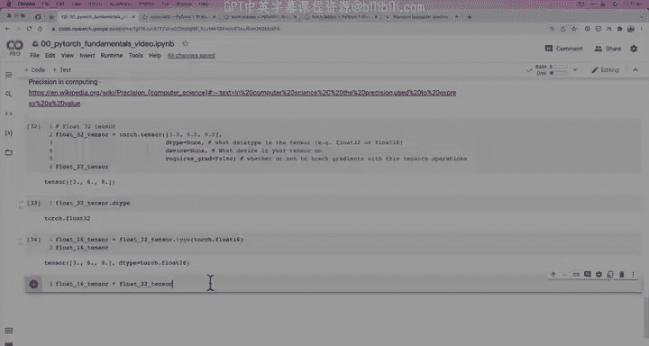
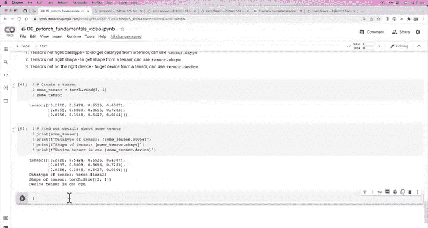

# 18：张量属性（关于张量的信息）📊

在本节课中，我们将学习如何获取PyTorch张量的关键信息，包括其形状、数据类型和所在设备。理解这些属性对于调试深度学习模型至关重要。



上一节我们介绍了张量的数据类型以及创建张量时的一些常见参数。本节中，我们来看看如何从张量中提取这些核心信息。

## 张量的三个关键属性

在深度学习和神经网络中，尤其是在使用PyTorch时，我们经常会遇到三类主要问题：张量的数据类型不正确、张量的形状不匹配，或者张量不在正确的设备上。为了解决这些问题，我们需要知道如何检查张量的以下三个属性：

以下是获取张量信息的三个核心方法：

*   **获取数据类型**：可以使用 `tensor.dtype`。
*   **获取形状**：可以使用 `tensor.shape`。
*   **获取设备**：可以使用 `tensor.device`。

## 实践：检查张量属性

让我们创建一个张量并尝试使用这些方法。

```python
import torch

# 创建一个随机张量
some_tensor = torch.rand(3, 4)
print(some_tensor)
```

输出：
```
tensor([[0.1234, 0.5678, 0.9012, 0.3456],
        [0.7890, 0.1234, 0.5678, 0.9012],
        [0.3456, 0.7890, 0.1234, 0.5678]])
```

现在，我们来获取这个张量的详细信息。

```python
# 获取张量的数据类型
print(f"张量的数据类型: {some_tensor.dtype}")

# 获取张量的形状
print(f"张量的形状: {some_tensor.shape}")

# 获取张量所在的设备
print(f"张量所在的设备: {some_tensor.device}")
```

输出：
```
张量的数据类型: torch.float32
张量的形状: torch.Size([3, 4])
张量所在的设备: cpu
```

如你所见，我们创建的张量默认是 `torch.float32` 数据类型，形状为 `(3, 4)`，并且位于CPU上。

## 关于 `shape` 与 `size()` 的说明

你可能还会遇到 `.size()` 方法。`.shape` 是一个属性，而 `.size()` 是一个方法（函数），但两者通常返回相同的结果。

```python
print(some_tensor.shape)   # 属性
print(some_tensor.size())  # 方法
```

输出：
```
torch.Size([3, 4])
torch.Size([3, 4])
```

根据个人习惯，你可以使用其中任何一个。不过请注意，`.shape` 是属性，直接调用；`.size()` 是方法，需要加上括号 `()` 调用。

## 挑战练习

为了巩固所学，请尝试以下练习：

1.  创建一个随机张量，但将其数据类型设置为 `torch.float16`，而不是默认的 `torch.float32`。
2.  探索如何更改PyTorch张量所在的设备（例如，从CPU移动到GPU，如果你有可用的GPU）。

## 总结



本节课中我们一起学习了PyTorch张量的三个核心属性：**数据类型** (`dtype`)、**形状** (`shape`) 和**设备** (`device`)。掌握如何检查和理解这些属性是有效构建和调试深度学习模型的基础技能。当遇到张量不匹配的错误时，首先检查这三个属性通常是解决问题的第一步。