# 19：张量操作 🧮

在本节课中，我们将要学习如何操作PyTorch张量。张量操作是构建神经网络的基础，因为神经网络本质上是由许多数学函数组成的。通过本节课的学习，你将掌握对张量进行加法、减法、乘法、除法和矩阵乘法等基本运算的方法。

---

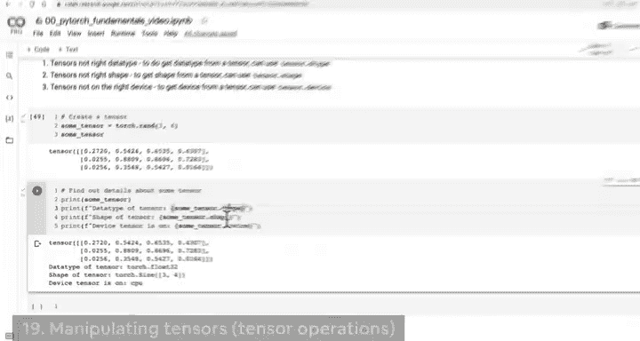

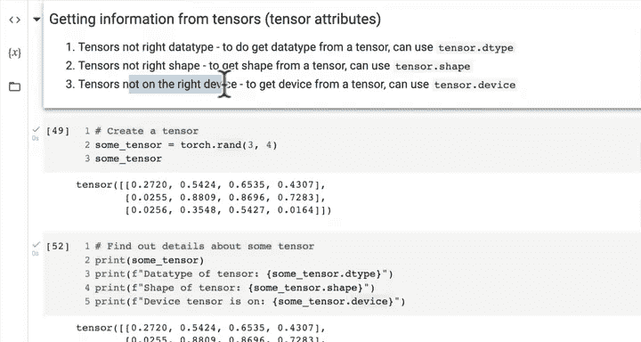

上一节我们介绍了张量的几个关键属性。本节中我们来看看如何对张量进行数学运算。

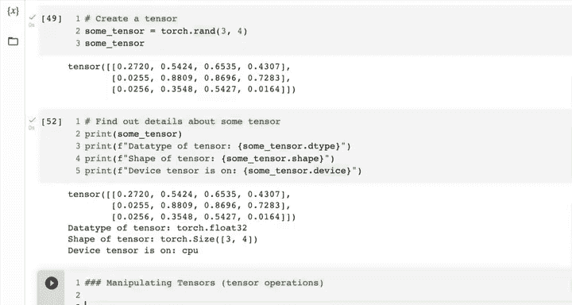

神经网络由大量数学函数构成，PyTorch代码会在幕后为我们执行这些函数。为了在数据集中发现模式，神经网络会以某种方式组合这些函数。它接收一个充满随机数的张量，执行加法、减法、乘法、除法或矩阵乘法的某种组合，以某种方式操作这些数字来表征数据集。神经网络的学习过程就是组合这些函数，观察数据，调整随机张量中的数字。

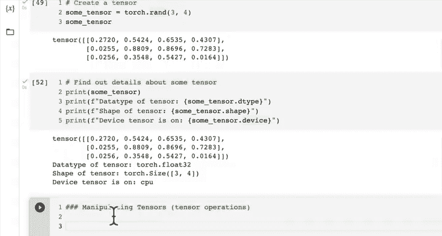

以下是神经网络中常见的张量运算：

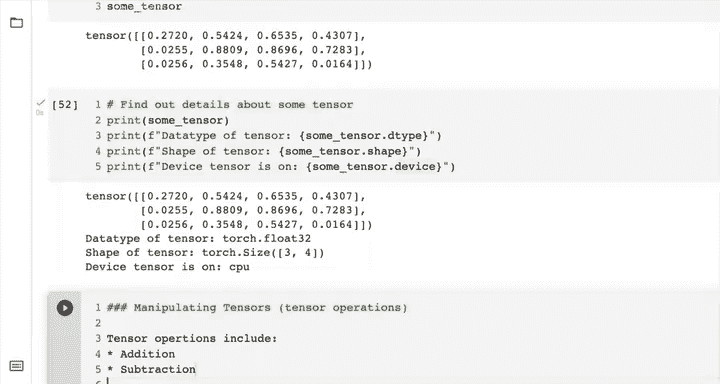

*   **加法**
*   **减法**
*   **乘法**（在深度学习和神经网络中，你通常会看到两种类型的乘法）
*   **除法**
*   **矩阵乘法**

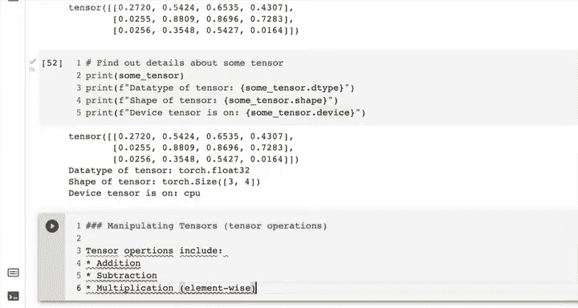

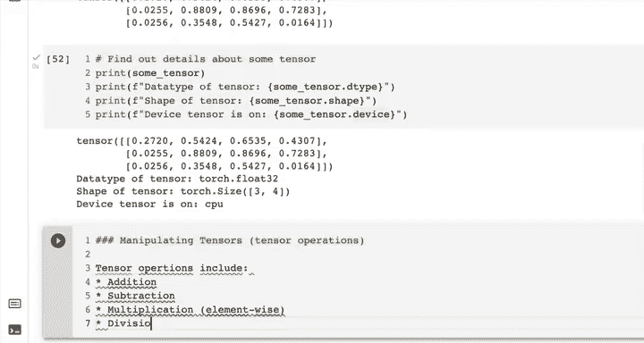

其中，加法、减法、乘法和除法是你可能熟悉的常规运算，矩阵乘法则是这里唯一不同的运算，我们稍后会详细查看。

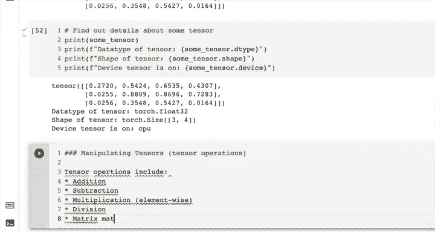

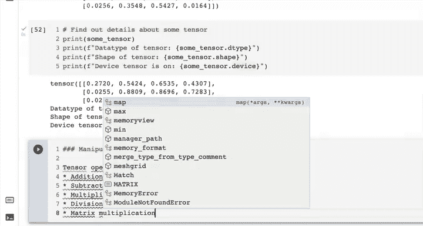

---

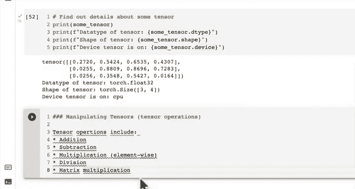

首先，我们创建一个张量来进行操作。

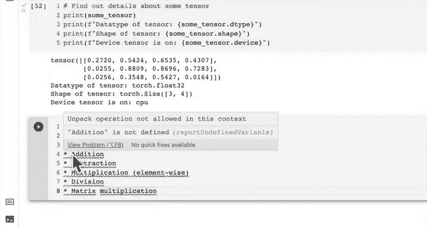

```python
import torch
tensor = torch.tensor([1, 2, 3])
```

**加法**

要给张量加上一个值，我们可以像在Python中一样使用加法运算符 `+`。

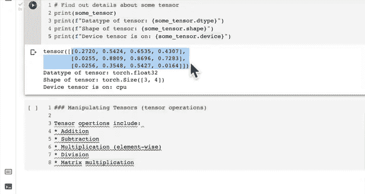

```python
# 张量加10
tensor + 10
# 输出：tensor([11, 12, 13])

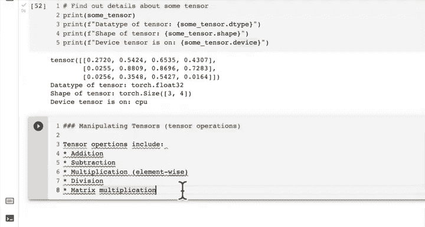

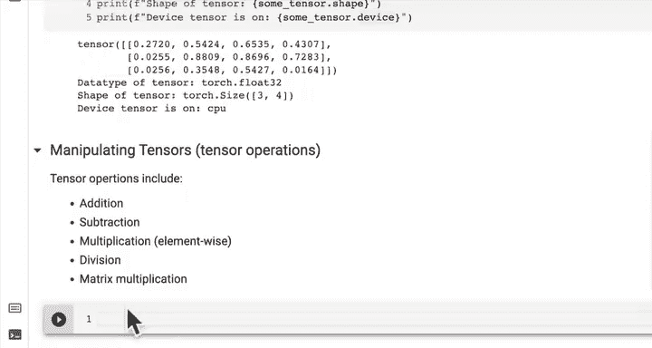

# 张量加100
tensor + 100
# 输出：tensor([101, 102, 103])
```

**乘法**

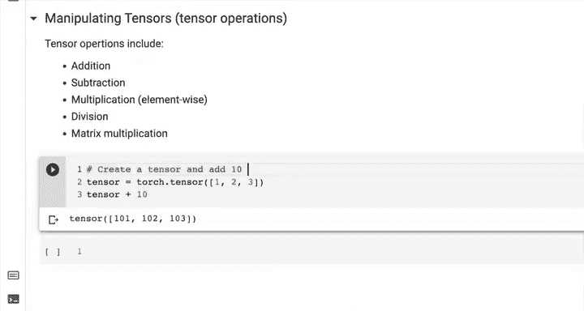

同样，我们可以使用乘法运算符 `*` 来乘以一个值。

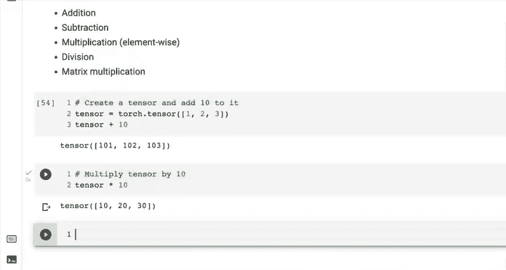

```python
# 张量乘以10
tensor * 10
# 输出：tensor([10, 20, 30])
```

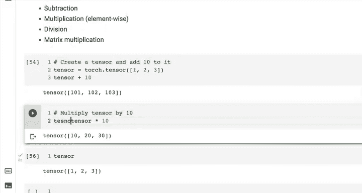

请注意，上述操作没有重新赋值给原变量 `tensor`，所以 `tensor` 的值仍然是 `[1, 2, 3]`。如果我们想改变原张量，需要重新赋值。

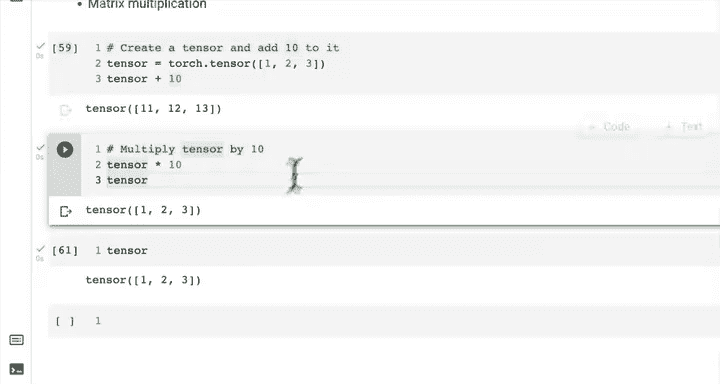

```python
# 重新赋值
tensor = tensor * 10
print(tensor)
# 输出：tensor([10, 20, 30])
```

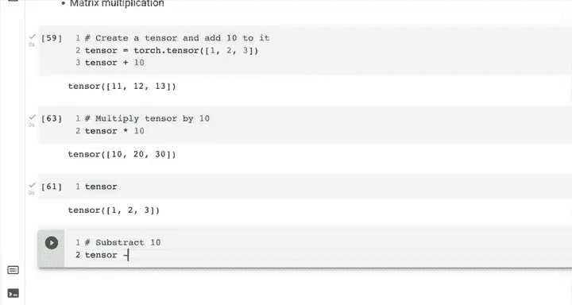

**减法**

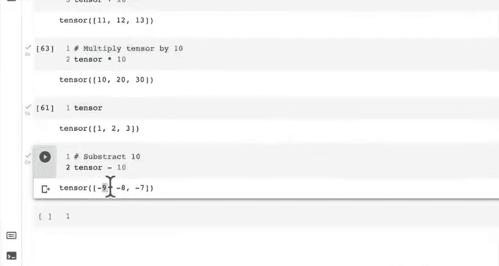

减法运算使用减法运算符 `-`。

```python
# 张量减10
tensor - 10
# 输出：tensor([ 0, 10, 20])
```

除了使用Python运算符，PyTorch也提供了内置函数来执行这些操作。

```python
# 使用torch.mul进行乘法
torch.mul(tensor, 10)
# 输出：tensor([100, 200, 300])

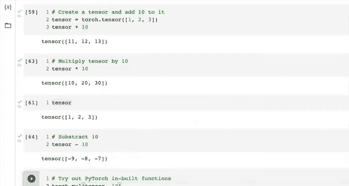

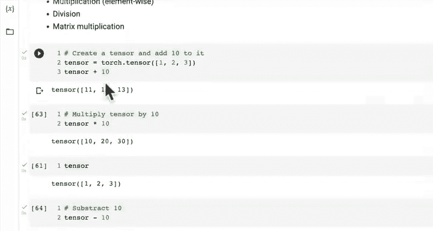

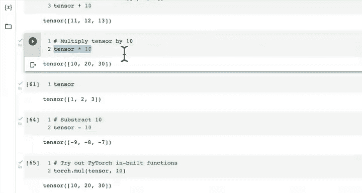

# 使用torch.add进行加法
torch.add(tensor, 10)
# 输出：tensor([20, 30, 40])
```

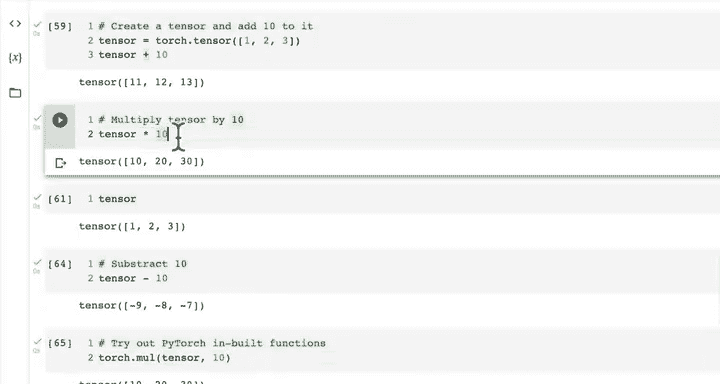

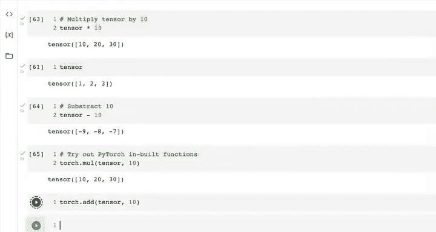

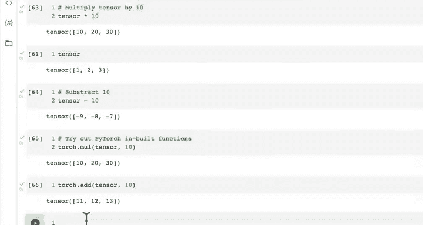

我建议在可能的情况下使用Python运算符，因为它们通常更直观易懂。但了解PyTorch的内置函数也是有益的。

---

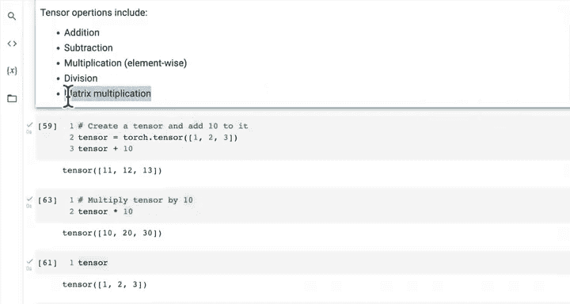

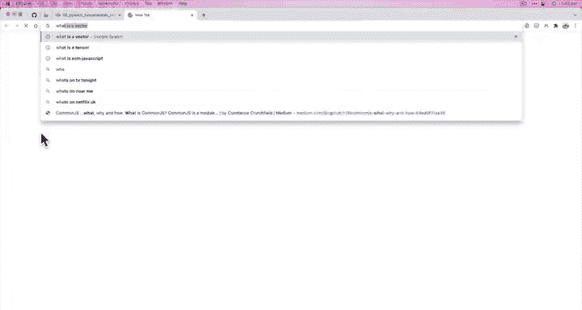

正如之前提到的，在深度学习中你会遇到两种乘法：**逐元素乘法**和**矩阵乘法**。我们将在下一个视频中重点介绍矩阵乘法。

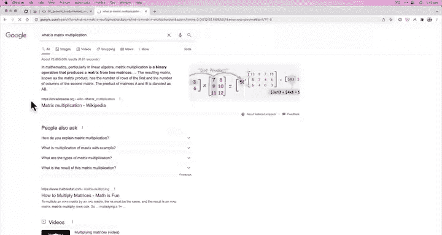

作为挑战，在进入下一课之前，我建议你搜索并了解**什么是矩阵乘法**。例如，维基百科或“Math is Fun”网站都有很好的指南。试着思考一下我们如何在PyTorch中实现矩阵乘法，即使你不确定具体方法，也可以先有一个初步的想法。

---

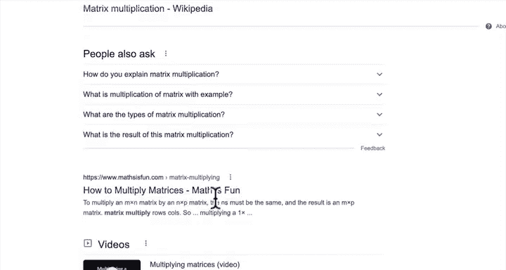

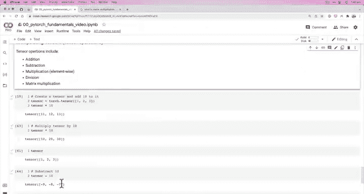

本节课中我们一起学习了PyTorch张量的基本操作，包括加法、减法、乘法和除法。我们了解了如何使用Python运算符和PyTorch内置函数来执行这些运算，并初步认识了矩阵乘法这一重要概念。掌握这些运算是理解和构建神经网络模型的关键步骤。