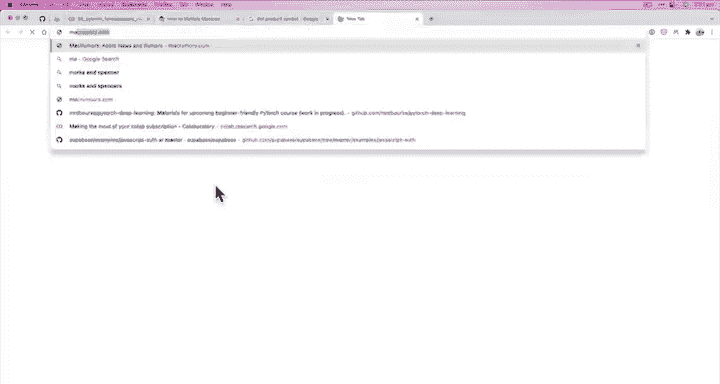
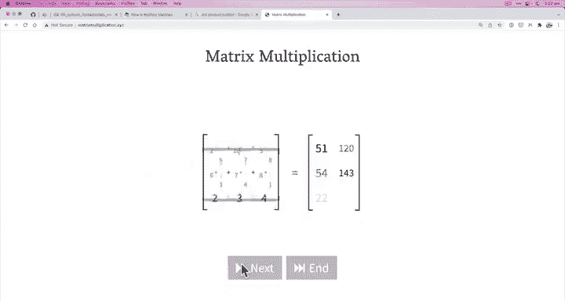
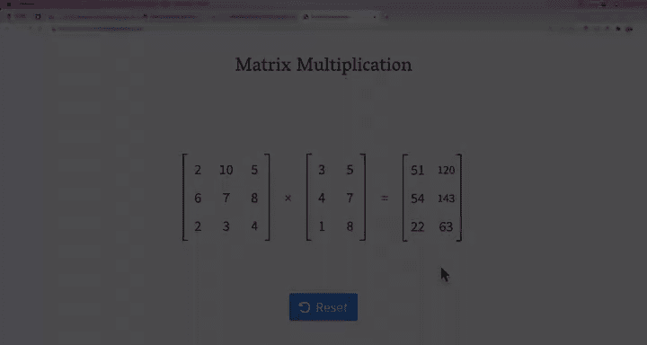
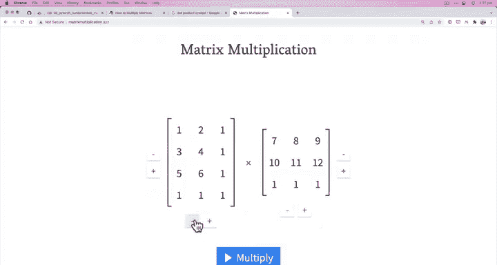

# 20：矩阵乘法 🧮

## 概述
在本节课中，我们将深入学习神经网络中最核心的运算之一：**矩阵乘法**。我们将详细探讨其与逐元素乘法的区别，理解其运算规则，并学习如何在PyTorch中高效地实现它，同时掌握处理相关形状错误的技巧。

---

## 矩阵乘法的两种方式
在上一节中，我们介绍了一些基础的张量运算。本节中，我们来看看神经网络和深度学习中最主要的两种乘法运算。

以下是两种主要的乘法方式：
1.  **逐元素乘法**：对应位置的元素直接相乘。
2.  **矩阵乘法**：也称为点积，是神经网络中最常见的张量运算。

矩阵乘法是构建神经网络层的基础，理解其规则至关重要。

---

## 逐元素乘法与矩阵乘法的区别
让我们通过代码来直观地理解这两种乘法的区别。首先，我们来看逐元素乘法。

以下是逐元素乘法的示例：
```python
import torch
tensor = torch.tensor([1, 2, 3])
result = tensor * tensor
print(f"逐元素乘法结果: {result}")
# 输出: tensor([1, 4, 9])
```
逐元素乘法计算过程为：`1*1=1`, `2*2=4`, `3*3=9`。

接下来，我们看看矩阵乘法。

在PyTorch中，矩阵乘法可以通过 `torch.matmul()` 或 `@` 运算符实现。
```python
result_matmul = torch.matmul(tensor, tensor)
print(f"矩阵乘法结果: {result_matmul}")
# 输出: tensor(14)
```
为什么结果是14？这与矩阵乘法的计算规则有关。

---

## 矩阵乘法的计算原理
矩阵乘法（点积）的计算涉及乘法和加法。对于两个向量 `[1, 2, 3]` 和 `[1, 2, 3]`，其点积计算如下：
**公式：** `1*1 + 2*2 + 3*3 = 14`

我们可以通过手动编写循环来验证：
```python
value = 0
for i in range(len(tensor)):
    value += tensor[i] * tensor[i]
print(f"手动计算矩阵乘法结果: {value}")
# 输出: 14
```
然而，手动循环的效率远低于PyTorch的优化实现。PyTorch使用**向量化**计算，能够极大提升运算速度，尤其是在处理大规模数据时。

---




## 矩阵乘法的核心规则
在上一节我们介绍了矩阵乘法的基本概念，本节中我们来看看执行矩阵乘法必须满足的两条核心规则，否则会导致最常见的深度学习错误之一：**形状错误**。





以下是矩阵乘法的两条核心规则：
1.  **内维必须匹配**：进行乘法的两个矩阵，第一个矩阵的列数必须等于第二个矩阵的行数。
2.  **结果矩阵的形状由外维决定**：结果矩阵的行数等于第一个矩阵的行数，列数等于第二个矩阵的列数。

规则可以概括为：若矩阵 `A` 的形状为 `(m, n)`，矩阵 `B` 的形状为 `(n, p)`，则它们可以相乘，结果矩阵 `C` 的形状为 `(m, p)`。

让我们通过例子来理解：
```python
# 规则1示例：内维不匹配导致错误
A = torch.randn(3, 2)
B = torch.randn(3, 2) # 形状也是 (3,2)
# torch.matmul(A, B) # 这会报错：shapes (3,2) and (3,2) cannot be multiplied

# 规则1 & 2 示例：内维匹配，成功计算
A = torch.randn(2, 3) # 形状 (2,3)
B = torch.randn(3, 2) # 形状 (3,2)，内维 3 匹配
C = torch.matmul(A, B)
print(f"矩阵C的形状: {C.shape}") # 输出: torch.Size([2, 2])，外维决定
```

---

## 处理形状错误：转置操作
当矩阵形状不满足乘法规则时，最常见的解决方案之一是使用**转置**操作。转置会交换矩阵的维度（行变列，列变行）。

假设我们有两个形状均为 `(3, 2)` 的张量 `tensor_A` 和 `tensor_B`，无法直接相乘。
```python
tensor_A = torch.tensor([[1, 2], [3, 4], [5, 6]])
tensor_B = torch.tensor([[7, 8], [9, 10], [11, 12]])

print(f"原始形状 - A: {tensor_A.shape}, B: {tensor_B.shape}")
# 输出: torch.Size([3, 2]) torch.Size([3, 2])
# torch.matmul(tensor_A, tensor_B) # 错误！
```
我们可以转置 `tensor_B` 使其形状变为 `(2, 3)`，从而满足内维匹配的条件（`tensor_A`的列数2等于`tensor_B.T`的行数2）。
```python
# 对 tensor_B 进行转置
tensor_B_transposed = tensor_B.T # 或 torch.t(tensor_B)
print(f"转置后B的形状: {tensor_B_transposed.shape}")
# 输出: torch.Size([2, 3])

# 现在可以相乘了
output = torch.matmul(tensor_A, tensor_B_transposed)
print(f"矩阵乘法输出:\n{output}")
print(f"输出形状: {output.shape}")
# 输出形状为 (3, 3)，由外维（A的行3，B.T的列3）决定
```
你可以尝试转置 `tensor_A` 而非 `tensor_B`，看看结果有何不同。理解并熟练运用转置是解决张量形状问题的关键。

为了更直观地理解计算过程，推荐使用可视化工具 [matrixmultiplication.xyz](https://matrixmultiplication.xyz)，输入你的张量数值，观察每一步的计算。

---




## 总结
本节课中我们一起学习了深度学习的基石——矩阵乘法。
我们明确了**逐元素乘法**与**矩阵乘法**的根本区别。
我们掌握了矩阵乘法的两条黄金规则：**内维必须匹配**，以及**结果形状由外维决定**。
我们还学习了如何使用**转置**操作来调整张量形状，以解决最常见的**形状错误**。
请记住，在PyTorch中，始终优先使用 `torch.matmul()` 或 `@` 运算符，而非手动循环，以获得最佳的运行效率。