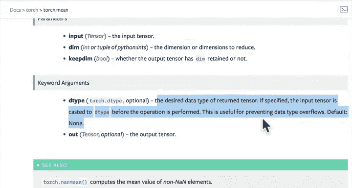
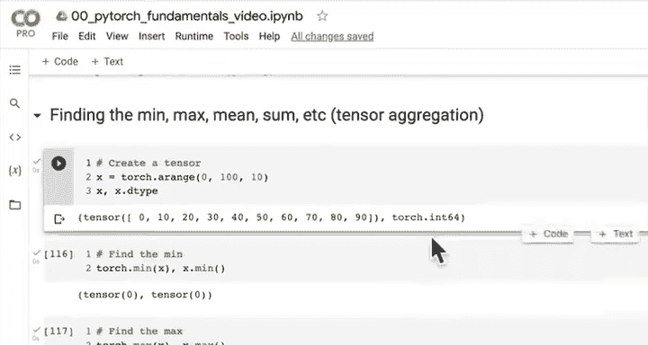
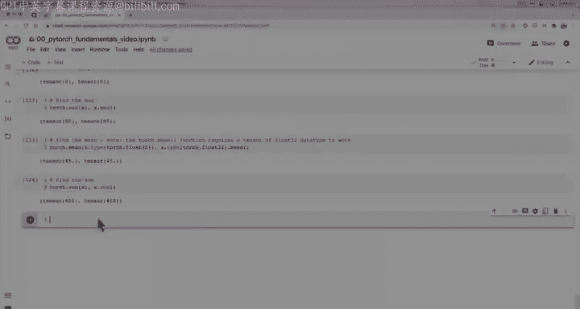
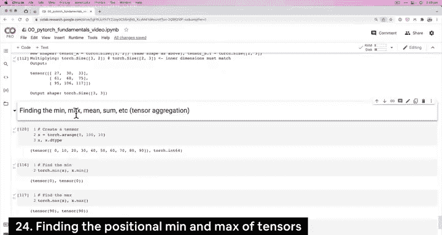
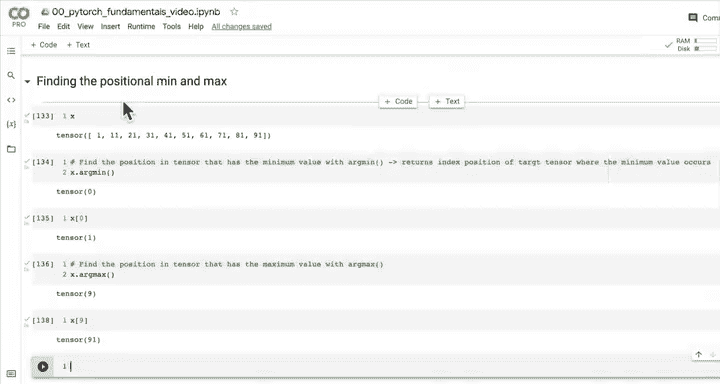

# 21：张量聚合操作（求最小值、最大值、均值与总和）📊

在本节课中，我们将要学习PyTorch中一个基础但至关重要的操作：**张量聚合**。具体来说，我们将探索如何找出张量中的最小值、最大值、均值以及总和。这些操作在数据分析和神经网络训练中非常常用。

---

## 概述

上一节我们介绍了神经网络的核心运算之一——矩阵乘法。本节中，我们来看看如何对张量进行聚合操作。所谓“聚合”，指的是将包含大量数据的张量缩减为少数几个值（例如最小值、最大值等）的过程。例如，将一个包含9个元素的张量聚合，得到其最小值27，这就是从多到少的聚合。

---

## 创建示例张量

首先，我们创建一个张量作为示例。

```python
import torch

# 创建一个从0到100，步长为10的张量
x = torch.arange(start=0, end=100, step=10)
print(x)
```

---

## 寻找最小值与最大值

以下是寻找张量最小值和最大值的两种常用方法。

```python
# 方法一：使用 torch 模块函数
min_value = torch.min(x)
max_value = torch.max(x)



# 方法二：使用张量的对象方法
min_value_alt = x.min()
max_value_alt = x.max()
```

你可以选择任意一种风格，它们在底层实现的功能是相同的。

---

## 计算均值与常见错误处理

接下来，我们尝试计算张量的平均值。

```python
# 尝试计算均值
try:
    mean_value = torch.mean(x)
except Exception as e:
    print(f"错误信息: {e}")
```

执行上述代码会引发一个错误：`Mean input data type should be either floating point or complex dtypes. Got Long instead.`。这是因为我们创建的张量 `x` 默认是 `torch.int64`（长整型）数据类型，而 `torch.mean` 函数要求输入张量的数据类型为浮点型（如 `torch.float32`）。

**解决方法**：在计算前将张量转换为正确的数据类型。

```python
# 将张量转换为浮点型后再计算均值
x_float = x.type(torch.float32)
mean_value = torch.mean(x_float)
# 或者使用张量对象方法
mean_value_alt = x_float.mean()
```

**核心概念**：确保张量的**数据类型**与操作函数的要求匹配是避免此类错误的关键。

---

## 计算总和

计算张量所有元素的总和同样简单。







```python
# 计算总和
sum_value = torch.sum(x)
# 或使用张量对象方法
sum_value_alt = x.sum()
```

---

## 寻找极值的位置（ArgMin 与 ArgMax）

除了获取极值本身，有时我们更需要知道这些极值在张量中的**位置（索引）**。这就是 `argmin` 和 `argmax` 的用途。

```python
# 获取最小值所在的索引位置
min_index = torch.argmin(x)
# 获取最大值所在的索引位置
max_index = torch.argmax(x)

# 验证：通过索引获取值
min_value_by_index = x[min_index]
max_value_by_index = x[max_index]
```

**公式解释**：
*   `argmin(x)` 返回张量 `x` 中**最小值首次出现**的索引。
*   `argmax(x)` 返回张量 `x` 中**最大值首次出现**的索引。

这在后续使用Softmax等激活函数时尤其有用。

---

## 总结

本节课中我们一起学习了PyTorch中的张量聚合操作：

1.  **求最小值与最大值**：使用 `torch.min()` / `.min()` 和 `torch.max()` / `.max()`。
2.  **求均值**：使用 `torch.mean()` / `.mean()`，但需**注意输入张量必须为浮点数据类型**。
3.  **求和**：使用 `torch.sum()` / `.sum()`。
4.  **求极值位置**：使用 `torch.argmin()` 和 `torch.argmax()` 来获取最小值与最大值所在的索引。

我们还再次强调了在PyTorch编程中处理**数据类型不匹配**错误的重要性。掌握这些基础的聚合操作，将为后续更复杂的深度学习模型构建和数据分析打下坚实基础。



在下一课中，我们将继续探索PyTorch的其他功能。