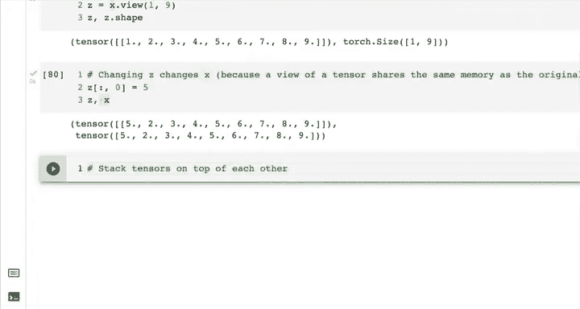
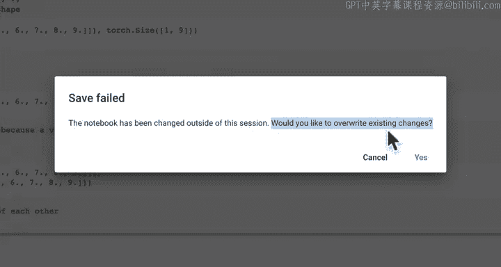
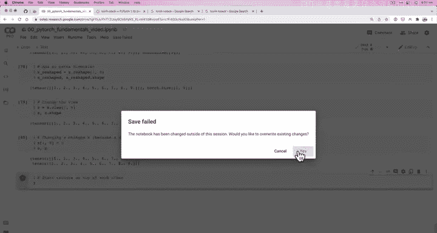
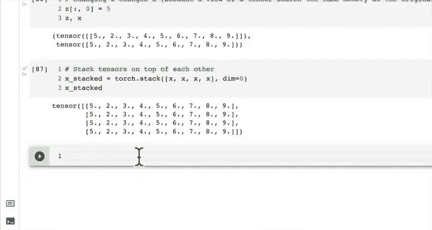

#  22：张量重塑、视图与堆叠 🧱

在本节课中，我们将学习如何改变张量的形状和维度。这是深度学习中一项至关重要的技能，因为许多错误都源于张量形状不匹配。

## 概述

我们已经学习了不少内容。需要说明的是，在完成前面的部分后，我稍作休息。我想展示一下如何恢复到之前的工作状态，因为如果我们直接在这里输入 `X` 并按 Shift+Enter 执行，由于我们的 Colab 运行时已断开连接，它会开始重新连接。在 Colab 中，只要你按下任何按钮，它就会尝试重新连接、初始化。此时，`X` 可能已不再存储在内存中。果然，出现了“name X is not defined”的错误。这是因为如果你休息几个小时，Colab 的状态会被重置。这是为了确保谷歌能持续免费提供资源，并删除所有内容以避免计算资源浪费。

为了恢复状态，我选择“重启并运行所有”。你并非必须重启整个笔记本，也可以选择“运行此单元格之前的所有单元格”或“运行此单元格之后的所有单元格”。我点击了“运行所有”，这将运行我们之前编写的所有单元格。然而，它会在我们故意留下的错误处停止。例如，之前遇到的形状错误，我特意没有修复它，以便我们能反复看到这个错误。因此，我们需要手动运行错误单元格之后的所有单元格。现在，这些单元格运行正常，我们又回到了可以访问 `X` 的状态。这只是我恢复编码状态的一个小技巧。

现在，让我们开始学习**重塑（reshaping）、堆叠（stacking）、压缩（squeezing）和反压缩（unsqueezing）**。你可能会想，压缩和反压缩是什么？这都与**张量（tensors）**有关。我们是要“拥抱”张量还是“释放”它们？让我们快速定义一下这些概念。

*   **重塑（Reshaping）**：正如我们之前所见，机器学习和深度学习中一个最常见的错误就是矩阵形状不匹配，因为它们必须满足特定规则。重塑操作会将输入张量改变为指定的形状。
*   **视图（View）**：返回输入张量在指定形状下的一个视图，但与原始张量共享相同的内存。视图和重塑非常相似，但视图始终与原始张量共享内存。它只是从不同角度、以不同形状展示同一个张量。
*   **堆叠（Stacking）**：将多个张量在垂直方向（`vstack`）或水平方向（`hstack`）上组合在一起。`torch.stack` 函数可以沿新维度连接一系列张量。`torch.vstack` 和 `torch.hstack` 是更具体的堆叠方式。
*   **压缩（Squeeze）**：移除张量中所有大小为 1 的维度。
*   **反压缩（Unsqueeze）**：向目标张量添加一个大小为 1 的维度。
*   **置换（Permute）**：返回输入张量维度经过特定方式交换后的视图。

这里介绍的方法不少，但其核心要点都是通过某种方式操作我们的张量，以改变它们的形状或维度。再次强调，机器学习和深度学习中头号问题之一就是张量形状问题。

让我们从创建一个张量开始，并逐一查看这些操作。

## 创建基础张量

首先，我们导入 PyTorch 并创建一个简单的张量。

```python
import torch

# 创建一个包含数字 1 到 9 的张量
x = torch.arange(start=1, end=10)
print(x)
print(x.shape)
```

输出：
```
tensor([1, 2, 3, 4, 5, 6, 7, 8, 9])
torch.Size([9])
```

我们得到了数字 1 到 9，张量形状是 `torch.Size([9])`，这是一个一维张量。

## 重塑张量

现在让我们从 `reshape` 开始。我们尝试添加一个额外的维度。

```python
x_reshaped = x.reshape(1, 7)
print(x_reshaped)
print(x_reshaped.shape)
```

执行这段代码会得到一个错误。PyTorch 在错误提示方面做得很好，它会告诉我们哪里出了问题：形状 `(1, 7)` 对于大小为 9 的输入是无效的。为什么？因为我们试图将 9 个元素塞进一个形状为 `1x7`（即 7 个元素）的张量里。

我们需要确保新形状的维度乘积（即元素总数）与原始张量一致。让我们修正它：

```python
x_reshaped = x.reshape(1, 9)
print(x_reshaped)
print(x_reshaped.shape)
```

输出：
```
tensor([[1, 2, 3, 4, 5, 6, 7, 8, 9]])
torch.Size([1, 9])
```

注意到发生了什么吗？我们添加了一个单一维度。看那个额外的方括号。如果我们想添加两个维度呢？

```python
x_reshaped = x.reshape(2, 9) # 这会出错
```

这行不通。因为 `2 * 9 = 18`，而我们只有 9 个元素。我们必须使用兼容的形状，例如 `3x3`：

```python
x_reshaped = x.reshape(3, 3)
print(x_reshaped)
print(x_reshaped.shape)
```

输出：
```
tensor([[1, 2, 3],
        [4, 5, 6],
        [7, 8, 9]])
torch.Size([3, 3])
```

我们也可以改变维度的顺序。`reshape(1, 9)` 和 `reshape(9, 1)` 是不同的：

```python
x_column = x.reshape(9, 1)
print(x_column)
print(x_column.shape)
```

输出：
```
tensor([[1],
        [2],
        [3],
        [4],
        [5],
        [6],
        [7],
        [8],
        [9]])
torch.Size([9, 1])
```

这里，我们把维度加在了“内部”，得到了一个列向量。

## 使用视图

`view` 方法在改变形状方面与 `reshape` 类似。关键区别在于，`view` 返回的张量与原始张量**共享内存**。

```python
z = x.view(1, 9)
print(z)
print(z.shape)
```

输出与 `reshape(1, 9)` 相同。但让我们验证一下内存共享：

```python
# 改变 z 的第一个元素
z[0, 0] = 5
print("z after change:", z)
print("x after change:", x)
```

输出：
```
z after change: tensor([[5, 2, 3, 4, 5, 6, 7, 8, 9]])
x after change: tensor([5, 2, 3, 4, 5, 6, 7, 8, 9])
```

可以看到，修改 `z` 的同时也修改了 `x`，因为它们共享同一块内存数据。`z` 只是 `x` 的一个不同“视图”。

## 堆叠张量

接下来，我们看看如何将多个张量堆叠在一起。`torch.stack` 函数可以将一系列张量沿着一个新的维度连接起来。

```python
# 创建几个相同的张量用于堆叠
x_stacked = torch.stack([x, x, x, x], dim=0)
print(x_stacked)
print(x_stacked.shape)
```



输出：
```
tensor([[5, 2, 3, 4, 5, 6, 7, 8, 9],
        [5, 2, 3, 4, 5, 6, 7, 8, 9],
        [5, 2, 3, 4, 5, 6, 7, 8, 9],
        [5, 2, 3, 4, 5, 6, 7, 8, 9]])
torch.Size([4, 9])
```



默认 `dim=0` 表示沿着第一个（新的）维度堆叠，相当于垂直堆叠。让我们试试 `dim=1`：



```python
x_stacked_dim1 = torch.stack([x, x, x, x], dim=1)
print(x_stacked_dim1)
print(x_stacked_dim1.shape)
```

输出：
```
tensor([[5, 5, 5, 5],
        [2, 2, 2, 2],
        [3, 3, 3, 3],
        [4, 4, 4, 4],
        [5, 5, 5, 5],
        [6, 6, 6, 6],
        [7, 7, 7, 7],
        [8, 8, 8, 8],
        [9, 9, 9, 9]])
torch.Size([9, 4])
```

现在张量是水平方向排列的。`dim` 参数指定了新维度插入的位置。PyTorch 还提供了更直观的 `torch.vstack`（垂直堆叠）和 `torch.hstack`（水平堆叠），它们内部调用了 `stack` 并设定了相应的 `dim` 值。

## 压缩与反压缩

最后，我们简要介绍 `squeeze` 和 `unsqueeze`。

*   `torch.squeeze()`：移除张量中所有大小为 1 的维度。
*   `torch.unsqueeze(dim)`：在指定的 `dim` 位置插入一个大小为 1 的维度。

它们的用法与 `reshape` 和 `view` 类似。为了控制本视频的长度，我们将一起在下一个视频中详细练习这两个操作。我鼓励你先尝试自己查找 `torch.squeeze` 和 `torch.unsqueeze` 的文档并试用它们。我们已经创建了张量，使用了 `reshape`、`view` 和 `stack`，`squeeze` 和 `unsqueeze` 的用法也相当直接。

## 总结

本节课我们一起学习了 PyTorch 中操作张量形状和维度的核心方法：

1.  **重塑 (`reshape`)**：改变张量的形状，需要保证元素总数不变。
2.  **视图 (`view`)**：改变张量的形状视图，且与原始张量共享内存。
3.  **堆叠 (`stack`)**：沿新维度组合多个张量，可通过 `dim` 参数控制堆叠方向。
4.  **压缩 (`squeeze`)** 与**反压缩 (`unsqueeze`)**：用于移除或添加大小为 1 的维度，是调整张量维度以适配不同操作（如神经网络层）的常用工具。



掌握这些操作对于构建和调试深度学习模型至关重要，因为确保张量形状的正确传递是模型能正常运行的基础。在下一节课中，我们将深入练习 `squeeze` 和 `unsqueeze`。